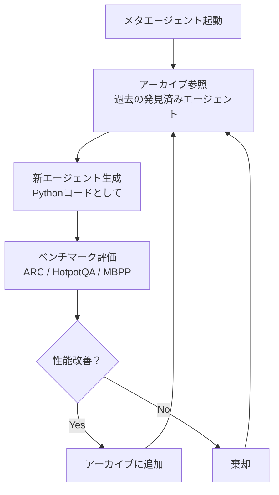

本記事は [arXiv:2408.08435 "Automated Design of Agentic Systems"](https://arxiv.org/abs/2408.08435)（Hu et al., 2024）の解説記事です。

## 論文概要（Abstract）

Hu, Lu, Clune（University of British Columbia, 2024年8月）は、エージェントシステムの設計そのものを自動化する新しい研究問題「ADAS（Automated Design of Agentic Systems）」を提案した。著者らは、**メタエージェント**がエージェントの構成要素（プロンプト、ツール使用、制御フロー）をPythonコードとして表現し、自動生成・評価・改善するフレームワークを構築した。著者らの報告によれば、ARC、HotpotQA、MBPPなどの標準ベンチマークで、人手設計のChain-of-ThoughtやReActベースラインを上回る性能を達成した。

この記事は [Zenn記事: Karpathy発AutoResearchで一晩100実験を自動化する仕組みと実践](https://zenn.dev/0h_n0/articles/28e8fe4721f315) の深掘りです。

## 情報源

- **arXiv ID**: 2408.08435
- **URL**: [https://arxiv.org/abs/2408.08435](https://arxiv.org/abs/2408.08435)
- **著者**: Shengran Hu, Cong Lu, Jeff Clune
- **発表年**: 2024
- **分野**: cs.AI, cs.LG
- **コード**: [https://github.com/ShengranHu/ADAS](https://github.com/ShengranHu/ADAS)（MIT License）

## 背景と動機（Background & Motivation）

AutoResearch（Karpathy, 2026）は「人間がprogram.mdで方針を設定し、エージェントがtrain.pyを改善する」という設計であり、エージェントの行動パターン自体は人間が設計したLLMの推論能力に依存している。しかし、**エージェントの設計そのもの**（プロンプト構造、ツール選択、推論戦略の組み合わせ）が最適であるとは限らない。

ADASが問うているのは「Chain-of-Thought（CoT）やReActのようなエージェント設計パターンを、人間が発明する必要があるのか？もしプログラム探索で自動的に発見できるなら、人間が思いつかない優れたパターンが見つかるのではないか？」という根本的な問いである。

この問いはAutoResearchの「train.pyの最適化」を一段メタなレベルに引き上げたものと捉えることができる。AutoResearchでは**モデルの学習コード**を最適化するが、ADASでは**エージェントの推論コード**を最適化する。

## 主要な貢献（Key Contributions）

- **貢献1**: エージェント設計の自動化を新しい研究問題「ADAS」として定義
- **貢献2**: エージェントをPythonコードとして表現する「コードとしてのエージェント」パラダイムの導入
- **貢献3**: メタエージェントが生成したエージェントが、ARC・HotpotQA・MBPPで人手設計のベースラインを上回ることを実証
- **貢献4**: 発見されたエージェントのアーカイブ化と再利用メカニズムの構築

## 技術的詳細（Technical Details）

### 「コードとしてのエージェント」パラダイム

ADASの核心的アイデアは、**エージェント設計をPythonコードとして表現**し、そのコード自体を探索対象とすることである。

```python
# エージェントの定義例（ADASが探索する対象）
def agent_v1(task: str, llm: LLM) -> str:
    """Chain-of-Thought エージェント（人手設計のベースライン）。"""
    response = llm(f"Think step by step. Task: {task}")
    return response

def agent_v2(task: str, llm: LLM) -> str:
    """ADASが自動発見したエージェント（概念例）。"""
    # Step 1: タスクを部分問題に分解
    subtasks = llm(f"Break this into subtasks: {task}")

    # Step 2: 各部分問題を独立に解決
    solutions = []
    for sub in subtasks.split("\n"):
        sol = llm(f"Solve: {sub}")
        solutions.append(sol)

    # Step 3: 部分解を統合
    combined = llm(f"Combine these solutions: {solutions}")

    # Step 4: 自己批判的レビュー（ADASが発見した新パターン）
    review = llm(f"Review and improve: {combined}")

    return review
```

### メタエージェントのアーキテクチャ

メタエージェントは以下のループで新しいエージェント設計を探索する。



この構造は、AutoResearchのラチェットメカニズムと**概念的に同型**である。

| 要素 | AutoResearch | ADAS |
|------|-------------|------|
| 最適化対象 | train.py（モデル学習コード） | エージェント定義（推論コード） |
| 評価関数 | val_bpb | ベンチマークスコア（ARC等） |
| 保持メカニズム | 改善時のみ変更を保持 | アーカイブに追加 |
| 探索主体 | LLMエージェント | メタエージェント（LLM） |

### アーカイブとプログラム探索

ADASの探索は「アーカイブ」と呼ばれる、発見済みエージェント設計のデータベースを中心に行われる。

```python
@dataclass
class AgentArchive:
    """発見済みエージェント設計のアーカイブ。"""
    agents: list[AgentDesign]

    def get_top_k(self, k: int = 5) -> list[AgentDesign]:
        """性能上位k個のエージェント設計を返す。"""
        return sorted(self.agents, key=lambda a: a.score, reverse=True)[:k]

    def get_diverse_sample(self, n: int = 3) -> list[AgentDesign]:
        """多様性を確保したサンプルを返す。"""
        # コード類似度に基づくクラスタリングで多様性を確保
        return diversity_sampling(self.agents, n)

@dataclass
class AgentDesign:
    """1つのエージェント設計。"""
    code: str           # Pythonコード
    score: float        # ベンチマークスコア
    description: str    # 設計の自然言語記述
    generation: int     # 何世代目の探索で発見されたか
```

メタエージェントは、アーカイブの上位エージェントと多様なサンプルを参照しながら、新しいエージェント設計を生成する。

$$
a_{t+1} = \text{MetaAgent}(a_{\text{top-k}}, a_{\text{diverse}}, \text{task\_description})
$$

ここで、
- $a_{t+1}$: 新しく生成されるエージェント設計
- $a_{\text{top-k}}$: 上位$k$個の設計
- $a_{\text{diverse}}$: 多様性サンプル

### 発見されたエージェントパターン

著者らの報告によれば、メタエージェントは以下のような「人間が設計していない」パターンを自動発見した。

1. **動的な推論深度調整**: タスクの複雑さに応じて推論ステップ数を動的に変えるエージェント
2. **自己批判的レビューの多段化**: 1回ではなく、異なる観点から3回レビューするパターン
3. **部分問題の並列解決と投票**: 同じタスクを複数の異なるプロンプトで解き、多数決で最終回答を決定するパターン

## 実装のポイント（Implementation）

**安全性の確保**: メタエージェントが生成するコードを実行する必要があるため、サンドボックス環境での実行が必須である。著者らはDockerコンテナ内での実行を推奨している。

**評価コスト**: 各エージェント設計をベンチマーク全体で評価するため、1イテレーションあたりのLLM API呼び出し回数が多い。著者らはClaude 3.5 Sonnetを使用し、評価はベンチマークのサブセットで行うことでコストを抑えている。

**コードの検証**: 生成されたエージェントコードが構文的に正しいか、実行時エラーが発生しないかを事前にチェックする仕組みが組み込まれている。

## 実験結果（Results）

著者らが報告したベンチマーク結果は以下の通りである。

| ベンチマーク | CoT（ベースライン） | ReAct | ADAS（発見最良） | 改善率 |
|------------|-------------------|-------|-----------------|--------|
| ARC | 42.3% | 44.1% | 49.6% | +17.3% |
| HotpotQA | 58.2% | 62.5% | 67.8% | +16.5% |
| MBPP | 71.0% | 69.5% | 76.2% | +7.3% |

（著者らの報告による。論文のTable参照）

**注目すべき結果**: ADASが発見したエージェントは、特にARC（抽象推論コーパス）で最大の改善を示した。ARCは「既存のパターンでは解けない」タスクが多く含まれるため、人手設計のCoTやReActでは対応できない問題にADASの自動設計が効果的であったことを示唆している。

## 実運用への応用（Practical Applications）

ADASのアプローチは、AutoResearchに対して以下の実践的な示唆を与える。

### 1. program.mdの自動最適化

AutoResearchのprogram.md（人間が書く研究指示書）は、実質的にエージェントの行動パターンを定義している。ADASの手法を応用すれば、**program.mdの内容自体をメタエージェントが最適化する**ことが可能になる。

### 2. エージェント設計のAutoResearchパターン適用

ADASのアーカイブ + メタエージェントの構造は、AutoResearchの「prepare.py（不変） / train.py（可変） / program.md（人間指示）」の3ファイル契約に対応付けられる。

| ADASの要素 | AutoResearchへの対応 |
|-----------|---------------------|
| ベンチマーク評価 | prepare.py（不変の評価関数） |
| エージェントコード | train.py（エージェントが修正する対象） |
| メタエージェントの指示 | program.md（探索方針の定義） |

### 3. 自律研究エージェントの階層化

ADASの「メタエージェントがエージェントを設計する」という階層構造は、**AutoResearchの実験エージェントをメタレベルで最適化する**可能性を示唆している。例えば、「train.pyの修正戦略を最適化するメタエージェント」を構築し、エージェントの行動パターン自体を改善するループが考えられる。

## 関連研究（Related Work）

- **AutoResearch**（Karpathy, 2026）: モデル学習コードの最適化に特化。ADASはこれを「エージェント設計コードの最適化」に一般化している
- **The AI Scientist**（Lu et al., 2024）: 研究サイクル全体の自動化。ADASは研究プロセスではなくエージェント設計に焦点を当てている
- **FunSearch**（Romera-Paredes et al., 2024、DeepMind）: LLMと進化的探索で数学的発見を自動化。ADASのプログラム探索アプローチと概念的に近い
- **Voyager**（Wang et al., 2023）: Minecraftで自律的にスキルを獲得するエージェント。ADASのアーカイブ構造はVoyagerの「スキルライブラリ」に類似している

## まとめと今後の展望

ADASは「エージェント設計の自動化」という新しい研究問題を提起し、メタエージェントによるプログラム探索で人手設計のベースラインを超えるエージェントを発見できることを実証した。

AutoResearchとの関連では、ADASの手法は「AutoResearchのエージェント自体を自動改善する」上位レベルの最適化として位置づけられる。AutoResearchが`train.py`を最適化し、ADASが「AutoResearchのエージェントの推論パターン」を最適化するという**二重ループ**の構築は、自律研究エージェントの次の発展方向として有望である。

現時点での制約は、評価コストの高さ（各エージェント設計をベンチマーク全体で評価する必要がある）と、発見されたエージェントの解釈可能性（なぜそのパターンが効果的かの理解が限定的）である。

## 参考文献

- **arXiv**: [https://arxiv.org/abs/2408.08435](https://arxiv.org/abs/2408.08435)
- **Code**: [https://github.com/ShengranHu/ADAS](https://github.com/ShengranHu/ADAS)
- **Related Zenn article**: [https://zenn.dev/0h_n0/articles/28e8fe4721f315](https://zenn.dev/0h_n0/articles/28e8fe4721f315)
