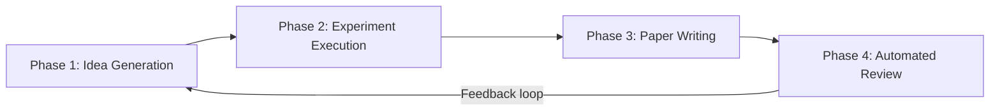

本記事は [arXiv:2408.06292 "The AI Scientist: Towards Fully Automated Open-Ended Scientific Discovery"](https://arxiv.org/abs/2408.06292) の解説記事です。

## 論文概要（Abstract）

Lu, Lu, Lange, Foerster, Clune, Ha（Sakana AI / University of Oxford / University of British Columbia, 2024年8月）は、大規模言語モデル（LLM）が科学研究の全サイクル — アイデア生成、実験設計・実装・実行、結果分析、論文執筆、査読シミュレーション — を自動で行うフレームワーク「The AI Scientist」を提案した。著者らの報告によれば、拡散モデル・Transformer言語モデル・Grokking（過学習後の汎化現象）の3分野で実証し、1論文あたり約$15のコストで生成が可能であるとしている。

この記事は [Zenn記事: Karpathy発AutoResearchで一晩100実験を自動化する仕組みと実践](https://zenn.dev/0h_n0/articles/28e8fe4721f315) の深掘りです。

## 情報源

- **arXiv ID**: 2408.06292
- **URL**: [https://arxiv.org/abs/2408.06292](https://arxiv.org/abs/2408.06292)
- **著者**: Chris Lu, Cong Lu, Robert Tjarko Lange, Jakob Foerster, Jeff Clune, David Ha
- **発表年**: 2024
- **分野**: cs.AI, cs.CL, cs.LG
- **コード**: [https://github.com/SakanaAI/AI-Scientist](https://github.com/SakanaAI/AI-Scientist)（Apache 2.0）

## 背景と動機（Background & Motivation）

科学的発見の自動化は人工知能研究の根源的な目標の一つである。従来、LLMは研究の一部 — ブレインストーミング、コード生成、結果の予測など — を支援するツールとして使用されてきたが、研究サイクル全体を自律的に回す試みは限られていた。既存のAutoML（Neural Architecture Search等）は探索空間が事前定義されたハイパーパラメータや構造に限定されており、**オープンエンドな**研究課題の設定・仮説生成まではカバーしていなかった。

著者らはこの課題に対し、「LLMが科学者の役割すべてを担えるか」を検証することを目的とした。AutoResearch（Karpathy, 2026）が`train.py`の最適化に特化した「実験自動化」であるのに対し、The AI Scientistは研究アイデアの着想から論文執筆・査読までを含む「**研究プロセス全体の自動化**」を目指している点が本質的な違いである。

## 主要な貢献（Key Contributions）

- **貢献1**: LLMが研究の全ライフサイクル（アイデア→実装→実験→論文→査読）を自律実行する初のエンドツーエンドフレームワークを構築
- **貢献2**: 拡散モデル・Transformer・Grokkingの3つのML分野で自動生成された論文が、一部NeurIPSスタイルの査読で「弱いAccept相当」の評価を得たことを報告
- **貢献3**: 自動査読モジュール（Automated Reviewer）が人間の査読者と「ほぼ同等の性能」を達成したと主張（ただし後述する限界あり）
- **貢献4**: 1論文あたり約$15という低コストでの自動生成を実現（GPT-4o使用時）

## 技術的詳細（Technical Details）

### アーキテクチャ全体像

The AI Scientistは4つのフェーズから構成される。



### Phase 1: アイデア生成

LLMに対して「既存のコードベース（テンプレート）」と「過去に生成されたアイデア」をコンテキストとして与え、新しい研究アイデアを生成させる。生成されたアイデアは以下の形式で構造化される。

```python
@dataclass
class ResearchIdea:
    """LLMが生成する研究アイデアの構造"""
    title: str                    # 論文タイトル
    experiment_plan: str          # 実験計画の自然言語記述
    novelty_score: float          # 0-10のスケールで新規性を自己評価
    interestingness_score: float  # 0-10のスケールで興味深さを自己評価
```

重要なのは、**Semantic Scholar API**を用いた文献検索が組み込まれている点である。LLMが生成したアイデアに対し、関連する既存論文を検索し、新規性が不十分と判断されたアイデアは棄却される。

### Phase 2: 実験実行

生成されたアイデアに基づき、LLMが既存のテンプレートコードを修正して実験を実装・実行する。

```python
def run_experiment(idea: ResearchIdea, template_code: str) -> ExperimentResult:
    """アイデアに基づいてコードを修正し実験を実行する。

    Args:
        idea: LLMが生成した研究アイデア
        template_code: ベースとなる実験コード

    Returns:
        実験結果（メトリクス、ログ、生成された図表）
    """
    # LLMがテンプレートコードを修正
    modified_code = llm.edit_code(template_code, idea.experiment_plan)

    # サンドボックス環境で実行（最大2回のリトライ）
    for attempt in range(MAX_RETRIES):
        try:
            result = sandbox.execute(modified_code, timeout=3600)
            return result
        except ExecutionError as e:
            modified_code = llm.fix_code(modified_code, str(e))

    raise ExperimentFailure(f"Failed after {MAX_RETRIES} attempts")
```

AutoResearchとの重要な違いは、**テンプレートコードベース**が複数用意されている点である。著者らは以下の3つのテンプレートを提供している。

| テンプレート | 分野 | ベースモデル | 主要メトリクス |
|------------|------|------------|--------------|
| NanoGPT | Transformer言語モデリング | GPT-2規模 | val_loss, perplexity |
| 2D Diffusion | 拡散モデル | DDPM | FID, KL divergence |
| Grokking | 学習ダイナミクス | 小規模MLP | generalization_delay |

### Phase 3: 論文執筆

実験結果をもとに、LLMがLaTeXフォーマットの論文を自動生成する。論文の構成は以下のセクションから成る。

1. Title & Abstract
2. Introduction
3. Background（関連研究を含む）
4. Method
5. Experimental Setup
6. Results
7. Conclusions

著者らが報告した工夫は、**セクションごとの逐次生成**と**自己批判的なリファインメント**である。各セクション生成後にLLM自身がレビューし、不足や矛盾があれば修正するループを2回繰り返す。

### Phase 4: 自動査読

生成された論文に対し、別のLLMインスタンスが査読者として評価を行う。査読は以下のスコアで構成される。

$$
S_{\text{overall}} = w_1 \cdot S_{\text{soundness}} + w_2 \cdot S_{\text{significance}} + w_3 \cdot S_{\text{novelty}} + w_4 \cdot S_{\text{clarity}}
$$

ここで、
- $S_{\text{soundness}}$: 技術的健全性（実験設計・結果の妥当性）
- $S_{\text{significance}}$: 研究の重要性
- $S_{\text{novelty}}$: 新規性
- $S_{\text{clarity}}$: 論文の明確さ
- $w_i$: 各評価軸の重み（均等配分）

著者らは、この自動査読モジュールがICLR 2024の実際の査読スコアとの相関で「人間査読者間の一致度に近い」性能を達成したと主張している（論文Section 4.3参照）。

### アルゴリズム全体の疑似コード

```python
def ai_scientist_loop(
    templates: list[str],
    num_ideas: int = 50,
    num_papers: int = 10
) -> list[Paper]:
    """The AI Scientistのメインループ。

    Args:
        templates: 実験テンプレートコードのリスト
        num_ideas: 生成するアイデア数
        num_papers: 最終的に論文化するアイデア数

    Returns:
        生成された論文のリスト
    """
    papers = []

    for template in templates:
        # Phase 1: アイデア生成（50件）
        ideas = generate_ideas(template, n=num_ideas)

        # 新規性フィルタ（Semantic Scholar検索）
        novel_ideas = filter_by_novelty(ideas, threshold=0.7)

        # 上位N件を選択
        top_ideas = sorted(novel_ideas, key=lambda x: x.interestingness_score)[:num_papers]

        for idea in top_ideas:
            # Phase 2: 実験実行
            result = run_experiment(idea, template)
            if result.is_successful:
                # Phase 3: 論文執筆
                paper = write_paper(idea, result)
                # Phase 4: 自動査読
                review = automated_review(paper)
                paper.review_score = review.overall_score
                papers.append(paper)

    return papers
```

## 実装のポイント（Implementation）

実際にThe AI Scientistを動かす際の注意点は以下の通りである。

**コンテキスト長の管理**: 実験コード全体 + 実験結果 + 過去のアイデアをLLMのコンテキストに含めるため、長いコンテキストウィンドウが必須となる。著者らはClaude 3.5 SonnetとGPT-4oで検証している。

**サンドボックスの必要性**: LLMが生成するコードを直接実行するため、セキュリティリスクがある。著者らはDockerコンテナ内での実行を推奨しているが、論文中の実験ではローカル環境で実行されている。

**テンプレートの品質**: 結果の質はテンプレートコードの品質に強く依存する。著者らが用意したNanoGPT・Diffusion・Grokkingテンプレートは十分にテストされたものだが、新しいドメインに適用する際はテンプレートの準備が追加工数となる。

**コスト**: 1論文あたりのLLM API費用は著者らの報告によれば約$15（GPT-4o使用時）。ただし失敗した実験も含めると実質的なコストは倍以上になる場合がある。

## 実験結果（Results）

著者らが報告した主要な結果は以下の通りである。

| テンプレート | 生成論文数 | 「弱いAccept」以上 | 平均査読スコア |
|------------|----------|-------------------|--------------|
| NanoGPT | 10 | 3 | 4.2/10 |
| Diffusion | 10 | 2 | 3.8/10 |
| Grokking | 10 | 4 | 4.5/10 |

（論文Table 1より。査読スコアは自動査読モジュールによる評価）

**注目すべき結果**: Grokkingテンプレートでは、LLMが「weight decay scheduleの段階的変化がgrokking transitionを加速する」という仮説を自動生成し、実験で確認している。著者らはこれを「既存文献で明示的に報告されていない発見」としている。

**限界**: 著者ら自身が認めているように、生成された論文には以下の問題が含まれる。
- **引用の不正確さ**: 存在しない論文を引用するケースがあった
- **結果の過大解釈**: 実験結果の統計的有意性が不十分なまま強い結論を出すことがあった
- **実験の失敗率**: 約30%の実験がコーディングエラーで失敗した

## 実運用への応用（Practical Applications）

### AutoResearchとの関係

The AI ScientistとAutoResearch（Karpathy, 2026）は異なるレベルの自動化を目指している。

| 観点 | AutoResearch | The AI Scientist |
|------|-------------|------------------|
| 自動化スコープ | 実験ループのみ | 研究サイクル全体 |
| コードベース | 630行の`train.py` | テンプレートリポジトリ |
| 評価メトリクス | val_bpb（単一） | 複数メトリクス + 論文品質 |
| 1実験あたりコスト | GPU時間 + API数ドル | 約$15/論文 |
| 設計思想 | ミニマリズム | 包括的パイプライン |

AutoResearchの「3ファイル契約（prepare.py不変 / train.py可変 / program.md指示書）」は、The AI Scientistの「テンプレート + アイデア生成 + 論文執筆」と対照的なアプローチである。前者は評価メトリクスの固定による信頼性を重視し、後者は研究全体の自律性を重視している。

### 実務での適用可能性

- **研究のプロトタイピング**: 新しいアイデアの初期検証を自動化し、有望な方向性を人間が選別する
- **ベースライン実験の大量実行**: 論文のベースライン比較表を自動生成する
- **文献サーベイの加速**: 関連論文の検索・要約を自動化する

ただし、著者ら自身が論文内で指摘しているように、現時点では**出版品質の論文生成には人間のレビューが不可欠**である。

## 関連研究（Related Work）

- **MLAgentBench**（Huang et al., 2023）: ML実験タスクにおけるLLMエージェントの体系的なベンチマーク。The AI Scientistのような統合システムの評価基準を提供する
- **AIDE**（Weco AI, 2024）: Kaggleタスクを自律的に解くMLエンジニアリングエージェント。ツリー探索によるコード最適化はThe AI Scientistの実験フェーズと類似
- **Agent Laboratory**（Schmidgall et al., 2025）: 研究全サイクルをマルチエージェントで実行するフレームワーク。The AI Scientistの後継的な位置づけ

## AI Scientist v2の登場

2025年4月には後続研究「The AI Scientist-v2: Workshop-Level Automated Scientific Discovery via Agentic Tree Search」（arXiv:2504.08066）が公開された。v2では以下の改善が報告されている。

- **テンプレート不要化**: 人間が書いたコードテンプレートへの依存を排除
- **Agentic Tree Search**: 実験管理エージェントが進化的にアイデアを探索
- **査読通過**: ICLR 2025のワークショップに投稿した3本のうち1本が「人間の平均Accept閾値を超えるスコア」を獲得

ただし、外部評価（arXiv:2502.14297）では、v1/v2共に実験の42%がコーディングエラーで失敗し、文献レビューの新規性判定が不正確であるとの指摘がなされている。

## まとめと今後の展望

The AI Scientistは、LLMによる研究プロセス全自動化の可能性を具体的に示した先駆的研究である。AutoResearchが「実験の高速ループ」に特化してミニマリストな設計を採用したのに対し、The AI Scientistは研究のライフサイクル全体をカバーする包括的なアプローチを取っている。

現時点での限界（引用の不正確さ、実験の失敗率、統計的検証の不足）は、自律的な科学研究エージェントが成熟するまでに解決すべき課題を明確にしている。この論文の最大の貢献は、「完全自動化は技術的に可能だが、品質保証には人間の関与が必要」という現実的な評価を定量データとともに提供した点にある。

## 参考文献

- **arXiv**: [https://arxiv.org/abs/2408.06292](https://arxiv.org/abs/2408.06292)
- **Code**: [https://github.com/SakanaAI/AI-Scientist](https://github.com/SakanaAI/AI-Scientist)
- **AI Scientist v2**: [https://arxiv.org/abs/2504.08066](https://arxiv.org/abs/2504.08066)
- **外部評価論文**: [https://arxiv.org/abs/2502.14297](https://arxiv.org/abs/2502.14297)
- **Related Zenn article**: [https://zenn.dev/0h_n0/articles/28e8fe4721f315](https://zenn.dev/0h_n0/articles/28e8fe4721f315)
