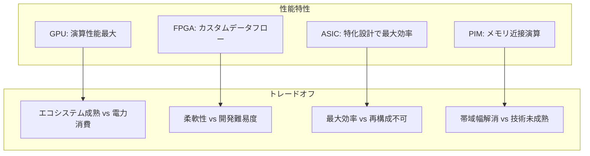

本記事は [Hardware Acceleration of LLMs: A comprehensive survey and comparison](https://arxiv.org/abs/2409.03384) の解説記事です。

## 論文概要（Abstract）

本サーベイは、LLM推論のハードウェア高速化に関する包括的な調査と比較を提供する。著者らはGPU、FPGA、ASIC、In-Memory Processing（PIM）の4つのハードウェアプラットフォームを横断的に分析し、各プラットフォーム上の実装を処理速度（speedup）、エネルギー効率（GOPs/Watt）、性能（GOPs）の観点で定量比較している。異なるプロセス技術で実装された各方式を公正に比較するため、同一プロセスノードへの外挿手法を用いた理論的・実測的比較の両面を提供している。

この記事は [Zenn記事: FPGAとLLM推論アクセラレータ2026年最前線 カスタムチップ開発の全体像](https://zenn.dev/0h_n0/articles/fda1b011be4252) の深掘りです。

## 情報源

- **arXiv ID**: 2409.03384
- **URL**: [https://arxiv.org/abs/2409.03384](https://arxiv.org/abs/2409.03384)
- **著者**: Nikoletta Koilia, Christoforos Kachris
- **発表年**: 2024
- **分野**: cs.AR, cs.AI

## 背景と動機（Background & Motivation）

LLMの急速な大規模化に伴い、推論に必要な演算量とメモリ帯域幅は指数関数的に増大している。GPT-4クラスのモデルでは1兆パラメータ超とされ、単純なGPU推論ではコスト・電力の両面で持続可能性が問われている。

この状況に対して、FPGA、ASIC、PIMなど多様なハードウェアプラットフォームが提案されてきたが、各プラットフォームは異なるプロセス技術（7nm, 14nm, 28nm等）で実装されており、公正な比較が困難であった。著者らは、この「公正な比較の不在」がハードウェア選定の意思決定を困難にしていると指摘し、プロセスノード外挿を用いた統一的な比較フレームワークを提案している。

## 主要な貢献（Key Contributions）

- **4プラットフォーム横断比較**: GPU、FPGA、ASIC、PIMの各プラットフォーム上のLLM推論実装を100件超の論文から収集し、定量的に比較
- **プロセスノード外挿手法**: 異なるプロセスノード（7nm, 14nm, 28nm等）で実装された各方式を同一ノードに外挿し、理論的に公正な比較を実現
- **実装検証**: 著者ら自身が複数のFPGAプラットフォーム上でLLMの一部を実装し、実測値による比較データを補完
- **選定ガイドライン**: モデルサイズ、デプロイ規模、電力予算に基づくハードウェア選定のフレームワークを提示

## 技術的詳細（Technical Details）

### LLM推論のボトルネック分析

サーベイでは、Transformerベースのモデルにおける2つの主要ボトルネックを分析している。

**1. Attention層の計算量**

Self-Attentionの計算量は系列長$L$に対して2次で増大する。

$$
\text{FLOPs}_{\text{Attention}} = 4Ld^2 + 2L^2d
$$

ここで、$d$はモデルの隠れ層次元数、$L$は系列長である。系列長が4096を超えると、$2L^2d$項が支配的になり、計算量が急激に増大する。

**2. FFN層のメモリ帯域幅**

FFN（Feed-Forward Network）層はモデル重みの約60-70%を占め、decodeフェーズでは毎トークン生成時にこれらの重みをメモリから読み出す必要がある。

$$
B_{\text{required}} = \frac{|\mathbf{W}_{\text{FFN}}|}{T_{\text{target}}}
$$

ここで、$|\mathbf{W}_{\text{FFN}}|$はFFN重みのバイト数、$T_{\text{target}}$はターゲットレイテンシである。LLaMA 70B（FP16）のFFN重みは約85 GBであり、1トークンあたり10 msのターゲットでは8.5 TB/sの帯域幅が必要となる。

### 4プラットフォームの特性比較

サーベイで分析されている各プラットフォームの特性を整理する。

| プラットフォーム | 演算能力 | メモリ帯域 | エネルギー効率 | 柔軟性 | 開発コスト |
|---------------|---------|-----------|-------------|--------|----------|
| GPU | 非常に高い | 高い (HBM) | 中 | 高 | 低 |
| FPGA | 中〜高 | 中 (HBM/DDR) | 高 | 高 | 中〜高 |
| ASIC | 高い | 設計依存 | 非常に高い | 低 | 非常に高 |
| PIM | 設計依存 | 非常に高い | 高 | 低 | 高 |

### プロセスノード外挿手法

サーベイの方法論的貢献として、異なるプロセスノードで実装されたアクセラレータを統一的に比較する外挿手法がある。

あるアクセラレータがプロセスノード$N_1$で性能$P_1$を達成している場合、プロセスノード$N_2$での推定性能$P_2$は以下で近似される。

$$
P_2 \approx P_1 \times \left(\frac{N_1}{N_2}\right)^{\alpha}
$$

ここで、$\alpha$は性能スケーリング係数であり、演算性能では$\alpha \approx 1.5$、エネルギー効率では$\alpha \approx 2.0$が経験的に使用される。

著者らは、この外挿手法を用いて28nm FPGAと7nm ASICの性能を同一ノード（例: 7nm）に外挿し、比較を行っている。

### GPU: エコシステムの強みと電力の課題

サーベイでは、GPU（特にNVIDIA A100/H100）が以下の理由でLLM推論のデフォルト選択肢であることを確認している。

**強み**:
- CUDAエコシステムの成熟度（vLLM, TGI, TensorRT-LLM等）
- HBM帯域幅の大きさ（H100: 3.35 TB/s）
- バッチ推論での高スループット

**課題**:
- 消費電力（H100 SXM: 700W）
- decodeフェーズでの演算ユニット利用率低下
- コスト（1枚約$30,000-40,000）

### FPGA: エネルギー効率とカスタムデータフロー

サーベイで取り上げられているFPGA実装の中から、代表的なものを整理する。

| 実装 | FPGA | モデル | エネルギー効率比 (vs GPU) |
|------|------|--------|----------------------|
| FlightLLM | Xilinx U280 | LLaMA2-7B | V100S比 6.0倍 |
| DFX | Xilinx U280 | BERT-Large | A100比 3.2倍 |
| FACT | Intel Stratix 10 | GPT-2 | V100比 2.5倍 |

著者らの分析によると、FPGAの強みはカスタムデータフローによるメモリアクセスパターンの最適化にある。特にdecodeフェーズでは、GPUの汎用メモリ階層と比較して、FPGAのオンチップメモリ（BRAM/URAM）を重みキャッシュとして活用することで帯域幅利用率を向上できる。

一方、課題としてRTL/HLS開発のスキル要件、コンパイル時間の長さ、GPUエコシステムとの互換性の欠如が挙げられている。

### ASIC: 最大効率と柔軟性のトレードオフ

サーベイでは、推論特化ASICの急速な台頭を以下のように整理している。

**商用ASIC**:
- Google TPU v5e: Transformer推論に最適化、GCPで利用可能
- Groq LPU: SRAM中心の低レイテンシ設計
- SambaNova SN40L: Reconfigurable Dataflow Unit（RDU）

**研究ASIC**:
- HARDSEA (2024): ハイブリッドアナログ-デジタル設計、スパースAttention、RTX 3090比28.5倍の加速
- BETA (2024): バイナリTransformerアクセラレータ、22倍のエネルギー効率
- 各種PIM設計: メモリ内演算による帯域幅ボトルネック解消

著者らは、ASICの最大のリスクとして「モデル世代交代への対応不能」を指摘している。モデルアーキテクチャが変化した場合、ASICの再設計には数億ドルと数年のリードタイムが必要となる。

### PIM (Processing-in-Memory): 将来のトレンド

サーベイでは、PIMをLLM推論の「将来のトレンド」として位置づけている。PIMはメモリ内に演算ユニットを配置することで、データ移動を根本的に排除するアプローチである。

$$
E_{\text{total}} = E_{\text{compute}} + E_{\text{data\_movement}}
$$

現在のGPU/FPGAでは$E_{\text{data\_movement}}$がエネルギー消費の60-80%を占めるとされており、PIMはこの支配項を直接的に削減する。

ただし、PIM技術はまだ研究段階であり、商用化された実装は限定的である。DRAM-PIM（Samsung HBM-PIM等）やSRAM-PIM、ReRAM-PIMなど複数のアプローチが研究されているが、精度・信頼性・製造コストに課題が残っている。

## 実装のポイント（Implementation）

サーベイの知見に基づくハードウェア選定の実践的ガイドラインを整理する。

**モデルサイズによる選定**:
- 1B-7B: FPGA（エッジ展開）またはGPU（開発速度重視）
- 7B-70B: GPU（H100/B200）が現実的。FPGA/ASICは特定ユースケースのみ
- 70B+: GPU必須（HBM容量の制約）。マルチGPU構成が前提

**デプロイ規模による選定**:
- プロトタイプ/少量: GPU（ソフトウェアツールチェーンの充実）
- 中規模（数百〜数千ユーザー）: GPU or 推論特化インスタンス（AWS Inferentia等）
- 大規模（数万ユーザー以上）: カスタムASICの検討価値あり（TCOの観点）

**電力予算による選定**:
- エッジ（10-50W）: FPGA > ASIC > GPU
- サーバー（200-700W）: GPU ≥ ASIC > FPGA
- ラックスケール（10-100kW）: ASICクラスタ ≥ GPUクラスタ

## 実験結果（Results）

サーベイで提示されている横断比較の主要結果を整理する。

**エネルギー効率比較（同一プロセスノード外挿後）**:

著者らの分析によると、同一プロセスノード（7nm相当）に外挿した場合のエネルギー効率（GOPs/Watt）は以下の順序となる。

$$
\text{PIM} > \text{ASIC} > \text{FPGA} > \text{GPU}
$$

ただし、これは理論的な上限であり、実際のデプロイではソフトウェアスタック、開発コスト、運用容易性を含めた総合判断が必要である。

**Speedup比較**: GPU（A100）をベースラインとした場合、FlightLLM（FPGA）は特定条件（バッチサイズ1、LLaMA2-7B）でスループットを超えるが、バッチサイズが大きい場合はGPUが優位となる。ASICは特化設計により最も高いスループットを達成するが、モデル固定という制約がある。

**実装難易度**: サーベイでは定量化されていないが、開発期間と必要スキルセットの観点で以下の序列が暗示されている。

$$
\text{GPU（数日〜数週間）} < \text{FPGA（数週間〜数ヶ月）} < \text{ASIC（数ヶ月〜数年）} < \text{PIM（研究段階）}
$$

## 実運用への応用（Practical Applications）

サーベイの分析に基づき、2024-2026年の実運用環境でのハードウェア選定を整理する。

**クラウド推論サービス**: GPU（H100/B200/Blackwell）が依然として主流。AWS Bedrock、Google Vertex AI、Azure OpenAI ServiceなどのマネージドサービスではGPUバックエンドが標準である。ただし、AWS + Cerebras、NVIDIA Vera Rubin + Groq 3 LPUなど、ヘテロジニアス構成への移行が始まっている。

**エッジ推論**: FPGAの採用が進んでいる分野。通信基地局（5G/6G）、自動車、産業IoTでの7Bクラスモデルの推論が実用化段階にある。

**専用推論サービス**: 特定のモデルを大量に推論するユースケース（チャットボット、音声アシスタント等）では、ASICの検討価値がある。Taalas HC1のような「1チップ1モデル」のアプローチは、モデルが確定した後の大量デプロイで有効である。

## 関連研究（Related Work）

- **A survey of FPGA and ASIC designs for transformer inference (Journal of Systems Architecture, 2024)**: FPGAとASICに特化したサーベイ。本サーベイはGPUとPIMを加えた4プラットフォーム横断である点で範囲が広い
- **A Survey on Efficient Inference for Large Language Models (arXiv: 2404.14294)**: ソフトウェア最適化（量子化、プルーニング、知識蒸留等）も含む効率化サーベイ。本サーベイはハードウェアに特化している点が差異
- **FlightLLM (arXiv: 2401.03868)**: 本サーベイで取り上げられているFPGA実装の代表例。サーベイの比較表でGPU比の優位性が定量的に示されている

## まとめと今後の展望

本サーベイは、LLM推論のハードウェア高速化に関する最も包括的な比較研究の一つである。GPU、FPGA、ASIC、PIMの4プラットフォームを統一的なフレームワークで比較し、各プラットフォームの強み・弱みを定量的に示している。

主要な知見として、エネルギー効率ではPIM > ASIC > FPGA > GPU、開発容易性ではGPU > FPGA > ASIC > PIMという逆の順序になることが明らかにされている。この「効率と容易性のトレードオフ」がハードウェア選定の本質的な課題であり、ワークロード特性に応じた判断が必要である。

2024年9月公開のサーベイであるため、2025年以降の進展（LUT-LLM、Taalas HC1、NVIDIA Groq 3 LPU、AWS+Cerebras等）は含まれていない。これらの最新動向を踏まえた補完的な情報収集が推奨される。

今後の研究方向として、著者らはPIM技術の成熟化とヘテロジニアスアーキテクチャ（GPU+FPGA、GPU+ASIC等）の普及を重要なトレンドとして指摘している。

## 参考文献

- **arXiv**: [https://arxiv.org/abs/2409.03384](https://arxiv.org/abs/2409.03384)
- **HTML版**: [https://arxiv.org/html/2409.03384v1](https://arxiv.org/html/2409.03384v1)
- **Related Survey**: [A survey of FPGA and ASIC designs for transformer inference](https://www.sciencedirect.com/science/article/abs/pii/S138376212400184X)
- **Related Zenn article**: [https://zenn.dev/0h_n0/articles/fda1b011be4252](https://zenn.dev/0h_n0/articles/fda1b011be4252)
