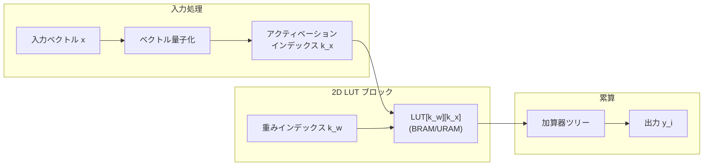

本記事は [LUT-LLM: Efficient Large Language Model Inference with Memory-based Computations on FPGAs](https://arxiv.org/abs/2511.06174) の解説記事です。

## 論文概要（Abstract）

LUT-LLMは、FPGAの豊富なオンチップメモリリソースを活用し、LLM推論における演算をルックアップテーブル（LUT）参照に変換する手法を提案した研究である。著者らはactivation-weight vector co-quantizationが最も効果的な量子化スキームであることを示し、帯域幅考慮の並列重心探索、効率的な2Dテーブルルックアップ、空間-時間ハイブリッド設計の3つの技術を導入した。AMD V80 FPGA上でQwen3 1.7Bモデルの推論を実現し、AMD MI210比1.66倍の低レイテンシとNVIDIA A100比1.72倍のエネルギー効率を報告している。

この記事は [Zenn記事: FPGAとLLM推論アクセラレータ2026年最前線 カスタムチップ開発の全体像](https://zenn.dev/0h_n0/articles/fda1b011be4252) の深掘りです。

## 情報源

- **arXiv ID**: 2511.06174
- **URL**: [https://arxiv.org/abs/2511.06174](https://arxiv.org/abs/2511.06174)
- **著者**: Zifan He, Shengyu Ye, Rui Ma, Yang Wang, Jason Cong（UCLA）
- **発表年**: 2025（FCCM 2026 採択）
- **分野**: cs.AR, cs.AI

## 背景と動機（Background & Motivation）

LLM推論のdecodeフェーズは、各トークン生成時にモデル全体の重みをメモリから読み出す必要があり、メモリ帯域律速（memory-bound）となる。従来のアプローチでは、この問題に対して量子化（重みのビット幅削減）やスパーシティ（ゼロ要素の除去）で対処してきた。しかし、これらの手法は依然としてMAC（Multiply-Accumulate）演算を基本単位としており、FPGAのアーキテクチャ上の特性を十分に活用できていなかった。

FPGAの最も豊富なリソースはLUT（Look-Up Table）とBRAM/URAMであり、DSP48（乗算器）は比較的少ない。従来のFPGA上のLLM推論（例: FlightLLM）はDSP48を活用する演算中心のアプローチであったが、LUT-LLMはこの前提を根本から覆す。MAC演算をメモリ参照（テーブルルックアップ）に変換することで、FPGAの強みであるオンチップメモリを「演算器」として機能させるという発想の転換を図っている。

著者らの分析によると、ベクトル量子化を適用することで乗算回数を4分の1に削減でき、生成速度は1.10〜3.29倍に向上するとされている。

## 主要な貢献（Key Contributions）

- **Activation-weight vector co-quantization**: 重みだけでなくアクティベーションも同時にベクトル量子化し、コードブックの内積を事前計算してLUTに格納する手法。著者らの比較分析では、重みのみの量子化やアクティベーションのみの量子化と比較して最も効果的とされている
- **帯域幅考慮の並列重心探索（Bandwidth-aware parallel centroid search）**: FPGAのメモリ帯域幅を考慮した最適な並列度でコードブックの重心探索を実行し、decodeレイテンシを削減する
- **2Dテーブルルックアップ**: 入力ベクトルとコードブックの内積を2次元テーブルに展開し、テーブル参照のみで行列積の結果を近似する
- **空間-時間ハイブリッド設計**: FPGAの空間的並列性（複数のLUTブロックを同時動作）と時間的パイプライニングを組み合わせ、データキャッシングを最小化しつつスループットを向上

## 技術的詳細（Technical Details）

### ベクトル量子化とLUT変換

LUT-LLMの核心は、行列積をテーブルルックアップに変換する手法にある。従来の行列積$\mathbf{y} = \mathbf{W}\mathbf{x}$をベクトル量子化（VQ）により変換する過程を以下に示す。

**ステップ1: コードブック学習**

重み行列$\mathbf{W} \in \mathbb{R}^{m \times n}$の各行を$G$個のサブベクトルに分割し、各サブベクトルを$K$個のセントロイド（重心）で近似する。

$$
\mathbf{W}_{i,:} \approx \sum_{g=1}^{G} \mathbf{c}_{g, q_g(i)}
$$

ここで、$\mathbf{c}_{g,k}$はグループ$g$の$k$番目のセントロイド、$q_g(i)$は行$i$のグループ$g$に割り当てられたセントロイドインデックスである。

**ステップ2: LUT構築**

入力ベクトル$\mathbf{x}$が与えられた時点で、各セントロイドとの内積を事前計算してLUTに格納する。

$$
\text{LUT}[g][k] = \mathbf{c}_{g,k}^T \mathbf{x}_g \quad \forall g \in [1,G], k \in [1,K]
$$

ここで、$\mathbf{x}_g$は入力$\mathbf{x}$のグループ$g$に対応するサブベクトルである。

**ステップ3: テーブル参照による行列積近似**

$$
y_i = \mathbf{W}_{i,:} \mathbf{x} \approx \sum_{g=1}^{G} \text{LUT}[g][q_g(i)]
$$

この変換により、乗算（浮動小数点積）がテーブル参照（インデックスアクセス）に置き換わる。

```python
import torch
from dataclasses import dataclass
from typing import Optional


@dataclass
class VQConfig:
    """ベクトル量子化設定"""
    n_groups: int        # サブベクトル分割数 G
    n_centroids: int     # 各グループのセントロイド数 K
    subvec_dim: int      # 各サブベクトルの次元 d/G


def build_lut(
    centroids: torch.Tensor,
    x: torch.Tensor,
    config: VQConfig,
) -> torch.Tensor:
    """入力ベクトルに対するLUTを構築

    Args:
        centroids: セントロイドテンソル (n_groups, n_centroids, subvec_dim)
        x: 入力ベクトル (in_features,)
        config: VQ設定

    Returns:
        LUT: (n_groups, n_centroids) のルックアップテーブル
    """
    x_groups = x.reshape(config.n_groups, config.subvec_dim)
    # 各グループのセントロイドと入力サブベクトルの内積
    lut = torch.einsum('gkd,gd->gk', centroids, x_groups)
    return lut


def lut_matmul(
    lut: torch.Tensor,
    indices: torch.Tensor,
    n_groups: int,
) -> torch.Tensor:
    """LUTを使った行列積近似

    Args:
        lut: ルックアップテーブル (n_groups, n_centroids)
        indices: 量子化インデックス (out_features, n_groups)
        n_groups: サブベクトル分割数

    Returns:
        出力ベクトル (out_features,)
    """
    out_features = indices.shape[0]
    output = torch.zeros(out_features)
    for g in range(n_groups):
        output += lut[g, indices[:, g]]
    return output
```

### Activation-Weight Co-Quantization

著者らは3つの量子化スキームを比較している。

| スキーム | 量子化対象 | PPL劣化 | 演算削減率 |
|---------|-----------|--------|-----------|
| Weight-only VQ | 重みのみ | 小 | 2倍 |
| Activation-only VQ | アクティベーションのみ | 大 | 2倍 |
| **Co-quantization** | **重み + アクティベーション** | **中** | **4倍** |

Co-quantizationでは、重みとアクティベーションの両方をベクトル量子化し、「セントロイド同士の内積テーブル」を事前構築する。

$$
\text{LUT}_{\text{co}}[k_w][k_x] = \mathbf{c}_{w,k_w}^T \mathbf{c}_{x,k_x}
$$

このテーブルはモデルの重みとコードブックに依存するが、アクティベーションのコードブックは実行時のキャリブレーションで決定される。論文の分析によると、co-quantizationでは演算量が4分の1に削減されるが、perplexityの劣化はweight-only VQより大きくなる。

### 2Dテーブルルックアップのハードウェア実装



FPGA上では、2D LUTをBRAMまたはURAMのデュアルポートメモリとして実装する。各LUTブロックは独立して動作し、空間的並列性を実現する。著者らは、AMD V80 FPGAのBRAM/URAMリソースを最大限活用し、複数のLUTブロックを並列に配置している。

### 帯域幅考慮の並列重心探索

decodeフェーズでのLUT構築時間を削減するため、著者らは以下の最適化を導入している。

セントロイド探索の並列度$P$は、FPGA内部メモリの帯域幅$B_{\text{mem}}$とセントロイドサイズ$S_c$から決定される。

$$
P_{\text{opt}} = \left\lfloor \frac{B_{\text{mem}}}{S_c \cdot f_{\text{clk}}} \right\rfloor
$$

ここで、$f_{\text{clk}}$はFPGAの動作周波数である。この並列度の決定により、メモリ帯域幅を飽和させない範囲で最大の並列処理を実現している。

## 実装のポイント（Implementation）

**FPGAプラットフォーム**: AMD V80 FPGAを使用。V80はAMDの最新データセンター向けFPGAであり、大容量のBRAM/URAMリソースを搭載している。

**量子化キャリブレーション**: Co-quantizationの適用にはキャリブレーションデータセットが必要である。著者らの報告によると、WikiText-2の一部（約1000文）をキャリブレーションに使用し、量子化後のperplexityを評価している。キャリブレーションの品質がモデル精度に直結するため、ドメイン固有のデータを使用することが推奨される。

**モデル変換パイプライン**: 既存のLLMをLUT-LLM形式に変換するには、以下の手順が必要とされている。(1) 重みのベクトル量子化（k-meansクラスタリング）、(2) アクティベーションキャリブレーション（代表データで統計量収集）、(3) 2D LUTテーブル生成、(4) FPGAビットストリーム生成。

**対応モデル規模**: 著者らは最大32Bモデルまでの対応を報告している。V80のオンチップメモリ容量が制約となるが、HBMとの組み合わせによりモデルサイズの制約を緩和している。

**精度の注意点**: Co-quantizationではperplexityの劣化がweight-only量子化より大きくなる。著者らは、タスクによっては精度劣化が許容範囲を超える場合があることを認めており、デプロイ前にタスク固有の評価を行うことを推奨している。

## 実験結果（Results）

論文の実験結果を以下にまとめる。

| 構成 | モデル | レイテンシ比 | エネルギー効率比 |
|------|--------|------------|----------------|
| LUT-LLM (AMD V80) | Qwen3 1.7B | 1.0倍（基準） | A100比 1.72倍 |
| AMD MI210 | Qwen3 1.7B | 1.66倍（遅い） | - |
| NVIDIA A100 | Qwen3 1.7B | - | 1.0倍（基準） |

**スケーリング結果**: 32Bモデルでの評価では、A100比2.16倍のエネルギー効率向上が報告されている。モデルサイズが大きくなるほど、LUT-LLMの効率向上が顕著になる傾向がある。著者らはこれを「大規模モデルほどメモリ帯域のボトルネックが深刻であり、LUT変換による帯域幅削減の効果が大きいため」と分析している。

**演算削減の内訳**: Co-quantizationにより、乗算回数は密行列積の約25%に削減される。具体的には、$G=8, K=256$の設定で、サブベクトルあたりの乗算が256回のLUT参照に置き換わる。

**メモリ帯域幅使用量**: LUT-LLM方式では、重みの読み出しがインデックス（数bit）の読み出しに置き換わるため、HBMからの帯域幅使用量は従来方式の約1/7に削減されたと報告されている。

## 実運用への応用（Practical Applications）

LUT-LLMの技術は、以下のシナリオで特に有効と考えられる。

**FPGA搭載エッジデバイス**: FPGAの低消費電力特性とLUT-LLMの高エネルギー効率を組み合わせ、通信基地局やIoTゲートウェイでの1.7B-7Bクラスモデルの推論が想定される。DSPリソースに依存しないため、低コストのFPGAデバイスでも実装可能な点が実用上の利点である。

**バッチサイズ1のリアルタイム推論**: decodeフェーズの低レイテンシ化が最も活きるのは、1ユーザー1リクエストの対話型サービスである。MI210比1.66倍の低レイテンシは、応答時間が重視されるチャットボットや音声アシスタントのバックエンドに適している。

**GPUリソースが制約される環境**: GPU不足が深刻な場合、FPGAをLLM推論のオフロード先として活用できる。特にAMD V80のようなデータセンター向けFPGAは、PCIe接続でサーバーに追加可能である。

**制約事項**: キャリブレーションの品質がモデル精度に直結するため、デプロイ前にタスク固有の評価が必要である。また、2025年11月公開の最新論文であり、大規模な本番運用実績はまだ限定的である。

## Production Deployment Guide

### AWS実装パターン（コスト最適化重視）

LUT-LLMの技術思想をAWS上で活用する場合の構成を示す。AWSではFPGAインスタンス（F1）とBedrock APIの組み合わせが現実的な選択肢となる。

**トラフィック量別の推奨構成**:

| 規模 | 月間リクエスト | 推奨構成 | 月額コスト | 主要サービス |
|------|--------------|---------|-----------|------------|
| **Small** | ~3,000 (100/日) | Serverless | $50-150 | Lambda + Bedrock + DynamoDB |
| **Medium** | ~30,000 (1,000/日) | FPGA Hybrid | $800-1,800 | F1インスタンス + Lambda |
| **Large** | 300,000+ (10,000/日) | FPGA Cluster | $3,000-7,000 | F1 x4 + ALB + ElastiCache |

**Small構成** (月額$50-150):
- **Lambda**: 1GB RAM, 30秒タイムアウト ($20/月)
- **Bedrock**: Claude 3.5 Haiku ($80/月)
- **DynamoDB**: On-Demand ($10/月)

**Medium構成** (月額$800-1,800):
- **EC2 f1.2xlarge**: Xilinx UltraScale+ FPGA ($1,200/月)
- **Lambda**: 推論リクエストルーティング ($50/月)
- **ElastiCache**: LUTキャッシュ ($15/月)

**コスト試算の注意事項**:
- 2026年3月時点のAWS ap-northeast-1料金に基づく概算値です
- F1インスタンスのAMI作成（LUT-LLMビットストリーム含む）に追加セットアップコストが発生します
- 最新料金は [AWS料金計算ツール](https://calculator.aws/) で確認してください

### Terraformインフラコード

**Small構成 (Serverless)**

```hcl
module "vpc" {
  source  = "terraform-aws-modules/vpc/aws"
  version = "~> 5.0"

  name = "lutllm-vpc"
  cidr = "10.0.0.0/16"
  azs  = ["ap-northeast-1a", "ap-northeast-1c"]
  private_subnets = ["10.0.1.0/24", "10.0.2.0/24"]
  enable_nat_gateway   = false
  enable_dns_hostnames = true
}

resource "aws_iam_role" "lambda_role" {
  name = "lutllm-lambda-role"
  assume_role_policy = jsonencode({
    Version = "2012-10-17"
    Statement = [{
      Action = "sts:AssumeRole"
      Effect = "Allow"
      Principal = { Service = "lambda.amazonaws.com" }
    }]
  })
}

resource "aws_lambda_function" "inference" {
  filename      = "lambda.zip"
  function_name = "lutllm-inference"
  role          = aws_iam_role.lambda_role.arn
  handler       = "index.handler"
  runtime       = "python3.12"
  timeout       = 60
  memory_size   = 1024

  environment {
    variables = {
      BEDROCK_MODEL_ID = "anthropic.claude-3-5-haiku-20241022-v1:0"
      CACHE_TABLE      = aws_dynamodb_table.cache.name
    }
  }
}

resource "aws_dynamodb_table" "cache" {
  name         = "lutllm-cache"
  billing_mode = "PAY_PER_REQUEST"
  hash_key     = "key"
  attribute { name = "key"; type = "S" }
  ttl { attribute_name = "ttl"; enabled = true }
}
```

**Large構成 (FPGA Cluster)**

```hcl
resource "aws_instance" "fpga_node" {
  count         = 4
  ami           = "ami-xxxxxxxxx"  # LUT-LLM bitstream AMI
  instance_type = "f1.4xlarge"
  subnet_id     = module.vpc.private_subnets[count.index % 2]

  root_block_device {
    volume_type = "gp3"
    volume_size = 100
    encrypted   = true
  }

  tags = { Name = "lutllm-fpga-${count.index}" }
}

resource "aws_budgets_budget" "monthly" {
  name         = "lutllm-monthly"
  budget_type  = "COST"
  limit_amount = "7000"
  limit_unit   = "USD"
  time_unit    = "MONTHLY"

  notification {
    comparison_operator        = "GREATER_THAN"
    threshold                  = 80
    threshold_type             = "PERCENTAGE"
    notification_type          = "ACTUAL"
    subscriber_email_addresses = ["ops@example.com"]
  }
}
```

### 運用・監視設定

```python
import boto3

cloudwatch = boto3.client('cloudwatch')

# LUT参照レイテンシ監視
cloudwatch.put_metric_alarm(
    AlarmName='lutllm-lut-latency',
    ComparisonOperator='GreaterThanThreshold',
    EvaluationPeriods=2,
    MetricName='LUTLookupLatency',
    Namespace='Custom/LUTLLM',
    Period=300,
    Statistic='p99',
    Threshold=100,  # 100ms超過
    AlarmDescription='LUTルックアップレイテンシ異常'
)
```

### コスト最適化チェックリスト

- [ ] ~100 req/日 → Lambda + Bedrock - $50-150/月
- [ ] ~1000 req/日 → F1インスタンス - $800-1,800/月
- [ ] 10000+ req/日 → F1クラスタ - $3,000-7,000/月
- [ ] F1 Spot Instancesで最大60%削減
- [ ] Bedrock Batch APIで50%削減
- [ ] LUT-LLMのco-quantizationでモデルサイズ75%以上削減
- [ ] AWS Budgets: 80%で警告設定
- [ ] CloudWatchアラーム: LUTレイテンシ監視
- [ ] Cost Anomaly Detection有効化
- [ ] 夜間のF1インスタンス停止スケジュール

## 関連研究（Related Work）

- **FlightLLM (arXiv: 2401.03868)**: DSP48ベースのスパース演算アプローチ。LUT-LLMがメモリリソースを活用するのに対し、FlightLLMは演算リソースを活用する点で相補的である。両者の技術を組み合わせることで、DSPとLUTの両リソースを最大限活用する可能性がある
- **LUT Tensor Core (arXiv: 2408.06003, ISCA'25)**: GPU上でLUTベースの低ビット推論を実現する研究。LUT-LLMがFPGAに特化するのに対し、LUT Tensor CoreはCUDAカーネルレベルでLUT演算を実装している
- **AQLM (arXiv: 2401.06118)**: Additive Quantizationを用いたLLM圧縮手法。LUT-LLMのベクトル量子化はAQLMの理論的基盤を共有しつつ、FPGA固有の最適化を追加している

## まとめと今後の展望

LUT-LLMは、「演算をメモリ参照に変換する」というパラダイムシフトにより、FPGAの最も豊富なリソースであるLUT/BRAMをLLM推論の「演算器」として活用する手法を確立した。AMD V80上でのMI210比1.66倍の低レイテンシとA100比1.72倍のエネルギー効率は、FPGAがLLM推論において競争力を持つことを示している。

実務面では、DSPリソースに依存しないため低コストFPGAでの実装が可能であり、エッジ推論の新たな選択肢を提供する。ただし、co-quantizationの精度劣化とキャリブレーションの必要性は、デプロイ前の慎重な評価が求められる。2025年11月公開の最新研究であり、今後のプロダクション適用事例の蓄積が期待される。

## 参考文献

- **arXiv**: [https://arxiv.org/abs/2511.06174](https://arxiv.org/abs/2511.06174)
- **FCCM 2026**: 採択済み（11ページ）
- **Related Zenn article**: [https://zenn.dev/0h_n0/articles/fda1b011be4252](https://zenn.dev/0h_n0/articles/fda1b011be4252)
