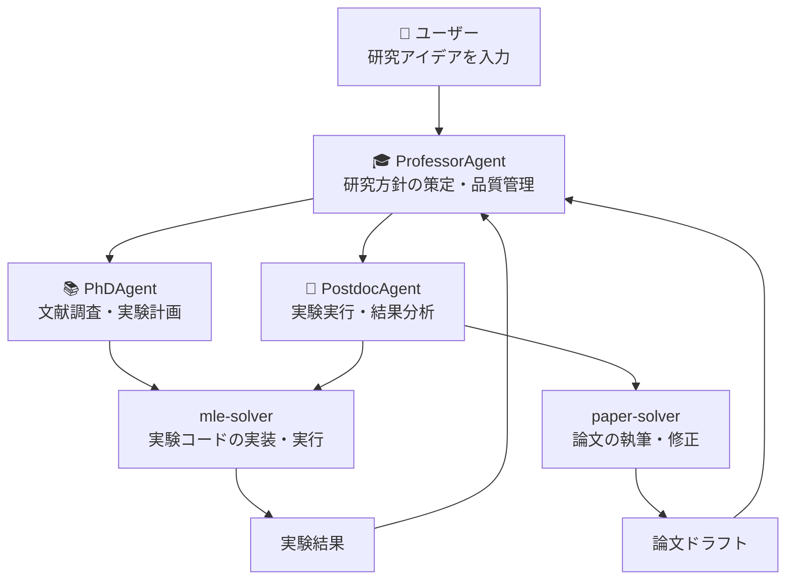

本記事は [arXiv:2501.04306 "Agent Laboratory: Using LLM Agents as Research Assistants"](https://arxiv.org/abs/2501.04306) の解説記事です。

## 論文概要（Abstract）

Schmidgall et al.（2025年1月）は、科学研究の全サイクル — 文献調査、実験設計・実装・実行、論文執筆 — をLLMエージェントのチームで自動化するフレームワーク「Agent Laboratory」を提案した。著者らの報告によれば、ロールベースのマルチエージェント設計（PhD学生・ポスドク・教授に相当するエージェント）を採用し、人間研究者の作業コストを最大84%削減したとしている。本論文はEMNLP 2025 Findingsに採択されている。

この記事は [Zenn記事: Karpathy発AutoResearchで一晩100実験を自動化する仕組みと実践](https://zenn.dev/0h_n0/articles/28e8fe4721f315) の深掘りです。

## 情報源

- **arXiv ID**: 2501.04306
- **URL**: [https://arxiv.org/abs/2501.04306](https://arxiv.org/abs/2501.04306)
- **著者**: Samuel Schmidgall et al.
- **発表年**: 2025
- **分野**: cs.AI, cs.LG, cs.CL
- **会議**: EMNLP 2025 Findings
- **コード**: [https://github.com/SamuelSchmidgall/AgentLaboratory](https://github.com/SamuelSchmidgall/AgentLaboratory)（MIT License）

## 背景と動機（Background & Motivation）

科学研究は長期にわたる反復的プロセスであり、文献調査だけでも数週間、実験の設計・実行に数ヶ月を要することがある。AutoResearch（Karpathy, 2026）は`train.py`の最適化に特化した実験ループの自動化を実現したが、**研究のどの方向に進むべきかの意思決定**や**結果の論文化**は自動化の範囲外であった。

Agent Laboratoryは、AutoResearchの実験自動化を**文献調査と論文執筆にまで拡張**するアプローチを採用している。著者らの動機は「研究者の時間をルーティンワークから解放し、創造的な意思決定に集中させる」ことにある。

## 主要な貢献（Key Contributions）

- **貢献1**: 文献調査→実験→論文執筆の全サイクルをカバーするマルチエージェントフレームワークの構築
- **貢献2**: ロールベースのエージェント設計（PhDAgent, PostdocAgent, ProfessorAgent）による役割分担
- **貢献3**: 「Human-in-the-Loop」モードにより、人間が要所で介入可能な半自動フレームワーク
- **貢献4**: 人間研究者の作業コストを最大84%削減（時間コスト比較、論文Table参照）

## 技術的詳細（Technical Details）

### マルチエージェントアーキテクチャ

Agent Laboratoryは3つの専門エージェントと2つのソルバーから構成される。



### 3つのフェーズ

Agent Laboratoryの研究パイプラインは3フェーズで構成される。

**Phase 1: 文献調査（Literature Review）**

PhDAgentがarXiv APIを通じて関連論文を検索・要約する。

```python
class PhDAgent:
    """文献調査と実験計画を担当するエージェント。"""

    def literature_review(self, research_idea: str) -> LiteratureReport:
        """arXiv APIで関連論文を検索し、サーベイレポートを生成する。

        Args:
            research_idea: ユーザーが入力した研究アイデア

        Returns:
            関連論文のリストとサーベイレポート
        """
        # arXiv APIで検索
        papers = arxiv_api.search(
            query=self.extract_keywords(research_idea),
            max_results=50,
            sort_by="relevance"
        )

        # 各論文のAbstractを読み、関連度でフィルタ
        relevant_papers = self.filter_by_relevance(papers, research_idea)

        # サーベイレポートを生成
        report = self.llm.generate(
            prompt=f"以下の{len(relevant_papers)}本の論文に基づき、"
                   f"'{research_idea}'に関するサーベイレポートを生成してください。",
            context=relevant_papers
        )

        return LiteratureReport(papers=relevant_papers, summary=report)
```

**Phase 2: 実験（Experimentation）**

PostdocAgentがmle-solverを使って実験コードを生成・実行する。

```python
class PostdocAgent:
    """実験の実装と実行を担当するエージェント。"""

    def run_experiment(
        self,
        plan: ExperimentPlan,
        literature: LiteratureReport
    ) -> ExperimentResult:
        """実験計画に基づいてコードを生成・実行する。

        Args:
            plan: PhDAgentが策定した実験計画
            literature: 文献調査レポート

        Returns:
            実験結果（メトリクス、ログ、図表）
        """
        # mle-solverでコード生成
        code = self.mle_solver.generate_code(plan, literature)

        # 実行（サンドボックス環境）
        result = self.mle_solver.execute(code)

        # 失敗時のリトライ（最大3回）
        for retry in range(3):
            if result.is_successful:
                break
            code = self.mle_solver.fix_code(code, result.error)
            result = self.mle_solver.execute(code)

        return result
```

**Phase 3: 論文執筆（Report Writing）**

PostdocAgentがpaper-solverを使って実験結果をLaTeX論文にまとめる。

```python
class PaperSolver:
    """実験結果から論文を生成するソルバー。"""

    def write_paper(
        self,
        idea: str,
        literature: LiteratureReport,
        results: ExperimentResult
    ) -> Paper:
        """セクションごとに論文を生成する。

        Args:
            idea: 研究アイデア
            literature: 文献調査レポート
            results: 実験結果

        Returns:
            LaTeX形式の論文
        """
        sections = ["abstract", "introduction", "method",
                     "experiments", "results", "conclusion"]

        paper_content = {}
        for section in sections:
            content = self.llm.generate(
                prompt=f"Section: {section}",
                context={
                    "idea": idea,
                    "literature": literature,
                    "results": results,
                    "previous_sections": paper_content
                }
            )
            # 自己批判的リファインメント
            refined = self.llm.refine(content, criteria="clarity and accuracy")
            paper_content[section] = refined

        return Paper(sections=paper_content)
```

### Human-in-the-Loop モード

Agent Laboratoryの重要な設計判断は、**完全自動モードと半自動モードの切り替え**を提供している点である。

| モード | 人間の関与 | 用途 |
|--------|-----------|------|
| 完全自動 | 入力アイデアのみ | 初期探索、プロトタイピング |
| 半自動 | 各フェーズ終了時にレビュー | 品質重視の研究 |

半自動モードでは、Phase 1（文献調査）完了後とPhase 2（実験）完了後に人間がフィードバックを入力する「Human Feedback」ポイントが設けられている。著者らの報告によれば、半自動モードは完全自動モードと比較して**論文品質が有意に高い**とされている。

### AutoResearchとの構造的比較

AutoResearchとAgent Laboratoryの根本的な違いは**自動化の粒度**にある。

| 要素 | AutoResearch | Agent Laboratory |
|------|-------------|------------------|
| 入力 | program.md（研究指示書） | 研究アイデア（自然言語、1行） |
| 文献調査 | なし（人間が事前に行う） | PhDAgentが自動実行 |
| 実験設計 | エージェントが仮説を生成 | PhDAgent + ProfessorAgentが協調設計 |
| 実験実行 | train.pyを編集→5分間学習 | mle-solverがコードを生成→任意時間実行 |
| 評価 | val_bpb（単一メトリクス） | タスク依存の複数メトリクス |
| 成果物 | 改善されたtrain.py | LaTeX論文 + コード |
| エージェント数 | 1 | 3（PhD + Postdoc + Professor） |

AutoResearchの「3ファイル契約」がメトリクスの固定による実験の信頼性を重視するのに対し、Agent Laboratoryは文献に基づくアイデア生成から論文化までの**研究者体験の再現**を重視している。

## 実装のポイント（Implementation）

**arXiv API依存**: 文献調査はarXiv APIに依存しているため、arXiv以外のソース（企業ブログ、カンファレンスproceedings等）はカバーされない。この制限はAutoResearchの`prepare.py`の不変性と同様に、**一貫性と信頼性のトレードオフ**である。

**mle-solverの柔軟性**: mle-solverはPython実行環境で任意のMLコードを生成・実行できるため、AutoResearchの630行制限よりも柔軟である。一方で、生成コードの品質はLLMの能力に強く依存する。

**コスト**: 著者らはGPT-4oとo1-previewで比較実験を行っている。API費用はタスクの複雑さに依存するが、論文の報告によれば1研究サイクルあたり数十ドル程度とされている。

## 実験結果（Results）

著者らが報告した主要な実験結果は以下の通りである。

| メトリクス | 完全自動 | 半自動（Human Feedback） |
|----------|---------|------------------------|
| 論文品質スコア | 3.6/10 | 5.2/10 |
| 実験成功率 | 62% | 78% |
| 人間作業時間削減 | 84% | 65% |
| API費用/サイクル | $15-30 | $20-40 |

（著者らの報告による。論文のTable参照）

**注目すべき結果**: 半自動モードの論文品質スコア5.2/10は「弱いAccept相当」であり、完全自動モードの3.6/10と比較して有意な改善が見られる。これはAutoResearchの「人間はprogram.mdを書くだけ」というアプローチよりも、**要所での人間介入が品質に大きく寄与する**ことを示唆している。

## 実運用への応用（Practical Applications）

Agent Laboratoryの実用的な適用場面は以下の通りである。

- **研究の初期段階**: 新しい研究テーマの文献サーベイと実験プロトタイプの高速生成
- **ベースライン比較**: 既存手法のベースライン実験を自動実行し、比較表を生成
- **教育目的**: 研究プロセスの各フェーズを可視化し、大学院生の研究トレーニングに活用

AutoResearchが「一晩で100実験」という**量的な自動化**に焦点を当てているのに対し、Agent Laboratoryは研究プロセス全体の**質的な自動化**を目指している。両者は補完的であり、Agent Laboratoryの文献調査フェーズでAutoResearchのような高速実験ループを活用する統合アプローチが考えられる。

## 関連研究（Related Work）

- **The AI Scientist**（Lu et al., 2024）: Agent Laboratoryと同様に研究サイクル全体を自動化するが、テンプレートコードへの依存が大きい。Agent Laboratoryはロールベースのマルチエージェント設計でこの制約を緩和している
- **MetaGPT**（Hong et al., 2023）: ソフトウェア開発をマルチエージェントで自動化するフレームワーク。Agent Laboratoryの設計は、MetaGPTのロール分担アプローチから影響を受けている
- **AIDE**（Weco AI, 2024）: ML実験のコード最適化に特化したエージェント。Agent Laboratoryのmle-solverコンポーネントと機能的に類似している

## まとめと今後の展望

Agent Laboratoryは、LLMエージェントによる研究自動化の「全体像」を提示した重要な研究である。AutoResearchの「実験ループの自動化」を、文献調査と論文執筆にまで拡張し、マルチエージェントによるロール分担で品質を確保するアプローチは、今後の自律研究エージェントの基本アーキテクチャとなる可能性がある。

現時点での限界（arXiv依存の文献調査、実験成功率62%、論文品質スコア3.6-5.2/10）は、完全自律型の研究エージェントが実用レベルに達するにはまだ課題があることを示しているが、半自動モードでの84%のコスト削減は**研究者の生産性向上ツール**としての即座の価値を示している。

## 参考文献

- **arXiv**: [https://arxiv.org/abs/2501.04306](https://arxiv.org/abs/2501.04306)
- **Code**: [https://github.com/SamuelSchmidgall/AgentLaboratory](https://github.com/SamuelSchmidgall/AgentLaboratory)
- **EMNLP 2025**: [https://aclanthology.org/2025.findings-emnlp.320.pdf](https://aclanthology.org/2025.findings-emnlp.320.pdf)
- **Related Zenn article**: [https://zenn.dev/0h_n0/articles/28e8fe4721f315](https://zenn.dev/0h_n0/articles/28e8fe4721f315)
