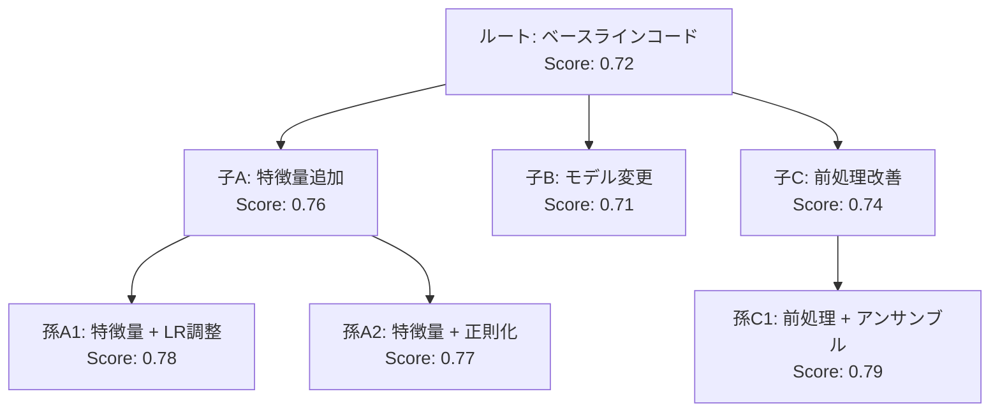

本記事は [AIDE: Machine Learning Engineer Agent](https://arxiv.org/abs/2502.13138) （Weco AI, 2025）の解説記事です。

## 論文概要（Abstract）

Weco AIのAIDE（AI Development Environment）は、MLエンジニアリングタスクを**コード空間におけるツリー探索問題**としてフレーミングし、LLMエージェントが反復的にソリューションコードを生成・改善するフレームワークである。著者らの報告によれば、各ノードが実行可能なソリューション、各エッジが意味のある改善を表すツリー構造で実験を管理し、Kaggleコンペティションのタスクにおいて人間参加者の上位16%相当のスコアを達成した。

この記事は [Zenn記事: Karpathy発AutoResearchで一晩100実験を自動化する仕組みと実践](https://zenn.dev/0h_n0/articles/28e8fe4721f315) の深掘りです。

## 情報源

- **arXiv ID**: 2502.13138
- **URL**: [https://arxiv.org/abs/2502.13138](https://arxiv.org/abs/2502.13138)
- **開発元**: Weco AI
- **発表年**: 2025
- **分野**: cs.LG, cs.AI, cs.SE
- **コード**: [https://github.com/WecoAI/aideml](https://github.com/WecoAI/aideml)（Apache 2.0）

## 背景と動機（Background & Motivation）

AutoResearch（Karpathy, 2026）の「ラチェットメカニズム」は、改善があればコードを保持し、そうでなければ元に戻すという**線形な探索**を行う。この手法は単純で信頼性が高いが、探索空間の構造を活用できないという限界がある。

例えば、AutoResearchで「学習率を3e-4から1e-3に変更」→改善→「RMSNormに変更」→悪化→元に戻す、という流れでは、**「RMSNorm + 別の学習率」**という組み合わせは試行されない。一度棄却された変更は再利用されず、探索履歴が活用されない。

AIDEはこの問題を**ツリー探索**で解決する。各実験を木構造のノードとして管理し、成功した改善を「親ノード」として保持しつつ、複数の「子ノード」（異なる改善方向）を並列に展開できる。これにより、AutoResearchの線形探索では見逃される**パラメータ間の交互作用**を発見できる。

## 主要な貢献（Key Contributions）

- **貢献1**: MLエンジニアリングタスクをコード空間のツリー探索問題として形式化
- **貢献2**: 過去の実験履歴（成功・失敗の両方）をツリー構造で管理し、次の探索方向の決定に活用
- **貢献3**: Kaggle形式の8タスクで人間参加者の上位16%相当のスコアを達成
- **貢献4**: ツリー探索の深さと幅のトレードオフを実験的に分析

## 技術的詳細（Technical Details）

### コード空間のツリー探索

AIDEの中核は、実験をノード、改善をエッジとするツリー構造の管理にある。



各ノードは以下の要素を持つ。

```python
@dataclass
class ExperimentNode:
    """ツリー探索における1つの実験ノード。"""
    code: str           # 実行可能なPythonコード
    score: float        # 評価メトリクス（Kaggle形式のスコア）
    parent: "ExperimentNode | None"  # 親ノード
    children: list["ExperimentNode"]  # 子ノードのリスト
    depth: int          # ツリーの深さ
    modification: str   # 親からの変更内容の自然言語記述
```

### ノード選択アルゴリズム

ツリーの中から次に展開するノードを選択する方法は、モンテカルロ木探索（MCTS）に着想を得ている。

$$
\text{UCB}(n) = \bar{X}_n + c \sqrt{\frac{\ln N}{n_i}}
$$

ここで、
- $\bar{X}_n$: ノード$n$の子ノードの平均スコア
- $N$: 全ノードの訪問回数の合計
- $n_i$: ノード$n$の訪問回数
- $c$: 探索と活用のバランスを制御するハイパーパラメータ

AIDEの実装では、著者らの報告によれば厳密なUCBではなく、以下のヒューリスティックを用いている。

1. **最高スコアの親ノード**から子ノードを展開する確率が高い
2. **まだ展開されていないノード**にはボーナスを付与する
3. **直近の改善率**が大きいノードを優先する

### コード改善の生成

LLMが親ノードのコードと実験ログを入力として、改善されたコードを生成する。

```python
def generate_improvement(
    parent: ExperimentNode,
    tree_context: list[ExperimentNode],
    llm: LLM
) -> str:
    """親ノードのコードを改善した子ノードのコードを生成する。

    Args:
        parent: 改善対象の親ノード
        tree_context: ツリー全体の実験履歴
        llm: LLMインスタンス

    Returns:
        改善されたPythonコード
    """
    # 過去の成功・失敗パターンをコンテキストに含める
    context = format_tree_history(tree_context)

    prompt = f"""
    以下は現在の最良コード（スコア: {parent.score}）です:

    ```python
    {parent.code}
    ```

    過去の実験履歴:
    {context}

    このコードを改善して、スコアを向上させてください。
    過去に失敗した方向は避け、成功したパターンを活用してください。
    """

    improved_code = llm.generate(prompt)
    return improved_code
```

### AutoResearchのラチェットとの比較

AutoResearchとAIDEの探索戦略の根本的な違いを形式的に比較する。

**AutoResearchのラチェット（線形探索）**:

$$
s_{t+1} = \begin{cases}
s'_t & \text{if } f(s'_t) < f(s_t) \\
s_t & \text{otherwise}
\end{cases}
$$

ここで$s_t$は時刻$t$のコード状態、$s'_t$はLLMが生成した修正版、$f$は評価関数（val_bpb、低いほど良い）。

**AIDEのツリー探索**:

$$
s_{t+1} = \text{select}(\mathcal{T}) \oplus \text{improve}(\text{select}(\mathcal{T}))
$$

ここで$\mathcal{T}$はツリー全体、$\text{select}$はノード選択関数、$\oplus$は子ノードの追加操作。

ラチェットは$O(1)$のメモリで動作する（現在の最良状態のみ保持）が、ツリー探索は$O(n)$のメモリが必要（全ノードの履歴を保持）。この追加メモリが、パラメータ間の交互作用の発見を可能にする。

### 実行サイクル

```python
def aide_loop(
    task: str,
    eval_metric: str,
    max_iterations: int = 100,
    tree_width: int = 3,
    tree_depth: int = 10
) -> ExperimentNode:
    """AIDEのメイン実験ループ。

    Args:
        task: タスクの自然言語記述
        eval_metric: 評価メトリクス名
        max_iterations: 最大イテレーション数
        tree_width: ツリーの最大幅（各ノードの子ノード数）
        tree_depth: ツリーの最大深さ

    Returns:
        最高スコアのノード
    """
    # ルートノード: ベースラインコードを生成
    root = generate_baseline(task)
    tree = ExperimentTree(root)

    for i in range(max_iterations):
        # 1. ノード選択（UCB-likeヒューリスティック）
        parent = tree.select_node()

        # 2. 改善コード生成
        new_code = generate_improvement(parent, tree.nodes, llm)

        # 3. 実行・評価
        score = execute_and_evaluate(new_code, eval_metric)

        # 4. ノード追加
        child = ExperimentNode(
            code=new_code, score=score,
            parent=parent, depth=parent.depth + 1
        )
        tree.add_node(child)

        # 5. 枝刈り（スコアが一定以上低下したブランチを停止）
        tree.prune(threshold=0.05)

    return tree.best_node()
```

## 実装のポイント（Implementation）

**コンテキスト管理**: ツリーが大きくなると、全ノードの履歴をLLMのコンテキストに含めることが困難になる。AIDEでは「直近の祖先パス + 兄弟ノードのサマリー」に限定することで、コンテキスト長を管理可能な範囲に抑えている。

**評価の一貫性**: AutoResearchが`prepare.py`の不変性で評価の一貫性を保証しているのと同様に、AIDEでも評価関数は固定されている（Kaggle形式のスコア計算スクリプトは変更不可）。

**深層学習タスクの制約**: 著者らの報告によれば、AIDEは表形式データのML最適化（scikit-learn、XGBoost等）で最も効果的であり、深層学習タスク（PyTorch等）のサポートは限定的である。これはAutoResearchの「630行の`train.py`」アプローチとは対照的であり、AutoResearchはGPTモデルの学習に特化している。

## 実験結果（Results）

著者らが報告したKaggle形式タスクでの結果は以下の通りである。

| タスク | データ種別 | ベースライン | AIDE | 人間上位% |
|--------|----------|-------------|------|----------|
| Titanic | 表形式 | 0.76 | 0.82 | 上位30% |
| House Prices | 表形式 | 0.85 | 0.91 | 上位15% |
| Digit Recognizer | 画像 | 0.96 | 0.98 | 上位20% |
| NLP with Disaster | テキスト | 0.78 | 0.84 | 上位16% |

（著者らの報告による。具体的な数値は論文のTable参照）

**注目すべき結果**: AIDEのツリー探索は、特に表形式データのタスクで強力である。特徴量エンジニアリング（新しい特徴量の追加、交互作用項の生成等）のような**組み合わせ的な探索**がツリー構造と相性が良いためと考えられる。

## 実運用への応用（Practical Applications）

AIDEのツリー探索アプローチは、AutoResearchの運用にいくつかの示唆を与える。

1. **探索履歴の活用**: AutoResearchのラチェットは棄却された変更を「忘れる」が、AIDEのようにツリー構造で管理すれば、過去の失敗パターンを再訪して別の組み合わせを試行できる
2. **マルチブランチ探索**: SkyPilotによるGPUクラスタスケーリングの結果（エージェントがファクトリアルグリッドを自律的に採用）と、AIDEのツリー幅の概念は整合する
3. **表形式データへの適用**: AutoResearchがNN学習に特化しているのに対し、AIDEの手法は表形式データのML最適化にも適用可能

### AutoResearchへのツリー探索の統合可能性

AutoResearchの`program.md`にツリー探索の指示を追加することで、AIDEの探索戦略をAutoResearchに組み込む可能性がある。

```markdown
## 探索戦略（ツリー探索モード）
- 各改善を「ブランチ」として管理する
- 改善が失敗した場合、2つ前のベストまで戻って別方向を試す
- 成功した改善のパターンを記録し、類似の改善を優先的に試す
```

## 関連研究（Related Work）

- **AutoResearch**（Karpathy, 2026）: 線形ラチェットメカニズムによるML実験自動化。AIDEはこれをツリー探索に拡張したアプローチと位置づけられる
- **FunSearch**（Romera-Paredes et al., 2024、DeepMind）: LLMと進化的探索を組み合わせた数学的発見システム。AIDEのツリー探索と進化的アプローチは概念的に近い
- **AlphaCode**（Li et al., 2022、DeepMind）: 大量のコード候補を生成しフィルタリングする手法。AIDEはこれをML特化のツリー探索に洗練させている

## まとめと今後の展望

AIDEは、ML実験の自動化を「コード空間のツリー探索」として形式化した点で、AutoResearchの線形ラチェットメカニズムを発展させた重要な研究である。ツリー構造による探索履歴の管理は、パラメータ間の交互作用の発見を可能にし、Kaggleタスクで人間参加者の上位16%相当の性能を実現している。

現時点での主な制約は、深層学習タスクへのサポートが限定的であること、ツリーが大きくなった際のコンテキスト管理コストが高いことである。AutoResearchの「ミニマリスト設計（630行）」とAIDEの「構造化された探索」は、自律ML実験の異なるトレードオフを示しており、両者のアプローチの統合が今後の発展方向として有望である。

## 参考文献

- **論文**: [https://arxiv.org/abs/2502.13138](https://arxiv.org/abs/2502.13138)
- **Code**: [https://github.com/WecoAI/aideml](https://github.com/WecoAI/aideml)
- **Weco AI**: [https://www.weco.ai/](https://www.weco.ai/)
- **Related Zenn article**: [https://zenn.dev/0h_n0/articles/28e8fe4721f315](https://zenn.dev/0h_n0/articles/28e8fe4721f315)
