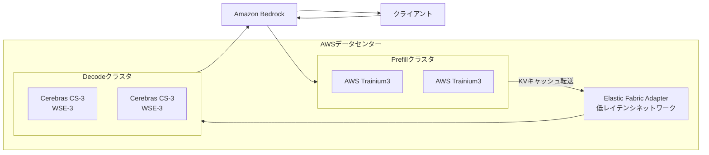
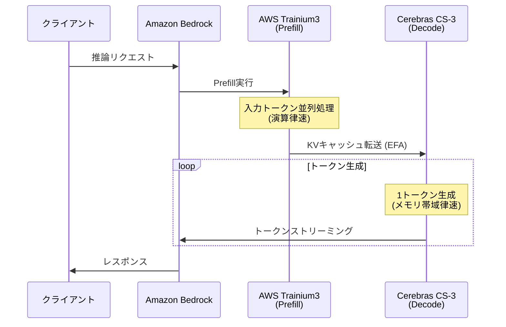

本記事は [AWS and Cerebras Collaboration Aims to Set a New Standard for AI Inference Speed and Performance in the Cloud](https://press.aboutamazon.com/aws/2026/3/aws-and-cerebras-collaboration-aims-to-set-a-new-standard-for-ai-inference-speed-and-performance-in-the-cloud) の解説記事です。

## ブログ概要（Summary）

2026年3月13日、AWSとCerebrasは、クラウドにおけるAI推論の速度とパフォーマンスの新たな標準を目指す協業を発表した。この協業は、AWS Trainium（prefill最適化）とCerebras CS-3（decode最適化）を組み合わせた**ディスアグリゲーテッド推論アーキテクチャ**を採用し、Amazon Bedrock経由での提供を計画している。プレスリリースによると、現在利用可能な推論ソリューションと比較して「桁違い（an order of magnitude）の高速化」を目指すとされている。

この記事は [Zenn記事: FPGAとLLM推論アクセラレータ2026年最前線 カスタムチップ開発の全体像](https://zenn.dev/0h_n0/articles/fda1b011be4252) の深掘りです。

## 情報源

- **種別**: 企業プレスリリース / テックブログ
- **URL**: [AWS Press Center](https://press.aboutamazon.com/aws/2026/3/aws-and-cerebras-collaboration-aims-to-set-a-new-standard-for-ai-inference-speed-and-performance-in-the-cloud)
- **組織**: Amazon Web Services / Cerebras Systems
- **発表日**: 2026年3月13日

## 技術的背景（Technical Background）

LLM推論は、prefillフェーズ（入力トークンの並列処理）とdecodeフェーズ（出力トークンの逐次生成）の2段階で構成される。プレスリリースでは、prefillを「本質的に並列であり、計算集約的で、適度なメモリ帯域幅を必要とする」処理、decodeを「本質的に逐次的であり、計算は軽量だが、メモリ帯域幅集約的」な処理と定義している。

従来のGPUベースの推論では、1つのハードウェアプラットフォームで両フェーズを処理していた。しかし、両フェーズの計算特性は大きく異なるため、単一ハードウェアでは一方のフェーズで必ずリソースが余剰になるという非効率が生じる。

この問題に対して、「推論ディスアグリゲーション（inference disaggregation）」というアプローチが注目されている。各フェーズに特化したハードウェアを割り当てることで、両フェーズのリソース利用効率を最大化する設計思想である。学術的にはISCA'24のSplitwise論文で体系的に分析されている。

AWS-Cerebras協業は、この推論ディスアグリゲーションをクラウド規模で商用化する取り組みである。

## 実装アーキテクチャ（Architecture）

### ディスアグリゲーテッド推論の構成



**AWS Trainium3（Prefill担当）**: AWSの自社設計AIチップで、高い演算性能と電力効率を備える。Prefillフェーズは行列積演算が支配的であり、Trainiumの高スループット演算能力が活かされる。プレスリリースによると、最新のTrainium3は「強い顧客採用（strong customer adoption）」を得ているとされている。

**Cerebras CS-3 / WSE-3（Decode担当）**: ウェハースケールエンジン（WSE-3）を搭載したCerebras CS-3システムは、900,000 AIコア、44 GB SRAM、21 PB/sの内部メモリ帯域幅を持つ。プレスリリースでは「最速のGPUより数千倍大きいメモリ帯域幅」と記載されている。Decodeフェーズはメモリ帯域律速であるため、WSE-3の圧倒的な内部帯域幅が直接的に性能向上に寄与する。

**EFA（Elastic Fabric Adapter）**: AWSのカスタムネットワーキング技術で、TrainiumとCS-3間のKVキャッシュ転送に使用される。低レイテンシ・高帯域幅の通信を提供し、ディスアグリゲーション構成での通信オーバーヘッドを最小化する。

### Cerebras WSE-3の技術仕様

| 項目 | WSE-3 | NVIDIA H200 (参考) |
|------|-------|-------------------|
| ダイサイズ | 300mmウェハー全面 | 814 mm² |
| AIコア数 | 900,000 | 16,896 (CUDA) |
| オンチップSRAM | 44 GB | 50 MB (L2) |
| SRAM帯域幅 | 21 PB/s | 3.35 TB/s (HBM3e) |
| トランジスタ数 | 4兆 | 800億 |

WSE-3のSRAM帯域幅（21 PB/s）は、H200のHBM帯域幅（3.35 TB/s）の約6,200倍である。decodeフェーズでの1トークン生成に必要な帯域幅を考えると、この差は直接的に生成速度の差として現れる。

Cerebras社の公表ベンチマークによると、CS-3上でLlama 3.1 70Bが2,100 tokens/sのユーザーあたり速度で動作し、「NVIDIA H200の約8倍速い」とされている。

### なぜディスアグリゲーションが有効か

Prefillフェーズの演算密度（Arithmetic Intensity）は高い。バッチサイズ$B$、系列長$L$の場合：

$$
\text{AI}_{\text{prefill}} = \frac{2BLd}{Bd + Ld + BL} \approx 2L \quad (\text{when } L \gg 1)
$$

ここで、$d$はモデルの隠れ層次元数である。系列長$L = 2048$の場合、AI ≈ 4096 FLOP/byte であり、演算律速となる。

一方、decodeフェーズ（バッチサイズ1）の演算密度は：

$$
\text{AI}_{\text{decode}} = \frac{2d}{d + d} = 1 \quad (\text{FP16の場合})
$$

AI = 1 FLOP/byte は極めて低く、メモリ帯域律速となる。

この100倍以上の演算密度の差が、ハードウェアのディスアグリゲーションを正当化する根拠である。Trainiumは高い演算性能でprefillを処理し、WSE-3は圧倒的なメモリ帯域幅でdecodeを処理する。



## パフォーマンス最適化（Performance）

### 公表されている性能指標

| 指標 | CS-3 (Decode) | 比較対象 |
|------|-------------|---------|
| Llama 3.1 70B速度 | 2,100 tokens/s/ユーザー | H200比 約8倍 |
| メモリ帯域幅 | 21 PB/s (SRAM) | GPU比 数千倍 |
| チップサイズ | WSE-3: 300mmウェハー全面 | GPU比 56倍 |

**注意事項**: 上記の性能数値はCerebras社の公表値であり、比較条件（バッチサイズ、量子化設定、推論フレームワーク）の詳細は公開情報に限りがある。2,100 tokens/sはシングルユーザーでの数値であり、マルチユーザーでのスループットは構成に依存する。

### チューニングポイント

**KVキャッシュ転送の最適化**: Prefill（Trainium）からDecode（CS-3）へのKVキャッシュ転送がボトルネックとなる可能性がある。EFAの帯域幅と、KVキャッシュのサイズ（モデルサイズ・系列長に比例）のバランスが重要である。

**バッチスケジューリング**: 複数ユーザーのリクエストをバッチ化する際、Prefill完了タイミングとDecode開始タイミングの同期が必要となる。Bedrockのオーケストレーションレイヤがこの同期を管理する。

## 運用での学び（Production Lessons）

AWS-Cerebras協業は発表段階であり、本番運用事例はまだ公開されていない。プレスリリースから推測される運用上の特徴を整理する。

**セキュリティモデル**: AWS Nitro Systemの基盤上に構築されており、「セキュリティ、分離、運用の一貫性」が維持されるとされている。マルチテナント環境でのCerebrasハードウェアへのアクセスはBedrock API経由に限定され、直接的なハードウェアアクセスは提供されない見込みである。

**モデル提供範囲**: プレスリリースでは「主要なオープンソースLLMとAmazon Nova」をCerebrasハードウェアで提供する計画が記載されている。カスタムモデルのデプロイ可否は未公表である。

**顧客事例**: プレスリリースではAnthropicがAWSの主要トレーニングパートナーとして、OpenAIが2ギガワットのTrainium容量を消費することが記載されている。また、CognitionやMistralがCS-3を「エージェント型コーディング」の加速に使用しているとされている。

**想定ユースケース**: リアルタイムコーディングアシスタント、インタラクティブアプリケーション、エージェント型コーディングワークフロー（推論速度が開発者の生産性を制約する場面）が挙げられている。

## 学術研究との関連（Academic Connection）

**Splitwise (ISCA'24, arXiv: 2311.18677)**: prefillとdecodeの分離による効率化を体系的に分析した論文。AWS-Cerebras協業は、Splitwiseの理論的枠組みを商用クラウド規模で実装したものと位置づけられる。

**DistServe (arXiv: 2401.09670)**: 分散環境でのprefill/decode分離推論に関する研究。TrainiumとCS-3間のKVキャッシュ転送戦略は、DistServeのアプローチと類似している。

**Cerebras MemoryX**: Cerebras社が開発した外部メモリ拡張技術。WSE-3のSRAM（44 GB）を超えるモデルサイズに対応するため、外部DRAMをストリーミングで活用するアプローチ。この技術がAWS環境でどのように統合されるかは今後の注目点である。

## Production Deployment Guide

### AWS実装パターン（コスト最適化重視）

AWS-Cerebras協業の技術思想を活用したprefill/decode分離構成のAWS実装パターンを示す。

**トラフィック量別の推奨構成**:

| 規模 | 月間リクエスト | 推奨構成 | 月額コスト | 主要サービス |
|------|--------------|---------|-----------|------------|
| **Small** | ~3,000 (100/日) | Serverless | $50-150 | Lambda + Bedrock + DynamoDB |
| **Medium** | ~30,000 (1,000/日) | Bedrock Cerebras | $500-2,000 | Bedrock (CS-3バックエンド) |
| **Large** | 300,000+ (10,000/日) | Trn + CS-3 | $3,000-10,000 | trn1 + Bedrock CS-3 |

**Small構成** (月額$50-150):
- **Lambda + Bedrock**: Claude 3.5 Haiku ($80/月)
- **DynamoDB**: キャッシュ ($10/月)

**Medium構成** (月額$500-2,000):
- **Bedrock (Cerebras CS-3バックエンド)**: 料金はリクエスト数とトークン数に基づく従量課金の見込み
- CS-3バックエンドが利用可能になった場合、Bedrockの標準APIで透過的にアクセス可能

**Large構成** (月額$3,000-10,000):
- **trn1.32xlarge**: Trainium搭載、prefill処理 ($3,000/月 On-Demand)
- **Bedrock CS-3**: decode処理（従量課金）
- **EFA**: 低レイテンシ通信

**コスト試算の注意事項**:
- 2026年3月時点の概算値です。Cerebras CS-3バックエンドの料金はBedrock提供開始後に確定する見込みです
- 最新料金は [AWS料金計算ツール](https://calculator.aws/) で確認してください

### Terraformインフラコード

**Small構成 (Serverless)**

```hcl
module "vpc" {
  source  = "terraform-aws-modules/vpc/aws"
  version = "~> 5.0"
  name = "cerebras-sim-vpc"
  cidr = "10.0.0.0/16"
  azs  = ["ap-northeast-1a", "ap-northeast-1c"]
  private_subnets = ["10.0.1.0/24", "10.0.2.0/24"]
  enable_nat_gateway   = false
  enable_dns_hostnames = true
}

resource "aws_lambda_function" "inference" {
  filename      = "lambda.zip"
  function_name = "cerebras-inference"
  role          = aws_iam_role.lambda_role.arn
  handler       = "index.handler"
  runtime       = "python3.12"
  timeout       = 120
  memory_size   = 1024
  environment {
    variables = {
      BEDROCK_MODEL_ID = "meta.llama3-1-70b-instruct-v1:0"
      CACHE_TABLE      = aws_dynamodb_table.cache.name
    }
  }
}

resource "aws_dynamodb_table" "cache" {
  name         = "cerebras-cache"
  billing_mode = "PAY_PER_REQUEST"
  hash_key     = "key"
  attribute { name = "key"; type = "S" }
  ttl { attribute_name = "ttl"; enabled = true }
}
```

**Large構成 (Trainium + Bedrock CS-3)**

```hcl
resource "aws_instance" "trainium_prefill" {
  count         = 2
  ami           = "ami-xxxxxxxxx"  # Neuron SDK + Trainium AMI
  instance_type = "trn1.32xlarge"
  subnet_id     = module.vpc.private_subnets[count.index % 2]

  root_block_device {
    volume_type = "gp3"
    volume_size = 500
    encrypted   = true
  }
  tags = { Name = "trainium-prefill-${count.index}", Role = "prefill" }
}

resource "aws_budgets_budget" "monthly" {
  name         = "cerebras-monthly"
  budget_type  = "COST"
  limit_amount = "10000"
  limit_unit   = "USD"
  time_unit    = "MONTHLY"
  notification {
    comparison_operator        = "GREATER_THAN"
    threshold                  = 80
    threshold_type             = "PERCENTAGE"
    notification_type          = "ACTUAL"
    subscriber_email_addresses = ["ops@example.com"]
  }
}
```

### 運用・監視設定

```python
import boto3

cloudwatch = boto3.client('cloudwatch')

# Bedrock推論レイテンシ監視
cloudwatch.put_metric_alarm(
    AlarmName='bedrock-cerebras-latency',
    ComparisonOperator='GreaterThanThreshold',
    EvaluationPeriods=2,
    MetricName='InvocationLatency',
    Namespace='AWS/Bedrock',
    Period=300,
    Statistic='p99',
    Threshold=5000,  # 5秒超過
    AlarmDescription='Bedrock推論レイテンシ異常（CS-3バックエンド）'
)

# トークン生成速度監視
cloudwatch.put_metric_alarm(
    AlarmName='bedrock-cerebras-tps',
    ComparisonOperator='LessThanThreshold',
    EvaluationPeriods=3,
    MetricName='OutputTokensPerSec',
    Namespace='Custom/LLMInference',
    Period=60,
    Statistic='Average',
    Threshold=500,
    AlarmDescription='トークン生成速度低下'
)
```

### コスト最適化チェックリスト

- [ ] ~100 req/日 → Lambda + Bedrock - $50-150/月
- [ ] ~1000 req/日 → Bedrock CS-3バックエンド - $500-2,000/月
- [ ] 10000+ req/日 → trn1 + Bedrock CS-3 - $3,000-10,000/月
- [ ] Bedrock Batch API: 非リアルタイム処理で50%削減
- [ ] trn1 Reserved Instances: 1年コミットで40%削減
- [ ] Prompt Caching: 繰り返しプロンプトの帯域幅削減
- [ ] KVキャッシュサイズ最適化: 系列長制限による転送量削減
- [ ] AWS Budgets: 月額上限設定
- [ ] CloudWatch: Bedrockレイテンシ・TPS監視
- [ ] Cost Anomaly Detection有効化

## まとめと実践への示唆

AWS-Cerebras協業は、LLM推論のprefill/decode分離を商用クラウド規模で実現する取り組みである。Cerebras WSE-3の44 GB SRAM / 21 PB/s帯域幅をdecodeフェーズに特化させ、AWS TrainiumをPrefillに特化させることで、単一ハードウェアでは達成できないリソース効率の向上を目指している。

実務面での示唆として、Amazon Bedrock経由でアクセスできるため、ユーザーはインフラ管理なしにCS-3の性能を利用できる見込みである。リアルタイム推論や、reasoning modelのような多トークン生成が求められるワークロードで特に効果が期待される。

ただし、2026年3月発表の段階であり、Bedrock上の提供開始は「数ヶ月以内」とされている。料金体系、対応モデル、カスタムモデルデプロイの可否など、詳細は今後の公表を待つ必要がある。

## 参考文献

- **Press Release**: [https://press.aboutamazon.com/aws/2026/3/aws-and-cerebras-collaboration-aims-to-set-a-new-standard-for-ai-inference-speed-and-performance-in-the-cloud](https://press.aboutamazon.com/aws/2026/3/aws-and-cerebras-collaboration-aims-to-set-a-new-standard-for-ai-inference-speed-and-performance-in-the-cloud)
- **Cerebras Blog**: [https://www.cerebras.ai/blog/cerebras-is-coming-to-aws](https://www.cerebras.ai/blog/cerebras-is-coming-to-aws)
- **Related: Splitwise (ISCA'24)**: [https://arxiv.org/abs/2311.18677](https://arxiv.org/abs/2311.18677)
- **Related Zenn article**: [https://zenn.dev/0h_n0/articles/fda1b011be4252](https://zenn.dev/0h_n0/articles/fda1b011be4252)
