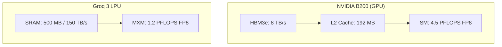
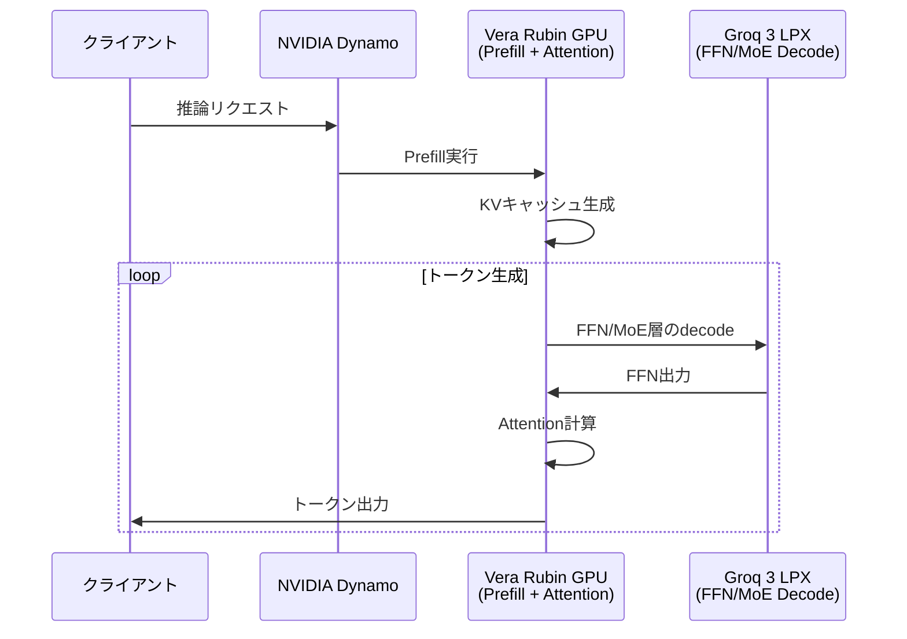

本記事は [Inside NVIDIA Groq 3 LPX: The Low-Latency Inference Accelerator for the NVIDIA Vera Rubin Platform](https://developer.nvidia.com/blog/inside-nvidia-groq-3-lpx-the-low-latency-inference-accelerator-for-the-nvidia-vera-rubin-platform/) の解説記事です。

## ブログ概要（Summary）

NVIDIA Groq 3 LPUは、NVIDIAが2025年12月にGroq社の推論技術IPを$20Bで取得して開発した、SRAM中心の低レイテンシ推論アクセラレータである。GTC 2026で発表されたこのチップは、チップあたり500 MB SRAM、150 TB/sのオンチップ帯域幅、1.2 PFLOPS（FP8）の性能を持ち、Vera Rubinプラットフォームのdecode専用コプロセッサとして位置づけられている。ラック構成（LPX）では256基のLPUを搭載し、合計128 GB SRAMと40 PB/sの帯域幅で、GB200 NVL72比35倍のTPS/MWを提供するとNVIDIAは主張している。

この記事は [Zenn記事: FPGAとLLM推論アクセラレータ2026年最前線 カスタムチップ開発の全体像](https://zenn.dev/0h_n0/articles/fda1b011be4252) の深掘りです。

## 情報源

- **種別**: 企業テックブログ
- **URL**: [NVIDIA Technical Blog](https://developer.nvidia.com/blog/inside-nvidia-groq-3-lpx-the-low-latency-inference-accelerator-for-the-nvidia-vera-rubin-platform/)
- **組織**: NVIDIA
- **発表日**: 2026年3月（GTC 2026）

## 技術的背景（Technical Background）

LLM推論の低レイテンシ化において、最大のボトルネックはdecodeフェーズのメモリ帯域幅である。1トークン生成ごとにモデル全体の重みをメモリから読み出す必要があり、GPU（H100/B200）のHBM帯域幅では数msのレイテンシが不可避である。

従来のGPUアーキテクチャでは、HBM（High Bandwidth Memory）がメインメモリとして機能し、L2キャッシュ（数十MB）が中間層として存在する。しかし、LLMの重みは数GB〜数百GBに及ぶため、L2キャッシュには収まらず、毎トークン生成時にHBMアクセスが発生する。

Groq 3 LPUは、この問題に対してSRAMをメインメモリとして使用する根本的に異なるアプローチを取る。SRAMはHBMと比較して帯域幅密度が高く、レイテンシが低い。チップあたり500 MBのSRAMは、HBMの帯域幅（数TB/s）と比較して150 TB/sという桁違いの帯域幅を提供する。

この設計思想はGroq社が2020年頃から推進してきたTSP（Tensor Streaming Processor）アーキテクチャに基づいており、NVIDIAが$20Bで取得したIPの核心部分である。

## 実装アーキテクチャ（Architecture）

### チップレベルの構成

Groq 3 LPUは、Samsung 4nmプロセスで製造され、以下の実行モジュールで構成されている。

| コンポーネント | 仕様 | 役割 |
|-------------|------|------|
| MXM (Matrix Execution Module) | FP8演算 | テンソル演算（行列積） |
| VXM (Vector Execution Module) | 320バイトベクトル | ポイントワイズ演算（活性化関数等） |
| SXM (Switch Execution Module) | データルーティング | チップ内外のデータ移動 |
| SRAM | 500 MB / 150 TB/s | モデル重み・中間値の格納 |
| C2Cリンク | 96リンク × 112 Gbps = 2.5 TB/s | チップ間通信 |

NVIDIAの技術ブログによると、Groq 3 LPUのFP8演算性能はチップあたり1.2 PFLOPSである。比較として、NVIDIA B200のFP8性能は4.5 PFLOPSであり、絶対的な演算能力ではB200が上回る。しかし、LPUの強みはSRAM帯域幅にある。

### SRAMファースト設計の意義

decodeフェーズでの行列積$\mathbf{y} = \mathbf{W}\mathbf{x}$において、重み$\mathbf{W}$の読み出し帯域幅がボトルネックとなる。

$$
T_{\text{decode}} = \max\left(\frac{|\mathbf{W}|}{B_{\text{mem}}}, \frac{2mn}{P_{\text{compute}}}\right)
$$

ここで、$|\mathbf{W}|$は重みのバイト数、$B_{\text{mem}}$はメモリ帯域幅、$P_{\text{compute}}$は演算性能（FLOPS）である。

B200（HBM3e: 8 TB/s）とGroq 3 LPU（SRAM: 150 TB/s）を比較すると、メモリ帯域幅に約19倍の差がある。decodeフェーズはメモリ帯域律速であるため、この帯域幅の差がそのまま性能差に反映される。



### ラック構成（LPX）

LPXラックは、32枚の液冷1Uコンピュートトレイで構成され、各トレイに8基のLPUが搭載されている。

| 構成レベル | SRAM | SRAM帯域幅 | FP8性能 | C2C帯域幅 |
|-----------|------|-----------|---------|----------|
| 1チップ | 500 MB | 150 TB/s | 1.2 PFLOPS | 2.5 TB/s |
| 1トレイ (8チップ) | 4 GB | 1.2 PB/s | 9.6 PFLOPS | 20 TB/s |
| 1ラック (256チップ) | 128 GB | 40 PB/s | 315 PFLOPS | 640 TB/s |

LPXラックの128 GB SRAMは、FP8量子化されたLLaMA 70B（約35 GB）を約3.7モデル分格納できる。NVIDIAのブログでは、LPXラック全体の推論効率について「GB200 NVL72比35倍のTPS/MW」と報告されている。

### Vera Rubinプラットフォームとの統合

Groq 3 LPUはスタンドアロンで動作するのではなく、Vera Rubin NVL72 GPUとの**ディスアグリゲーテッドdecode**構成で使用される。



NVIDIAの技術ブログによると、Vera Rubin GPUがAttention層の計算とKVキャッシュ管理を担当し、Groq 3 LPUがFFN（Feed-Forward Network）およびMoE（Mixture of Experts）層のdecodeを担当する。この分離は、FFN/MoE層がモデル全体の重みの約60-70%を占め、decodeフェーズのメモリ帯域ボトルネックの主因であることに基づいている。

NVIDIA Dynamoオーケストレーションソフトウェアが、GPU-LPU間のヘテロジニアスルーティングを管理する。

## パフォーマンス最適化（Performance）

NVIDIAが公表している性能指標を整理する。

| 指標 | Groq 3 LPX (ラック) | 比較対象 | 倍率 |
|------|-------------------|---------|------|
| TPS/MW | - | GB200 NVL72 | 35倍 |
| 兆パラメータモデルの収益機会 | - | - | 10倍 |
| SRAM帯域幅 | 40 PB/s | B200 HBM: 8 TB/s | ~5,000倍 |
| FP8性能 | 315 PFLOPS | B200: 4.5 PFLOPS | 70倍（ラック対チップ） |

**注意事項**: NVIDIAが報告している「35倍のTPS/MW」は、400 tokens/sのユーザーあたり生成速度での比較とされている。比較条件（バッチサイズ、モデルサイズ、精度）の詳細は公開ブログに明記されていない部分があり、同一条件での独立検証は2026年3月時点で報告されていない。

**チューニング手法**:
- **モデルシャーディング**: 500 MB/チップでは大規模モデルは収まらないため、256チップにまたがるモデルシャーディングが必須である
- **plesiosynchronousプロトコル**: 数百チップの同期をナノ秒精度で実現する決定論的通信プロトコルを採用
- **ケーブルレス設計**: LPXラック内はバックプレーンによるケーブルレス接続で、通信レイテンシを最小化

## 運用での学び（Production Lessons）

Groq 3 LPUは2026年Q3出荷予定であり、大規模な本番運用事例はまだ公開されていない。ただし、以下の運用上の考慮点が技術ブログから推測される。

**モデル更新の柔軟性**: SRAMにモデル重みを格納するため、モデルの入れ替えはSRAMへの再ロードで対応可能である。Taalas HC1のようなハードワイヤード方式とは異なり、複数モデルの切り替えが可能である。

**冷却要件**: LPXラックは液冷設計であり、既存の空冷データセンターでは導入に設備投資が必要となる可能性がある。

**ソフトウェアエコシステム**: NVIDIA Dynamoを通じたGPU-LPU間のオーケストレーションが必要であり、既存のvLLMやTGIなどの推論フレームワークとの統合方法は、出荷後に詳細が明らかになると見込まれる。

**モニタリング**: SRAM使用率、チップ間通信レイテンシ、電力消費量が主要な監視指標となる。NVIDIA DCGMとの統合が予想される。

## 学術研究との関連（Academic Connection）

Groq 3 LPUのアーキテクチャは、以下の学術研究の流れを汲んでいる。

- **TSP (Tensor Streaming Processor)**: Groq社の創業時からの基盤技術。データフロー型プロセッサで、命令のスケジューリングをコンパイル時に確定させることで、実行時のオーバーヘッドを排除する設計思想
- **SRAMベースアクセラレータの研究**: 大容量SRAMを推論に活用するアプローチは、Cerebras WSE（44 GB SRAM）やTenstorrentなど複数のスタートアップが追求している方向性であり、学術的にはProcessing-in-Memory（PIM）研究とも関連する
- **ディスアグリゲーテッドアーキテクチャ**: prefillとdecodeの分離は、ISCA'24のSplitwise論文（arXiv: 2311.18677）で体系的に分析されており、NVIDIAのVera Rubin + LPX構成はこの学術的知見を工業規模で実装したものと位置づけられる

## Production Deployment Guide

### AWS実装パターン（コスト最適化重視）

Groq 3 LPXは2026年Q3出荷予定のためAWSでの直接利用はまだ不可だが、類似のSRAMファーストアプローチをAWS上で模擬する構成と、LPX出荷後の推定構成を示す。

**トラフィック量別の推奨構成**:

| 規模 | 月間リクエスト | 推奨構成 | 月額コスト | 主要サービス |
|------|--------------|---------|-----------|------------|
| **Small** | ~3,000 (100/日) | Serverless | $50-150 | Lambda + Bedrock + DynamoDB |
| **Medium** | ~30,000 (1,000/日) | GPU Hybrid | $1,500-3,000 | p5.xlarge + ElastiCache |
| **Large** | 300,000+ (10,000/日) | GPU Cluster | $5,000-15,000 | p5.48xlarge x2 + Inf2 decode |

**Small構成** (月額$50-150):
- **Lambda + Bedrock**: Claude 3.5 Haiku ($80/月)
- **DynamoDB**: プロンプトキャッシュ ($10/月)

**Medium構成** (月額$1,500-3,000):
- **p5.xlarge (H100)**: prefill処理 ($2,000/月 On-Demand)
- **inf2.xlarge**: decode処理のオフロード ($500/月)
- **ElastiCache**: KVキャッシュ ($50/月)

**Large構成** (月額$5,000-15,000):
- **p5.48xlarge x2**: prefill + attention ($10,000/月)
- **inf2.8xlarge x4**: decode FFN/MoE ($3,000/月)
- **EFA**: 低レイテンシGPU-Inf2間通信 ($500/月)

**コスト試算の注意事項**:
- 2026年3月時点のAWS ap-northeast-1料金に基づく概算値です
- Groq 3 LPX搭載インスタンスがAWSで提供される場合、コスト構成は大幅に変動する見込みです
- 最新料金は [AWS料金計算ツール](https://calculator.aws/) で確認してください

### Terraformインフラコード

**Small構成 (Serverless)**

```hcl
module "vpc" {
  source  = "terraform-aws-modules/vpc/aws"
  version = "~> 5.0"
  name = "groq-sim-vpc"
  cidr = "10.0.0.0/16"
  azs  = ["ap-northeast-1a", "ap-northeast-1c"]
  private_subnets = ["10.0.1.0/24", "10.0.2.0/24"]
  enable_nat_gateway   = false
  enable_dns_hostnames = true
}

resource "aws_lambda_function" "inference" {
  filename      = "lambda.zip"
  function_name = "groq-sim-handler"
  role          = aws_iam_role.lambda_role.arn
  handler       = "index.handler"
  runtime       = "python3.12"
  timeout       = 60
  memory_size   = 1024
  environment {
    variables = {
      BEDROCK_MODEL_ID = "anthropic.claude-3-5-haiku-20241022-v1:0"
      CACHE_TABLE      = aws_dynamodb_table.cache.name
    }
  }
}

resource "aws_dynamodb_table" "cache" {
  name         = "groq-sim-cache"
  billing_mode = "PAY_PER_REQUEST"
  hash_key     = "key"
  attribute { name = "key"; type = "S" }
  ttl { attribute_name = "ttl"; enabled = true }
}
```

**Large構成 (GPU + Inferentia ヘテロジニアス)**

```hcl
resource "aws_instance" "prefill_gpu" {
  count         = 2
  ami           = "ami-xxxxxxxxx"  # Deep Learning AMI
  instance_type = "p5.48xlarge"
  subnet_id     = module.vpc.private_subnets[count.index % 2]

  root_block_device {
    volume_type = "gp3"
    volume_size = 500
    encrypted   = true
  }
  tags = { Name = "prefill-gpu-${count.index}", Role = "prefill" }
}

resource "aws_instance" "decode_inf2" {
  count         = 4
  ami           = "ami-xxxxxxxxx"  # Neuron SDK AMI
  instance_type = "inf2.8xlarge"
  subnet_id     = module.vpc.private_subnets[count.index % 2]

  root_block_device {
    volume_type = "gp3"
    volume_size = 200
    encrypted   = true
  }
  tags = { Name = "decode-inf2-${count.index}", Role = "decode" }
}

resource "aws_budgets_budget" "monthly" {
  name         = "groq-sim-monthly"
  budget_type  = "COST"
  limit_amount = "15000"
  limit_unit   = "USD"
  time_unit    = "MONTHLY"
  notification {
    comparison_operator        = "GREATER_THAN"
    threshold                  = 80
    threshold_type             = "PERCENTAGE"
    notification_type          = "ACTUAL"
    subscriber_email_addresses = ["ops@example.com"]
  }
}
```

### 運用・監視設定

```python
import boto3

cloudwatch = boto3.client('cloudwatch')

# GPU prefill レイテンシ監視
cloudwatch.put_metric_alarm(
    AlarmName='prefill-latency-spike',
    ComparisonOperator='GreaterThanThreshold',
    EvaluationPeriods=2,
    MetricName='PrefillLatency',
    Namespace='Custom/LLMInference',
    Period=300,
    Statistic='p99',
    Threshold=2000,  # 2秒超過
    AlarmDescription='Prefillレイテンシ異常'
)

# decode TPS監視
cloudwatch.put_metric_alarm(
    AlarmName='decode-tps-drop',
    ComparisonOperator='LessThanThreshold',
    EvaluationPeriods=3,
    MetricName='DecodeTokensPerSec',
    Namespace='Custom/LLMInference',
    Period=60,
    Statistic='Average',
    Threshold=100,
    AlarmDescription='Decodeスループット低下'
)
```

### コスト最適化チェックリスト

- [ ] ~100 req/日 → Lambda + Bedrock - $50-150/月
- [ ] ~1000 req/日 → p5 + inf2 Hybrid - $1,500-3,000/月
- [ ] 10000+ req/日 → p5 + inf2 Cluster - $5,000-15,000/月
- [ ] Spot Instances: p5のSpotで最大70%削減
- [ ] Reserved: inf2 1年コミットで40%削減
- [ ] Bedrock Batch API: 非リアルタイム処理で50%削減
- [ ] prefill/decode分離: 各フェーズに最適なインスタンスタイプを選択
- [ ] EFA: GPU-Inf2間の低レイテンシ通信を活用
- [ ] AWS Budgets: 月額上限設定
- [ ] CloudWatch: TPS/レイテンシ両面の監視
- [ ] Cost Anomaly Detection有効化

## まとめと実践への示唆

NVIDIA Groq 3 LPXは、SRAMファーストのアーキテクチャにより、decodeフェーズのメモリ帯域ボトルネックを根本から解消するアプローチを取る。チップあたり500 MB SRAM / 150 TB/sという仕様は、HBMベースのGPUとは桁違いの帯域幅密度を提供する。

実務面での示唆として、LPXは単独で使用するのではなく、Vera Rubin GPUとの**ヘテロジニアス構成**で最大の効果を発揮する設計である。prefillはGPU、decodeはLPUという役割分担は、今後のLLM推論インフラの設計パターンとして定着する可能性がある。

ただし、2026年Q3出荷予定であり、独立したベンチマーク結果はまだ限定的である。NVIDIAが報告している「35倍のTPS/MW」は特定条件下の数値であり、実環境での性能は出荷後の検証を待つ必要がある。

## 参考文献

- **Blog URL**: [https://developer.nvidia.com/blog/inside-nvidia-groq-3-lpx-the-low-latency-inference-accelerator-for-the-nvidia-vera-rubin-platform/](https://developer.nvidia.com/blog/inside-nvidia-groq-3-lpx-the-low-latency-inference-accelerator-for-the-nvidia-vera-rubin-platform/)
- **GTC 2026 Session**: NVIDIA GTC 2026 Keynote (Jensen Huang)
- **Related: Splitwise (ISCA'24)**: [https://arxiv.org/abs/2311.18677](https://arxiv.org/abs/2311.18677)
- **Related Zenn article**: [https://zenn.dev/0h_n0/articles/fda1b011be4252](https://zenn.dev/0h_n0/articles/fda1b011be4252)
