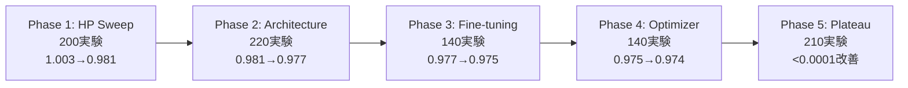
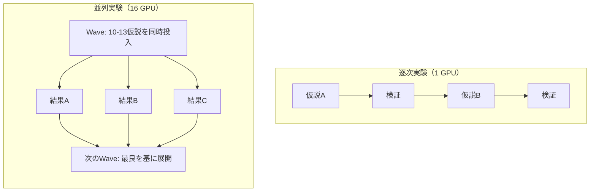

本記事は [SkyPilot公式ブログ "Scaling Karpathy's Autoresearch: What Happens When the Agent Gets a GPU Cluster"](https://blog.skypilot.co/scaling-autoresearch/) の解説記事です。

## ブログ概要（Summary）

SkyPilotチーム（2026年3月公開）は、Andrej KarpathyのAutoResearchを単一GPUからKubernetesクラスタ上の16GPU（H100 13台 + H200 3台）に拡張する実験を行い、その結果をブログで報告した。SkyPilotブログによれば、8時間の実行で約910回の実験を実施し、val_bpbを1.003から0.974へ改善（2.87%減少）した。単一GPUの逐次実行（約96実験/8時間）に対して約9.5倍のスループットを達成し、総コストはGPU $260 + Claude API $9 = 約$269であった。

この記事は [Zenn記事: Karpathy発AutoResearchで一晩100実験を自動化する仕組みと実践](https://zenn.dev/0h_n0/articles/28e8fe4721f315) の深掘りです。

## 情報源

- **種別**: 企業テックブログ
- **URL**: [https://blog.skypilot.co/scaling-autoresearch/](https://blog.skypilot.co/scaling-autoresearch/)
- **組織**: SkyPilot（UC BerkeleyのSky Computingラボ発のOSSプロジェクト）
- **発表日**: 2026年3月

## 技術的背景（Technical Background）

AutoResearchは単一GPUで5分×N回の逐次実験ループを回す設計であり、スループットの上限は約10実験/時間（セットアップ時間含む）に制限されている。この制約は、エージェントの**探索戦略を貪欲な山登り法（greedy hill-climbing）に強制**する。1つの仮説を検証し終わるまで次の仮説を試せないため、パラメータ間の交互作用（interaction effects）を発見するのは困難である。

SkyPilotは、マルチクラウド・Kubernetes対応のジョブスケジューラであり、`sky launch`コマンド一つでGPUインスタンスのプロビジョニングから実験実行までを自動化する。このブログ記事は「GPUを増やすと、エージェントのスループットだけでなく**探索戦略そのものが質的に変化する**」という興味深い知見を報告している。

## 実験セットアップ（Architecture）

### インフラ構成

SkyPilotブログが報告した実験構成は以下の通りである。

| 項目 | 詳細 |
|------|------|
| クラスタ | Kubernetes（CoreWeaveバックエンド） |
| GPU構成 | H100 × 13台 + H200 × 3台（計16台） |
| H100 VRAM | 80GB、約283ms/step |
| H200 VRAM | 141GB、約263ms/step |
| AIエージェント | Claude Code |
| 実験予算 | 各実験5分の壁時計時間（AutoResearchと同一） |
| 実行時間 | 8時間 |

### SkyPilot設定

ブログで紹介されている設定ファイルの概要は以下の通りである。

```yaml
# experiment.yaml（SkyPilotブログの説明に基づく構成）
resources:
  accelerators: {H100:1, H200:1}  # SkyPilotが空きGPUを自動選択
  infra: k8s                       # Kubernetes バックエンド

setup: |
  pip install uv
  uv sync
  uv run prepare.py

run: |
  uv run train.py 2>&1 | tee run.log
  # val_bpbとpeak_vramメトリクスを抽出
```

### 並列化コマンド

SkyPilotでは以下のコマンドパターンで実験を投入する。

```bash
# GPU-01にジョブを投入（デタッチモード）
sky launch gpu-01 experiment.yaml -d

# 追加ジョブをキューイング（アイドルタイムゼロのパイプライニング）
sky exec gpu-01 experiment.yaml -d
```

重要な点は、**エージェント（Claude Code）自身がこれらのコマンドを発行する**ことである。人間がGPUの割り当てを管理するのではなく、エージェントが実験の優先度に応じて自律的にGPUを使い分ける。

## 実験結果の5つのフェーズ

SkyPilotブログは、8時間の実験をエージェントの行動変化に基づいて5つのフェーズに分類している。



### Phase 1: ハイパーパラメータスイープ（約200実験）

val_bpb: 1.003 → 0.981（2.2%改善）

エージェントは学習率、バッチサイズ、ウォームアップステップ数などの基本的なハイパーパラメータを並列グリッドで探索した。ブログによれば、16GPUを活用して1波あたり10〜13実験を同時投入するファクトリアルグリッドが実行された。

### Phase 2: アーキテクチャ探索（約220実験）

val_bpb: 0.981 → 0.977（0.4%改善、**最大の単一ジャンプ**）

ブログが報告した最も注目すべき発見はこのフェーズで起きた。エージェントが6種類のモデルアスペクト比を同時にテストし、**ASPECT_RATIO = 96（model_dim = 768）がPhase 1のすべてのハイパーパラメータチューニングを上回る改善**をもたらすことを発見した。

この結果は「**モデルの幅を広げることが、個々のハイパーパラメータ調整よりも効果的**」という知見を示している。逐次実験ではこのような構造的な変更を試すまでに多くの時間が必要だが、並列実験では早期にこのようなアーキテクチャレベルの改善を発見できる。

### Phase 3: ファインチューニング（約140実験）

val_bpb: 0.977 → 0.975

Phase 2で発見された最良のアーキテクチャ上で、学習率スケジュールやweight decayの微調整を行った。

### Phase 4: オプティマイザチューニング（約140実験）

val_bpb: 0.975 → 0.974

ブログによれば、最終的に発見された最良の構成は以下の通りである。

```python
# SkyPilotブログが報告した最終最良構成
BEST_CONFIG = {
    "ASPECT_RATIO": 96,           # model_dim = 768
    "DEPTH": 8,                    # Transformerレイヤー数
    "WINDOW_PATTERN": "SL",        # 交互Attention
    "TOTAL_BATCH_SIZE": 2**18,     # ~524Kトークン/ステップ
    "MATRIX_LR": 0.05,            # Muonオプティマイザ
    "EMBEDDING_LR": 0.6,          # AdamW
    "muon_beta2": 0.98,           # 後半フェーズで最も影響大
}
```

### Phase 5: 収穫逓減（約210実験）

val_bpb改善: < 0.0001

このフェーズではほぼ改善が見られず、エージェントは「プラトー」に到達した。ブログはこれを「5分の固定予算では表現できない改善（より深い構造変更が必要）に到達した」と分析している。

## エージェントの創発的行動

### GPU性能差の自律的発見

SkyPilotブログが報告した最も技術的に興味深い知見は、**エージェントがH100とH200の性能差を自律的に検出し、探索戦略を適応させた**ことである。

具体的には、H200はH100よりも約9%高速（283ms/step vs 263ms/step）であり、同じ5分間でより多くの学習ステップを実行できる。エージェントはこの差を実験ログから検出し、以下の2層戦略を自発的に採用したとブログは報告している。

| 層 | GPU | 用途 |
|----|-----|------|
| スクリーニング | H100（13台） | 仮説の初期検証。速度よりも並列度を重視 |
| 確認 | H200（3台） | 有望な候補の精密検証。高いステップ数で信頼性の高い結果を取得 |

この行動は**明示的にプログラムされていない**。エージェントが実験ログの分析から自律的に発見した戦略である。

### 逐次→並列での探索戦略の質的変化



単一GPUでの逐次実験は「1仮説ずつ検証する貪欲法」に制約されるが、16GPUの並列環境ではエージェントの行動が質的に変化する。ブログによれば、エージェントは「ファクトリアルグリッド」（10〜13実験を同時投入）を採用し、パラメータ間の交互作用を効率的に発見するようになった。

この変化は**並列計算資源が増えると、最適化アルゴリズムの性質自体が変わる**という、分散最適化の理論的知見と整合する。

## コスト分析

SkyPilotブログが報告した8時間実験のコスト内訳は以下の通りである。

| 項目 | コスト |
|------|--------|
| H100 × 13台 × 8時間（@$2/h） | 約$208 |
| H200 × 3台 × 8時間（@$2.3/h） | 約$55 |
| Claude Code API | 約$9 |
| **合計** | **約$272** |

### コスト効率の分析

$$
\text{Cost per experiment} = \frac{\$272}{910} \approx \$0.30/\text{experiment}
$$

$$
\text{Cost per val\_bpb improvement point} = \frac{\$272}{0.029} \approx \$9,379/\text{point}
$$

単一GPU実験のコスト（GPU $2/h × 8h + API ~$5 = ~$21で96実験）と比較すると、1実験あたりのコストは$0.22 → $0.30と37%増加するが、スループットは9.5倍になる。探索空間が広い初期フェーズでは並列化の投資対効果が高い。

## 運用での学び（Production Lessons）

### 実験の衝突と管理

ブログが指摘した運用上の課題は、並列実験間の「良い変更」が衝突する場合のマージ戦略である。複数の実験が同時に`train.py`の異なる部分を改善した場合、それらを統合する方法はAutoResearchの現在のアーキテクチャでは自明ではない。

### スケーリングの限界

Phase 5で観察された収穫逓減は、**5分の固定予算がスケーリングのボトルネック**になっていることを示唆する。GPU数を増やしても、各実験の「深さ」は変わらないため、より根本的な改善（モデルサイズの大幅変更、学習パラダイムの転換等）は発見できない。

### GPU異種性の活用

エージェントが自律的にGPU性能差を活用した事例は、**異種計算環境でのAIエージェント運用**における重要な先例となる。今後、異なるアクセラレータ（GPU、TPU、専用ASIC）が混在する環境で、エージェントが自律的に計算リソースを最適配分する可能性を示唆している。

## 学術研究との関連（Academic Connection）

SkyPilotブログの実験結果は、以下の学術的知見と関連する。

- **並列ハイパーパラメータ最適化**: ASHA（Asynchronous Successive Halving Algorithm）やHyperband等の理論的な並列HPOアルゴリズムは、リソースが増えると探索効率が向上することを理論的に保証している。SkyPilotの結果はこの理論的予測と整合する。
- **Population-Based Training (PBT)**: DeepMindのPBTは複数のエージェントが並列に学習し、定期的に「良いハイパーパラメータ」を交配する手法であり、エージェントの並列探索戦略と概念的に類似している。

## まとめと実践への示唆

SkyPilotブログの報告は、AutoResearchのGPUスケーリングに関する以下の実践的知見を提供している。

1. **スループットは線形にスケール**: 16GPUで約9.5倍のスループット（理想的な16倍には到達しないが、セットアップオーバーヘッドを考慮すると妥当）
2. **探索戦略は質的に変化**: 貪欲法からファクトリアルグリッドへの自律的移行
3. **異種GPUの自律活用**: エージェントがハードウェア性能差を検出し、2層戦略を採用
4. **コスト効率**: 1実験あたり$0.30で910実験、初期探索フェーズでは投資対効果が高い
5. **収穫逓減**: 5分固定予算の制約により、GPU数を増やしても改善のプラトーに到達する

## 参考文献

- **Blog URL**: [https://blog.skypilot.co/scaling-autoresearch/](https://blog.skypilot.co/scaling-autoresearch/)
- **SkyPilot GitHub**: [https://github.com/skypilot-org/skypilot](https://github.com/skypilot-org/skypilot)
- **AutoResearch GitHub**: [https://github.com/karpathy/autoresearch](https://github.com/karpathy/autoresearch)
- **Related Zenn article**: [https://zenn.dev/0h_n0/articles/28e8fe4721f315](https://zenn.dev/0h_n0/articles/28e8fe4721f315)
