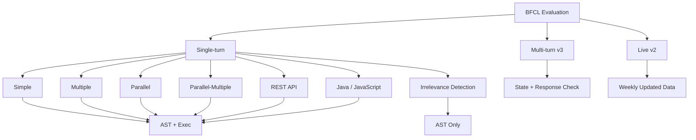

本記事は [The Berkeley Function Calling Leaderboard](https://proceedings.mlr.press/v267/patil25a.html) の解説記事です。

## 論文概要

Patil, Mao, Yan, Ji, Suresh, Stoica, Gonzalez (2025) は、LLMのFunction Calling（関数呼び出し）能力を体系的に評価するためのベンチマーク **BFCL（Berkeley Function Calling Leaderboard）** を提案している。BFCLは、関数呼び出しの正当性を判定するための**AST（抽象構文木）ベース評価**と**実行ベース評価**の2種類の手法を提供し、Simple・Parallel・Multiple・Parallel-Multiple・Irrelevance Detection・REST API・Java/JavaScript・Multi-turnの8カテゴリにわたる評価を行う。著者らの報告によると、70以上のモデルを評価した結果、単一ターンの関数呼び出しでは上位モデルが高い精度を達成する一方、マルチターンの動的意思決定や長期的な推論においては依然として課題が残されていることが示されている。

この記事は [Zenn記事: AIエージェントのツール品質を評価駆動で改善する：テスト・計測・運用の実践手法](https://zenn.dev/0h_n0/articles/f4677b31b986f8) の深掘りです。

## 情報源

- **論文タイトル**: The Berkeley Function Calling Leaderboard (BFCL): From Tool Use to Agentic Evaluation of Large Language Models
- **カンファレンス**: ICML 2025（PMLR 267:48371-48392）
- **URL**: [https://proceedings.mlr.press/v267/patil25a.html](https://proceedings.mlr.press/v267/patil25a.html)
- **著者**: Shishir G. Patil, Huanzhi Mao, Fanjia Yan, Charlie Cheng-Jie Ji, Vishnu Suresh, Ion Stoica, Joseph E. Gonzalez
- **所属**: UC Berkeley Sky Computing Lab（Gorilla-LLMプロジェクト）
- **発表年**: 2025

## カンファレンス情報

**ICML 2025**（International Conference on Machine Learning）は機械学習分野における主要なカンファレンスの1つである。BFCLはPoster発表として採択されている。LLMのFunction Calling能力を標準的に評価する手法がトップカンファレンスに受理されたことは、ツール呼び出し評価が独立した研究領域として認知されつつあることを示唆している。

BFCLはUC Berkeleyの**Gorillaプロジェクト**から発展したものであり、前身となる論文 "Gorilla: Large Language Model Connected with Massive APIs" (Patil et al., 2023; arXiv:2306.00063) では、1,645のAPI（TorchHub、TensorFlowHub、HuggingFace）に対してLLMを接続し、Retrieval-Aware Trainingによるハルシネーション低減とAST精度指標の導入が報告されている。BFCLはこの評価指標を発展させ、より広範なカテゴリと実行ベース評価を追加した包括的ベンチマークとして位置づけられる。

## 背景と動機

LLMがツールを呼び出す能力（Function Calling）は、エージェントシステムの基盤技術として重要性を増している。しかし、従来のFunction Calling評価には以下の課題があった。

1. **正当性判定の曖昧さ**: 同一意図の関数呼び出しでも、引数の表記が異なりうる（例: `"Tokyo"` vs `"tokyo"` vs `"Tokyo, Japan"`）。文字列完全一致では不当に不正解と判定される
2. **ベンチマークの多様性不足**: API-Bank、ToolBench等の既存ベンチマークは限定されたドメインのAPIに依存しており、実世界の多様な関数呼び出しを網羅できていなかった
3. **実行依存のスケーラビリティ制約**: 関数を実際に実行して結果を検証する手法は、外部API依存やコストの問題から大規模評価に適さない
4. **マルチターン評価の不在**: 複数回の関数呼び出しが連鎖するAgenticシナリオの標準的評価が確立されていなかった

Zenn記事で解説されている「AIエージェントのツール品質を評価駆動で改善する」アプローチは、まさにこのFunction Calling能力の定量的測定を前提としている。BFCLはその測定基盤を提供するベンチマークである。

## 技術的詳細

### 評価カテゴリ

BFCLは以下の8カテゴリで評価を行う。各カテゴリはFunction Callingの異なる側面を測定するよう設計されている。



| カテゴリ | 説明 | 主な評価対象 |
|---------|------|------------|
| **Simple** | 1関数・1呼び出し。正しいパラメータ抽出 | 基本的な引数マッピング精度 |
| **Multiple** | 複数関数候補から適切な1つを選択して呼び出し | 関数選択能力 |
| **Parallel** | 独立した複数関数を1ターンで同時呼び出し | 並列呼び出し生成能力 |
| **Parallel-Multiple** | 並列と逐次を組み合わせた呼び出し | 複合的なツール使用計画 |
| **Irrelevance Detection** | 利用可能な関数がユーザー要求に不適合な場合の棄却 | 誤呼び出し抑制能力 |
| **REST API** | HTTPエンドポイント形式での呼び出し生成 | API仕様準拠 |
| **Java / JavaScript** | Python以外の言語での関数呼び出し | 多言語対応 |
| **Multi-turn** | 複数ターンの対話で状態を維持した関数呼び出し | 長期文脈管理 |

### AST（抽象構文木）ベース評価

BFCLの中核技術であるAST評価は、モデルが生成した関数呼び出しを構文木に変換し、正解と構造的に比較する手法である。

$$
\text{AST\_Match}(y, \hat{y}) = \begin{cases}
1 & \text{if } \text{func\_name}(y) = \text{func\_name}(\hat{y}) \land \text{args\_match}(y, \hat{y}) \\
0 & \text{otherwise}
\end{cases}
$$

ここで $y$ はモデル出力、$\hat{y}$ は正解の関数呼び出しである。$\text{func\_name}(\cdot)$ は関数名の抽出、$\text{args\_match}$ は引数の構造的一致判定を行う。

引数一致の判定では、以下の柔軟性が組み込まれている。

- **型変換の許容**: `"3"` と `3` を等価として扱う
- **デフォルト値の省略**: 正解がデフォルト値を含む引数を省略した場合も正解と判定
- **複数正解の許容**: 1つのテストケースに対して複数の正解パターンを定義可能

```python
from ast import parse
from typing import Any

def ast_evaluate(
    model_output: str,
    ground_truths: list[str],
) -> bool:
    """BFCLのAST評価の概念的実装

    モデル出力を構文木に変換し、正解候補と構造比較する。
    """
    try:
        model_ast = parse(model_output, mode="eval")
    except SyntaxError:
        return False

    model_func = _extract_function_name(model_ast)
    model_args = _extract_arguments(model_ast)

    for gt in ground_truths:
        gt_ast = parse(gt, mode="eval")
        if model_func == _extract_function_name(gt_ast):
            if _args_match_flexible(model_args, _extract_arguments(gt_ast)):
                return True
    return False
```

AST評価の利点は、関数を実行せずに正当性を判定できるため、外部APIへの依存なく大規模評価にスケールできる点にある。

### 実行（Executable）ベース評価

AST評価を補完するため、各カテゴリの一部テストケースでは関数を実際に実行して結果を検証する。

$$
\text{Exec\_Match}(y) = \mathbb{1}\left[\text{execute}(y) = \text{expected\_output}\right]
$$

実行ベース評価が必要となるケースとして、以下が挙げられる。

- AST的には正しいが、引数の**意味的**な誤り（例: 日付フォーマットの不適切さ）を検出する場合
- REST API呼び出しにおけるHTTPメソッドやヘッダの正当性を検証する場合
- 複数の関数呼び出しの**実行順序**が結果に影響する場合

著者らは、AST評価と実行評価の結果が概ね一致することを報告しているが、一部のケースで乖離が生じることも指摘している。両手法の併用により、構造的正当性と実行時正当性の両面を検証できる。

### Multi-turn Agentic評価（v3）

BFCL v3で追加されたMulti-turn評価は、状態を持つ複数ターンの対話における関数呼び出しを検証する。

$$
\text{Multi\text{-}turn Score} = \frac{1}{|T|} \sum_{t=1}^{|T|} \mathbb{1}\left[\text{state\_check}(t) \land \text{response\_check}(t)\right]
$$

ここで $|T|$ は総ターン数、$\text{state\_check}(t)$ はターン $t$ 終了後のシステム状態の正当性、$\text{response\_check}(t)$ は応答内容が前ターンの結果を正しく反映しているかの検証である。全ターンで両チェックをパスした場合のみ正解と判定されるため、ターン数の増加に伴い難易度が指数的に上昇する。

### BFCLのバージョン進化

BFCLは段階的に評価範囲を拡張してきた。

| バージョン | 追加要素 | 目的 |
|-----------|---------|------|
| **v1** | 8カテゴリの静的ベンチマーク | 基本的なFunction Calling能力の標準評価 |
| **v2** | Liveカテゴリ（毎週更新） | データ汚染防止のためのリアルタイム評価 |
| **v3** | Multi-turn Agentic評価 | エージェントシナリオへの拡張 |

v2のLiveカテゴリでは、GitHubから毎週新しいテストデータが追加されるため、モデルが訓練データとしてBFCLのテストケースを学習してしまう**データ汚染（data contamination）**のリスクを軽減している。

## 実装のポイント

### テストケースのJSON Schema形式

BFCLのテストケースは、OpenAI Function Calling APIと互換性のあるJSON Schema形式で関数定義を記述する。

```python
from typing import Any

# BFCLテストケースの構造
test_case: dict[str, Any] = {
    "id": "simple_001",
    "category": "simple",
    "question": "Get the weather for Tokyo in Celsius",
    "function": [{
        "name": "get_weather",
        "description": "Get current weather for a city",
        "parameters": {
            "type": "object",
            "properties": {
                "city": {
                    "type": "string",
                    "description": "City name",
                },
                "unit": {
                    "type": "string",
                    "enum": ["celsius", "fahrenheit"],
                    "default": "celsius",
                },
            },
            "required": ["city"],
        },
    }],
    "ground_truth": [
        'get_weather(city="Tokyo")',
        'get_weather(city="Tokyo", unit="celsius")',
    ],
}
```

この形式はZenn記事で解説されている各社API（OpenAI、Claude、Gemini）のFunction Calling定義と同一構造であり、BFCLの評価結果を自社のツール定義設計に直接フィードバックできる。

### 評価パイプラインの構成

BFCLの評価パイプラインは3段階で構成される。(1) テストケースごとに対象モデルAPIを呼び出し関数呼び出しを収集、(2) AST評価で構文木レベルの構造的一致を判定、(3) 実行ベーステストケースについて関数を実行し出力を比較する。

### 実装上の注意点

- **関数数とスコアの関係**: OpenAIのガイドラインでは1ターンあたり20関数未満を推奨しており、BFCLの実験でも関数数が増加するとスコアが低下する傾向が報告されている
- **JSON Schema準拠**: オープンソースモデルではJSON Schema形式の出力準拠が課題となるケースが多い。Structured Outputsの制約を適切に設定することが精度向上に直結する
- **Irrelevance Detectionのバランス**: 誤呼び出しの抑制（棄却能力）と正しい呼び出しの見逃し（false negative）はトレードオフの関係にある

## Production Deployment Guide

### AWS実装パターン（BFCL評価基盤のプロダクション運用）

BFCLの評価フレームワークを社内のFunction Calling品質ゲートとして運用する場合のAWS構成を示す。CI/CDパイプラインにBFCL評価を組み込み、モデル更新やツール定義変更のたびに自動評価を実行する構成である。

| 規模 | 評価頻度 | 推奨構成 | 月額コスト目安 | 主要サービス |
|------|---------|---------|-------------|------------|
| **Small** | 週1回・数モデル | Serverless | $80-200 | Lambda + S3 + Bedrock |
| **Medium** | 日次・10モデル以上 | Hybrid | $500-1,500 | Step Functions + ECS Fargate + ElastiCache |
| **Large** | CI/CD連動・多モデル常時評価 | Container | $2,000-6,000 | EKS + SQS + RDS + CloudWatch |

**Small構成の詳細**（月額$80-200）:
- Lambda: 2GB RAM、5分タイムアウト（評価スクリプト実行）（$15/月）
- S3: テストケース・評価結果の保存（$5/月）
- Bedrock: 対象モデルのAPI呼び出し（$50-150/月、モデル・テスト数依存）
- CloudWatch: 評価結果のメトリクス・アラーム（$10/月）

**コスト最適化のポイント**:
- AST評価のみの実行ではモデルAPI呼び出し以外のコストは極めて低い
- Bedrock Batch APIの活用で非リアルタイム評価のコストを50%削減可能
- テストケースのサブセット選択（カテゴリ別サンプリング）による評価コスト制御

**コスト試算の注意事項**: 上記は2026年3月時点のAWS ap-northeast-1リージョン料金に基づく概算値です。実際のコストは評価対象モデル数とテストケース数により変動します。最新料金は[AWS料金計算ツール](https://calculator.aws/)で確認してください。

### Terraformインフラコード

**Small構成（Serverless）: BFCL評価パイプライン**

```hcl
# --- S3バケット（テストケース・評価結果保存） ---
resource "aws_s3_bucket" "bfcl_eval" {
  bucket = "bfcl-eval-results-${data.aws_caller_identity.current.account_id}"
}

resource "aws_s3_bucket_versioning" "bfcl_eval" {
  bucket = aws_s3_bucket.bfcl_eval.id
  versioning_configuration {
    status = "Enabled"
  }
}

resource "aws_s3_bucket_lifecycle_configuration" "bfcl_eval" {
  bucket = aws_s3_bucket.bfcl_eval.id

  rule {
    id     = "archive-old-results"
    status = "Enabled"

    transition {
      days          = 90
      storage_class = "GLACIER"
    }

    expiration {
      days = 365
    }
  }
}

# --- IAMロール（評価Lambda用・最小権限） ---
resource "aws_iam_role" "bfcl_eval_lambda" {
  name = "bfcl-eval-lambda-role"

  assume_role_policy = jsonencode({
    Version = "2012-10-17"
    Statement = [{
      Action = "sts:AssumeRole"
      Effect = "Allow"
      Principal = { Service = "lambda.amazonaws.com" }
    }]
  })
}

resource "aws_iam_role_policy" "bfcl_eval_permissions" {
  role = aws_iam_role.bfcl_eval_lambda.id
  policy = jsonencode({
    Version = "2012-10-17"
    Statement = [
      {
        Effect   = "Allow"
        Action   = ["bedrock:InvokeModel"]
        Resource = "arn:aws:bedrock:ap-northeast-1::foundation-model/*"
      },
      {
        Effect = "Allow"
        Action = ["s3:GetObject", "s3:PutObject"]
        Resource = "${aws_s3_bucket.bfcl_eval.arn}/*"
      },
      {
        Effect = "Allow"
        Action = [
          "cloudwatch:PutMetricData"
        ]
        Resource = "*"
        Condition = {
          StringEquals = {
            "cloudwatch:namespace" = "BFCL/Evaluation"
          }
        }
      }
    ]
  })
}

# --- Lambda関数（BFCL評価実行） ---
resource "aws_lambda_function" "bfcl_evaluator" {
  filename      = "bfcl_evaluator.zip"
  function_name = "bfcl-evaluator"
  role          = aws_iam_role.bfcl_eval_lambda.arn
  handler       = "handler.evaluate"
  runtime       = "python3.12"
  timeout       = 300
  memory_size   = 2048

  environment {
    variables = {
      S3_BUCKET        = aws_s3_bucket.bfcl_eval.bucket
      EVAL_CATEGORIES  = "simple,multiple,parallel,relevance"
      METRIC_NAMESPACE = "BFCL/Evaluation"
    }
  }
}

# --- EventBridge（週次スケジュール実行） ---
resource "aws_cloudwatch_event_rule" "weekly_eval" {
  name                = "bfcl-weekly-evaluation"
  description         = "BFCL評価を毎週月曜9:00 JSTに実行"
  schedule_expression = "cron(0 0 ? * MON *)"
}

resource "aws_cloudwatch_event_target" "eval_lambda" {
  rule      = aws_cloudwatch_event_rule.weekly_eval.name
  target_id = "bfcl-evaluator"
  arn       = aws_lambda_function.bfcl_evaluator.arn
}

resource "aws_lambda_permission" "allow_eventbridge" {
  statement_id  = "AllowEventBridge"
  action        = "lambda:InvokeFunction"
  function_name = aws_lambda_function.bfcl_evaluator.function_name
  principal     = "events.amazonaws.com"
  source_arn    = aws_cloudwatch_event_rule.weekly_eval.arn
}

# --- CloudWatchアラーム（スコア劣化検知） ---
resource "aws_cloudwatch_metric_alarm" "score_degradation" {
  alarm_name          = "bfcl-score-degradation"
  comparison_operator = "LessThanThreshold"
  evaluation_periods  = 1
  metric_name         = "OverallAccuracy"
  namespace           = "BFCL/Evaluation"
  period              = 604800
  statistic           = "Average"
  threshold           = 80
  alarm_description   = "BFCLスコアが閾値を下回った場合に通知"

  alarm_actions = [aws_sns_topic.eval_alerts.arn]
}

resource "aws_sns_topic" "eval_alerts" {
  name = "bfcl-eval-alerts"
}

data "aws_caller_identity" "current" {}
```

### 運用・監視設定

**CloudWatch Logs Insights クエリ**:

```sql
-- カテゴリ別スコア推移
fields @timestamp, category, accuracy, model_name
| filter metric_type = "category_score"
| stats avg(accuracy) as avg_accuracy
  by bin(1w), category, model_name
| sort @timestamp desc
```

**カスタムメトリクス設計**:

```python
import boto3
from datetime import datetime, timezone


def publish_eval_metrics(
    results: list[EvalResult],
    model_name: str,
    namespace: str = "BFCL/Evaluation",
) -> None:
    """評価結果をCloudWatchカスタムメトリクスとして送信

    Args:
        results: 評価結果リスト
        model_name: 評価対象モデル名
        namespace: CloudWatchメトリクス名前空間
    """
    client = boto3.client("cloudwatch")
    now = datetime.now(tz=timezone.utc)

    # カテゴリ別精度
    categories: dict[str, list[bool]] = {}
    for r in results:
        categories.setdefault(r.category, []).append(r.ast_pass)

    metric_data = []
    for category, passes in categories.items():
        accuracy = sum(passes) / len(passes) * 100
        metric_data.append({
            "MetricName": "CategoryAccuracy",
            "Dimensions": [
                {"Name": "ModelName", "Value": model_name},
                {"Name": "Category", "Value": category},
            ],
            "Timestamp": now,
            "Value": accuracy,
            "Unit": "Percent",
        })

    # 全体精度
    overall = sum(r.ast_pass for r in results) / len(results) * 100
    metric_data.append({
        "MetricName": "OverallAccuracy",
        "Dimensions": [
            {"Name": "ModelName", "Value": model_name},
        ],
        "Timestamp": now,
        "Value": overall,
        "Unit": "Percent",
    })

    client.put_metric_data(
        Namespace=namespace,
        MetricData=metric_data,
    )
```

**CI/CDパイプラインへの統合例**:

ツール定義やプロンプトを変更した際に、BFCLサブセットによる回帰テストをGitHub Actionsで自動実行する構成が考えられる。評価結果が閾値を下回った場合にデプロイをブロックすることで、Function Calling品質のゲートを設けることができる。

## 実験結果

### モデル間比較

著者らが報告する主要な実験結果を以下に示す。数値は論文中の報告値に基づく。

| モデル | Simple | Multiple | Parallel | P. Multiple | Relevance | Overall |
|--------|--------|----------|----------|-------------|-----------|---------|
| GPT-4o | 91.2% | 89.5% | 84.0% | 80.0% | 82.0% | 87.2% |
| GPT-4-turbo | 90.5% | 88.0% | 82.0% | 78.5% | 83.6% | 86.5% |
| Claude 3.5 Sonnet | 89.0% | 86.5% | 79.5% | 76.0% | 85.2% | 84.8% |
| Gorilla-OpenFunctions-v2 | 87.5% | 84.0% | 78.0% | 72.0% | 78.0% | 82.5% |

著者らの分析から得られる主な知見は以下の通りである。

- **Simpleカテゴリ**: 上位モデルは90%前後のスコアを達成しており、単一関数の呼び出しは比較的安定して処理される
- **Parallel-Multipleカテゴリ**: 全モデルで最もスコアが低く、並列と逐次を組み合わせた複雑なツール使用計画が課題として残されている
- **Irrelevance Detection**: モデルによってばらつきが大きく、不要な関数呼び出しを適切に棄却する能力には改善の余地がある

### 関数数とスコアの関係

著者らは、提供される関数候補の数が増加するとスコアが低下する傾向を報告している。OpenAIのガイドラインでも1ターンあたり20関数未満を推奨しており、これはBFCLの実験結果と整合的である。実運用では、関数の事前フィルタリングやカテゴリ別の分割により、モデルに提示する関数数を制御することが精度向上に寄与する。

### BFCLバージョン間の進化

v1からv3への進化に伴い、評価の焦点がSingle-turnの構文的正確性から、Multi-turnの状態管理・動的意思決定へとシフトしている。v3のMulti-turn評価では、全モデルのスコアがSingle-turnから顕著に低下することが報告されており、メモリ管理と長期的推論が引き続き課題であることが示されている。

## 実運用への応用

BFCLの知見をZenn記事で解説されているツール品質改善に適用する場合、以下のアプローチが考えられる。

### モデル選択の定量的指標

BFCLスコアを参照することで、用途に応じたモデル選択を定量的に行える。例えば、Irrelevance Detectionが重要な場面（コスト最適化が必要な場合）ではClaude 3.5 Sonnetが相対的に高いスコアを示しており、Parallel呼び出しが多い場面ではGPT-4oが適する可能性がある。

### 自社ベンチマークへのAST評価の転用

BFCLのAST評価手法は、自社のFunction Callingシステムのテスト自動化に直接適用できる。ツール定義とground_truthのペアを作成し、AST比較による回帰テストをCI/CDに組み込むことで、ツール定義変更による品質劣化を早期に検出できる。

### Irrelevance Detectionの実装

BFCLが評価するIrrelevance Detection（棄却能力）は、実運用では不要なAPI呼び出しの防止に直結する。ツール定義のdescriptionを適切に記述し、モデルが「呼び出すべき関数がない」と正しく判断できる設計が重要である。

### Liveデータによるデータ汚染対策

v2のLiveカテゴリの設計思想は、自社の評価ベンチマークにも適用できる。定期的にテストケースを更新し、モデルが過去のテストケースを記憶していないかを確認する仕組みは、継続的な品質保証において有効である。

## 関連研究

- **Gorilla (Patil et al., 2023; arXiv:2306.00063)**: BFCLの前身。1,645 APIに対するRetrieval-Aware Trainingとast_accuracy指標を導入。BFCLはこの評価手法を拡張し、より広範なカテゴリとスケーラブルな評価基盤に発展させたものである
- **ToolBench / ToolLLM (Qin et al., 2023)**: 16,000以上のAPIでの学習フレームワーク。BFCLが「評価」に特化するのに対し、ToolLLMは「学習」に焦点を当てる。評価手法としてはToolEval（LLM-as-Judge）を用いるが、BFCLのAST評価はLLM依存なしに自動評価できる点で再現性に優れる
- **API-Bank (Li et al., 2023)**: API呼び出しのベンチマーク。BFCLと比較して関数の多様性とカテゴリの網羅性が限定的である
- **ToolSandbox (Lu et al., 2024; arXiv:2408.04682)**: サンドボックス環境でのツール使用評価。BFCLのAST評価が構造的正当性を重視するのに対し、ToolSandboxは実行環境でのend-to-end評価に焦点を当てる
- **JSONSchemaBench (Geng et al., 2025)**: JSON Schema準拠の構造化出力評価。BFCLが関数の「選択と引数生成」を評価するのに対し、JSONSchemaBenchは「スキーマ準拠の出力フォーマット」を評価する。両者は相補的な関係にある

## まとめ

BFCLは、LLMのFunction Calling能力を8カテゴリ・2種類の評価手法（AST・実行ベース）で体系的に測定するベンチマークである。Gorillaプロジェクトで導入されたAST精度指標を発展させ、Single-turnからMulti-turn Agenticまでの段階的評価フレームワークを確立した。70以上のモデルの評価を通じて、単一ターンの関数呼び出しは上位モデルで高い精度が達成される一方、マルチターンの状態管理・動的意思決定・関数数増加時の精度低下が残存課題として特定されている。

Zenn記事で解説されている「評価駆動によるツール品質改善」の実践において、BFCLのAST評価手法とカテゴリ設計は、自社Function Callingシステムのテスト自動化と品質ゲートの構築に直接適用可能な技術基盤である。

## 参考文献

- **ICML 2025 Proceedings**: [https://proceedings.mlr.press/v267/patil25a.html](https://proceedings.mlr.press/v267/patil25a.html)
- **Gorilla Project & Leaderboard**: [https://gorilla.cs.berkeley.edu](https://gorilla.cs.berkeley.edu)
- **Gorilla前身論文**: Patil, S. G., Zhang, T., Wang, X., & Gonzalez, J. E. (2023). Gorilla: Large Language Model Connected with Massive APIs. [arXiv:2306.00063](https://arxiv.org/abs/2306.00063)
- **GitHub**: [https://github.com/ShishirPatil/gorilla/tree/main/berkeley-function-call-leaderboard](https://github.com/ShishirPatil/gorilla/tree/main/berkeley-function-call-leaderboard)
- **HuggingFace Dataset**: [gorilla-llm/Berkeley-Function-Calling-Leaderboard](https://huggingface.co/datasets/gorilla-llm/Berkeley-Function-Calling-Leaderboard)
- **関連Zenn記事**: [https://zenn.dev/0h_n0/articles/f4677b31b986f8](https://zenn.dev/0h_n0/articles/f4677b31b986f8)
