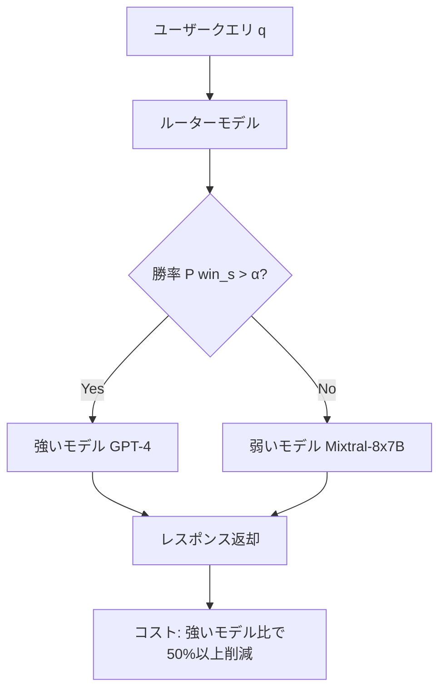

本記事は [RouteLLM: Learning to Route LLMs with Preference Data](https://arxiv.org/abs/2406.18665)（Ong et al., ICLR 2025）の解説記事です。

## 論文概要（Abstract）

RouteLLMは、推論時にクエリごとに強いLLM（例: GPT-4）と弱いLLM（例: Mixtral-8x7B）を動的に切り替えるルーターモデルのフレームワークである。著者らは、Chatbot Arenaの人間選好データとデータ拡張技術を活用して4種類のルーターアーキテクチャを訓練し、品質を維持しながらコストを2倍以上削減できることを報告している。

この記事は [Zenn記事: Portkey Gateway 2.0でLLMアプリの信頼性を設計する](https://zenn.dev/0h_n0/articles/babea176772c33) の深掘りです。Portkey Gatewayの負荷分散・ルーティング機能の学術的基盤を理解するために、RouteLLMの技術的詳細を解説します。

## 情報源

- **arXiv ID**: 2406.18665
- **URL**: [https://arxiv.org/abs/2406.18665](https://arxiv.org/abs/2406.18665)
- **著者**: Isaac Ong, Amjad Almahairi, Vincent Wu, Wei-Lin Chiang, Tianhao Wu, Joseph E. Gonzalez, M Waleed Kadous, Ion Stoica
- **発表年**: 2024（ICLR 2025採択）
- **分野**: cs.LG, cs.AI, cs.CL

## 背景と動機（Background & Motivation）

LLMの商用利用では、GPT-4やClaude 3 Opusのような高性能モデルは高い推論コストを伴う。一方、Mixtral-8x7BやLlama 3 8Bのような軽量モデルは低コストだが、複雑なタスクでは品質が劣る。実運用では全リクエストに高性能モデルを使う必要はなく、簡単なクエリには軽量モデルで十分な場合が多い。

従来のモデル選択は手動のルールベースか、タスク固有のベンチマークに依存しており、多様なユーザークエリに対して動的にモデルを切り替える汎用的な手法が欠如していた。RouteLLMはこの課題に対して、人間の選好データから学習するルーターモデルを提案している。

## 主要な貢献（Key Contributions）

- **貢献1**: 4種類のルーターアーキテクチャ（類似度加重ランキング、行列分解、BERTクラシファイア、因果LLMクラシファイア）の設計と比較評価
- **貢献2**: Chatbot Arenaの選好データとデータ拡張技術（Golden-Label拡張、LLM-Judge拡張）を組み合わせた訓練フレームワーク
- **貢献3**: モデルペアを変更しても性能を維持する転移学習能力の実証

## 技術的詳細（Technical Details）

### ルーティングの定式化

ルーティング問題は以下のように定式化される。ユーザークエリ $q$ に対して、強いモデル $\mathcal{M}_{\text{strong}}$ と弱いモデル $\mathcal{M}_{\text{weak}}$ のどちらに送るかを決定する閾値 $\alpha$ を持つルーター $R^\alpha$ を学習する。

$$
R^\alpha(q) = \begin{cases} \mathcal{M}_{\text{weak}} & \text{if } P(\text{win}_s | q) < \alpha \\ \mathcal{M}_{\text{strong}} & \text{if } P(\text{win}_s | q) \geq \alpha \end{cases}
$$

ここで、
- $P(\text{win}_s | q)$: クエリ $q$ に対して強いモデルが弱いモデルに勝つ確率
- $\alpha \in [0, 1]$: ルーティング閾値（コストと品質のトレードオフを制御）

$\alpha = 0$ で全リクエストを弱いモデルに、$\alpha = 1$ で全リクエストを強いモデルに送る。

### 訓練目的関数

ルーターの訓練は選好データ $\mathcal{D}_{\text{pref}}$ に対する最尤推定で行われる:

$$
\max_\theta \sum_{(q, l_{s,w}) \in \mathcal{D}_{\text{pref}}} \log P_\theta(l_{s,w} | q)
$$

ここで $l_{s,w}$ は強いモデルが勝つ（win）、弱いモデルが勝つ（lose）、引き分け（tie）のラベルである。

### 4種類のルーターアーキテクチャ

**1. 類似度加重（SW）ランキング**

Bradley-Terryモデルとコサイン類似度を組み合わせた手法。推論時にクエリ $q$ と訓練データの各クエリ $q'$ のコサイン類似度を計算し、加重投票で勝敗を予測する。明示的な訓練が不要という利点がある。

**2. 行列分解**

モデルとクエリの埋め込みの双線形関数でスコアリングする:

$$
\delta(M, q) = \mathbf{w}_2^\top (\mathbf{v}_m \odot (\mathbf{W}_1^\top \mathbf{v}_q + \mathbf{b}))
$$

ここで $\mathbf{v}_m$ はモデル埋め込み、$\mathbf{v}_q$ はクエリ埋め込み、$\odot$ はアダマール積である。8GB GPUで約10エポック、バッチサイズ64、Adam（学習率 $3 \times 10^{-4}$）で訓練する。

**3. BERTクラシファイア**

BERT-Baseアーキテクチャでクエリを埋め込み、[CLS]トークンの表現 $\mathbf{h}_{\text{CLS}}$ から勝率を予測する:

$$
P_\theta(\text{win}_s | q) = \sigma(\mathbf{W} \mathbf{h}_{\text{CLS}} + \mathbf{b})
$$

2×L4 24GB GPUで約2000ステップの全パラメータファインチューニングを行う。

**4. 因果LLMクラシファイア**

Llama 3 8Bを使用し、比較ラベルを語彙に追加トークンとして付与する。8×A100 80GB GPUで約2000ステップ訓練する。最も計算コストが高いが、複雑なクエリの判別精度に優れる。

### データ拡張技術

**Golden-Label拡張（$\mathcal{D}_{\text{gold}}$）**: MMLUのバリデーションセット（約1500問）を使用し、強弱モデルの回答を正解ラベルと比較してペアワイズラベルを生成する。

**LLM-Judge拡張（$\mathcal{D}_{\text{judge}}$）**: GPT-4をジャッジとして約120Kの選好サンプルを生成する。Nectarデータセットからクエリを取得し、GPT-4の回答を強いモデル、Mixtral-8x7Bの回答を弱いモデルとして使用する。著者らによると収集コストは約700ドルとのことである。

### ルーティングフロー



## 実装のポイント（Implementation）

RouteLLMはオープンソースフレームワークとしてリリースされている。実装時の主なポイントは以下の通り。

- **閾値 $\alpha$ のキャリブレーション**: ルーター訓練後、検証セットでコストと品質のパレートフロンティアを描き、目標品質に対応する $\alpha$ を選択する。$\alpha$ を高くするほど品質が上がるがコストも増加する
- **モデルティアリング**: Chatbot ArenaのEloスコアに基づく10段階の階層クラスタリングで、上位2ティアを $\mathcal{M}_{\text{strong}}$、第3ティアを $\mathcal{M}_{\text{weak}}$ として分類する
- **埋め込みモデルの選択**: 行列分解とSWランキングではクエリの埋め込みベクトルが必要であり、テキスト埋め込みモデルの品質がルーティング精度に直結する

## Production Deployment Guide

### AWS実装パターン（コスト最適化重視）

RouteLLMのルーティングロジックをAWS上でプロダクション運用する場合の構成を示す。

| 規模 | 月間リクエスト | 推奨構成 | 月額コスト目安 | 主要サービス |
|------|--------------|---------|-------------|------------|
| **Small** | ~3,000 (100/日) | Serverless | $50-150 | Lambda + Bedrock + DynamoDB |
| **Medium** | ~30,000 (1,000/日) | Hybrid | $300-800 | Lambda + ECS Fargate + ElastiCache |
| **Large** | 300,000+ (10,000/日) | Container | $2,000-5,000 | EKS + Karpenter + EC2 Spot |

**Small構成の詳細**（月額$50-150）:
- Lambda: 1GB RAM、30秒タイムアウト（$20/月）
- Bedrock: Claude 3.5 Haiku + GPT-4o相当（$80/月）
- DynamoDB: On-Demand、ルーティング結果キャッシュ（$10/月）
- CloudWatch: 基本監視（$5/月）

**コスト削減テクニック**:
- ルーターモデル自体はBERT-Baseサイズのため、Lambda上で低コスト推論可能
- Bedrock Batch API使用で50%割引（非リアルタイム処理向け）
- Prompt Caching有効化で同一プロンプトパターンのコストを30-90%削減
- Spot Instances使用で最大90%削減（EKS構成時）

**コスト試算の注意事項**: 上記は2026年3月時点のAWS ap-northeast-1リージョン料金に基づく概算値です。実際のコストはトラフィックパターンにより変動します。最新料金は[AWS料金計算ツール](https://calculator.aws/)で確認してください。

### Terraformインフラコード

**Small構成（Serverless）: ルーター + Bedrock統合**

```hcl
# --- IAMロール（最小権限） ---
resource "aws_iam_role" "router_lambda" {
  name = "routellm-lambda-role"

  assume_role_policy = jsonencode({
    Version = "2012-10-17"
    Statement = [{
      Action = "sts:AssumeRole"
      Effect = "Allow"
      Principal = { Service = "lambda.amazonaws.com" }
    }]
  })
}

resource "aws_iam_role_policy" "bedrock_invoke" {
  role = aws_iam_role.router_lambda.id
  policy = jsonencode({
    Version = "2012-10-17"
    Statement = [{
      Effect   = "Allow"
      Action   = ["bedrock:InvokeModel", "bedrock:InvokeModelWithResponseStream"]
      Resource = "arn:aws:bedrock:ap-northeast-1::foundation-model/*"
    }]
  })
}

# --- Lambda関数（ルーター + LLM呼び出し） ---
resource "aws_lambda_function" "router" {
  filename      = "routellm_lambda.zip"
  function_name = "routellm-router"
  role          = aws_iam_role.router_lambda.arn
  handler       = "index.handler"
  runtime       = "python3.12"
  timeout       = 60
  memory_size   = 1024

  environment {
    variables = {
      STRONG_MODEL    = "anthropic.claude-3-5-sonnet-20241022-v2:0"
      WEAK_MODEL      = "anthropic.claude-3-5-haiku-20241022-v1:0"
      ROUTER_THRESHOLD = "0.7"
      DYNAMODB_TABLE   = aws_dynamodb_table.routing_cache.name
    }
  }
}

# --- DynamoDB（ルーティング結果キャッシュ） ---
resource "aws_dynamodb_table" "routing_cache" {
  name         = "routellm-cache"
  billing_mode = "PAY_PER_REQUEST"
  hash_key     = "query_hash"

  attribute {
    name = "query_hash"
    type = "S"
  }

  ttl {
    attribute_name = "expire_at"
    enabled        = true
  }
}

# --- CloudWatch アラーム ---
resource "aws_cloudwatch_metric_alarm" "router_errors" {
  alarm_name          = "routellm-error-rate"
  comparison_operator = "GreaterThanThreshold"
  evaluation_periods  = 2
  metric_name         = "Errors"
  namespace           = "AWS/Lambda"
  period              = 300
  statistic           = "Sum"
  threshold           = 10
  alarm_description   = "ルーティングエラー率の異常検知"

  dimensions = {
    FunctionName = aws_lambda_function.router.function_name
  }
}
```

### 運用・監視設定

**CloudWatch Logs Insights クエリ**:
```sql
-- ルーティング決定の分布（強/弱モデルの比率）
fields @timestamp, routed_model, latency_ms
| stats count(*) as total,
        count_distinct(routed_model) as models_used
  by bin(1h), routed_model
| sort @timestamp desc

-- コスト異常検知
fields @timestamp, input_tokens, output_tokens, routed_model
| stats sum(input_tokens + output_tokens) as total_tokens by bin(1h)
| filter total_tokens > 100000
```

**コスト最適化チェックリスト**:
- [ ] ルーターモデル推論: Lambda上でBERT-Base実行（GPU不要）
- [ ] 強いモデル: Bedrock Batch APIで50%割引活用
- [ ] 弱いモデル: Haiku使用で$0.25/MToken
- [ ] キャッシュ: DynamoDB TTLで古いルーティング結果を自動削除
- [ ] 監視: AWS Budgets月額予算設定（80%で警告）

## 実験結果（Results）

### MT Bench（論文Table 1より）

| ルーター | CPT(50%) | APGR |
|---------|----------|------|
| ランダムベースライン | 49.03% | 0.500 |
| 行列分解（拡張済み） | 13.40% | 0.802 |
| SWランキング（拡張済み） | 23.21% | 0.759 |
| BERTクラシファイア | 28.53% | 0.714 |
| 因果LLM | 21.07% | 0.764 |

ここでCPT(50%)は50%の品質水準を達成するために必要な強いモデルへの呼び出し割合、APGRはルーティング曲線下の面積である。行列分解ルーターはランダムベースラインと比較してCPTを49.03%から13.40%に削減しており、つまり**約3.7倍少ない強いモデル呼び出しで同等の品質を維持**できることを著者らは報告している。

### コスト削減効果（論文Table 6より）

GPT-4（$24.7/MToken）とMixtral-8x7B（$0.24/MToken）のルーティングにおいて:

| ベンチマーク | コスト削減倍率 | 品質維持率 |
|------------|-------------|----------|
| MT Bench | 3.66x | 95% |
| MMLU | 1.41x | 92% |
| GSM8K | 1.49x | 87% |

### 転移学習（論文Table 4より）

訓練時と異なるモデルペア（Claude 3 Opus/Sonnet、Llama 3.1 70B/8B）でも再訓練なしで性能を維持。SWランキングはClaude 3ペアでAPGR 0.772（ランダム比+56.6%）を達成したと報告されている。

## 実運用への応用（Practical Applications）

RouteLLMの知見は、Portkey Gatewayのようなプロダクションシステムと直結する。

- **Portkey Gatewayとの関係**: Portkeyの`loadbalance`戦略で重み付きルーティングを行う際、RouteLLMのルーターモデルをカスタム分類器として組み込むことで、静的な重み配分ではなくクエリ内容に基づく動的ルーティングが実現可能
- **コスト管理**: 著者らのGPT-4/Mixtral実験で示された3.66倍のコスト削減は、Portkeyのコスト追跡機能と組み合わせることで定量的なコスト管理に活用できる
- **マルチティア構成**: RouteLLMの2モデルルーティングを、Portkeyのネスト構成（フォールバック + 負荷分散）に拡張することで、3つ以上のモデルティアへのルーティングが実現可能

## 関連研究（Related Work）

- **FrugalGPT**（Chen et al., 2023）: LLMのカスケード呼び出しによるコスト削減。RouteLLMはルーティング（並列選択）アプローチで、カスケード（逐次呼び出し）との違いを明確にしている
- **Hybrid LLM**（Ding et al., 2024）: 小さいモデルで回答可能かを判定するアプローチ。RouteLLMは選好データから直接学習する点が異なる
- **AutoMix**（Madaan et al., 2024）: 自己検証メカニズムによるモデル選択。RouteLLMはクエリのみから判断するため推論時のオーバーヘッドが小さい

## まとめと今後の展望

RouteLLMは、人間の選好データを活用したLLMルーティングの体系的なフレームワークを提示した。行列分解ルーターが最も高い性能を示し、MT Benchで3.66倍のコスト削減を達成している。転移学習能力により、新しいモデルペアへの適用も再訓練不要である点が実用上の利点として報告されている。Portkey GatewayのようなLLMゲートウェイにルーティングロジックを組み込む際の理論的基盤として有用な研究である。

## 参考文献

- **arXiv**: [https://arxiv.org/abs/2406.18665](https://arxiv.org/abs/2406.18665)
- **Related Zenn article**: [https://zenn.dev/0h_n0/articles/babea176772c33](https://zenn.dev/0h_n0/articles/babea176772c33)
