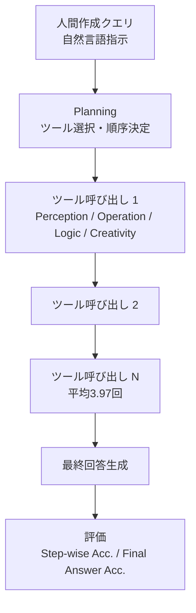
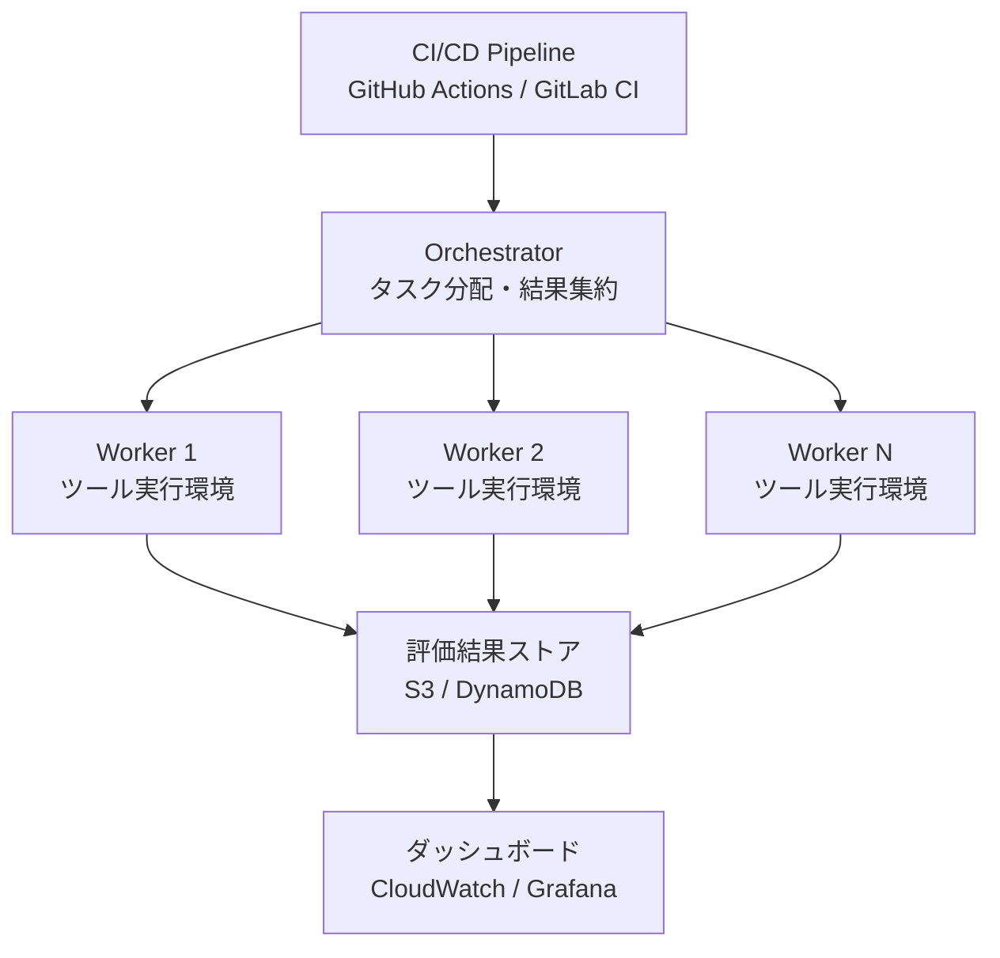

## 論文概要

本記事は [GTA: A Benchmark for General Tool Agents](https://arxiv.org/abs/2407.08713) の解説記事です。

GTA（General Tool Agents）は、Jize Wangらが提案したLLMベースのツール使用エージェントを評価するためのベンチマークである。NeurIPS 2024に採択された本研究は、既存ベンチマークが抱える3つの構造的問題——仮想ツール、単一ツール孤立タスク、LLM生成クエリ——を同時に解決することを目的としている。GTAは229件の実世界タスクで構成され、1タスクあたり平均3.97回のツール呼び出しを要求する。著者らは、最も高性能なGPT-4（vision対応）でさえ最終回答精度が約46%にとどまることを報告しており、現行LLMのツール使用能力に大きな改善余地があることを示している。

本記事はAI（Claude）による論文の引用・解説記事であり、独自の実験は行っていない。

## 関連Zenn記事

本記事は [Zenn記事: AIエージェントのツール品質を評価駆動で改善する：テスト・計測・運用の実践手法](https://zenn.dev/0h_n0/articles/f4677b31b986f8) の深掘りです。

## 情報源

| 項目 | 内容 |
|------|------|
| arXiv ID | [2407.08713](https://arxiv.org/abs/2407.08713) |
| タイトル | GTA: A Benchmark for General Tool Agents |
| 著者 | Jize Wang, Xinrun Du, Hao Wang, Tianming Liu, Luu Anh Tuan, Bin Liang, Ruifeng Xu |
| カンファレンス | NeurIPS 2024 |
| 初回投稿 | 2024年7月11日 |
| 分野 | cs.AI, cs.CL |

## 背景と動機

LLMをツール使用エージェントとして活用する研究が急速に進展する中、既存のベンチマークには以下の3つの構造的欠陥があると著者らは指摘している。

### 欠陥1: 仮想ツール（Virtual Tools）

API-Bank、ToolBench、MetaToolといった先行ベンチマークでは、ツールが実際には実行されず、出力がシミュレーションやテンプレートで置き換えられている。著者らは、仮想ツールを用いた評価ではエージェントがツール出力のフォーマットや例外処理を正しく扱えるかを検証できず、実環境との乖離が生じると論じている。たとえば、画像認識ツールの仮想実行では常に理想的な認識結果が返されるが、実ツールではノイズや認識誤りが含まれる。

### 欠陥2: 単一ツール孤立タスク（Isolated Single-Tool Tasks）

多くの既存ベンチマークでは、1タスクにつき1つのツールしか使用しない。実世界のタスクでは、複数ツールの出力を組み合わせてはじめて最終回答に到達できるケースが大半であり、ツール間の情報受け渡しやエラー伝搬を評価できない構造は不十分であると著者らは主張している。

### 欠陥3: 人工的クエリ（Artificial Queries）

一部のベンチマークではLLMを用いてタスククエリを自動生成している。この手法では、LLMが生成しやすいパターンにクエリが偏り、人間ユーザが実際に発する多様で曖昧な自然言語表現を反映できないと著者らは指摘している。

GTAはこれら3つの欠陥すべてに対応するベンチマークとして設計されている。

## 主要な貢献

著者らは以下の3点をGTAの主要な貢献として報告している。

1. **実行可能な実ツール**: 画像認識、コード実行、テキスト生成など、すべてのツールが実際に実行され、その出力がエージェントに返される。仮想ツールに依存しないことで、ツール出力の解釈やエラーハンドリングを含めた包括的な評価が可能になった
2. **マルチステップ・マルチツール設計**: 1タスクあたり平均3.97回のツール呼び出しを要求し、ツール間の情報連鎖を評価する。最大で7ツール以上の連鎖を含むタスクも存在する
3. **人間作成クエリ**: すべてのタスククエリを人間アノテータが作成しており、LLM生成バイアスを排除している。クエリには暗黙的な前提知識や曖昧表現が含まれ、実世界の使用状況をより忠実に反映している

## 技術的詳細

### ベンチマーク設計

GTAは229件のタスクで構成され、各タスクは「クエリ（自然言語の指示）」「参照ツール呼び出し列」「最終回答の正解」の3つ組として定義されている。

タスク解決のフローは以下の通りである。



### 4つのツールカテゴリ

著者らは、GTAで使用するツールを機能に応じて4つのカテゴリに分類している。

| カテゴリ | 機能 | 具体例 |
|----------|------|--------|
| **Perception（知覚）** | 入力データの認識・抽出 | 画像認識、OCR、音声認識（Speech-to-Text） |
| **Operation（操作）** | ファイル操作・コード実行 | コードインタープリタ、ファイルI/O |
| **Logic（論理）** | 推論・計算・変換 | 電卓、単位変換、データ型変換 |
| **Creativity（創造）** | コンテンツ生成 | 画像生成、テキスト変換、スタイル変更 |

この分類は、ツール使用エージェントが求められる能力の多様性を反映している。特にPerceptionカテゴリは、マルチモーダル入力の処理とツール呼び出しを同時に行う必要があるため、著者らの実験では最も困難なカテゴリとして報告されている。

### タスクの多様性

GTAのタスクは以下のような特性を持つ。

- **ツール連鎖の深さ**: 最小2ステップから最大7ステップ以上まで、多様な連鎖長のタスクを含む
- **クロスカテゴリ連鎖**: Perceptionで取得した情報をLogicで処理し、Creativityで出力するなど、カテゴリをまたぐ連鎖タスクが含まれる
- **マルチモーダル入力**: テキストだけでなく、画像や音声を入力として受け取るタスクが存在し、Vision対応の有無が性能に直結する
- **曖昧なクエリ**: 人間アノテータが作成したクエリには「この画像の中の数字を合計して」のように、暗黙的にOCRツールの使用を要求する表現が含まれる

### ツールインターフェース設計

各ツールはOpenAI Function Calling互換のJSON Schemaで定義されている。以下はPerceptionカテゴリのOCRツールの定義例である。

```json
{
  "type": "function",
  "function": {
    "name": "ocr_extract_text",
    "description": "Extract text content from an image using OCR.",
    "parameters": {
      "type": "object",
      "properties": {
        "image_path": {
          "type": "string",
          "description": "Path to the image file to extract text from."
        },
        "language": {
          "type": "string",
          "description": "Language hint for OCR engine (e.g., 'en', 'zh').",
          "default": "en"
        }
      },
      "required": ["image_path"]
    }
  }
}
```

この設計により、OpenAI APIやその互換インターフェースを持つモデルであれば、共通のプロトコルでGTAのタスクを実行できる。

## 実装のポイント

### 評価スクリプトの構成

著者らはGTAの評価コードをGitHubリポジトリ（[open-compass/GTA](https://github.com/open-compass/GTA)）で公開している。評価は以下の2段階で行われる。

**Step-wise Accuracy（ステップ単位精度）**: 各ツール呼び出しステップにおいて、正しいツールが正しい引数で呼ばれたかを評価する。この指標はエージェントの「計画能力」と「ツール選択能力」を分離して測定するために設計されている。

**Final Answer Accuracy（最終回答精度）**: タスク全体の最終出力が正解と一致するかを評価する。ツール連鎖の途中でエラーが発生すると最終回答にも影響が波及するため、この指標はエージェントの端到端（end-to-end）性能を反映する。

### フォーマット準拠率

著者らは、モデルが出力するJSON形式のツール呼び出しがスキーマに準拠しているかを「フォーマット準拠率」として測定している。この指標は特にオープンソースモデルにおいて重要な差異を生む要因として報告されている。GPT-4がほぼ100%のフォーマット準拠率を示す一方、一部のオープンソースモデルでは準拠率が50%を下回るケースがある。

### 再現実行の手順

GTAを用いたベンチマーク評価の基本的な流れは以下の通りである。

```python
from typing import Any

# 1. タスクデータのロード
def load_gta_tasks(dataset_path: str) -> list[dict[str, Any]]:
    """GTAデータセットからタスク一覧を読み込む。

    Args:
        dataset_path: データセットJSONファイルのパス

    Returns:
        タスク辞書のリスト。各要素にquery, tools, ground_truthを含む
    """
    import json
    with open(dataset_path) as f:
        return json.load(f)


# 2. エージェントの実行ループ（概念的な擬似コード）
def run_agent_on_task(
    task: dict[str, Any],
    model_name: str,
) -> dict[str, Any]:
    """単一タスクに対してエージェントを実行し結果を返す。

    Args:
        task: GTAタスク辞書（query, tools, ground_truth）
        model_name: 使用するモデル名

    Returns:
        tool_calls: 実行されたツール呼び出し列
        final_answer: エージェントの最終回答
    """
    # 実際の実装はOpenAI Function Calling APIを使用
    raise NotImplementedError("具体的な実装はGTAリポジトリを参照")


# 3. 評価指標の計算
def evaluate_step_wise(
    predicted_calls: list[dict[str, Any]],
    ground_truth_calls: list[dict[str, Any]],
) -> float:
    """ステップ単位の精度を計算する。

    Args:
        predicted_calls: エージェントが実行したツール呼び出し列
        ground_truth_calls: 正解のツール呼び出し列

    Returns:
        0.0-1.0の精度スコア
    """
    correct = 0
    total = len(ground_truth_calls)
    for pred, gt in zip(predicted_calls, ground_truth_calls):
        if pred["name"] == gt["name"] and pred["arguments"] == gt["arguments"]:
            correct += 1
    return correct / total if total > 0 else 0.0
```

## プロダクション環境でのデプロイガイド

GTAベンチマークの知見をプロダクション環境のツールエージェント評価パイプラインとして運用する場合の設計指針を以下に示す。

### アーキテクチャ概要

GTAの評価フレームワークをCI/CDパイプラインに組み込む場合、以下の3層アーキテクチャが考えられる。



**Orchestrator層**: タスクの分配と結果の集約を担う。AWS Step Functionsを用いてタスクごとにWorkerを並列起動し、タイムアウトやリトライ制御を行う。229タスク全体の実行をバッチジョブとして管理する。

**Worker層**: 各タスクの実行を担うコンテナ。GTAのツール（OCR、コード実行、画像生成など）は外部APIやローカルライブラリに依存するため、依存関係を含むDockerイメージを事前にビルドしておく。

**評価結果ストア**: Step-wise AccuracyとFinal Answer Accuracyをタスク単位で記録する。時系列でモデルバージョンごとの性能推移を追跡できるようにする。

### AWSインフラ構成

以下はTerraformによるWorker実行環境の構成例である。

```hcl
# ECS Fargate タスク定義（GTA Worker）
resource "aws_ecs_task_definition" "gta_worker" {
  family                   = "gta-benchmark-worker"
  network_mode             = "awsvpc"
  requires_compatibilities = ["FARGATE"]
  cpu                      = "2048"
  memory                   = "4096"
  execution_role_arn       = aws_iam_role.ecs_execution.arn
  task_role_arn            = aws_iam_role.gta_worker.arn

  container_definitions = jsonencode([
    {
      name  = "gta-worker"
      image = "${aws_ecr_repository.gta.repository_url}:latest"
      environment = [
        { name = "RESULT_BUCKET", value = aws_s3_bucket.results.id },
        { name = "TASK_QUEUE_URL", value = aws_sqs_queue.tasks.url }
      ]
      logConfiguration = {
        logDriver = "awslogs"
        options = {
          "awslogs-group"         = aws_cloudwatch_log_group.gta.name
          "awslogs-region"        = var.aws_region
          "awslogs-stream-prefix" = "worker"
        }
      }
    }
  ])
}

# SQSキュー（タスク分配用）
resource "aws_sqs_queue" "tasks" {
  name                       = "gta-benchmark-tasks"
  visibility_timeout_seconds = 900
  message_retention_seconds  = 86400

  redrive_policy = jsonencode({
    deadLetterTargetArn = aws_sqs_queue.dlq.arn
    maxReceiveCount     = 3
  })
}

# S3バケット（評価結果保存用）
resource "aws_s3_bucket" "results" {
  bucket = "gta-benchmark-results-${var.environment}"
}
```

### モニタリングとアラート

ベンチマーク実行のモニタリングでは、以下のメトリクスを収集する。

**実行メトリクス**:
- タスクあたりの実行時間（P50/P95/P99）
- ツール呼び出しの成功率・失敗率
- フォーマット準拠率の推移

**品質メトリクス**:
- Step-wise Accuracyの時系列変化
- Final Answer Accuracyの時系列変化
- カテゴリ別精度の内訳

CloudWatch MetricsとGrafanaダッシュボードを組み合わせ、モデル更新時にベンチマークスコアが閾値を下回った場合にSlackへアラートを送信する構成が実用的である。

```python
import json
import datetime
from typing import Any


def publish_benchmark_metrics(
    results: list[dict[str, Any]],
    model_version: str,
    cloudwatch_namespace: str = "GTA/Benchmark",
) -> None:
    """ベンチマーク結果をCloudWatch Metricsに送信する。

    Args:
        results: タスクごとの評価結果リスト
        model_version: 評価対象モデルのバージョン
        cloudwatch_namespace: CloudWatchの名前空間
    """
    import boto3

    client = boto3.client("cloudwatch")

    step_wise_scores = [r["step_wise_accuracy"] for r in results]
    final_scores = [r["final_answer_accuracy"] for r in results]

    metric_data = [
        {
            "MetricName": "StepWiseAccuracy",
            "Dimensions": [
                {"Name": "ModelVersion", "Value": model_version},
            ],
            "Timestamp": datetime.datetime.now(datetime.timezone.utc),
            "Value": sum(step_wise_scores) / len(step_wise_scores),
            "Unit": "None",
        },
        {
            "MetricName": "FinalAnswerAccuracy",
            "Dimensions": [
                {"Name": "ModelVersion", "Value": model_version},
            ],
            "Timestamp": datetime.datetime.now(datetime.timezone.utc),
            "Value": sum(final_scores) / len(final_scores),
            "Unit": "None",
        },
    ]

    client.put_metric_data(
        Namespace=cloudwatch_namespace,
        MetricData=metric_data,
    )
```

### セキュリティ上の考慮事項

GTAのツール群にはコードインタープリタやファイルI/Oなど、任意コード実行を伴うツールが含まれる。プロダクション環境でこれらを実行する際は以下の対策が必要である。

- **ネットワーク分離**: Worker コンテナはプライベートサブネットに配置し、必要な外部APIのみホワイトリストで許可する
- **実行時間制限**: 各ツール呼び出しに15秒のタイムアウトを設定し、無限ループを防止する
- **ファイルシステム制限**: 書き込み可能領域を`/tmp`のみに限定し、tmpfsで容量上限を設定する
- **IAMロールの最小権限**: Worker用IAMロールにはS3書き込みとSQS読み取りのみを付与する

## 実験結果

### モデル別性能比較

著者らは、GPT-4（vision対応）、GPT-3.5、およびオープンソースモデル（LLaMAベース）を含む複数のモデルで評価を行い、以下の結果を報告している。

| モデル | Step-wise Acc. | Final Answer Acc. |
|--------|---------------|-------------------|
| GPT-4（w/ vision） | 最高水準 | 約46% |
| GPT-3.5 | 中程度 | 約33% |
| オープンソースモデル（LLaMA系） | 低い | 約20%以下 |

この結果から、以下の知見が得られると著者らは述べている。

### 知見1: 最高性能モデルでも約46%の最終精度

GPT-4（vision対応）がGTAで最も高い性能を示したが、最終回答精度は約46%にとどまる。これは、実ツールを用いたマルチステップタスクがLLMにとって依然として困難な課題であることを示している。仮想ツールを用いた既存ベンチマークでは80%以上のスコアが報告される場合もあるが、GTAの結果はそれらのスコアが楽観的である可能性を示唆している。

### 知見2: フォーマット準拠がオープンソースモデルの最大障壁

オープンソースモデルの性能低下の主因は、ツール呼び出しのJSON形式がスキーマに準拠しないケースが多いことにあると著者らは分析している。関数名の誤り、引数型の不一致、必須パラメータの欠落など、フォーマットレベルのエラーがタスク失敗に直結する。この結果は、Function Calling能力の向上がオープンソースモデルの優先課題であることを示唆している。

### 知見3: ステップ精度と最終精度のギャップ

Step-wise AccuracyがFinal Answer Accuracyを上回るという一貫した傾向が観察されている。これは、個々のツール呼び出しは正しくても、複数ステップの連鎖においてエラーが蓄積・伝搬し、最終回答の品質を低下させることを意味する。

$$
\text{Final Acc.} \leq \prod_{i=1}^{N} \text{Step Acc.}_i
$$

ここで$$N$$はタスクあたりのツール呼び出し回数であり、平均3.97回のツール呼び出しにおいて各ステップの精度が独立に$$p$$であると仮定すると、最終精度は$$p^{3.97}$$に比例して低下する。この関係は、ステップ単位の精度改善がエージェント全体の性能向上に乗数的な効果をもたらすことを示唆している。

### 知見4: Perceptionカテゴリの困難さ

4つのツールカテゴリの中で、Perception（知覚）カテゴリが最も低い精度を示している。これは、マルチモーダル入力の処理（画像理解、音声認識）とツール呼び出しの計画を同時に行う必要があるためであると著者らは分析している。画像中のテキストをOCRで読み取り、その結果を計算ツールに渡すようなタスクでは、OCRの認識精度がそのまま後続ステップのエラー率に影響する。

### 知見5: 実ツール vs 仮想ツール

著者らは、同じタスクセットに対して実ツールと仮想ツール（出力をシミュレーション）を適用した比較実験を行っている。その結果、仮想ツールを用いた場合の精度が実ツールの場合を大幅に上回ることが確認されている。この差は、既存の仮想ベンチマークがエージェントの実力を過大評価していることを意味する。

### 知見6: 人間アノテータとのギャップ

人間アノテータはGTAのタスクのほぼすべてを解決できると著者らは報告している。これに対し、最も高性能なGPT-4でも約46%の精度であり、人間とLLMの間に大きなギャップが残存していることが明確に示されている。このギャップの解消がツールエージェント研究の今後の方向性として重要である。

## 実運用への応用

GTAの知見は、プロダクション環境でのツールエージェント設計に以下の示唆を与える。

### エラー蓄積への対策

GTAの実験結果が示すステップ間のエラー蓄積は、実運用システムにおいても深刻な問題となる。各ツール呼び出しの出力を検証するバリデーション層の挿入や、中間結果の確信度に基づくリトライ機構の導入が有効と考えられる。

### フォーマット準拠の確保

オープンソースモデルを使用する場合、Function Callingの出力フォーマットを強制するための後処理レイヤ（JSON修復、スキーマバリデーション）の導入が推奨される。Structured Outputsのような機能を活用し、フォーマットエラーによるタスク失敗を防止することが重要である。

### 評価駆動の改善サイクル

GTAが提供するStep-wise AccuracyとFinal Answer Accuracyの2段階評価は、エージェントのどの段階にボトルネックがあるかを特定するうえで有用である。CI/CDパイプラインにベンチマーク評価を組み込み、モデル更新やプロンプト変更のたびに性能劣化を検知する運用が推奨される。

### マルチモーダル対応の必要性

Perceptionカテゴリの困難さは、テキストのみのエージェントでは対応できないタスクの存在を示している。画像入力を伴うタスクに対応するためには、Vision対応モデルの採用または専用の前処理パイプライン（画像→テキスト変換）の導入を検討する必要がある。

## 関連研究

GTAに関連する主要な研究を以下に整理する。

- **API-Bank** (Li et al., 2023): LLMのAPI呼び出し能力を評価するベンチマーク。ただし、ツールの実行は仮想的であり、GTAとは異なる
- **ToolBench** (Qin et al., 2023): RapidAPIから収集した16,000以上のAPIを対象とするベンチマーク。大規模なツール集合を扱うが、クエリはLLMで生成されている
- **MetaTool** (Huang et al., 2024): ツール選択の意識とツール使用の正確さを評価するベンチマーク。仮想ツールベースの評価である
- **ToolSandbox** (Lu et al., 2024): ステートフルな対話環境でのツール使用を評価する。GTAとは補完的な関係にあり、ToolSandboxが対話のステートフル性に焦点を当てるのに対し、GTAはツールの実行可能性とマルチステップ連鎖に焦点を当てている
- **AgentBench** (Liu et al., 2023): Webブラウジング、データベース操作など8つの環境でLLMエージェントを評価するベンチマーク。GTAよりも環境の多様性が広いが、ツール呼び出しの粒度での評価は行わない
- **BFCL** (Patil et al., 2024): Berkeley Function Calling Leaderboard。単発のFunction Calling精度ランキングを提供するが、マルチステップ評価は含まない

## まとめ

GTAは、既存のツールエージェントベンチマークが抱える3つの構造的問題（仮想ツール・単一ツール孤立タスク・人工的クエリ）を同時に解決するベンチマークとして、NeurIPS 2024で発表された。229件の実世界タスク、平均3.97回のツール呼び出し、人間作成クエリという設計により、エージェントの実力をより正確に評価できることが著者らによって示されている。

最も高性能なGPT-4（vision対応）でも最終回答精度が約46%にとどまるという結果は、ツール使用エージェントの研究が依然として発展途上にあることを示唆しており、特にフォーマット準拠率の向上、ステップ間エラー蓄積への対処、マルチモーダル能力の強化が今後の重要な研究方向として提示されている。実運用においては、GTAの評価手法をCI/CDパイプラインに組み込み、モデルの性能を継続的に監視する評価駆動アプローチが有効である。

## 参考文献

1. Wang, J., Du, X., Wang, H., Liu, T., Tuan, L. A., Liang, B., & Xu, R. (2024). GTA: A Benchmark for General Tool Agents. *NeurIPS 2024*. [arXiv:2407.08713](https://arxiv.org/abs/2407.08713)
2. GitHub リポジトリ: [open-compass/GTA](https://github.com/open-compass/GTA)
3. Li, M., et al. (2023). API-Bank: A Comprehensive Benchmark for Tool-Augmented LLMs. *EMNLP 2023*. [arXiv:2304.08244](https://arxiv.org/abs/2304.08244)
4. Qin, Y., et al. (2023). ToolLLM: Facilitating Large Language Models to Master 16000+ Real-World APIs. *ICLR 2024*. [arXiv:2307.16789](https://arxiv.org/abs/2307.16789)
5. Lu, J., et al. (2024). ToolSandbox: A Stateful, Conversational, Interactive Evaluation Benchmark for LLM Tool Use Capabilities. [arXiv:2408.04682](https://arxiv.org/abs/2408.04682)
6. Liu, X., et al. (2023). AgentBench: Evaluating LLMs as Agents. *ICLR 2024*. [arXiv:2308.03688](https://arxiv.org/abs/2308.03688)
