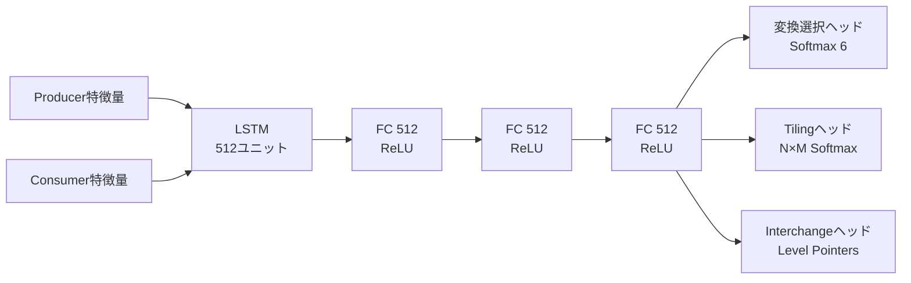

本記事は [A Reinforcement Learning Environment for Automatic Code Optimization in the MLIR Compiler (arXiv:2409.11068)](https://arxiv.org/abs/2409.11068) の解説記事です。

## 論文概要（Abstract）

著者らはMLIR RLと名付けた強化学習環境を提案しています。この環境はMLIRコンパイラのLinalg Dialectで表現されたループネストに対し、タイリング・並列化・フュージョン・ループ交換・ベクトル化の5つの変換を自動選択する仕組みです。行動空間の組み合わせ爆発を抑えるため、Multi-discrete定式化とLevel Pointersという手法を導入しています。PyTorchの深層学習オペレータとLQCD（格子量子色力学）のワークロードで評価が行われ、Maxpoolingで PyTorch比3.3倍、LQCD Hexaquark計算でHalide autoscheduer比11倍の高速化が報告されています。

この記事は [Zenn記事: LLVM 20〜22の進化を総整理](https://zenn.dev/0h_n0/articles/0a233ce0c2d576) の深掘りです。

## 情報源

- **arXiv ID**: 2409.11068
- **URL**: [https://arxiv.org/abs/2409.11068](https://arxiv.org/abs/2409.11068)
- **著者**: Mohammed Tirichine, Nassim Ameur, Nazim Bendib, Iheb Nassim Aouadj, Bouchama Djad, Rafik Bouloudene, Riyadh Baghdadi
- **発表**: CGO 2026（IEEE/ACM International Symposium on Code Generation and Optimization）, 2026年1月31日〜2月4日, シドニー
- **分野**: cs.LG, cs.DC, cs.SE
- **ライセンス**: Creative Commons Attribution 4.0

## 背景と動機（Background & Motivation）

コンパイラの最適化パス選択は、従来ヒューリスティクスベースで行われてきました。しかし、MLIRのような多段階IRでは変換の組み合わせが膨大になり、手動チューニングでは最適解に到達できないケースが増えています。Halide、TVM、Tiramisu等の先行研究ではドメイン固有言語（DSL）内での自動チューニングが行われてきましたが、汎用コンパイラIR上での強化学習環境は十分に整備されていませんでした。

著者らは、MLIRのLinalg Dialectを対象として、以下の課題を解決する環境の構築を目指しています。

- **行動空間の組み合わせ爆発**: $N$個のループに対するInterchange変換だけで$N!$通りの選択肢が存在する
- **変換間の依存関係**: Fusionの前にTilingが必要など、変換の適用順序に制約がある
- **実行時間計測の高コスト**: 報酬を得るために毎回コードを実行する必要がある

## 主要な貢献（Key Contributions）

- **貢献1**: MLIR Linalg Dialectを対象とした強化学習環境の設計と実装。5種類の変換（Tiling, Tiled Parallelization, Tiled Fusion, Interchange, Vectorization）を行動として定義
- **貢献2**: Multi-discrete行動空間定式化により、変換パラメータの組み合わせを効率的に表現。Level Pointersの導入によりInterchangeの行動空間を$N!$から$N$回の逐次選択に削減
- **貢献3**: PyTorch深層学習オペレータ（1,135個）とLQCD計算（691例）からなるデータセットでの評価。Multi-discrete定式化が平均18.7倍の高速化を達成

## 技術的詳細（Technical Details）

### 行動空間の設計

著者らは5つの変換を行動として定義しています。各変換のパラメータ空間は以下の通りです。

| 変換 | 説明 | パラメータ空間サイズ |
|------|------|---------------------|
| Tiling | ループ階層ごとのタイルサイズ指定 | $M^N$ |
| Tiled Parallelization | Tiling + 最外ループのOpenMP並列化 | $M^N$ |
| Tiled Fusion | Producer-Consumerループのタイル粒度での融合 | $M^N$ |
| Interchange | ループ順序の入れ替え | $N!$ |
| Vectorization | 最内ループのベクトル化 | 1 |

ここで、$N$はループの深さ（ネスト数）、$M$はタイルサイズ候補の数（論文では8、ゼロを含む）です。行動空間の合計サイズは以下の式で表されます。

$$
|A| = 3 \cdot M^N + N! + 2
$$

最後の$+2$はVectorizationとNo Transformation（終了アクション）に対応します。

### Level Pointers によるInterchange空間の削減

$N$個のループの全順列を列挙すると$N!$の行動空間になります。著者らはLevel Pointersという手法でこれを$N$回の逐次選択に分解しています。

ステップ$i \in [0, N)$で、エージェントは残りのループ集合から位置$i$に配置するループを選択します。既に選択済みのループはマスクされるため、各ステップの選択肢は減少していきます。

```python
from dataclasses import dataclass

@dataclass
class LevelPointersInterchange:
    """Level Pointersによるループ交換の逐次選択"""
    n_loops: int

    def select_permutation(self, policy_network, state):
        """N回の逐次選択でN!の順列空間を探索"""
        permutation = []
        available = list(range(self.n_loops))

        for step in range(self.n_loops):
            # ポリシーネットワークが残りのループから1つ選択
            # マスク付きSoftmaxで選択済みループを除外
            logits = policy_network.interchange_head(state)
            mask = torch.zeros(self.n_loops)
            for idx in available:
                mask[idx] = 1.0
            probs = softmax(logits * mask + (1 - mask) * (-1e9))

            selected = torch.multinomial(probs, 1).item()
            permutation.append(selected)
            available.remove(selected)

            # 選択履歴を状態に追加
            state = update_action_history(state, step, selected)

        return permutation
```

著者らの実験では、Level Pointersを用いたMulti-discrete定式化が平均18.7倍の高速化を達成し、列挙方式の14.5倍を上回ったと報告されています（論文Section V-B, Table II）。

### 状態表現

状態は以下の要素から構成されています。

1. **オペレーションタイプ**: One-hotベクトル（matmul, conv_2d, add, pooling, generic, unknownの6種）
2. **ループ範囲**: 上限値とイテレータ型（reduction / parallel）
3. **ベクトル化前提条件**: Boolean値
4. **インデキシングマップ**: 多面体アクセス行列（$D \times N$、$D$はテンソル次元、$N$はループイテレータ数）
5. **演算カウント**: +, -, ×, /, exp各演算の個数
6. **行動履歴**: One-hot行列（タイリング用$\tau \times N \times M$、Interchange用$\tau \times N \times N$）

Producer-Consumerペアの特徴量をLSTM（512ユニット）に入力し、最終隠れ状態を状態埋め込みとして使用しています。

### ポリシーネットワーク構造



バックボーンは512ニューロンの全結合層3層（ReLU活性化）で構成されます。行動ヘッドは変換タイプ選択用（6クラスSoftmax）、Tiling系3変換用（$N \times M$の2D Softmax）、Interchange用（Level PointersまたはEnumerated）に分かれています。

### 報酬関数と学習設定

報酬はエピソード終了時にのみ与えられ、高速化率の対数として定義されています。

$$
r = \log\left(\frac{t_{\text{original}}}{t_{\text{optimized}}}\right)
$$

ここで$t_{\text{original}}$は最適化前の実行時間、$t_{\text{optimized}}$は最適化後の実行時間です。対数を取ることで、加法的な報酬累積が乗法的な高速化に対応するようになっています。

学習アルゴリズムはPPO（Proximal Policy Optimization）で、主要ハイパーパラメータは以下の通りです。

| パラメータ | 値 |
|-----------|-----|
| 学習率 | 0.001 |
| クリップ範囲 | 0.2 |
| 割引率 $\gamma$ | 1.0（割引なし） |
| GAE $\lambda$ | 0.95 |
| バッチサイズ | 64コードサンプル |
| ミニバッチ | 32 |
| PPO更新エポック | 4 |
| 学習ステップ数 | 10,000 |

学習には16ノードのCPUクラスタ（Intel Xeon E5-2680 v4 @ 2.40 GHz, 64GB RAM/ノード）で約127時間を要したと報告されています。

## 実験結果（Results）

### 深層学習オペレータ（論文Figure 5, Table III）

| ワークロード | MLIR RL高速化率 | PyTorch比 | 備考 |
|-------------|----------------|-----------|------|
| Maxpooling | 3.3× | PyTorchより高速 | 単純な要素比較で高い並列性 |
| ResNet-18 | 16.17× | PyTorch比（推論時間25.43ms vs 374.77ms） | モデル全体の最適化 |
| MobileNetV2 | 4.07× | PyTorch比（6.93ms vs 23.66ms） | depthwise convを含む |
| VGG | 6.02× | PyTorch比（54.64ms vs 321.99ms） | 大規模CNN |

著者らは、Conv2DやMatmulなどの高度に最適化されたカーネル（cuBLAS、MKL-DNN等）を持つ演算では、MLIR RLが産業実装に劣る結果となったことも報告しています（Conv2Dで6.71倍遅い）。これはMLIRのLinalg表現がこれらの専用ライブラリの最適化レベルに達していないためと述べられています。

### LQCD（格子量子色力学）計算（論文Table IV）

| ベンチマーク | MLIR RL | Halide Autoscheduler | 高速化率 |
|-------------|---------|---------------------|---------|
| Hexaquark-Hexaquark (S=12) | 13.25ms | 1.17ms相当 | **11×** |
| Dibaryon-Dibaryon (S=24) | 7.57ms | 5.15ms相当 | 1.5× |
| Dibaryon-Hexaquark (S=32) | 2.15ms | 4.68ms相当 | 0.46×（劣る） |

LQCD計算では、テンソル縮約のループ構造が深く（S=12で12重ループ）、Halide autoschedulerの探索空間を超える最適化が可能であったと報告されています。一方、S=32のように非常に深いループネストでは、探索が十分に収束しなかったケースもあります。

### Multi-discrete vs Enumerated（論文Table II）

| 定式化 | 平均高速化率 | 収束速度 |
|--------|------------|---------|
| Enumerated（列挙） | 14.5× | 速い |
| Multi-discrete + Level Pointers | **18.7×** | 遅いが高い最終性能 |

### コンパイルオーバーヘッド

- ポリシーネットワーク推論: 0.028秒/コードサンプル
- MLIR変換適用: オペレータ0.089秒、LQCD 0.8秒

## 実装のポイント（Implementation）

### 変換の適用順序

著者らはオペレータをConsumerからProducerへ逆順に処理しています。これはLinalg Fusionの制約（変更済みProducerへのFusionが制限される）に起因します。

### MLIR Linalg入力の例

```mlir
// 行列積のMLIR Linalg表現
linalg.generic {
  indexing_maps = [
    affine_map<(d0,d1,d2) -> (d0,d2)>,  // A[i,k]
    affine_map<(d0,d1,d2) -> (d2,d1)>,  // B[k,j]
    affine_map<(d0,d1,d2) -> (d0,d1)>   // C[i,j]
  ],
  iterator_types = ["parallel", "parallel", "reduction"]
}
ins(%A, %B: memref<256x1024xf32>, memref<1024x512xf32>)
outs(%C: memref<256x512xf32>) {
  ^bb0(%a: f32, %b: f32, %c: f32):
    %d = arith.mulf %a, %b : f32
    %e = arith.addf %c, %d : f32
    linalg.yield %e : f32
}
```

Tiling [8, 8, 0] + Vectorization適用後は、`scf.forall`ループと`vector.transfer_read`/`vector.transfer_write`を用いた並列タイル計算コードに変換されます。

### データセット構成

- **深層学習**: PyTorchモデルから抽出した1,135個のLinalgオペレータ（可変長シーケンス、最大$L=5$）
- **LQCD**: 7つのコンパイラテストから入力サイズを変えて691例を生成
- **合計**: 3,959の学習サンプル

## 関連研究（Related Work）

- **CompilerGym (Cummins et al., 2022)**: LLVM IRレベルでのパス順序最適化を強化学習で行う環境。MLIR RLはより高い抽象度（Linalg Dialect）で変換を行う点が異なる
- **Halide RL (Baghdadi et al., 2021)**: Halide DSL内での強化学習ベースの自動スケジューリング。MLIR RLはHalide固有ではなく汎用MLIR IRを対象とする
- **ACPO (Ashouri et al., 2023)**: LLVMパス内にMLモデルを統合するフレームワーク。パス単位の決定であり、変換レベルの行動空間とは粒度が異なる

## 制約と今後の課題

著者らは以下の制約を述べています。

- **学習コスト**: 16 CPUノードで約127時間の学習が必要であり、新規ワークロードへの転移学習は検証されていない
- **行列積・畳み込みの限界**: MKL-DNN等の高度に最適化されたライブラリに対して劣る結果となっている
- **行動空間の拡張**: Fused Multiply-Add等の新しい変換の追加が今後の課題として挙げられている
- **GPUターゲット**: 現在はCPUのみを対象としており、GPU向けの拡張は未実装

## まとめと今後の展望

MLIR RLは、汎用コンパイラIR上での強化学習ベース最適化の実現可能性を示した研究です。Level Pointersによる行動空間の削減は、ループ交換のような組み合わせ的な最適化問題に対する実用的なアプローチといえます。LQCD計算でHalide autoscheduler比11倍の高速化を達成した一方で、高度に最適化された産業ライブラリ（cuBLAS等）との性能差は残されています。EuroLLVM 2026のMLIR Workshopでは「Multi Stage Sequential RL Environment for MLIR Meta-Optimization」という発展研究も発表予定であり、この分野の研究は活発に進行中です。

## 参考文献

- **arXiv**: [https://arxiv.org/abs/2409.11068](https://arxiv.org/abs/2409.11068)
- **CGO 2026 Proceedings**: [https://2026.cgo.org/](https://2026.cgo.org/)
- **EuroLLVM 2026 MLIR Workshop**: [https://discourse.llvm.org/t/announcing-the-7th-mlir-workshop-eurollvm-2026-program/90119](https://discourse.llvm.org/t/announcing-the-7th-mlir-workshop-eurollvm-2026-program/90119)
- **Related Zenn article**: [https://zenn.dev/0h_n0/articles/0a233ce0c2d576](https://zenn.dev/0h_n0/articles/0a233ce0c2d576)
