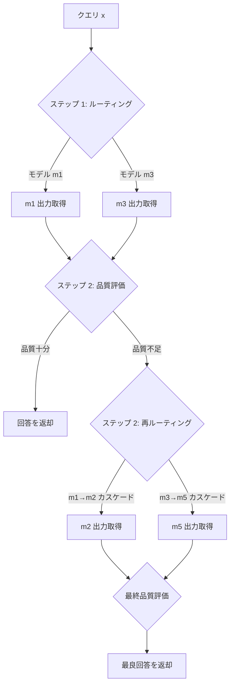

本記事は [A Unified Approach to Routing and Cascading for LLMs](https://arxiv.org/abs/2410.10347)（Dekoninck, Baader, Vechev, ICLR 2025）の解説記事です。

## 論文概要（Abstract）

LLMのモデル選択戦略には、クエリに基づいて1つのモデルを選択する「ルーティング」と、小さいモデルから順に試行して満足な回答が得られるまで大きなモデルに切り替える「カスケード」の2つのパラダイムがある。著者らは両方の最適戦略を理論的に導出した上で、それらを統合した「Cascade Routing」フレームワークを提案している。SWE-Benchで既存手法に対して最大14%の改善を報告している。

この記事は [Zenn記事: Portkey Gateway 2.0でLLMアプリの信頼性を設計する](https://zenn.dev/0h_n0/articles/babea176772c33) の深掘りです。Portkey Gatewayのフォールバック戦略（カスケード的動作）と負荷分散戦略（ルーティング的動作）の理論的基盤を理解するために、Cascade Routingの技術的詳細を解説します。

## 情報源

- **arXiv ID**: 2410.10347
- **URL**: [https://arxiv.org/abs/2410.10347](https://arxiv.org/abs/2410.10347)
- **著者**: Jasper Dekoninck, Maximilian Baader, Martin Vechev
- **発表年**: 2024（ICLR 2025採択）
- **分野**: cs.CL

## 背景と動機（Background & Motivation）

LLMの推論コスト最適化において、ルーティング（クエリごとに最適なモデルを選ぶ）とカスケード（安いモデルから順に試す）は代表的な2つのアプローチである。しかし、従来の研究では以下の3つの限界があった。

1. **最適性の証明がない**: 既存のルーティング戦略やカスケード戦略が本当に最適かどうかの理論的保証がない
2. **適用条件が不明**: どのような状況でルーティングが有利で、どのような状況でカスケードが有利かの分析がない
3. **統合の欠如**: 両パラダイムを組み合わせるフレームワークが存在しない

著者らはこれらの課題に対して、数学的な最適性証明を伴う統合フレームワークを提案している。

## 主要な貢献（Key Contributions）

- **貢献1**: ルーティングの最適戦略の証明（Theorem 1）
- **貢献2**: カスケードの新たな最適戦略の導出（Theorem 2）
- **貢献3**: 両者を統合するCascade Routingフレームワークの提案（Theorem 3）
- **貢献4**: 品質推定器（Quality Estimator）がルーティング成功の鍵であることの理論的・実証的分析

## 技術的詳細（Technical Details）

### ルーティングの最適戦略

$n$ 個のモデル $\{m_1, \ldots, m_n\}$ に対して、クエリ $x$ のルーティング戦略 $s$ は確率分布として定式化される: $s_i(x)$ はモデル $m_i$ にルーティングされる確率。

最適化問題は以下の通りである。

$$
\max_{s} \mathbb{E}_{x \in \mathcal{X}} \left[ \sum_i s_i(x) \cdot \hat{q}_i(x) \right] \quad \text{s.t.} \quad \mathbb{E}_{x \in \mathcal{X}} \left[ \sum_i s_i(x) \cdot \hat{c}_i(x) \right] \leq B
$$

ここで、
- $\hat{q}_i(x)$: モデル $m_i$ のクエリ $x$ に対する品質推定値
- $\hat{c}_i(x)$: モデル $m_i$ のクエリ $x$ に対するコスト推定値
- $B$: 予算制約

**Theorem 1（最適ルーティング戦略）**: コスト・品質トレードオフ指標 $\tau_i(x, \lambda)$ を定義する:

$$
\tau_i(x, \lambda) = \hat{q}_i(x) - \lambda \hat{c}_i(x)
$$

最適戦略は、$\tau_i(x, \lambda)$ を最大化するモデルを選択する。ラグランジュ乗数 $\lambda$ は予算制約 $B$ に対応する。

### カスケードの最適戦略

カスケードでは、モデルを順番に呼び出し、品質が十分と判定されたら停止する。著者らは「スーパーモデル」の概念を導入する。スーパーモデル $M_{1:i}$ はモデル列 $(m_1, \ldots, m_i)$ を表し、最良の回答を採用する。

$$
\tilde{q}_{1:i}^{(j)}(x) = \mathbb{E}\left[\max\left(\hat{q}_1^{(j)}(x), \ldots, \hat{q}_i^{(j)}(x)\right)\right]
$$

**Theorem 2（最適カスケード戦略）**: カスケードの各ステップ $j$ で、ルーティングと同様のトレードオフ指標を使って最適な継続/停止判定を行う。ただし、各ステップごとに異なるラグランジュ乗数 $\lambda_j$ が必要となる。

著者らの重要な知見として、カスケードはルーティングと比較して**事後品質推定**（モデル出力を見た後の品質判定）が事前推定を大幅に上回る場合にのみ有利であることが示されている。

### Cascade Routing（統合フレームワーク）

**Theorem 3（最適Cascade Routing戦略）**: 標準的なカスケードは逐次的にモデルを追加するだけだが、Cascade Routingでは各ステップで**全ての互換スーパーモデル**に対してルーティングを行う。



標準カスケードとの違いは以下の通り。

| 特性 | 標準カスケード | Cascade Routing |
|------|-------------|-----------------|
| モデル順序 | 固定（安→高） | 動的（ルーティング） |
| 各ステップの選択肢 | 次のモデルのみ | 全互換スーパーモデル |
| 品質推定の利用 | 事後のみ | 事前 + 事後 |

### 負のマージナルゲイン枝刈り

スーパーモデルの組み合わせが指数的に増加する問題に対して、**負のマージナルゲイン枝刈り**を適用する。モデル $m$ がスーパーモデル $M$ の品質・コストトレードオフを悪化させる場合、$m$ を含む全てのスーパーモデルを枝刈りする。

$$
\text{if } \tau_M(x, \lambda) - \tau_{M \setminus \{m\}}(x, \lambda) < 0 \implies \text{prune all supermodels containing } M
$$

## 実装のポイント（Implementation）

- **品質推定器の重要性**: 著者らは「ルーティングが適しているケースでも、品質推定が不正確であれば戦略は失敗する」と強調している。事前品質推定（モデル出力前の予測）の精度がルーティング性能を決定する
- **ノイズ耐性**: Cascade Routingは事前・事後両方の品質推定ノイズに対してロバストである。カスケード単独は事後推定ノイズに、ルーティング単独は事前推定ノイズに弱い
- **計算コスト**: 負のマージナルゲイン枝刈りにより、ルーティング判定自体の計算コストは無視できるレベルに抑えられると報告されている（Appendix F）

## 実験結果（Results）

### RouterBench（論文Table 1より）

5モデル構成、中ノイズ条件でのAUC（Area Under Curve）:

| 戦略 | AUC |
|------|-----|
| 線形補間（ベースライン） | 69.22% |
| ルーティング（最適） | 74.43% |
| カスケード（従来） | 73.03% |
| カスケード（著者ら提案） | 75.17% |
| **Cascade Routing** | **76.31%** |

Cascade Routingはベースラインに対して7.09ポイントの改善を達成しており、これは13-80%の相対的改善に相当すると著者らは報告している。

### 実世界ベンチマーク（論文Table 2より）

| ベンチマーク | ルーティング | カスケード（従来） | カスケード（提案） | Cascade Routing |
|------------|-----------|----------------|----------------|-----------------|
| SWE-Bench (10モデル) | 40.47% | 38.52% | 53.20% | **54.12%** |
| Math+Code (5モデル) | 39.40% | 45.89% | 50.94% | **51.09%** |

SWE-Benchではベースラインに対して最大14%の改善を達成。著者らによると、従来のカスケードが失敗する原因は、バイナリフィードバック（正解/不正解）が極端な閾値を生成するためである。

### 品質推定ノイズの影響（論文Figure 2より）

- 事前推定ノイズ（$\sigma_{\text{ante}}$）が高い場合: ルーティングの性能が大幅に劣化するが、カスケードは影響を受けにくい
- 事後推定ノイズ（$\sigma_{\text{post}}$）が高い場合: カスケードの性能が劣化するが、ルーティングは影響を受けにくい
- Cascade Routingは両方のノイズに対してロバスト: カスケード単独に対して最大8%、ルーティング単独に対して最大12%の改善

## 実運用への応用（Practical Applications）

Cascade Routingの理論は、Portkey Gatewayのフォールバック+負荷分散ネスト構成と直接対応する。

- **Portkeyのフォールバック = カスケード**: Portkeyの`fallback`戦略はプライマリモデルが失敗したらセカンダリに切り替える。これはカスケードの特殊ケース（品質推定 = 成功/失敗のバイナリ）である
- **Portkeyの負荷分散 = ルーティング**: Portkeyの`loadbalance`戦略は重み付きでモデルを選択する。これはルーティングの一形態である
- **ネスト構成 = Cascade Routing**: Portkeyのフォールバック+負荷分散のネスト構成は、Cascade Routingの実用的な近似実装と見なせる。まずルーティング（負荷分散）でモデルを選び、失敗したらカスケード（フォールバック）する
- **品質推定の実装**: Portkeyの`on_status_codes`は品質推定の簡易版（HTTPステータスコードによるバイナリ判定）であり、より精度の高い品質推定器を組み込むことでCascade Routingの理論的最適解に近づけられる

## Production Deployment Guide

### AWS実装パターン（コスト最適化重視）

Cascade Routingのロジックをプロダクション環境で実装する場合の構成を示す。ルーティング判定・品質推定・カスケード制御を1つのサービスとして実装する。

| 規模 | 月間リクエスト | 推奨構成 | 月額コスト目安 | 主要サービス |
|------|--------------|---------|-------------|------------|
| **Small** | ~3,000 (100/日) | Serverless | $50-150 | Lambda + Bedrock + Step Functions |
| **Medium** | ~30,000 (1,000/日) | Hybrid | $400-1,000 | ECS Fargate + Bedrock + ElastiCache |
| **Large** | 300,000+ (10,000/日) | Container | $2,500-6,000 | EKS + Bedrock + Karpenter |

**Small構成の詳細**（月額$50-150）:
- Lambda: ルーティング判定 + 品質推定（$15/月）
- Bedrock: Claude 3.5 Haiku（弱）+ Sonnet（強）（$80/月）
- Step Functions: カスケードフロー制御（$5/月）
- DynamoDB: 品質推定キャッシュ（$5/月）

AWS Step Functionsを使うことで、カスケードの逐次呼び出しフロー（モデルA → 品質評価 → 不十分なら モデルB → ...）をステートマシンとして宣言的に定義できる。これはCascade Routingの「各ステップでルーティング判定を行う」設計と自然に対応する。

**コスト削減テクニック**:
- 品質推定器（DistilBERT等）はLambda上でCPU推論（GPU不要）
- Bedrock Batch APIで非リアルタイム処理を50%割引
- カスケード深度制限: 最大2ステップでタイムアウト（過剰コスト防止）
- 品質推定キャッシュ: 同一クエリパターンの再判定を回避

**コスト試算の注意事項**: 上記は2026年3月時点のAWS ap-northeast-1リージョン料金に基づく概算値です。最新料金は[AWS料金計算ツール](https://calculator.aws/)で確認してください。

### Terraformインフラコード

```hcl
# --- Step Functions: カスケードフロー ---
resource "aws_sfn_state_machine" "cascade_router" {
  name     = "cascade-routing-flow"
  role_arn = aws_iam_role.sfn_role.arn

  definition = jsonencode({
    StartAt = "RouteQuery"
    States = {
      RouteQuery = {
        Type     = "Task"
        Resource = aws_lambda_function.router.arn
        Next     = "EvaluateQuality"
      }
      EvaluateQuality = {
        Type = "Choice"
        Choices = [{
          Variable          = "$.quality_score"
          NumericGreaterThan = 0.8
          Next              = "ReturnResponse"
        }]
        Default = "CascadeToStrongerModel"
      }
      CascadeToStrongerModel = {
        Type     = "Task"
        Resource = aws_lambda_function.cascade_step.arn
        Next     = "ReturnResponse"
      }
      ReturnResponse = {
        Type = "Succeed"
      }
    }
  })
}

# --- Lambda: ルーティング判定 ---
resource "aws_lambda_function" "router" {
  filename      = "cascade_router.zip"
  function_name = "cascade-routing-judge"
  role          = aws_iam_role.lambda_role.arn
  handler       = "router.handler"
  runtime       = "python3.12"
  timeout       = 30
  memory_size   = 512

  environment {
    variables = {
      WEAK_MODEL   = "anthropic.claude-3-5-haiku-20241022-v1:0"
      STRONG_MODEL = "anthropic.claude-3-5-sonnet-20241022-v2:0"
      QUALITY_THRESHOLD = "0.8"
    }
  }
}

# --- Lambda: カスケードステップ ---
resource "aws_lambda_function" "cascade_step" {
  filename      = "cascade_step.zip"
  function_name = "cascade-routing-step"
  role          = aws_iam_role.lambda_role.arn
  handler       = "cascade.handler"
  runtime       = "python3.12"
  timeout       = 60
  memory_size   = 1024
}
```

### コスト最適化チェックリスト

- [ ] 品質推定器: CPU推論（Lambda上でDistilBERT実行）
- [ ] カスケード深度: 最大2ステップに制限（コスト爆発防止）
- [ ] 弱いモデル優先: 70%以上のリクエストをHaikuで処理
- [ ] 品質推定キャッシュ: DynamoDB TTL 1時間
- [ ] Step Functions: Express Workflowsで低レイテンシ・低コスト
- [ ] AWS Budgets: 月額予算（80%/100%でアラート）
- [ ] カスケードタイムアウト: 全ステップ合計で30秒以内

## 関連研究（Related Work）

- **RouteLLM**（Ong et al., ICLR 2025）: 選好データベースのルーティング。Cascade Routingはルーティングを一般化したフレームワークであり、RouteLLMのルーターをCascade Routing内の品質推定器として利用可能
- **FrugalGPT**（Chen et al., 2023）: LLMカスケードの先駆的研究。Cascade Routingの理論的分析により、FrugalGPTの閾値ベースカスケードが最適でない条件が明らかにされた
- **Hybrid LLM**（Ding et al., 2024）: 2モデル間のルーティング。Cascade Routingは任意の数のモデルに対する最適戦略を提供する点で一般化

## まとめと今後の展望

Cascade Routingは、LLMのルーティングとカスケードを理論的に統合した初のフレームワークであり、両パラダイムの最適戦略の証明を伴っている。SWE-Benchで最大14%の改善が報告されており、品質推定器の精度がシステム全体の性能を決定するという重要な知見を提供している。Portkey Gatewayのフォールバック+負荷分散のネスト構成は、Cascade Routingの実用的な近似であり、品質推定の高度化によりさらなる改善が期待できる。

## 参考文献

- **arXiv**: [https://arxiv.org/abs/2410.10347](https://arxiv.org/abs/2410.10347)
- **OpenReview**: [https://openreview.net/forum?id=AAl89VNNy1](https://openreview.net/forum?id=AAl89VNNy1)
- **Related Zenn article**: [https://zenn.dev/0h_n0/articles/babea176772c33](https://zenn.dev/0h_n0/articles/babea176772c33)
