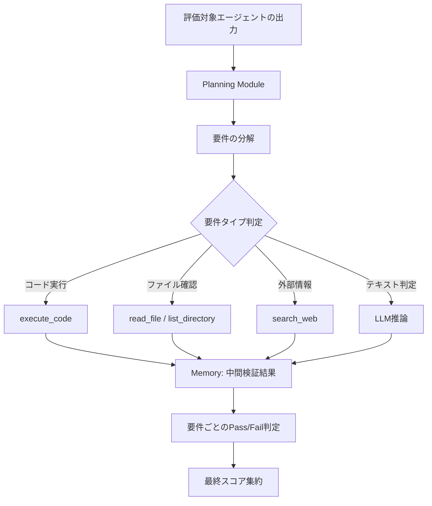
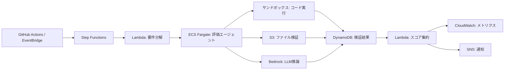

本記事は [Agent-as-a-Judge: Evaluate Agents with Agents](https://arxiv.org/abs/2410.10934) の解説記事です。

Mingchen Zhuge らが提案した本論文は、ICML 2025 に採択されている。LLM-as-a-Judge の限界を体系的に分析し、ツール使用・マルチステップ推論・メモリを備えた評価エージェントによる新しい評価パラダイム「Agent-as-a-Judge」を提案している。本記事では、その技術的詳細と実装上のポイントを整理する。

## 1. 論文概要

- **タイトル**: Agent-as-a-Judge: Evaluate Agents with Agents
- **著者**: Mingchen Zhuge, Changsheng Zhao, Dylan Ashley, Linyi Yang, Dmitrii Khizbullin, Yuhui Song, Frank Hutter, Juergen Schmidhuber
- **会議**: ICML 2025
- **arXiv**: [2410.10934](https://arxiv.org/abs/2410.10934)

著者らは、LLMベースの自動評価（LLM-as-a-Judge）がエージェントタスクの評価において根本的な制約を抱えていることを指摘している。具体的には、コード実行やファイル生成を伴うタスクの成否を、テキスト推論のみで判定することの限界である。この問題に対し、評価者自身をツール使用可能なエージェントとして構成する Agent-as-a-Judge を提案し、人間との一致率を大幅に改善したと報告している。

## 2. 背景と動機

### LLM-as-a-Judge の限界

LLM-as-a-Judge は、LLM の出力品質を別の LLM に評価させるアプローチとして広く用いられている（Zheng et al., 2023）。テキスト生成やQAタスクでは一定の有効性が確認されているが、著者らはエージェントタスクの評価において以下の根本的な問題があると分析している。

**1. コード実行の検証不能**

LLM-as-a-Judge はコードを「読む」ことはできるが「実行する」ことはできない。著者らの分析によれば、LLM-as-a-Judge は実際にはエラーで停止するコードに対して「正常に動作する」と誤判定する事例が多数観測されている。

**2. ファイル生成の確認不能**

エージェントがファイルを出力するタスク（モデルの重みファイル、可視化画像など）について、LLM-as-a-Judge はファイルの存在や内容を物理的に確認できない。結果として、エージェントの軌跡（trajectory）中の自己申告に依存した判定になりやすい。

**3. 長い軌跡のコンテキスト制限**

エージェントの実行軌跡は数千から数万トークンに及ぶことがある。LLM-as-a-Judge は単一推論で全体を処理する必要があるため、コンテキストウィンドウの制約や「Lost in the Middle」問題（Liu et al., 2023）の影響を受ける。

**4. 中間ステップの評価困難**

エージェントタスクでは、最終出力だけでなく中間ステップの妥当性も重要である。しかし、LLM-as-a-Judge は一括処理のため、個々のステップに対する詳細な検証が困難である。

### 評価手法の発展

著者らは、自動評価手法の発展を以下の3段階で整理している。

1. **Human-as-a-Judge**: 人間が直接評価。高精度だがスケーラビリティに制約がある
2. **LLM-as-a-Judge**: LLM による単一推論での評価。スケーラブルだがツール使用不可
3. **Agent-as-a-Judge**: 評価エージェントによるマルチステップ評価。ツール使用により実行検証が可能

## 3. 主要な貢献

著者らは本論文の貢献を以下の3点にまとめている。

1. **Agent-as-a-Judge フレームワークの提案**: ツール使用、マルチステップ推論、メモリを備えた評価エージェントの設計
2. **DevAI ベンチマークの構築**: 55のAI開発タスクと265の要件からなる、3階層構造の評価ベンチマーク
3. **体系的な比較実験**: LLM-as-a-Judge と Agent-as-a-Judge の評価精度を人間評価との一致率で定量比較

## 4. 技術的詳細

### 4.1 Agent-as-a-Judge アーキテクチャ

Agent-as-a-Judge の中核は、評価タスクを複数のサブステップに分解し、各ステップでツールを活用して検証を行う点にある。以下に全体アーキテクチャを示す。



#### Planning Module

評価対象の要件リストを受け取り、各要件に対する検証計画を生成する。要件の種類（コード実行確認、ファイル存在確認、出力値の妥当性確認など）に応じて、使用するツールと検証手順を決定する。

#### ツールセット

著者らが Agent-as-a-Judge に付与したツールは以下の4種類である。

| ツール名 | 機能 | 使用場面 |
|----------|------|----------|
| `execute_code` | Python/シェルコードの実行 | コードの動作確認、出力値の検証 |
| `read_file` | ファイル内容の読み取り | 生成ファイルの確認、設定ファイルの検証 |
| `list_directory` | ディレクトリ構造の取得 | 期待されるファイルの存在確認 |
| `search_web` | Web検索 | 外部リソースの参照確認 |

#### Memory

各要件の検証結果を逐次保存し、後続の検証ステップで参照可能にする。これにより、要件間の依存関係（例: 「データ前処理が正しく完了していること」が前提の「モデル学習が成功すること」）を追跡できる。

#### マルチステップ推論

Chain-of-Thought（CoT）構造を基盤とし、各検証ステップで以下のサイクルを繰り返す。

1. **観察（Observe）**: 現在の検証対象と利用可能な情報を確認
2. **計画（Plan）**: どのツールをどのように使うか決定
3. **実行（Act）**: ツールを実行し結果を取得
4. **判断（Judge）**: 結果に基づき要件の充足を判定

### 4.2 DevAI ベンチマーク

著者らは Agent-as-a-Judge の評価のために、DevAI（Development AI）ベンチマークを新たに構築している。

#### タスク設計

DevAI は55のAI開発タスクから構成される。各タスクは実際のAI開発プロジェクト（画像分類、テキスト生成、強化学習など）を模しており、データ準備からモデル学習、評価、レポート生成までの一連の工程を含む。

#### 3階層の要件構造

265の要件が以下の3つのレベルに分類されている。

| レベル | 説明 | 例 | 配点 |
|--------|------|-----|------|
| **Hard Requirements** | 必須要件。未達成でタスク失敗 | 「学習スクリプトがエラーなく完了すること」 | 必須 |
| **Soft Requirements** | 推奨要件。品質に影響 | 「学習曲線の可視化を含むこと」 | 加点 |
| **Bonus Requirements** | 追加要件。高度な実装 | 「ハイパーパラメータの自動チューニングを実装すること」 | ボーナス |

この階層構造により、エージェントの能力を段階的に評価できる設計になっている。著者らは、単純な二値（成功/失敗）判定では捉えきれない「部分的な達成度」を測定するためにこの設計を採用したと述べている。

#### スコアリング

タスク $i$ のスコアは以下のように計算される。

$$
S_i = \frac{\sum_{j \in \text{Hard}} w_j \cdot r_{ij} + \sum_{k \in \text{Soft}} w_k \cdot r_{ik} + \sum_{l \in \text{Bonus}} w_l \cdot r_{il}}{\sum_{j \in \text{Hard}} w_j + \sum_{k \in \text{Soft}} w_k + \sum_{l \in \text{Bonus}} w_l}
$$

ここで $r_{ij} \in \{0, 1\}$ は要件 $j$ の充足判定、$w_j$ は要件の重みである。Hard Requirements の重みは Soft/Bonus より大きく設定されている。

### 4.3 LLM-as-a-Judge との比較

以下に両手法の構造的差異をまとめる。

| 観点 | LLM-as-a-Judge | Agent-as-a-Judge |
|------|----------------|------------------|
| 評価ステップ数 | 1（単一推論） | 複数（動的） |
| ツール使用 | 不可 | 可（コード実行、ファイルI/O） |
| 中間ステップの評価 | 困難 | 可能 |
| 長い軌跡の処理 | コンテキスト制限の影響大 | ステップごとの処理で回避 |
| 人間との一致率（Cohen's $\kappa$） | 約0.25 | 約0.56 |
| 人間同士の $\kappa$ | 約0.72 | 約0.72 |
| 計算コスト | 低 | 高 |

Cohen's $\kappa$ は評価者間の一致度を測る指標で、偶然の一致を補正した値である。著者らの実験では、LLM-as-a-Judge の $\kappa \approx 0.25$ は「fair agreement（弱い一致）」にとどまるのに対し、Agent-as-a-Judge の $\kappa \approx 0.56$ は「moderate agreement（中程度の一致）」に到達していると報告されている。

## 5. 実装のポイント

### 5.1 評価エージェントのプロンプト設計

著者らの設計では、評価エージェントのプロンプトは以下の要素で構成される。

1. **システムプロンプト**: 評価者としての役割定義、客観的判定の指示
2. **タスク記述**: 評価対象タスクの仕様
3. **要件リスト**: 3階層の要件と各要件の判定基準
4. **エージェント軌跡**: 評価対象エージェントの実行ログ
5. **ツール定義**: 使用可能なツールのスキーマ

特に重要な点として、著者らはプロンプト中で「実際にコードを実行して確認すること」を明示的に指示している。これにより、評価エージェントがテキスト推論のみに頼る傾向を抑制している。

### 5.2 軌跡の処理

エージェントの実行軌跡が長大になる場合の処理として、著者らは以下の方針を採用している。

- **要件単位での分割処理**: 全軌跡を一度に処理するのではなく、各要件に関連する部分を抽出して個別に検証する
- **重要部分の優先**: コード実行結果、エラーメッセージ、ファイル出力に関する部分を優先的に検証する
- **メモリによる文脈維持**: 前の検証ステップの結果をメモリに保存し、後続ステップで参照する

### 5.3 スコアリングメカニズム

各要件の判定は以下の3値で行われる。

- **Pass (1)**: 要件を充足
- **Fail (0)**: 要件を不充足
- **Uncertain**: 判定不能（ツール実行でもエラーが発生した場合など）

Uncertain の場合は、追加のツール呼び出しによる再検証を試みる。それでも判定不能な場合は Fail として扱う。この保守的な方針は、偽陽性（実際には要件を満たしていないのに Pass と判定）を抑制するためと著者らは説明している。

## 6. 本番デプロイガイド

Agent-as-a-Judge を本番環境の評価パイプラインに組み込む際の設計パターンを以下に整理する。ここではAWS上での構成を前提とする。

### 6.1 アーキテクチャ全体像

Agent-as-a-Judge をCI/CDパイプラインや定期バッチとして運用する場合、以下の構成が考えられる。



#### 実行環境の分離

評価エージェントがコード実行ツールを使う際、セキュリティ上の観点から実行環境を分離する必要がある。以下のTerraform構成例は、ECS Fargate上にサンドボックスコンテナを構築するものである。

```hcl
# サンドボックス実行用のECSタスク定義
resource "aws_ecs_task_definition" "agent_judge_sandbox" {
  family                   = "agent-judge-sandbox"
  requires_compatibilities = ["FARGATE"]
  network_mode             = "awsvpc"
  cpu                      = 2048
  memory                   = 4096

  container_definitions = jsonencode([
    {
      name  = "sandbox"
      image = "${aws_ecr_repository.sandbox.repository_url}:latest"
      linuxParameters = {
        readonlyRootFilesystem = true
        capabilities = {
          drop = ["ALL"]
        }
      }
      logConfiguration = {
        logDriver = "awslogs"
        options = {
          "awslogs-group"         = "/ecs/agent-judge-sandbox"
          "awslogs-region"        = var.region
          "awslogs-stream-prefix" = "sandbox"
        }
      }
    }
  ])
}

# VPCエンドポイント（インターネットアクセス制限）
resource "aws_vpc_endpoint" "s3" {
  vpc_id       = aws_vpc.main.id
  service_name = "com.amazonaws.${var.region}.s3"
}
```

この構成では、サンドボックスコンテナはルートファイルシステムを読み取り専用にし、Linuxケーパビリティをすべてドロップすることで、評価対象コードによる環境への影響を最小限に抑えている。

### 6.2 Step Functionsによるオーケストレーション

Agent-as-a-Judge の評価フローは複数のステップに分かれるため、AWS Step Functions でワークフローを管理する。

```hcl
resource "aws_sfn_state_machine" "agent_judge_pipeline" {
  name     = "agent-judge-evaluation"
  role_arn = aws_iam_role.sfn_role.arn

  definition = jsonencode({
    StartAt = "DecomposeRequirements"
    States = {
      DecomposeRequirements = {
        Type     = "Task"
        Resource = aws_lambda_function.decompose.arn
        Next     = "EvaluateRequirements"
      }
      EvaluateRequirements = {
        Type = "Map"
        ItemsPath = "$.requirements"
        MaxConcurrency = 5
        Iterator = {
          StartAt = "VerifyRequirement"
          States = {
            VerifyRequirement = {
              Type     = "Task"
              Resource = "arn:aws:states:::ecs:runTask.sync"
              Parameters = {
                Cluster        = aws_ecs_cluster.main.arn
                TaskDefinition = aws_ecs_task_definition.agent_judge_sandbox.arn
                LaunchType     = "FARGATE"
              }
              Retry = [
                {
                  ErrorEquals     = ["States.TaskFailed"]
                  IntervalSeconds = 30
                  MaxAttempts     = 2
                  BackoffRate     = 2.0
                }
              ]
              End = true
            }
          }
        }
        Next = "AggregateScores"
      }
      AggregateScores = {
        Type     = "Task"
        Resource = aws_lambda_function.aggregate.arn
        Next     = "NotifyResults"
      }
      NotifyResults = {
        Type     = "Task"
        Resource = "arn:aws:states:::sns:publish"
        Parameters = {
          TopicArn = aws_sns_topic.evaluation_results.arn
          "Message.$" = "$.summary"
        }
        End = true
      }
    }
  })
}
```

要件ごとの評価を `Map` ステートで並列実行し、`MaxConcurrency` でサンドボックスの同時起動数を制限している。`Retry` 設定により、一時的な障害（コンテナ起動失敗など）からの自動復旧を実現する。

### 6.3 モニタリングとアラート

評価パイプラインの健全性を監視するために、以下のメトリクスを CloudWatch に送信する。

```hcl
resource "aws_cloudwatch_metric_alarm" "judge_accuracy_drift" {
  alarm_name          = "agent-judge-accuracy-drift"
  comparison_operator = "LessThanThreshold"
  evaluation_periods  = 3
  metric_name         = "HumanAgreementRate"
  namespace           = "AgentJudge"
  period              = 86400
  statistic           = "Average"
  threshold           = 0.45
  alarm_description   = "Agent-as-a-Judge の人間一致率が閾値を下回った"
  alarm_actions       = [aws_sns_topic.evaluation_alerts.arn]
}

resource "aws_cloudwatch_metric_alarm" "sandbox_timeout" {
  alarm_name          = "sandbox-execution-timeout"
  comparison_operator = "GreaterThanThreshold"
  evaluation_periods  = 1
  metric_name         = "SandboxTimeoutCount"
  namespace           = "AgentJudge"
  period              = 3600
  statistic           = "Sum"
  threshold           = 10
  alarm_description   = "サンドボックス実行タイムアウトが閾値を超過"
  alarm_actions       = [aws_sns_topic.evaluation_alerts.arn]
}
```

監視すべき主要メトリクスは以下の通りである。

| メトリクス | 目的 | 閾値例 |
|-----------|------|--------|
| `HumanAgreementRate` | 人間評価との一致率推移 | < 0.45 で警告 |
| `SandboxTimeoutCount` | サンドボックス実行タイムアウト数 | 1時間10回超で警告 |
| `EvaluationLatencyP99` | 評価完了までのレイテンシ | > 600秒で警告 |
| `RequirementUncertainRate` | Uncertain 判定の割合 | > 20% で警告 |
| `LLMTokenUsage` | LLM API トークン消費量 | 予算超過で警告 |

### 6.4 コスト最適化

Agent-as-a-Judge は LLM-as-a-Judge と比較して計算コストが高い。著者らもこの点を課題として言及している。運用時のコスト最適化として、以下の方針が有効である。

- **要件の重要度による段階的評価**: Hard Requirements のみ先に評価し、全て Pass なら Soft/Bonus を評価する。Hard で Fail が検出された時点で早期終了することで不要な評価を削減する
- **キャッシュの活用**: 同一コードスニペットの実行結果をキャッシュし、同じ検証の重複実行を避ける
- **軽量モデルの併用**: テキストベースの判定には軽量モデル（Claude Haiku 等）を使い、コード実行を伴う判定にのみ高性能モデルを割り当てる

## 7. 実験結果

### 7.1 人間評価との一致率

著者らは DevAI ベンチマーク上で、複数の評価手法について人間評価との一致率（Cohen's $\kappa$）を測定している。

主要な結果として、以下が報告されている。

- **LLM-as-a-Judge（GPT-4系）**: $\kappa \approx 0.25$（fair agreement）
- **Agent-as-a-Judge**: $\kappa \approx 0.56$（moderate agreement）
- **Human-Human**: $\kappa \approx 0.72$（substantial agreement）

Agent-as-a-Judge は LLM-as-a-Judge に対して $\kappa$ を約2倍に改善している。ただし、人間同士の一致率（0.72）との間にはまだ差があり、完全な代替には至っていないと著者らは指摘している。

### 7.2 LLM-as-a-Judge の失敗分析

著者らは LLM-as-a-Judge が特に失敗しやすいカテゴリを分析している。

**ファイル生成の検証**: エージェントが「ファイルを生成した」と軌跡中で報告している場合、LLM-as-a-Judge はその報告を鵜呑みにする傾向がある。実際にはファイルが生成されていない、または内容が不正な場合でも Pass と判定してしまう。

**コード実行可能性**: エージェントが生成したコードに構文エラーやインポートエラーが含まれていても、LLM-as-a-Judge はコードの「意図」に基づいて Pass と判定する場合がある。Agent-as-a-Judge は実際にコードを実行するため、このような偽陽性を回避できる。

**マルチステップ依存の追跡**: タスクの後半ステップが前半ステップの出力に依存する場合、LLM-as-a-Judge は依存関係の追跡が不十分になりやすい。例えば、データ前処理に失敗しているにもかかわらず、モデル学習のステップを独立して評価し Pass と判定するケースが報告されている。

### 7.3 計算コスト

著者らは Agent-as-a-Judge のコスト面の課題にも言及している。Agent-as-a-Judge は要件ごとにツール呼び出しとLLM推論を繰り返すため、LLM-as-a-Judge と比較してトークン消費量と実行時間が大幅に増加する。具体的な数値は論文中で詳述されているが、この精度-コストのトレードオフは実用上の重要な検討事項である。

## 8. 実運用への応用

### 8.1 CI/CDパイプラインへの統合

Agent-as-a-Judge はエージェント開発のCI/CDパイプラインに組み込むことで、コード変更がエージェント性能に与える影響を自動検証できる。具体的には以下のような活用が考えられる。

- **プルリクエスト時の自動評価**: エージェントのコード変更に対し、DevAI のようなベンチマークで自動テストを実行し、性能劣化を検出する
- **回帰テスト**: 定期的にAgent-as-a-Judgeを実行し、モデル更新やプロンプト変更による性能変化を追跡する

### 8.2 評価基準のカスタマイズ

DevAI の3階層構造は、独自のエージェント評価にも応用できる。組織固有のタスクに対して、Hard/Soft/Bonus の要件を定義し、Agent-as-a-Judge で自動評価する仕組みを構築できる。

### 8.3 ハイブリッド評価

コストと精度のバランスを取るために、以下のハイブリッド戦略が考えられる。

1. **一次スクリーニング**: LLM-as-a-Judge で低コストに一次評価を実施
2. **詳細検証**: 一次評価で Fail またはボーダーラインのケースに対してのみ Agent-as-a-Judge を実行
3. **サンプリング検証**: 定期的にランダムサンプルに対して Agent-as-a-Judge を実行し、LLM-as-a-Judge の精度をモニタリング

このアプローチにより、全件に Agent-as-a-Judge を適用する場合と比較してコストを抑えつつ、重要なケースでの精度を確保できる。

## 9. 関連研究

### 自動評価手法

LLM-as-a-Judge（Zheng et al., 2023）は LLM による自動評価の基盤となるアプローチである。その後、MT-Bench、AlpacaEval などのベンチマークで広く活用されている。しかし、これらは主にテキスト生成タスクを対象としており、エージェントタスクへの適用には限界がある。

### エージェントベンチマーク

SWE-bench（Jimenez et al., 2024）はソフトウェアエンジニアリングタスクのエージェント評価ベンチマークとして知られる。テストケースの通過率で評価する点で、コード実行による検証を内包している。DevAI はこれをAI開発タスクに拡張し、より詳細な要件ベースの評価を可能にしている。

### エージェント設計パターン

ReAct（Yao et al., 2023）は推論と行動を交互に行うエージェントのフレームワークであり、Agent-as-a-Judge の基盤となるマルチステップ推論の設計に影響を与えている。Reflexion（Shinn et al., 2023）は自己反省によるエージェント改善のアプローチであり、評価と改善のループという観点で関連がある。

### ToolSandbox

ToolSandbox（Lu et al., 2024）はエージェントのツール使用能力をサンドボックス環境で評価するフレームワークである。Agent-as-a-Judge がツール使用を評価プロセスに組み込んでいる点で、思想的な共通点がある。

## 10. まとめ

本論文は、LLM-as-a-Judge のエージェントタスク評価における根本的な限界を体系的に分析し、ツール使用・マルチステップ推論・メモリを備えた Agent-as-a-Judge フレームワークを提案している。DevAI ベンチマーク上での実験により、人間との一致率が LLM-as-a-Judge の約2倍に改善されたことが報告されている。

一方で、計算コストの増大は実用上の課題であり、ハイブリッド評価戦略や段階的評価によるコスト最適化が今後の重要な研究方向である。また、人間同士の一致率（$\kappa \approx 0.72$）にはまだ到達しておらず、評価エージェントの更なる精度改善も求められる。

エージェント開発の成熟に伴い、エージェントの出力品質を自動的かつ高精度に評価する仕組みの重要性は増していく。Agent-as-a-Judge は、この課題に対する有望なアプローチの一つとして位置付けられる。

## 参考文献

- Zhuge, M., Zhao, C., Ashley, D., Yang, L., Khizbullin, D., Song, Y., Hutter, F., & Schmidhuber, J. (2024). Agent-as-a-Judge: Evaluate Agents with Agents. arXiv:2410.10934. ICML 2025.
- Zheng, L., Chiang, W.-L., Sheng, Y., Zhuang, S., Wu, Z., Zhuang, Y., ... & Stoica, I. (2023). Judging LLM-as-a-Judge with MT-Bench and Chatbot Arena. NeurIPS 2023.
- Jimenez, C. E., Yang, J., Wettig, A., Yao, S., Pei, K., Press, O., & Narasimhan, K. (2024). SWE-bench: Can Language Models Resolve Real-World GitHub Issues? ICLR 2024.
- Yao, S., Zhao, J., Yu, D., Du, N., Shafran, I., Narasimhan, K., & Cao, Y. (2023). ReAct: Synergizing Reasoning and Acting in Language Models. ICLR 2023.
- Shinn, N., Cassano, F., Gopinath, A., Shakkottai, K., Labash, A., & Kass-Hout, T. (2023). Reflexion: Language Agents with Verbal Reinforcement Learning. NeurIPS 2023.
- Liu, N. F., Lin, K., Hewitt, J., Paranjape, A., Bevilacqua, M., Petroni, F., & Liang, P. (2023). Lost in the Middle: How Language Models Use Long Contexts. TACL 2024.
- Lu, Y., Li, J., Li, Y., Liu, T., & Zhao, T. (2024). ToolSandbox: A Stateful, Conversational, Interactive Evaluation Framework for LLM Tool Use Capabilities. arXiv:2408.04682.
