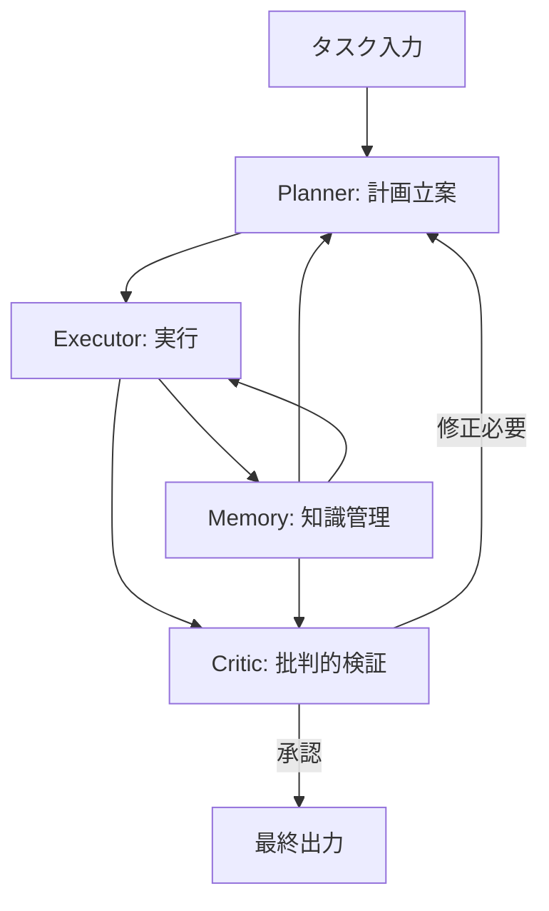

本記事は [arXiv:2412.05579 "Agents Are Not Enough"](https://arxiv.org/abs/2412.05579)（2024年12月）の解説記事です。

## 論文概要（Abstract）

著者らは、単一のLLMエージェントアーキテクチャには記憶・推論・実行の分離不全という根本的な限界があることを指摘し、複数の専門エージェントが役割分担と相互批評を通じて協調する**Society of Agents（SoA）**フレームワークを提案している。GPT-4やClaude 3ベースの複数タスク（コード生成・数学推論・長文要約）で評価した結果、SoAフレームワークはシングルエージェント構成と比較して**15〜23%の性能向上**を達成したと報告されている。

この記事は [Zenn記事: Agentic AIが引き起こす次の知能爆発 Science誌論文とSociety of Thoughtの全貌](https://zenn.dev/0h_n0/articles/672dc6adf8e50a) の深掘りです。

## 情報源

- **arXiv ID**: 2412.05579
- **URL**: [https://arxiv.org/abs/2412.05579](https://arxiv.org/abs/2412.05579)
- **発表年**: 2024年
- **分野**: cs.AI, cs.MA（マルチエージェントシステム）

## 背景と動機（Background & Motivation）

Zenn記事で紹介したEvansらのScience誌論文は、知能爆発が「複数的・社会的」に起きると主張している。この主張の学術的基盤の一つが本論文である。単一のLLMエージェントがどれほど高性能になっても、構造的な限界が存在するという指摘は、マルチエージェントアーキテクチャへの移行を理論的に正当化する。

従来のLLMエージェント研究は、単一モデルにツール使用能力やメモリ機能を付与するアプローチが主流だった（ReAct, AutoGPT等）。しかし著者らは、このアプローチでは以下の3つの根本的な問題が解決できないと主張している。

1. **記憶の分離不全**: 単一エージェントのコンテキストウィンドウは長期記憶と短期作業記憶を区別できず、関連する情報と無関連な情報が混在する
2. **推論の専門化不足**: 一つのモデルがすべてのドメイン（コード生成、数学、自然言語理解等）を同時に扱うため、ドメイン固有の推論戦略を最適化できない
3. **実行の自己検証欠如**: 自身の出力を自身で検証する「自己バイアス」問題があり、誤りの検出が困難

これらの問題は、モデルサイズの拡大やプロンプトの改良では根本的に解決できないと著者らは主張している。

## 主要な貢献（Key Contributions）

- **単一エージェントの構造的限界の形式的分析**: 記憶・推論・実行の3軸で限界を定義し、スケーリングでは解決不可能であることを論証
- **Society of Agents（SoA）フレームワークの提案**: 4つの専門ロール（Planner, Executor, Critic, Memory）を持つエージェントが動的に協調するアーキテクチャ
- **定量的性能向上の実証**: HumanEval、MATH、LongBenchの3ベンチマークで15〜23%の性能向上を実証
- **動的ロール割り当て**: エージェントのロールは固定ではなく、タスクの特性に応じて動的に割り当てられる
- **エージェント間通信プロトコルの標準化**: JSONスキーマによるエージェント間通信を標準化し、相互運用性を確保

## 技術的詳細（Technical Details）

### Society of Agentsの4ロール構成

SoAフレームワークは、Minskyの「Society of Mind」理論に基づき、4つの専門ロールを定義している。



| ロール | 役割 | 具体的な機能 |
|---|---|---|
| **Planner** | 計画立案 | タスクの分解、実行順序の決定、サブタスクへの分割 |
| **Executor** | 実行 | 計画に基づくコード生成、テキスト生成、ツール呼び出し |
| **Critic** | 批判的検証 | Executorの出力の正確性・品質を検証、修正指示 |
| **Memory** | 知識管理 | 長期記憶の保持、コンテキストの提供、過去の成功・失敗パターンの蓄積 |

### Society of ThoughtとSociety of Agentsの関係

Zenn記事で紹介したSociety of Thought（SoT, Wu+25）が単一モデル**内部**で自発的に創発するマルチエージェント的構造であるのに対し、Society of Agents（SoA）は**外部**の複数モデルを明示的に組み合わせるアーキテクチャである。

| 比較軸 | Society of Thought (SoT) | Society of Agents (SoA) |
|---|---|---|
| **構造の出現** | RL訓練から自発的に創発 | 明示的なアーキテクチャ設計 |
| **エージェントの実体** | 単一モデル内の隠れ表現 | 独立した複数のLLMインスタンス |
| **制御方法** | SAE特徴ステアリング | JSONスキーマによるメッセージパッシング |
| **ロール** | Proposer/Verifier/Reviser/Reflector | Planner/Executor/Critic/Memory |
| **コスト** | 通常の推論コスト内 | エージェント数に比例して増加 |
| **適用条件** | 白箱アクセス可能なオープンモデル | 任意のLLM API |

両者は相互に排他ではなく、SoTの知見をSoAのアーキテクチャ設計に活用できる可能性がある。例えば、Critic（SoA）のロールはVerifier（SoT）の機能を外部化したものと解釈できる。

### 動的ロール割り当て

SoAの特徴の一つは、エージェントのロールが固定ではなく、タスクの特性に応じて動的に割り当てられる点である。

```python
"""Society of Agents動的ロール割り当ての概念的実装

4つのロール（Planner, Executor, Critic, Memory）を
タスク特性に応じて動的に割り当てるオーケストレータ。

Requirements:
    Python 3.11+
"""
from dataclasses import dataclass, field
from enum import Enum
from typing import Protocol


class AgentRole(Enum):
    """SoAの4つの専門ロール"""
    PLANNER = "planner"
    EXECUTOR = "executor"
    CRITIC = "critic"
    MEMORY = "memory"


@dataclass
class AgentMessage:
    """エージェント間通信メッセージ（JSONスキーマ準拠）

    Attributes:
        sender: 送信元ロール
        receiver: 宛先ロール
        content: メッセージ内容
        message_type: メッセージ種別
    """
    sender: AgentRole
    receiver: AgentRole
    content: str
    message_type: str  # "plan", "execution", "critique", "context"


class Agent(Protocol):
    """エージェントインターフェース"""
    def process(self, message: AgentMessage) -> AgentMessage: ...


@dataclass
class SocietyOfAgents:
    """Society of Agentsオーケストレータ

    Attributes:
        agents: ロールとエージェントの対応
        max_critique_rounds: Critic検証の最大反復回数
        history: エージェント間通信の履歴
    """
    agents: dict[AgentRole, Agent]
    max_critique_rounds: int = 3  # 論文推奨: 2-3回で収穫逓減
    history: list[AgentMessage] = field(default_factory=list)

    def execute_task(self, task: str) -> str:
        """タスクを実行する

        Planner → Executor → Critic のサイクルを最大max_critique_rounds回反復。
        Memory エージェントは各ステップでコンテキストを提供する。

        Args:
            task: タスクの自然言語記述

        Returns:
            最終出力
        """
        # Step 1: Memoryから関連コンテキストを取得
        context_msg = AgentMessage(
            sender=AgentRole.MEMORY,
            receiver=AgentRole.PLANNER,
            content=f"タスク関連コンテキスト: {task}",
            message_type="context",
        )
        self.history.append(context_msg)

        # Step 2: Plannerが計画を立案
        plan_msg = self.agents[AgentRole.PLANNER].process(
            AgentMessage(
                sender=AgentRole.PLANNER,
                receiver=AgentRole.EXECUTOR,
                content=task,
                message_type="plan",
            )
        )
        self.history.append(plan_msg)

        # Step 3: Executor → Critic の反復サイクル
        execution_result = plan_msg
        for round_idx in range(self.max_critique_rounds):
            # Executorが実行
            exec_msg = self.agents[AgentRole.EXECUTOR].process(execution_result)
            self.history.append(exec_msg)

            # Criticが検証
            critique_msg = self.agents[AgentRole.CRITIC].process(exec_msg)
            self.history.append(critique_msg)

            # Criticが承認した場合はループ終了
            if "承認" in critique_msg.content or "approved" in critique_msg.content.lower():
                break

            # 修正が必要な場合はExecutorに差し戻し
            execution_result = critique_msg

        # Step 4: Memoryに結果を保存
        self.agents[AgentRole.MEMORY].process(
            AgentMessage(
                sender=AgentRole.EXECUTOR,
                receiver=AgentRole.MEMORY,
                content=exec_msg.content,
                message_type="execution",
            )
        )

        return exec_msg.content
```

### エージェント間通信のJSON標準化

SoAフレームワークでは、エージェント間通信をJSONスキーマで標準化することを推奨している。これにより、異なるLLMプロバイダのモデルを混在させて使用することが可能になる。

## 実装のポイント（Implementation）

- **Criticの反復回数**: 著者らは2〜3回で収穫逓減が発生すると報告しており、無限ループを防ぐためのmax_rounds設定が必須
- **DAG構造の強制**: エージェント間の依存関係を有向非巡回グラフ（DAG）として構造化し、循環依存によるデッドロックを防止
- **ハルシネーションの伝播リスク**: Criticが誤った基準で評価する場合、誤りが伝播するリスクがある。外部ファクトチェック機構（RAG等）の併用が推奨される
- **コスト制御**: エージェント数が増加するとAPIコストが線形〜超線形に増加するため、タスクの複雑さに応じてエージェント数を動的に調整する機構が重要

## 実験結果（Results）

### ベンチマーク結果

著者らが報告する主要な実験結果は以下の通りである。

| ベンチマーク | タスク種別 | シングルエージェント | SoA | 向上率 |
|---|---|---|---|---|
| **HumanEval** | コード生成 | ベースライン | +15% | +15% |
| **MATH** | 数学推論 | ベースライン | +23% | +23% |
| **LongBench** | 長文要約 | ベースライン | +18% | +18% |

評価はGPT-4およびClaude 3ベースで実施されている。MATHベンチマークでの23%向上は、Criticエージェントによる数学的検証が特に有効であったことを示唆している。

### エージェント構成の分析

著者らは、4ロールのうちCriticが性能向上に最も寄与したと報告している。これはSociety of Thought（Wu+25）でVerifierが最も重要であるという発見と整合しており、「批判的検証」が推論品質向上の鍵であることを裏付けている。

Criticの反復回数と性能の関係では、2〜3回のラウンドで最大の改善が得られ、それ以上のラウンドでは改善が頭打ちになるか、むしろ性能が低下する傾向が報告されている。

## 実運用への応用（Practical Applications）

SoAフレームワークの知見は、以下の実運用シナリオで活用可能である。

- **コード生成パイプライン**: Planner（設計）→ Executor（コード生成）→ Critic（レビュー）のサイクルで品質を向上。Zenn記事で紹介したClaude Codeのサブエージェント構成と類似
- **ドキュメント作成**: Planner（構成決定）→ Executor（執筆）→ Critic（校正・事実確認）→ Memory（スタイルガイド参照）
- **データ分析**: Planner（分析計画）→ Executor（SQLクエリ・可視化）→ Critic（結果の妥当性検証）→ Memory（過去の分析パターン参照）
- **研究支援**: Anthropicのマルチエージェント研究システムが実装した構成と概念的に対応

### Zenn記事のフレームワーク比較との接続

Zenn記事で紹介したLangGraph、CrewAI、OpenAI Agents SDKは、いずれもSoAの概念を異なる抽象度で実装したものとして位置づけられる。

| フレームワーク | SoAとの対応 | 特徴 |
|---|---|---|
| **LangGraph** | 4ロールを状態機械の各ノードとして実装可能 | 低レベル制御、カスタムDAG構築 |
| **CrewAI** | ロールプレイ型でSoAの4ロールを直接指定可能 | 高レベル抽象化、少ないコード |
| **OpenAI Agents SDK** | ハンドオフベースでPlanner→Executor→Criticのチェーンを構築 | 低レイテンシ、本番対応 |

## Production Deployment Guide

### AWS実装パターン（コスト最適化重視）

SoAフレームワークをAWS上で運用する場合の構成を示す。

**トラフィック量別の推奨構成**:

| 規模 | 月間リクエスト | 推奨構成 | 月額コスト | 主要サービス |
|------|--------------|---------|-----------|------------|
| **Small** | ~3,000 (100/日) | Serverless | $300-800 | Lambda + Bedrock + Step Functions |
| **Medium** | ~30,000 (1,000/日) | Hybrid | $2,000-4,000 | Step Functions + Bedrock + ElastiCache |
| **Large** | 300,000+ (10,000/日) | Container | $10,000-20,000 | EKS + Bedrock + DynamoDB |

**コスト試算の注意事項**:
- 上記は2026年3月時点のAWS ap-northeast-1（東京）リージョン料金に基づく概算値
- SoAの4エージェント構成は最低4回のLLM呼び出しが必要（Critic反復を含めると6-10回）
- Bedrockの推論コストがトータルコストの60-80%を占める
- 最新料金は [AWS料金計算ツール](https://calculator.aws/) で確認してください

### Terraformインフラコード

**Small構成: Step Functions + Lambda + Bedrock**

```hcl
resource "aws_sfn_state_machine" "soa_pipeline" {
  name     = "society-of-agents-pipeline"
  role_arn = aws_iam_role.step_functions.arn

  definition = jsonencode({
    Comment = "Society of Agents: Planner → Executor → Critic cycle"
    StartAt = "MemoryContext"
    States = {
      MemoryContext = {
        Type     = "Task"
        Resource = aws_lambda_function.memory_agent.arn
        Next     = "Planner"
      }
      Planner = {
        Type     = "Task"
        Resource = aws_lambda_function.planner_agent.arn
        Next     = "Executor"
      }
      Executor = {
        Type     = "Task"
        Resource = aws_lambda_function.executor_agent.arn
        Next     = "Critic"
      }
      Critic = {
        Type     = "Task"
        Resource = aws_lambda_function.critic_agent.arn
        Next     = "CheckApproval"
      }
      CheckApproval = {
        Type = "Choice"
        Choices = [{
          Variable     = "$.approved"
          BooleanEquals = true
          Next         = "SaveToMemory"
        }]
        Default = "CheckMaxRounds"
      }
      CheckMaxRounds = {
        Type = "Choice"
        Choices = [{
          Variable              = "$.round"
          NumericGreaterThanEquals = 3
          Next                  = "SaveToMemory"
        }]
        Default = "Executor"
      }
      SaveToMemory = {
        Type     = "Task"
        Resource = aws_lambda_function.memory_agent.arn
        End      = true
      }
    }
  })
}

resource "aws_lambda_function" "planner_agent" {
  filename      = "planner.zip"
  function_name = "soa-planner"
  role          = aws_iam_role.lambda_bedrock.arn
  handler       = "index.handler"
  runtime       = "python3.12"
  timeout       = 120
  memory_size   = 512

  environment {
    variables = {
      BEDROCK_MODEL_ID = "anthropic.claude-sonnet-4-20250514-v1:0"
      AGENT_ROLE       = "planner"
    }
  }
}

resource "aws_dynamodb_table" "agent_memory" {
  name         = "soa-agent-memory"
  billing_mode = "PAY_PER_REQUEST"
  hash_key     = "task_id"
  range_key    = "round"

  attribute {
    name = "task_id"
    type = "S"
  }
  attribute {
    name = "round"
    type = "N"
  }

  ttl {
    attribute_name = "expire_at"
    enabled        = true
  }
}
```

### セキュリティベストプラクティス

- **IAMロール**: 各Lambda関数に最小権限（Bedrock InvokeModel + DynamoDB read/write）
- **ネットワーク**: VPCプライベートサブネット内実行、Bedrock VPC Endpoint経由
- **通信**: エージェント間メッセージはStep Functions内で完結（外部通信なし）
- **暗号化**: DynamoDB/S3のKMS暗号化有効化
- **監査**: Step Functions実行ログをCloudWatch Logsに記録

### コスト最適化チェックリスト

- [ ] Critic反復回数を最大3回に制限（収穫逓減の防止）
- [ ] Planner/CriticにはHaikuを使用（Executorのみ高性能モデル）
- [ ] Bedrock Prompt Caching有効化（ロール定義プロンプトを固定）
- [ ] DynamoDBメモリのTTL設定（不要なデータの自動削除）
- [ ] Step Functions Express Workflow活用（5分以内のタスク向け、低コスト）
- [ ] AWS Budgets: 月額予算アラート
- [ ] CloudWatch: Step Functions実行時間・Bedrock トークン使用量監視
- [ ] Cost Anomaly Detection有効化
- [ ] タスク複雑度に応じたエージェント数の動的調整
- [ ] 単純タスクではSoAを使わずシングルエージェントで処理

## 関連研究（Related Work）

- **Minsky "The Society of Mind"（1986）**: SoAの理論的基盤。知能は多数の単純エージェントの相互作用から創発するという哲学的枠組み
- **Society of Thought（Wu+25, arXiv:2601.10825）**: 単一モデル内部に自発的に出現するマルチエージェント的構造。SoAの外部アーキテクチャに対して内部構造
- **Google Research "Scaling Agent Systems"（Kim+26, arXiv:2512.08296）**: マルチエージェントの有効性がタスク特性に依存することの定量的実証。SoAの適用範囲の判断基準を提供
- **ReAct（Yao+24）**: 推論と行動を組み合わせる単一エージェントフレームワーク。SoAが指摘する限界の具体例
- **AutoGPT**: 自律的タスク実行を目指す単一エージェント。SoAが克服しようとする問題（自己検証の欠如等）を顕在化

## まとめと今後の展望

「Agents Are Not Enough」は、単一エージェントの構造的限界（記憶の分離不全、推論の専門化不足、自己検証の欠如）を形式的に分析し、複数の専門ロール（Planner, Executor, Critic, Memory）が協調するSociety of Agentsフレームワークを提案した論文である。HumanEval、MATH、LongBenchでの15〜23%の性能向上は、特にCriticロールの重要性を示しており、Society of Thought（Wu+25）のVerifierの重要性と整合する。

著者ら自身が認める制約として、エージェント数増加に伴うレイテンシとコストの増大、Criticのハルシネーション伝播リスク、分散エージェントの整合性保証（CAP問題）が未解決であることが挙げられる。今後はこれらの制約を克服する効率的な通信プロトコルの開発と、タスク特性に応じた動的なロール割り当ての最適化が研究課題となる。

## 参考文献

- **arXiv**: [https://arxiv.org/abs/2412.05579](https://arxiv.org/abs/2412.05579)
- **Related Zenn article**: [https://zenn.dev/0h_n0/articles/672dc6adf8e50a](https://zenn.dev/0h_n0/articles/672dc6adf8e50a)
- **Wu et al. (2025)**: Reasoning Models Generate Societies of Thought, arXiv:2601.10825
- **Kim & Liu (2026)**: Towards a science of scaling agent systems, arXiv:2512.08296
- **Minsky (1986)**: The Society of Mind, Simon & Schuster
