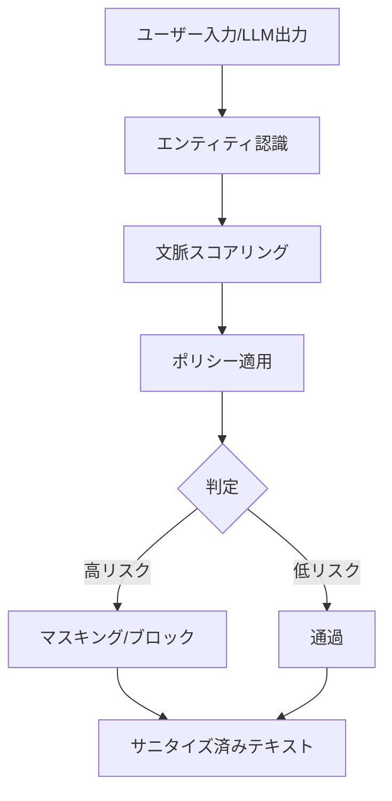

本記事は [Deploying Privacy Guardrails for LLMs: A Comparative Analysis of Real-World Applications](https://arxiv.org/abs/2501.12456)（Asthana et al., AAAI 2025 Deployable AI Workshop）の解説記事です。

## 論文概要（Abstract）

OneShield Privacy Guardは、LLMへの入出力における個人識別情報（PII）を検出・マスキングするプライバシーガードレールフレームワークである。著者らは2つの実デプロイ事例を比較分析している。第1のデプロイは30の言語モデルを管理するエンタープライズシステム（Data and Model Factory）で、26言語にわたるPII検出でF1スコア0.95を達成したと報告されている。第2のデプロイはオープンソースのPR Insights（GitHub Pull Requestの自動レビュー）で、3ヶ月間に300時間以上の手動作業を削減したとのことである。

この記事は [Zenn記事: Portkey Gateway 2.0でLLMアプリの信頼性を設計する](https://zenn.dev/0h_n0/articles/babea176772c33) の深掘りです。Portkey GatewayのPII Redaction Guardrails機能の学術的基盤として、プライバシーガードレールの設計パターンと実運用での知見を解説します。

## 情報源

- **arXiv ID**: 2501.12456
- **URL**: [https://arxiv.org/abs/2501.12456](https://arxiv.org/abs/2501.12456)
- **著者**: Shubhi Asthana, Bing Zhang, Ruchi Mahindru, Chad DeLuca, Anna Lisa Gentile, Sandeep Gopisetty
- **発表年**: 2025（AAAI 2025 Deployable AI Workshop採択）
- **分野**: cs.CR, cs.AI, cs.LG, cs.SE

## 背景と動機（Background & Motivation）

LLMの商用利用が拡大する中、ユーザーがプロンプトに含める個人情報（メールアドレス、電話番号、クレジットカード番号など）がLLMプロバイダーに送信されるリスクが顕在化している。GDPR（EU一般データ保護規則）、CCPA（カリフォルニア州消費者プライバシー法）、PIPEDA（カナダ個人情報保護法）などの規制は、個人情報の処理に厳格な要件を課しており、LLMを介した個人情報の不正な流出は法的リスクを伴う。

従来のPII検出ツール（Microsoft Presidio、StarPII等）は正規表現ベースのパターンマッチングに依存しており、文脈依存のPII（例：「田中さん」が人名か企業名かの判別）や多言語対応に限界がある。OneShield Privacy Guardは、ルールベースとMLベースの検出器を組み合わせた文脈認識型のPII検出パイプラインを提案している。

## 主要な貢献（Key Contributions）

- **貢献1**: 26言語対応の文脈認識型PII検出フレームワーク（OneShield Privacy Guard）の設計と実装
- **貢献2**: エンタープライズ規模（30モデル管理）とオープンソースプロジェクト（PR Insights）の2つの異なるデプロイ環境での比較分析
- **貢献3**: 既存ツール（StarPII、Presidio）を最大12%上回るF1スコアの達成

## 技術的詳細（Technical Details）

### OneShield Privacy Guardのアーキテクチャ

OneShield Privacy Guardは3つのコアコンポーネントで構成される。



**1. エンティティ認識（Entity Recognition）**

正規表現パターンとML分類器を組み合わせて、テキスト中のPIIエンティティを検出する。サポートされるエンティティタイプは以下の通り。

| PII種別 | 検出方法 | 対応言語数 |
|---------|---------|----------|
| 人名（Person） | ML分類器 + NER | 26 |
| 日付（Date） | 正規表現 + ML | 26 |
| メールアドレス | 正規表現 | 全言語 |
| 電話番号 | 正規表現（国別パターン） | 26 |
| 国民ID | 正規表現（国別） | 限定的 |
| クレジットカード | 正規表現 + Luhnチェック | 全言語 |
| 所在地（Location） | ML分類器 + NER | 26 |
| 銀行口座 | 正規表現（国別） | 限定的 |
| APIトークン・機密鍵 | 正規表現 | 全言語 |

**2. 文脈スコアリング（Contextual Scoring）**

検出されたエンティティの周辺文脈を評価し、感度レベルを推定する。たとえば「田中太郎が2024年に発表した論文」の「田中太郎」は著者名として低リスク、「田中太郎のクレジットカード番号は...」の「田中太郎」は高リスクと判定する。著者らによると、この文脈認識メカニズムが、エンティティ間の関係（例：名前と生年月日の組み合わせ）を正確に捕捉するために重要であるとのことである。

**3. ポリシー適用（Policy Enforcement）**

法域ごとの規制要件（GDPR、CCPA、PIPEDA）に基づいて、検出されたエンティティに対するアクション（マスキング、ブロック、通過）を動的に決定する。テンプレートベースのポリシー管理により、組織ごとのカスタマイズが可能である。

### 処理パイプラインの数式的定式化

PII検出の信頼度スコアは以下のように計算される。

$$
\text{score}(e) = w_{\text{regex}} \cdot s_{\text{regex}}(e) + w_{\text{ml}} \cdot s_{\text{ml}}(e) + w_{\text{ctx}} \cdot s_{\text{ctx}}(e)
$$

ここで、
- $e$: 検出されたエンティティ
- $s_{\text{regex}}(e)$: 正規表現マッチのスコア（0 or 1）
- $s_{\text{ml}}(e)$: ML分類器の予測確率
- $s_{\text{ctx}}(e)$: 文脈スコア（周辺テキストからの推定値）
- $w_{\text{regex}}, w_{\text{ml}}, w_{\text{ctx}}$: 各検出器の重み

閾値 $\tau$ を超えたエンティティがPIIとしてフラグされる: $\text{PII}(e) = \mathbb{1}[\text{score}(e) > \tau]$

## 実装のポイント（Implementation）

- **レイテンシへの影響**: デプロイ1（Data and Model Factory）では、150トークンの入力に対して0.521msの追加レイテンシ、250トークンで0.711msであり、全体レイテンシの5%未満に収まると著者らは報告している。Portkey Gatewayの公式ドキュメントにおけるプロキシレイテンシ1ms未満と同等のオーダーである
- **多言語対応の課題**: ドイツの電話番号の正規表現パターンがインドのAadhaarカード番号と重複するケースがあり、文脈認識による曖昧性解消が不可欠であるとのことである
- **Human-in-the-Loop**: デプロイ2（PR Insights）では、歴史上の人物やフィクションのキャラクターの誤検出に対して、人間のフィードバックを通じてモデルを反復的に改善している

## Production Deployment Guide

### AWS実装パターン（コスト最適化重視）

PII検出パイプラインをAWS上で構築する場合の構成を示す。

| 規模 | 月間リクエスト | 推奨構成 | 月額コスト目安 | 主要サービス |
|------|--------------|---------|-------------|------------|
| **Small** | ~3,000 (100/日) | Serverless | $30-80 | Lambda + Comprehend + DynamoDB |
| **Medium** | ~30,000 (1,000/日) | Hybrid | $200-500 | Lambda + ECS Fargate + ElastiCache |
| **Large** | 300,000+ (10,000/日) | Container | $1,000-3,000 | EKS + Comprehend Custom + S3 |

**Small構成の詳細**（月額$30-80）:
- Lambda: PII検出パイプライン実行（$10/月）
- Amazon Comprehend: PII検出API（$15/月）
- DynamoDB: ポリシー設定・検出結果キャッシュ（$5/月）

**コスト削減テクニック**:
- Amazon Comprehendの組み込みPII検出を活用し、カスタムモデル訓練コストを回避
- 正規表現ベースの事前フィルタリングでComprehend API呼び出し回数を50%以上削減
- 検出結果のキャッシュ（同一パターンの再検出を回避）

**コスト試算の注意事項**: 上記は2026年3月時点のAWS ap-northeast-1リージョン料金に基づく概算値です。Amazon Comprehendの料金はリクエスト量とテキスト長に依存します。最新料金は[AWS料金計算ツール](https://calculator.aws/)で確認してください。

### Terraformインフラコード

```hcl
# --- Lambda: PII検出パイプライン ---
resource "aws_lambda_function" "pii_detector" {
  filename      = "pii_detector.zip"
  function_name = "pii-guardrail-detector"
  role          = aws_iam_role.pii_role.arn
  handler       = "detector.handler"
  runtime       = "python3.12"
  timeout       = 30
  memory_size   = 512

  environment {
    variables = {
      POLICY_TABLE   = aws_dynamodb_table.pii_policy.name
      PII_THRESHOLD  = "0.8"
      ENABLED_LANGS  = "en,ja,de,fr,es"
    }
  }
}

# --- IAMロール（Comprehend + DynamoDB） ---
resource "aws_iam_role" "pii_role" {
  name = "pii-guardrail-role"
  assume_role_policy = jsonencode({
    Version = "2012-10-17"
    Statement = [{
      Action    = "sts:AssumeRole"
      Effect    = "Allow"
      Principal = { Service = "lambda.amazonaws.com" }
    }]
  })
}

resource "aws_iam_role_policy" "pii_policy" {
  role = aws_iam_role.pii_role.id
  policy = jsonencode({
    Version = "2012-10-17"
    Statement = [
      {
        Effect   = "Allow"
        Action   = ["comprehend:DetectPiiEntities", "comprehend:ContainsPiiEntities"]
        Resource = "*"
      },
      {
        Effect   = "Allow"
        Action   = ["dynamodb:GetItem", "dynamodb:PutItem", "dynamodb:Query"]
        Resource = aws_dynamodb_table.pii_policy.arn
      }
    ]
  })
}

# --- DynamoDB: ポリシー設定 ---
resource "aws_dynamodb_table" "pii_policy" {
  name         = "pii-guardrail-policy"
  billing_mode = "PAY_PER_REQUEST"
  hash_key     = "jurisdiction"
  range_key    = "entity_type"

  attribute {
    name = "jurisdiction"
    type = "S"
  }
  attribute {
    name = "entity_type"
    type = "S"
  }
}
```

### コスト最適化チェックリスト

- [ ] 正規表現事前フィルタ: Comprehend API呼び出し前に明白なPIIパターンをLambda内で検出
- [ ] Comprehend Batch API: 非リアルタイム処理にはバッチモードで50%以上のコスト削減
- [ ] キャッシュ: 同一テキストパターンの再検出を回避（DynamoDB TTL: 24時間）
- [ ] 言語フィルタ: サポート言語を限定し、不要な言語の検出処理をスキップ
- [ ] AWS Budgets: 月額予算設定（Comprehend使用量の急増を検知）

## 実験結果（Results）

### PII種別ごとのF1スコア比較（論文Table 2より）

| PII種別 | OneShield D1 | OneShield D2 | StarPII | Presidio |
|---------|-------------|-------------|---------|----------|
| Person | 0.98 | 0.95 | 0.87 | 0.91 |
| Date | 0.96 | 0.88 | 0.85 | 0.72 |
| Email | 0.94 | 0.89 | 0.73 | 0.85 |
| Phone | 0.89 | 0.82 | 0.71 | 0.77 |
| Location | 0.91 | 0.84 | 0.74 | 0.81 |
| National ID | 0.92 | 0.78 | N/A | N/A |
| Credit Card | 0.95 | N/A | 0.68 | 0.72 |

D1（Data and Model Factory）はエンタープライズ環境でのデプロイ、D2（PR Insights）はオープンソース環境でのデプロイを示す。著者らによると、OneShieldはStarPII・Presidioと比較して最大12%高いF1スコアを達成しており、特にNational IDとCredit CardのようなドメインフォーマットのPIIで顕著な差があるとのことである。

### 運用効率指標

- **デプロイ1**: 1,200件のユーザープロンプトを処理、26言語で95%の検出率
- **デプロイ2**: 1,256件のPull Requestを3ヶ月間処理、8.25%（約104件）をプライバシー違反としてフラグ、手動作業を300時間以上削減、運用生産性を約25%向上

## 実運用への応用（Practical Applications）

OneShield Privacy Guardの知見は、Portkey GatewayのPII Redaction Guardrailsと直接関連する。

- **Portkey GatewayのPII Redaction**: Portkeyは`before_request_hooks`と`after_request_hooks`でPIIを検出・置換する。OneShieldの3段階パイプライン（エンティティ認識→文脈スコアリング→ポリシー適用）は、Portkeyのガードレールエンジンが内部で行っている処理と類似している
- **多言語対応**: Portkey Proのガードレールが7種類のPIIを標準サポートするのに対し、OneShieldは9種類以上を26言語で対応している。日本語環境でのPII検出を強化する際の参考になる
- **レイテンシ**: OneShieldの0.5-0.7msの追加レイテンシは、Portkey Gatewayの1ms未満のプロキシレイテンシと組み合わせても、実用上許容範囲内である

## 関連研究（Related Work）

- **Microsoft Presidio**: オープンソースのPII検出ライブラリ。正規表現とNERを組み合わせるが、文脈スコアリングが不足しているため、OneShieldに対してF1スコアで劣る
- **StarPII**: 高速なPII検出ツール。OneShieldと比較してNational IDなどの複雑なパターンの検出精度が低い
- **LLM Guard**: オープンソースのLLMセキュリティライブラリ。プロンプトインジェクション検出、PII匿名化、毒性検出を統合的に提供する

## まとめと今後の展望

OneShield Privacy Guardは、ルールベースとMLベースを組み合わせた文脈認識型のPII検出パイプラインにより、26言語でF1スコア0.95を達成したと著者らは報告している。2つの異なるデプロイ環境（エンタープライズ・オープンソース）での比較分析は、PII検出システムの設計指針として有用である。Portkey GatewayのPII Redaction Guardrailsを本番運用する際の検出精度向上や多言語対応の参考となる研究である。

## 参考文献

- **arXiv**: [https://arxiv.org/abs/2501.12456](https://arxiv.org/abs/2501.12456)
- **Related Zenn article**: [https://zenn.dev/0h_n0/articles/babea176772c33](https://zenn.dev/0h_n0/articles/babea176772c33)
