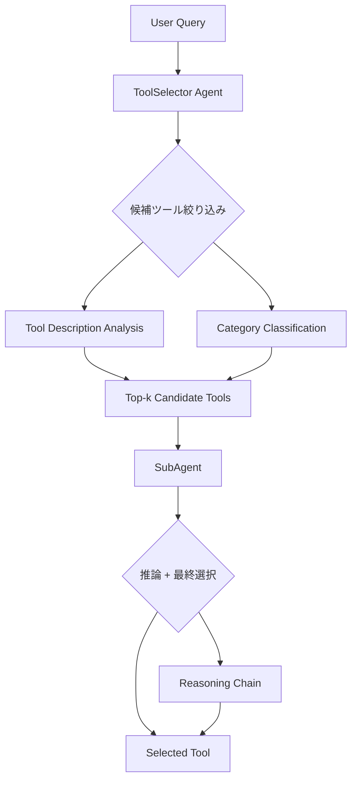

本記事は [AgentTool: Evaluating Tool Selection in Multi-Agent Workflows](https://arxiv.org/abs/2501.12599) の解説記事です。

## 論文概要（Abstract）

AgentToolは、LLMベースのエージェントがマルチエージェントワークフローにおいてツールを正しく選択できるかどうかを評価するためのベンチマークである。Coding、Math、Reasoning、Writing、Retrievalの5カテゴリにわたる3,310インスタンスから構成され、ツール選択精度（Tool Selection Accuracy: TSA）を定量的に測定する。著者らは従来のSingle Agentアーキテクチャに対し、ToolSelector+SubAgentという2段階のマルチエージェントアーキテクチャを提案し、GPT-4oで72.4%から79.6%へのTSA向上を報告している。

この記事は [Zenn記事: AIエージェントのツール品質を評価駆動で改善する：テスト・計測・運用の実践手法](https://zenn.dev/0h_n0/articles/f4677b31b986f8) の深掘りです。

## 情報源

- **arXiv ID**: 2501.12599
- **URL**: [https://arxiv.org/abs/2501.12599](https://arxiv.org/abs/2501.12599)
- **著者**: Aniket Deroy, Subhankar Maity（Indian Statistical Institute）
- **発表年**: 2025
- **分野**: cs.AI, cs.MA

## 背景と動機（Background & Motivation）

LLMベースのエージェントは外部ツールを呼び出すことで計算、コード実行、検索などの能力を獲得する。しかし、利用可能なツールの数が増加するにつれ、正しいツールを選択する能力がボトルネックとなる。著者らは既存の評価研究がツール呼び出しの引数生成やAPI連携の正確性に焦点を当てており、ツール選択そのものを体系的に評価するベンチマークが不足していると指摘している。

特に問題となるのは、類似したツールの混同（Similar Tool Confusion）とタスクの分解不全（Task Decomposition Failure）である。これらはツール数が増えるほど深刻化し、単一エージェントのアーキテクチャでは対応が困難になる。AgentToolはこの課題に対して、評価基盤と改善アーキテクチャの両方を提供する研究である。

## 主要な貢献（Key Contributions）

- **貢献1**: 5カテゴリ・3,310インスタンスからなるツール選択評価ベンチマークAgentToolの構築
- **貢献2**: ToolSelector+SubAgentという2段階マルチエージェントアーキテクチャの提案と、Single Agentに対する一貫した精度向上の実証
- **貢献3**: 候補ツール数（k）、推論プロンプト、ツール説明文の品質がTSAに与える影響のアブレーション分析

## 技術的詳細（Technical Details）

### ベンチマーク設計

AgentToolの各インスタンスは以下の4つ組で構成される。

$$
\text{Instance} = (q, T, t^*, c)
$$

ここで、
- $q$: ユーザクエリ（自然言語のタスク記述）
- $T = \{t_1, t_2, \ldots, t_n\}$: 候補ツール集合
- $t^* \in T$: 正解ツール
- $c \in \{\text{Coding}, \text{Math}, \text{Reasoning}, \text{Writing}, \text{Retrieval}\}$: カテゴリ

評価指標であるTSA（Tool Selection Accuracy）は以下のように定義される。

$$
\text{TSA} = \frac{1}{N} \sum_{i=1}^{N} \mathbb{1}[\hat{t}_i = t_i^*]
$$

ここで $N$ は評価インスタンス数、$\hat{t}_i$ はモデルが選択したツール、$t_i^*$ は正解ツールである。

### ToolSelector + SubAgent アーキテクチャ

著者らが提案するアーキテクチャは、ツール選択の責務を2つのエージェントに分離する設計である。



**ToolSelector**はユーザクエリを受け取り、全ツール集合から候補を絞り込む。具体的には、クエリとツール説明文の意味的類似度を計算し、上位$k$件を候補として抽出する。

$$
\text{score}(q, t_j) = \text{sim}(\text{Enc}(q), \text{Enc}(\text{desc}(t_j)))
$$

ここで $\text{Enc}(\cdot)$ はLLMのエンコーダ、$\text{desc}(t_j)$ はツール $t_j$ の説明文、$\text{sim}(\cdot, \cdot)$ はコサイン類似度である。

**SubAgent**は絞り込まれた候補ツール集合を受け取り、推論チェーン（Reasoning Chain）を生成しながら最終的なツール選択を行う。SubAgentはカテゴリごとに専門化されており、Coding用SubAgent、Math用SubAgentなどがタスクの特性に応じた推論を行う。

## 実装のポイント（Implementation）

ToolSelectorのプロンプト設計が精度に大きく影響する。著者らの提案する構成を以下に示す。

```python
from dataclasses import dataclass


@dataclass
class Tool:
    """ツール定義"""
    name: str
    description: str
    category: str
    parameters: dict


def build_tool_selector_prompt(
    query: str, tools: list[Tool], k: int = 5,
) -> str:
    """ToolSelector用プロンプトを構築する

    Args:
        query: ユーザクエリ
        tools: 候補ツール一覧
        k: 選択する候補数

    Returns:
        LLMに渡すプロンプト文字列
    """
    tool_desc = "\n".join(
        f"- {t.name}: {t.description} [Category: {t.category}]"
        for t in tools
    )
    return f"""You are a ToolSelector agent. Given a user query,
select the top {k} most relevant tools.

## Available Tools
{tool_desc}

## User Query
{query}

## Instructions
1. Analyze the query to identify the task type.
2. Match the task requirements against each tool's description.
3. Return the top {k} tools ranked by relevance.

## Output Format
Return JSON: {{"selected_tools": ["tool1", ...], "reasoning": "..."}}
"""
```

実装上の注意点として、著者らはツール説明文の品質がTSAに直結すると報告している（論文Table 5より、Detailed: 79.6% vs Name only: 65.8%）。ツール説明文には以下を含めることが推奨される。

1. ツールが実行する処理の明確な記述
2. 入力パラメータの型と制約
3. 出力フォーマットの仕様
4. ユースケースの例示

## Production Deployment Guide

### AWS実装パターン（コスト最適化重視）

ToolSelector+SubAgentアーキテクチャをAWS上に展開する際の構成パターンを示す。コスト試算は2026年3月時点のap-northeast-1リージョン料金に基づく概算値であり、実際のコストはトラフィックパターンやバースト使用量により変動する。最新料金はAWS料金計算ツールで確認を推奨する。

| 構成 | トラフィック | サービス | 月額概算 |
|------|------------|---------|---------|
| Small | ~100 req/日 | Lambda + Bedrock + DynamoDB | $50-150 |
| Medium | ~1,000 req/日 | ECS Fargate + Bedrock + ElastiCache | $300-800 |
| Large | 10,000+ req/日 | EKS + Karpenter + Spot + Bedrock | $2,000-5,000 |

**Small構成**: Lambda関数でToolSelectorとSubAgentをそれぞれ実装し、DynamoDBにツール定義とセッション状態を保存する。Bedrock経由でLLM推論を行う。リクエスト頻度が低いためサーバレスのコスト効率が高い。

**Medium構成**: ECS Fargateでコンテナ化されたエージェントを常駐させ、ElastiCacheでツール説明文のエンベディングをキャッシュする。ToolSelectorの応答レイテンシをP95 500ms以下に抑えたい場合に有効。

**Large構成**: EKSクラスタ上でKarpenterによる自動スケーリングを行い、Spot Instancesを優先活用することで最大90%のコスト削減を図る。ToolSelectorとSubAgentを独立したDeploymentとしてスケール可能にする。

**コスト削減テクニック**: Spot Instances活用で最大90%削減、Reserved Instances（1年コミット）で最大72%削減、Bedrock Batch API使用で50%削減（非リアルタイム評価時）、Prompt Caching有効化でツール説明文の繰り返し送信コストを30-90%削減。

### Terraformインフラコード

**Small構成（Lambda + Bedrock + DynamoDB）**:

```hcl
resource "aws_iam_role" "tool_selector_lambda" {
  name = "tool-selector-lambda-role"
  assume_role_policy = jsonencode({
    Version = "2012-10-17"
    Statement = [{
      Action    = "sts:AssumeRole"
      Effect    = "Allow"
      Principal = { Service = "lambda.amazonaws.com" }
    }]
  })
}

resource "aws_iam_role_policy" "bedrock_invoke" {
  name = "bedrock-invoke"
  role = aws_iam_role.tool_selector_lambda.id
  policy = jsonencode({
    Version = "2012-10-17"
    Statement = [{
      Effect   = "Allow"
      Action   = ["bedrock:InvokeModel"]
      Resource = "arn:aws:bedrock:ap-northeast-1::foundation-model/*"
    }]
  })
}

resource "aws_lambda_function" "tool_selector" {
  function_name = "agent-tool-selector"
  runtime       = "python3.12"
  handler       = "handler.lambda_handler"
  memory_size   = 512   # 推論不要なため512MBで十分
  timeout       = 60
  role          = aws_iam_role.tool_selector_lambda.arn
  environment {
    variables = {
      BEDROCK_MODEL_ID = "anthropic.claude-sonnet-4-20250514"
      DYNAMODB_TABLE   = aws_dynamodb_table.tool_definitions.name
      CANDIDATE_K      = "5"
    }
  }
}

resource "aws_dynamodb_table" "tool_definitions" {
  name         = "agent-tool-definitions"
  billing_mode = "PAY_PER_REQUEST"  # On-Demand: 低トラフィック向け
  hash_key     = "tool_id"
  attribute { name = "tool_id"; type = "S" }
  server_side_encryption { enabled = true }
  point_in_time_recovery { enabled = true }
}
```

**Large構成（EKS + Karpenter + Spot）**:

```hcl
module "eks" {
  source          = "terraform-aws-modules/eks/aws"
  version         = "~> 20.0"
  cluster_name    = "agent-tool-cluster"
  cluster_version = "1.31"
  vpc_id          = module.vpc.vpc_id
  subnet_ids      = module.vpc.private_subnets
  cluster_endpoint_public_access = false  # プライベートのみ
}

resource "kubectl_manifest" "nodepool" {
  yaml_body = yamlencode({
    apiVersion = "karpenter.sh/v1"
    kind       = "NodePool"
    metadata   = { name = "agent-tool-pool" }
    spec = {
      template.spec.requirements = [
        { key = "karpenter.sh/capacity-type", operator = "In",
          values = ["spot", "on-demand"] },
        { key = "node.kubernetes.io/instance-type", operator = "In",
          values = ["m6i.large", "m6i.xlarge", "m7i.large"] }
      ]
      limits     = { cpu = "100", memory = "400Gi" }
      disruption = { consolidationPolicy = "WhenEmptyOrUnderutilized" }
    }
  })
}

resource "aws_budgets_budget" "monthly" {
  name         = "agent-tool-monthly"
  budget_type  = "COST"
  limit_amount = "5000"
  limit_unit   = "USD"
  time_unit    = "MONTHLY"
  notification {
    comparison_operator       = "GREATER_THAN"
    threshold                 = 80
    threshold_type            = "PERCENTAGE"
    notification_type         = "ACTUAL"
    subscriber_sns_topic_arns = [aws_sns_topic.alerts.arn]
  }
}
```

### 運用・監視設定

**CloudWatch Logs Insights**（コスト異常検知）:

```
fields @timestamp, @message
| filter @message like /bedrock/
| stats sum(input_tokens) as total_input, sum(output_tokens) as total_output by bin(1h)
| filter total_input > 100000
```

**X-Ray トレーシング + CloudWatch アラーム**:

```python
import boto3
from aws_xray_sdk.core import xray_recorder, patch_all

patch_all()  # boto3自動計装

@xray_recorder.capture("tool_selection")
def select_tool(query: str, tools: list[dict]) -> dict:
    """ツール選択処理をX-Rayでトレースする"""
    seg = xray_recorder.current_subsegment()
    seg.put_annotation("category", classify_query(query))
    seg.put_metadata("candidate_count", len(tools))
    result = invoke_tool_selector(query, tools)
    return result

# CloudWatch アラーム: Bedrockトークンスパイク検知
cloudwatch = boto3.client("cloudwatch")
cloudwatch.put_metric_alarm(
    AlarmName="bedrock-token-spike",
    Namespace="AgentTool", MetricName="TokenUsage",
    Statistic="Sum", Period=3600, EvaluationPeriods=1,
    Threshold=500000, ComparisonOperator="GreaterThanThreshold",
    AlarmActions=["arn:aws:sns:ap-northeast-1:123456789:alerts"],
)
```

**Cost Explorer日次レポート**:

```python
import boto3
from datetime import date, timedelta

def get_daily_cost() -> dict:
    """日次コストレポートを取得し閾値超過時にSNS通知する"""
    ce = boto3.client("ce")
    today = date.today()
    resp = ce.get_cost_and_usage(
        TimePeriod={"Start": str(today - timedelta(days=1)), "End": str(today)},
        Granularity="DAILY", Metrics=["UnblendedCost"],
        Filter={"Tags": {"Key": "Project", "Values": ["agent-tool"]}},
    )
    cost = float(resp["ResultsByTime"][0]["Total"]["UnblendedCost"]["Amount"])
    if cost > 100:
        boto3.client("sns").publish(
            TopicArn="arn:aws:sns:ap-northeast-1:123456789:alerts",
            Message=f"Daily cost alert: ${cost:.2f}",
        )
    return {"date": str(today), "cost": cost}
```

### コスト最適化チェックリスト

**アーキテクチャ選択**:
- [ ] トラフィック100 req/日以下 → Serverless（Lambda + Bedrock）
- [ ] トラフィック1,000 req/日前後 → Hybrid（ECS Fargate + Bedrock）
- [ ] トラフィック10,000 req/日以上 → Container（EKS + Spot）

**リソース最適化**:
- [ ] EC2/EKS Worker: Spot Instances優先（最大90%削減）
- [ ] Reserved Instances: 1年コミットで72%削減
- [ ] Savings Plans: Compute Savings Plans検討
- [ ] Lambda: メモリサイズをPower Tuningで最適化
- [ ] EKS: Karpenter consolidation有効化でアイドルノード削除
- [ ] NAT Gateway: VPCエンドポイント活用で通信コスト削減

**LLMコスト削減**:
- [ ] Bedrock Batch API: 非リアルタイム評価で50%削減
- [ ] Prompt Caching: ツール説明文の繰り返し送信を30-90%削減
- [ ] モデル選択ロジック: 簡易クエリはLlama 8Bへルーティング
- [ ] トークン数制限: max_tokensを推論チェーンに応じて動的設定
- [ ] 候補ツール数kの最適化: k=3-5で精度とコストのバランスを取る

**監視・アラート**:
- [ ] AWS Budgets: 月次予算の80%でアラート
- [ ] CloudWatch: Bedrockトークンスパイク検知
- [ ] Cost Anomaly Detection: 自動異常検知有効化
- [ ] 日次コストレポート: SNS通知で$100/日超過を検知

**リソース管理**:
- [ ] 未使用リソース削除: Trusted Advisor定期確認
- [ ] タグ戦略: Project/Environment/Ownerタグ必須化
- [ ] ライフサイクルポリシー: ECRイメージ/S3オブジェクト自動削除
- [ ] 開発環境夜間停止: EventBridgeで平日夜間・休日にスケールダウン

## 実験結果（Results）

### ツール選択精度の比較

論文Table 1より、提案手法（ToolSelector+SubAgent）はすべてのLLMでSingle Agentを上回っている。

| アーキテクチャ | GPT-4o | Llama3.1-70B | Llama3.1-8B | Gemma2-27B | Gemma2-9B |
|---|---|---|---|---|---|
| Single Agent | 72.4 | 64.8 | 51.3 | 61.2 | 49.7 |
| 提案手法 | 79.6 | 71.3 | 56.2 | 67.4 | 54.8 |
| **改善幅** | **+7.2** | **+6.5** | **+4.9** | **+6.2** | **+5.1** |

GPT-4oでの改善幅が+7.2ポイントと最も大きく、モデル規模が大きいほどToolSelectorの恩恵を受けやすい傾向がある。小規模モデルでも+4.9〜+5.1ポイントの改善が得られており、アーキテクチャの効果は汎用的であると著者らは報告している。

### カテゴリ別の精度

論文Table 2より、提案手法におけるカテゴリ別TSAを示す。

| カテゴリ | GPT-4o | Llama3.1-70B |
|---|---|---|
| Coding | 85.3 | 78.2 |
| Math | 83.7 | 76.5 |
| Reasoning | 77.2 | 69.4 |
| Writing | 76.8 | 68.9 |
| Retrieval | 74.9 | 63.5 |

CodingとMathではツールの機能が明確に定義されやすく、ToolSelectorが説明文から適切に絞り込めるためと著者らは分析している。一方、RetrievalはRAG、Web検索、ドキュメント検索など類似ツールが多く混同が生じやすい。

### 候補ツール数kの影響

論文Table 3より、GPT-4oにおける候補ツール数kとTSAの関係を示す。

| k | TSA |
|---|---|
| k=3 | 86.4 |
| k=5 | 83.3 |
| k=10 | 78.1 |
| k=All | 79.6 |

$k=3$ で最高精度86.4%を達成している点が注目に値する。候補を絞り込みすぎると正解ツールが漏れるリスクがあるが、$k=3$ では絞り込みの恩恵が上回っている。$k=\text{All}$（79.6%）が$k=10$（78.1%）を上回る逆転現象は、ToolSelectorが全ツールを見渡すことで文脈理解が向上するためと著者らは推測している。

### アブレーション分析

論文Table 5より、提案手法の各構成要素の寄与を示す。

| 構成 | TSA |
|---|---|
| Full（完全版） | 79.6 |
| w/o Reasoning Chain | 77.1 |
| w/o SubAgent Specialization | 75.8 |
| w/o Tool Descriptions | 71.3 |

ツール説明文の除去が最も大きな精度低下（-8.3ポイント）を引き起こしており、ツールのメタデータ品質が選択精度の基盤であることが確認された。SubAgentのカテゴリ専門化を除去した場合も-3.8ポイントの低下が生じ、タスク特性に応じた推論の重要性が示されている。

### エラー分析

著者らはエラーを以下の4種に分類している。

| エラー種別 | 割合 |
|---|---|
| Similar Tool Confusion（類似ツール混同） | 42% |
| Task Decomposition Failure（タスク分解不全） | 31% |
| Over-specification（過剰特化） | 17% |
| Category Cross-contamination（カテゴリ混同） | 10% |

最大のエラー要因は類似ツール混同（42%）であり、特にRetrievalカテゴリで顕著である。タスク分解不全（31%）は複合的なクエリで発生しやすく、1つのクエリに複数のツールが必要な場合にSubAgentが単一ツールしか選択できない問題を指す。

### ツール説明文の品質影響

著者らはツール説明文の詳細度を3段階に変化させた実験も行っている。

| 説明文の詳細度 | TSA |
|---|---|
| Detailed（機能・パラメータ・ユースケース記載） | 79.6 |
| Simple（1文の要約のみ） | 73.2 |
| Name only（ツール名のみ） | 65.8 |

DetailedからName onlyへの変更で-13.8ポイントの低下が生じる。この結果は、エージェントシステムにおけるツール定義のドキュメント品質が運用上の重要課題であることを示している。

## 実運用への応用（Practical Applications）

AgentToolの知見は、Zenn記事で扱っているエージェントのツール品質評価と改善の実践に直結する。

**評価基盤の構築**: AgentToolの3,310インスタンスの設計方針（5カテゴリ、候補ツール集合の制御、TSA指標）は、自社のエージェントシステムにおけるツール選択のリグレッションテスト設計に応用できる。特にk値の影響分析（論文Table 3より）は、ToolSelectorの候補数をチューニングする際のガイドラインとなる。

**ツール説明文の品質管理**: Detailed説明文で79.6%、Name onlyで65.8%という13.8ポイントの差は、ツール定義のドキュメント品質をCI/CDパイプラインで検証する必要性を裏付ける。OpenAPI Specやツールスキーマのリンティングルールとして「説明文が50文字未満のツールを警告する」といった自動チェックの導入が有効である。

**段階的アーキテクチャの採用**: ToolSelector+SubAgentの2段階構成は、候補ツール数を削減することで推論コストも抑制する。$k=5$ でのTSA 83.3%は、全ツールを投入する場合（79.6%）を上回っており、コストと精度の両面で有利である。

## 関連研究（Related Work）

- **ToolBench (Qin et al., 2024)**: 16,000以上のAPIを対象としたツール利用ベンチマークで、ツール呼び出しの正確性を評価する。AgentToolとの違いは、ToolBenchがAPI引数の生成精度に焦点を当てるのに対し、AgentToolはツール選択そのものの精度を独立して評価する点にある。
- **BFCL (Patil et al., 2024)**: Berkeley Function Calling Leaderboardは、LLMのFunction Calling能力を網羅的に評価するベンチマークである。AgentToolはFunction Callingの前段階であるツール選択に特化している。
- **Gorilla (Patil et al., 2023)**: LLMがAPIドキュメントを参照してAPI呼び出しを生成する能力を評価する。RAG的なアプローチでAPI選択精度を向上させる手法を提案しており、AgentToolのToolSelectorと共通する設計思想がある。

## まとめと今後の展望

AgentToolは、LLMエージェントのツール選択能力を定量的に評価するベンチマークとして、3,310インスタンス・5カテゴリという規模で体系的な分析を可能にした。提案されたToolSelector+SubAgentアーキテクチャは、GPT-4oで+7.2ポイント、小規模モデルでも+5ポイント前後の精度改善を実現している。

今後の展望として、著者らは複数ツールの同時選択（マルチツール選択）やツール連鎖（Tool Chaining）への拡張を挙げている。また、ツール説明文の自動生成や品質向上のための手法も研究課題として残されている。Zenn記事で紹介されている評価駆動のツール品質改善サイクルとの組み合わせにより、エージェントシステムの信頼性向上が期待される。

## 参考文献

- **arXiv**: [https://arxiv.org/abs/2501.12599](https://arxiv.org/abs/2501.12599)
- **Related Zenn article**: [https://zenn.dev/0h_n0/articles/f4677b31b986f8](https://zenn.dev/0h_n0/articles/f4677b31b986f8)
- Qin, Y. et al. (2024). "ToolBench: An Open Platform for Training, Serving, and Evaluating Large Language Model Based Tool Agents." NeurIPS 2024.
- Patil, S. et al. (2024). "BFCL: Berkeley Function Calling Leaderboard." arXiv:2402.15671.
- Patil, S. et al. (2023). "Gorilla: Large Language Model Connected with Massive APIs." arXiv:2305.15334.
