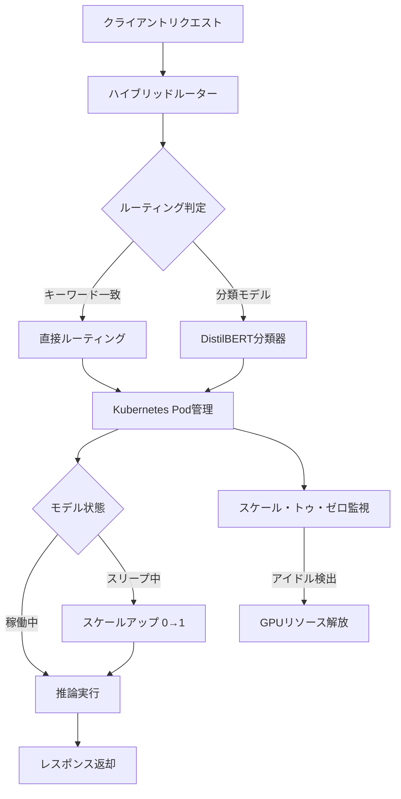

本記事は [Efficient Multi-Model Orchestration for Self-Hosted Large Language Models](https://arxiv.org/abs/2512.22402)（Vangala & Malik, 2025）の解説記事です。

## 論文概要（Abstract）

Pick and Spinは、セルフホスト環境における複数LLMのオーケストレーションフレームワークである。Kubernetesベースのデプロイ基盤、アダプティブなスケール・トゥ・ゼロ自動化、キーワードヒューリスティクスとDistilBERT分類器を組み合わせたハイブリッドルーティングモジュールを統合している。著者らの評価では、4つのLLM（27B〜685Bパラメータ）を8つのベンチマークデータセット（31,019プロンプト、163,720推論実行）で検証し、静的デプロイと比較して成功率21.6%向上、レイテンシ30%削減、GPUコスト33%削減を報告している。

この記事は [Zenn記事: Portkey Gateway 2.0でLLMアプリの信頼性を設計する](https://zenn.dev/0h_n0/articles/babea176772c33) の深掘りです。Portkey Gatewayのセルフホスト版デプロイとModel Catalog機能の学術的基盤として、マルチモデルオーケストレーションの設計パターンを解説します。

## 情報源

- **arXiv ID**: 2512.22402
- **URL**: [https://arxiv.org/abs/2512.22402](https://arxiv.org/abs/2512.22402)
- **著者**: Bhanu Prakash Vangala, Tanu Malik
- **発表年**: 2025
- **分野**: cs.DC, cs.AI

## 背景と動機（Background & Motivation）

LLMのクラウドAPI利用はデータプライバシーやコスト予測可能性の観点から課題がある。金融、医療、政府機関などの規制業界では、データをサードパーティのAPIに送信できない場合が多い。セルフホスト（オンプレミスまたはプライベートクラウド）でのLLM運用が必要になるが、複数モデルの管理・スケーリング・ルーティングは運用上の大きな負担となる。

従来のセルフホスト型デプロイでは、固定的なGPU割り当てによる低い利用効率、手動でのモデル選択、スケーリング自動化の欠如が課題であった。Pick and Spinはこれらの課題に対して、Kubernetesネイティブなオーケストレーション基盤を提案している。

## 主要な貢献（Key Contributions）

- **貢献1**: Helmチャートによる統一デプロイシステム（複数LLMの一括管理）
- **貢献2**: アダプティブなスケール・トゥ・ゼロ自動化（アイドル時のGPUリソース解放）
- **貢献3**: キーワードヒューリスティクスとDistilBERT分類器を組み合わせたハイブリッドルーティングモジュール

## 技術的詳細（Technical Details）

### システムアーキテクチャ

Pick and Spinは3層のアーキテクチャで構成される。



### ハイブリッドルーティング

ルーティングは2段階で行われる。

**第1段階: キーワードヒューリスティクス**

リクエスト内の特定キーワード（例：「code」「数学」「reasoning」など）を検出し、高速にモデルを選択する。パターンマッチングのみで完了するため、追加のGPU推論は不要である。

**第2段階: DistilBERT分類器**

キーワードマッチで判定できないリクエストに対して、DistilBERT（66Mパラメータ）ベースの分類器がタスク種別を推定する。DistilBERTはBERT-Baseの40%のサイズでありながら97%の精度を維持する蒸留モデルであり、CPU上で高速に推論できる。

ルーティングの決定関数は以下のように定式化される。

$$
R(q) = \begin{cases} M_{\text{keyword}}(q) & \text{if } \exists k \in \mathcal{K}: k \in q \\ M_{\text{clf}}(\arg\max_c P_\theta(c | q)) & \text{otherwise} \end{cases}
$$

ここで、
- $q$: 入力クエリ
- $\mathcal{K}$: キーワードセット
- $M_{\text{keyword}}(q)$: キーワードマッチによるモデル選択
- $P_\theta(c | q)$: DistilBERT分類器によるタスクカテゴリ $c$ の予測確率
- $M_{\text{clf}}(c)$: カテゴリ $c$ に対応するモデル

### スケール・トゥ・ゼロ自動化

GPUリソースの効率的な利用のため、アイドル状態のモデルのPodを0にスケールダウンする機能を備える。リクエスト到着時に自動でスケールアップする。

$$
\text{replicas}(t) = \begin{cases} 0 & \text{if } t - t_{\text{last\_request}} > T_{\text{idle}} \\ 1 & \text{if request arrived and replicas} = 0 \\ \text{HPA}(t) & \text{otherwise} \end{cases}
$$

ここで $T_{\text{idle}}$ はアイドルタイムアウト（デフォルト30秒）、$t_{\text{last\_request}}$ は最後のリクエスト到着時刻、HPA(t) はKubernetes Horizontal Pod Autoscalerによるレプリカ数である。

### Helmチャートによる統一デプロイ

各LLMがHelmチャートとして定義され、一括デプロイ・バージョン管理が可能。モデルの追加・削除はHelmの`values.yaml`の編集とアップグレードで完了する。

## 実装のポイント（Implementation）

- **コールドスタートの管理**: スケール・トゥ・ゼロからの起動（コールドスタート）は大規模モデルで数十秒かかる場合がある。著者らは、リクエストパターンの予測に基づくプリウォーミング戦略を検討している
- **GPUメモリ管理**: 685Bパラメータのモデル（DeepSeek-R1）はGPUメモリを大量に消費するため、KubernetesのGPUリソースリクエスト/リミットの適切な設定が不可欠である
- **ルーティング精度の限界**: キーワードヒューリスティクスは高速だが、曖昧なクエリに対しては誤ルーティングのリスクがある。DistilBERT分類器のファインチューニングがドメイン固有の精度向上に重要である

## Production Deployment Guide

### AWS実装パターン（コスト最適化重視）

Pick and Spinのアーキテクチャに準じたセルフホスト型LLMオーケストレーション基盤をAWSで構築する場合の構成を示す。

| 規模 | 月間リクエスト | 推奨構成 | 月額コスト目安 | 主要サービス |
|------|--------------|---------|-------------|------------|
| **Small** | ~3,000 (100/日) | Serverless | $50-200 | Lambda + Bedrock |
| **Medium** | ~30,000 (1,000/日) | Hybrid | $800-2,000 | ECS Fargate + Bedrock + ElastiCache |
| **Large** | 300,000+ (10,000/日) | Container | $5,000-15,000 | EKS + Karpenter + GPU Spot |

**Large構成の詳細**（月額$5,000-15,000）:
- EKS: コントロールプレーン（$72/月）
- EC2 g5.xlarge Spot × 2-4台: モデル推論（$800-2,000/月）
- Karpenter: スケール・トゥ・ゼロ自動化
- S3: モデルウェイトストレージ（$50/月）
- ECR: コンテナイメージ管理（$10/月）

**コスト削減テクニック**:
- Spot Instances使用でGPU推論コストを最大90%削減
- KarpenterのttlSecondsAfterEmpty設定で30秒のアイドル後にスケールダウン
- 軽量モデル（Haiku相当）はCPUインスタンスで実行しGPU不要
- Reserved Instances: 1年コミットで72%削減（予測可能なベースロード）

**コスト試算の注意事項**: 上記は2026年3月時点のAWS ap-northeast-1リージョン料金に基づく概算値です。GPU Spot Instanceの料金は需給により大幅に変動します。最新料金は[AWS料金計算ツール](https://calculator.aws/)で確認してください。

### Terraformインフラコード

**EKS + Karpenter構成（スケール・トゥ・ゼロ対応）**

```hcl
module "eks" {
  source  = "terraform-aws-modules/eks/aws"
  version = "~> 20.0"

  cluster_name    = "llm-orchestration"
  cluster_version = "1.31"
  vpc_id          = module.vpc.vpc_id
  subnet_ids      = module.vpc.private_subnets

  cluster_endpoint_public_access = true
  enable_cluster_creator_admin_permissions = true
}

# --- Karpenter（スケール・トゥ・ゼロ対応） ---
resource "kubectl_manifest" "karpenter_provisioner" {
  yaml_body = <<-YAML
    apiVersion: karpenter.sh/v1alpha5
    kind: Provisioner
    metadata:
      name: gpu-spot-provisioner
    spec:
      requirements:
        - key: karpenter.sh/capacity-type
          operator: In
          values: ["spot"]
        - key: node.kubernetes.io/instance-type
          operator: In
          values: ["g5.xlarge", "g5.2xlarge", "g5.4xlarge"]
      limits:
        resources:
          cpu: "64"
          memory: "256Gi"
          nvidia.com/gpu: "8"
      providerRef:
        name: default
      ttlSecondsAfterEmpty: 30
  YAML
}

# --- AWS Budgets ---
resource "aws_budgets_budget" "llm_monthly" {
  name         = "llm-orchestration-budget"
  budget_type  = "COST"
  limit_amount = "15000"
  limit_unit   = "USD"
  time_unit    = "MONTHLY"

  notification {
    comparison_operator        = "GREATER_THAN"
    threshold                  = 80
    threshold_type             = "PERCENTAGE"
    notification_type          = "ACTUAL"
    subscriber_email_addresses = ["ops@example.com"]
  }
}
```

### コスト最適化チェックリスト

- [ ] Spot Instances優先（Karpenter設定でspot指定）
- [ ] スケール・トゥ・ゼロ: ttlSecondsAfterEmpty=30でアイドルGPU解放
- [ ] ルーティング分類: DistilBERTはCPU推論（GPU不要）
- [ ] モデルウェイト: S3 + EFS/Lustreで効率的に共有
- [ ] AWS Budgets: 月額予算設定（80%/100%でアラート）
- [ ] コールドスタート: 予測ベースのプリウォーミングでユーザー体験維持

## 実験結果（Results）

### 評価環境

著者らの実験では以下のモデルとデータセットを使用している。

| モデル | パラメータ数 | 用途 |
|-------|-----------|------|
| Gemma-3 | 27B | 軽量タスク |
| Llama-3 | 90B | 汎用タスク |
| Qwen-3 | 235B | 高品質タスク |
| DeepSeek-R1 | 685B | 推論特化タスク |

8つの公開ベンチマークデータセット、5つの推論戦略、2つのルーティングバリアントで31,019プロンプト・163,720推論実行の評価を行ったと報告されている。

### 主要結果

| 指標 | 静的デプロイ | Pick and Spin | 改善率 |
|------|-----------|--------------|--------|
| 成功率 | ベースライン | +21.6% | 21.6%向上 |
| レイテンシ | ベースライン | -30% | 30%削減 |
| GPU コスト/クエリ | ベースライン | -33% | 33%削減 |

著者らによると、ハイブリッドルーティングにより、複雑な推論タスクはDeepSeek-R1（685B）に、簡単な質疑応答はGemma-3（27B）に振り分けることで、全体のコストを削減しつつ成功率を向上させている。

## 実運用への応用（Practical Applications）

Pick and Spinの設計は、Portkey Gatewayのセルフホスト版運用と直接関連する。

- **Model Catalog対応**: Portkey 2.0のModel Catalog記法（`@provider-slug/model-name`）は、Pick and Spinのモデルレジストリと類似した概念である。両者とも複数モデルを統一的に管理する
- **スケール・トゥ・ゼロ**: Portkey Gatewayのセルフホスト版はDockerコンテナとして動作するが、バックエンドのモデル推論サーバーにKarpenterのスケール・トゥ・ゼロを適用することで、GPUコストを大幅に削減できる
- **ハイブリッドルーティング**: Portkeyの`loadbalance`戦略に静的な重み配分だけでなく、Pick and Spinのような分類器ベースの動的ルーティングを組み合わせることで、コスト効率をさらに改善できる

## 関連研究（Related Work）

- **RouteLLM**（Ong et al., ICLR 2025）: 選好データからルーターを学習。Pick and Spinは選好データではなくキーワード+分類器のハイブリッドアプローチを採用し、訓練データの収集コストを低減
- **vLLM**（Kwon et al., 2023）: PagedAttentionによる高効率LLM推論エンジン。Pick and Spinのモデル推論バックエンドとして利用可能
- **NVIDIA NIM**: モデル推論のマイクロサービス化。Pick and SpinのHelmチャートベースのデプロイと類似するが、NIMはNVIDIAハードウェアに最適化されている点が異なる

## まとめと今後の展望

Pick and Spinは、セルフホスト環境における複数LLMの効率的なオーケストレーションをKubernetesネイティブに実現するフレームワークである。ハイブリッドルーティング（キーワード+DistilBERT）とスケール・トゥ・ゼロの組み合わせにより、著者らはGPUコスト33%削減を報告している。Portkey Gatewayのセルフホスト版と組み合わせることで、ソフトウェア層の信頼性設計（フォールバック・ガードレール）とインフラ層のコスト最適化（スケール・トゥ・ゼロ・ルーティング）を両立する運用が期待できる。

## 参考文献

- **arXiv**: [https://arxiv.org/abs/2512.22402](https://arxiv.org/abs/2512.22402)
- **Related Zenn article**: [https://zenn.dev/0h_n0/articles/babea176772c33](https://zenn.dev/0h_n0/articles/babea176772c33)
