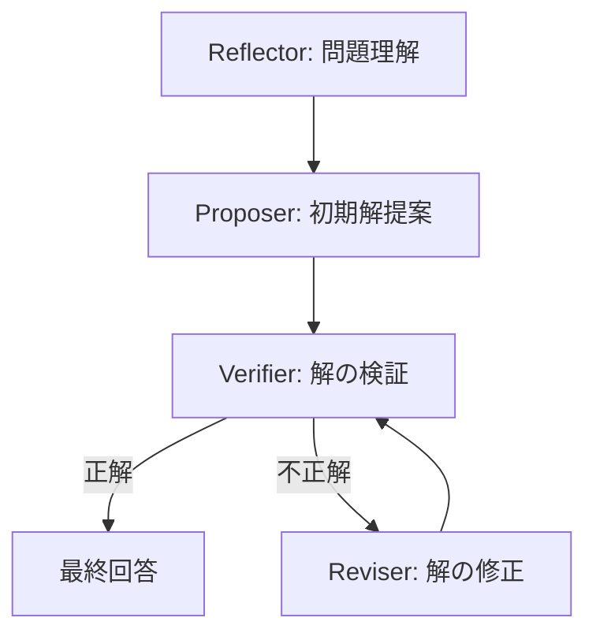

本記事は [arXiv:2601.10825 "Reasoning Models Generate Societies of Thought"](https://arxiv.org/abs/2601.10825)（Wu, Kotek, Potts, Goodman, 2025年1月）の解説記事です。

## 論文概要（Abstract）

著者らは、RLHF（人間のフィードバックによる強化学習）やGRPO（報酬ベース強化学習）で訓練された大規模言語モデル（LLM）の推論トレースを分析し、モデル内部に計画・批判・振り返りを行う複数の「内部エージェント」が自発的に出現する現象を発見した。この現象を **Society of Thought（SoT: 思考の社会）** と名付け、観察的手法（LLMによる自動ラベリング）と介入的手法（Sparse Autoencoder: SAEによる特徴ステアリング）の2軸で分析している。SAEを用いたVerifier特徴のステアリングにより、Countdownタスクの精度が27.1%から54.8%へ向上したと報告されている。

この記事は [Zenn記事: Agentic AIが引き起こす次の知能爆発 Science誌論文とSociety of Thoughtの全貌](https://zenn.dev/0h_n0/articles/672dc6adf8e50a) の深掘りです。

## 情報源

- **arXiv ID**: 2601.10825
- **URL**: [https://arxiv.org/abs/2601.10825](https://arxiv.org/abs/2601.10825)
- **著者**: Zhengxuan Wu, Hadas Kotek, Christopher Potts, Noah Goodman
- **発表年**: 2025年
- **分野**: cs.CL, cs.AI

## 背景と動機（Background & Motivation）

近年、DeepSeek-R1やQwQ-32Bなどの推論モデルは、Chain of Thought（CoT）と呼ばれる段階的な推論トレースを生成することで、数学やコーディングなどの複雑なタスクで高い性能を発揮している。しかし、これらの推論トレースの内部で「何が起きているのか」は十分に理解されていなかった。

従来の研究では、推論トレースの言語的特性（Sprague+25, Wang+25）や、特定の機能的役割（「aha moments」: Mao+25、「effort tokens」: Muennighoff+25）が調査されてきた。しかし、推論トレース全体にわたるより高次の行動構造は未解明だった。

著者らはMinsky（1986）の「Society of Mind（心の社会）」理論に着想を得て、単一モデルの推論トレース内に多エージェント的な議論構造が隠れているという仮説を検証した。重要な点として、この内部構造は明示的なマルチエージェントプロンプト設計とは異なり、強化学習の訓練のみから自発的に創発した現象である。

## 主要な貢献（Key Contributions）

著者らは以下の5つの主要な貢献を報告している。

- **Society of Thought（SoT）の発見と定式化**: RL訓練済みLLMの推論トレース内にProposer、Verifier、Reviser、Reflectorの4種のエージェントが自発的に出現することを実証
- **モデル非依存の自動ラベリング手法**: Claude 3.5 Sonnetをラベリングモデルとして使用し、推論トレースの各セグメントにエージェントタイプを付与する手順を確立（人手アノテーションとのCohen's Kappa = 0.76）
- **観察的分析**: どのエージェントが正解を最初に生成するかをLLMで自動判定し、反事実分析で各エージェントの因果的重要度を定量化
- **介入的分析（SAE Feature Steering）**: Sparse Autoencoderを用いて各エージェントタイプに対応する隠れ特徴を抽出し、推論時にステアリング。推論モデルへのSAEステアリング適用は本論文が初とされる
- **アライメントタックスの解析**: RLHF度が高いモデルほどVerifierセグメントの比率が増加し、非安全タスクの性能低下（アライメントタックス）と相関することを発見

## 技術的詳細（Technical Details）

### Society of Thoughtの4エージェント分類

著者らが定義する4種の内部エージェントと、その推論トレース内での役割は以下の通りである。

| エージェント | 役割 | 推論における機能 |
|---|---|---|
| **Proposer** | 候補解を生成 | 最初に登場し、初期解を提案する |
| **Verifier** | 解の正しさを検証 | 提案された解が正しいか批判的に検証する |
| **Reviser** | 解を修正・改良 | 誤りがある場合に新しい解を生成して修正する |
| **Reflector** | 問題の振り返り | 問題文の制約を明確化するサポート的役割 |

典型的な出現パターンは、Reflector（問題理解）→ Proposer（初期解提案）→ Verifier（検証）→ Reviser（修正）であり、Verifier/Reviserが交互に繰り返し出現する。著者らはVerifierとReviserの区別を強調しており、Verifierは検証のみ行い、Reviserは修正を通じて新たな解を生成できる。



### 自動ラベリング手順

著者らは推論トレースを以下の手順でラベリングする。

1. 推論トレースを自然言語の境界（段落区切り等）でセグメントに分割
2. ラベリングモデル $\mathcal{M}_{\text{Label}}$（Claude 3.5 Sonnet）に分類定義とFew-shot例を提示
3. 各セグメントに4種のエージェントラベルのいずれかを付与

この手法はモデル非依存であり、拡張的な推論トレースを生成する任意の推論モデルに適用可能である。人手アノテーションとの一致度はCohen's Kappa = 0.76と報告されている。

### SAE Feature Steeringの数式

介入的分析では、Sparse Autoencoder（SAE）を用いて各エージェントタイプに対応する隠れ特徴を抽出し、推論時にステアリングを行う。

層 $l$、トークン位置 $t$ における隠れ状態 $\mathbf{h}$ に対して、ステアリング後の隠れ状態 $\mathbf{h}'$ は以下の式で計算される。

$$
\mathbf{h}'_{l,t} = \mathbf{h}_{l,t} + \alpha \sum_{f \in F_{\text{agent}}} \mathbf{v}_f
$$

ここで、
- $F_{\text{agent}}$: 対象エージェントタイプの上位 $k$ 個の特徴量集合
- $\mathbf{v}_f$: SAEデコーダから得られる特徴方向ベクトル
- $\alpha$: ステアリング係数（介入の強度を制御）

特徴量の選択は、各エージェントタイプのラベルが付与されたセグメントにわたる平均特徴活性化度でランキングし、上位 $k$ 個を使用する。

著者らが報告する最適ハイパーパラメータは以下の通りである。

| パラメータ | 最適値 | 備考 |
|---|---|---|
| $\alpha$（ステアリング係数） | 20 | 正規化済み特徴ベクトル使用時 |
| $k$（特徴量数/エージェント） | 50 | 上位50特徴量を選択 |

$\alpha$ が過大の場合は出力が非整合になり、過小の場合は効果がないと報告されている。

### 有機化学合成での内部議論の具体例

論文の関連する観察として、DeepSeek-R1が有機化学の合成経路を推論する場面では、モデル内部で以下のプロセスが自発的に生成されたと報告されている。

1. Proposerが合成経路を提案
2. Verifierがその前提条件に疑義を呈する
3. Reviserが敵対的な検証を通じて合成経路を修正
4. 最終的に正しい合成パスに到達

この内部議論なしでは誤った合成経路を出力していたケースであり、SoTの実用的な意義を示す事例とされている。

## 実装のポイント（Implementation）

SoTの知見を実装に活かす際の要点を整理する。

### SAE Feature Steeringの実装

```python
"""Society of Thought Feature Steering の概念的実装

SAEを用いた推論モデルの内部エージェント制御パイプライン。
実際の適用にはモデル固有のSAEの事前学習が必要。

Requirements:
    - Python 3.11+
    - torch >= 2.0
    - transformer_lens（SAE解析用）
"""
from dataclasses import dataclass
from typing import Literal

import torch

AgentType = Literal["proposer", "verifier", "reviser", "reflector"]


@dataclass
class SteeringConfig:
    """ステアリング設定

    Attributes:
        alpha: ステアリング係数。論文推奨値は20。
        top_k: エージェントあたりの特徴量数。論文推奨値は50。
        target_agent: ステアリング対象のエージェントタイプ。
    """
    alpha: float = 20.0
    top_k: int = 50
    target_agent: AgentType = "verifier"


def compute_agent_features(
    sae_activations: torch.Tensor,
    agent_labels: list[AgentType],
    target_agent: AgentType,
    top_k: int = 50,
) -> torch.Tensor:
    """エージェントタイプに対応するSAE特徴量を抽出

    Args:
        sae_activations: SAE活性化値 (num_segments, num_features)
        agent_labels: 各セグメントのエージェントラベル
        target_agent: 対象エージェントタイプ
        top_k: 選択する上位特徴量の数

    Returns:
        上位k個の特徴量インデックス (top_k,)
    """
    mask = torch.tensor(
        [label == target_agent for label in agent_labels],
        dtype=torch.bool,
    )
    agent_activations = sae_activations[mask]
    mean_activation = agent_activations.mean(dim=0)
    _, top_indices = mean_activation.topk(top_k)
    return top_indices


def steer_hidden_state(
    hidden_state: torch.Tensor,
    sae_decoder_vectors: torch.Tensor,
    feature_indices: torch.Tensor,
    alpha: float = 20.0,
) -> torch.Tensor:
    """隠れ状態にSAE特徴方向を加算してステアリング

    論文の式: h'_{l,t} = h_{l,t} + α * Σ_{f ∈ F_agent} v_f

    Args:
        hidden_state: 元の隠れ状態 (seq_len, d_model)
        sae_decoder_vectors: SAEデコーダの特徴ベクトル (num_features, d_model)
        feature_indices: ステアリング対象の特徴インデックス (top_k,)
        alpha: ステアリング係数

    Returns:
        ステアリング後の隠れ状態 (seq_len, d_model)
    """
    steering_direction = sae_decoder_vectors[feature_indices].sum(dim=0)
    return hidden_state + alpha * steering_direction
```

### 実装上の注意点

- **SAEの事前学習が必要**: 任意のモデルに適用するには、当該モデル向けのSAEを事前に学習する必要がある。Bricken+24（Towards Monosemanticity）の手法が基盤
- **白箱アクセスが前提**: モデルの内部表現（隠れ状態）にアクセスできるオープンモデルが対象。API経由のクローズドモデルには適用不可
- **ラベリングのAPIコスト**: Claude 3.5 Sonnetによる自動ラベリングは、大規模適用ではAPI呼び出しコストと遅延が発生する
- **ステアリング係数のチューニング**: $\alpha$ と $k$ はタスクごとに最適化が必要。過大な $\alpha$ は出力の整合性を損なう

## 実験結果（Results）

### Countdownタスク

著者らはDeepSeek-R1-Distill-Qwen-1.5B（GRPOで訓練）に対し、1000問のCountdownタスク（与えられた数字と四則演算で目標数に到達する推論タスク）で評価を行っている。

**観察的分析の結果**（論文Table 1より）:

| エージェント | 正解を最初に生成した割合 | 反事実的重要度 |
|---|---|---|
| Proposer | 23.4% | 31.2% |
| **Verifier** | **51.3%** | **48.7%** |
| Reviser | 25.3% | 20.1% |

Verifierが正解を最初に提示するケースが51.3%と最多であり、反事実的にVerifierを除外すると48.7%のケースで正解に到達できなくなると報告されている。

**SAE Feature Steeringの結果**（論文Table 2より）:

| 条件 | Countdownタスク精度 |
|---|---|
| ベースライン（ステアリングなし） | 27.1% |
| + Verifier Steering | **54.8%** |
| + Proposer Steering | 31.2% |
| + Reviser Steering | 33.7% |
| + Reflector Steering | 29.4% |

Verifier特徴量のステアリングのみで精度が27.1%から54.8%へ向上（約2倍）しており、これは観察的分析でVerifierが最も重要であるという知見と整合する。他のエージェントタイプのステアリングではわずかな改善にとどまっている。

### アライメントタックス評価

TruthfulQAやHarmlessQAベンチマークにおける社会的推論タスクでの評価では、RLHF度が高いモデルほどVerifierセグメントの比率が増加することが報告されている。著者らは、このVerifier活動の増加がアライメントタックス（安全性強化による非安全タスクの性能低下）と相関し、Reflector特徴のステアリングによって安全性を損なわずに性能を部分的に回復できると報告している。

## 実運用への応用（Practical Applications）

SoTの知見は以下の実運用シナリオで活用可能である。

- **推論品質の向上**: Verifierステアリングにより、検証フェーズを強化して推論精度を向上させる。数学的推論やコード生成など、正解の検証が容易なタスクで有効
- **解釈可能性の改善**: 推論トレースのどの部分がどの役割を果たしているかを可視化することで、モデルの推論過程の透明性が向上する
- **プロンプトエンジニアリングへの応用**: SoTの発見を踏まえ、明示的に「まず候補を提案し、次に検証し、必要に応じて修正せよ」という構造をプロンプトに組み込むことで、クローズドモデルでも類似の効果が期待できる
- **モデル選択の指標**: 推論トレース内のSoT構造の豊富さ（エージェントの多様性・相互作用の回数）が、モデルの推論能力の指標として利用できる可能性がある

## Production Deployment Guide

### AWS実装パターン（コスト最適化重視）

SoTに基づくVerifierステアリングを本番環境で運用する場合のAWS構成を示す。SAE特徴ステアリングにはモデルの内部表現へのアクセスが必要なため、オープンモデルの自前ホスティングが前提となる。

**トラフィック量別の推奨構成**:

| 規模 | 月間リクエスト | 推奨構成 | 月額コスト | 主要サービス |
|------|--------------|---------|-----------|------------|
| **Small** | ~3,000 (100/日) | Serverless | $200-400 | Lambda + SageMaker Serverless + DynamoDB |
| **Medium** | ~30,000 (1,000/日) | Hybrid | $800-1,500 | SageMaker Endpoint + Lambda + ElastiCache |
| **Large** | 300,000+ (10,000/日) | Container | $3,000-8,000 | EKS + Karpenter + g5.xlarge Spot |

**コスト試算の注意事項**:
- 上記は2026年3月時点のAWS ap-northeast-1（東京）リージョン料金に基づく概算値です
- SAEステアリングはGPUメモリを追加で消費するため、通常の推論より大きなインスタンスが必要です
- 実際のコストはモデルサイズ、トラフィックパターンにより変動します
- 最新料金は [AWS料金計算ツール](https://calculator.aws/) で確認してください

### Terraformインフラコード

**Small構成 (Serverless): SageMaker Serverless + Lambda**

```hcl
module "vpc" {
  source  = "terraform-aws-modules/vpc/aws"
  version = "~> 5.0"

  name = "sot-steering-vpc"
  cidr = "10.0.0.0/16"
  azs  = ["ap-northeast-1a", "ap-northeast-1c"]
  private_subnets = ["10.0.1.0/24", "10.0.2.0/24"]

  enable_nat_gateway   = true
  single_nat_gateway   = true  # コスト削減
  enable_dns_hostnames = true
}

resource "aws_iam_role" "sagemaker_execution" {
  name = "sot-sagemaker-role"
  assume_role_policy = jsonencode({
    Version = "2012-10-17"
    Statement = [{
      Action    = "sts:AssumeRole"
      Effect    = "Allow"
      Principal = { Service = "sagemaker.amazonaws.com" }
    }]
  })
}

resource "aws_sagemaker_model" "sot_model" {
  name               = "deepseek-r1-sot-steering"
  execution_role_arn = aws_iam_role.sagemaker_execution.arn

  primary_container {
    image          = "763104351884.dkr.ecr.ap-northeast-1.amazonaws.com/pytorch-inference:2.1-gpu-py311"
    model_data_url = "s3://sot-models/deepseek-r1-distill-qwen-1.5b-sae.tar.gz"
    environment = {
      STEERING_ALPHA = "20"
      STEERING_TOP_K = "50"
      TARGET_AGENT   = "verifier"
    }
  }
}

resource "aws_dynamodb_table" "reasoning_cache" {
  name         = "sot-reasoning-cache"
  billing_mode = "PAY_PER_REQUEST"
  hash_key     = "prompt_hash"

  attribute {
    name = "prompt_hash"
    type = "S"
  }

  ttl {
    attribute_name = "expire_at"
    enabled        = true
  }
}
```

### セキュリティベストプラクティス

- **IAMロール**: SageMakerとLambdaに最小権限のみ付与
- **ネットワーク**: SageMakerエンドポイントはVPCプライベートサブネット内に配置
- **シークレット管理**: モデルのAPI鍵やSAE設定はSecrets Managerに格納
- **暗号化**: S3（モデル保存）・DynamoDB共にKMS暗号化有効化
- **監査**: CloudTrail全リージョン有効化

### コスト最適化チェックリスト

- [ ] ~100 req/日 → SageMaker Serverless Inference（$200-400/月）
- [ ] ~1000 req/日 → SageMaker Real-time Endpoint ml.g5.xlarge（$800-1,500/月）
- [ ] 10000+ req/日 → EKS + Spot Instances g5.xlarge（$3,000-8,000/月）
- [ ] SageMaker Savings Plans: 1年コミットで最大64%削減
- [ ] Spot Instances: EKS + Karpenterで最大90%削減
- [ ] 推論キャッシュ: 同一プロンプトのステアリング結果をDynamoDBにキャッシュ
- [ ] モデル量子化: INT8量子化で推論コスト削減（精度への影響要検証）
- [ ] AWS Budgets: 月額予算設定（80%で警告）
- [ ] CloudWatch アラーム: GPU使用率・推論レイテンシ監視

## 関連研究（Related Work）

- **Minsky "The Society of Mind"（1986）**: 知能は多数の単純なエージェントの相互作用から創発するという哲学的枠組み。SoTの理論的基盤
- **Bricken+24 "Towards Monosemanticity"**: Sparse Autoencoderを用いたLLMの内部表現の解釈可能性研究。SoTのSAE特徴抽出の基盤技術
- **Lightman+24 "Let's Verify Step by Step"**: 推論の各ステップを検証する手法。SoTのVerifierエージェントの概念と関連
- **外部マルチエージェントDebate（Liang+24, Wang+25）**: 複数のLLMを明示的にルーティングして議論させる手法。SoTは単一モデル内で同等の構造が自発的に出現する点が異なる
- **DeepSeek-R1（DPM+24）**: GRPOで訓練された推論モデル。SoTの分析対象モデルの一つ

## まとめと今後の展望

著者らは、RL訓練済み推論モデルの内部にSociety of Thought（SoT）と呼ぶべきマルチエージェント的構造が自発的に創発することを実証した。特にVerifierエージェントの特徴量ステアリングがCountdownタスクで精度を2倍に向上させた結果は、認知の多様性が推論精度と直接的に関連することを示唆している。

ただし、著者ら自身が認めるように、分析はDeepSeek-R1-Distill-Qwen-1.5B（1.5Bパラメータ）の小規模モデルに限定されており、より大規模なモデルへの一般化は今後の課題である。また、SAEステアリングは白箱アクセスを前提とするため、API経由のクローズドモデルには直接適用できない。将来的には、より効率的なステアリング手法の開発や、SoT構造を明示的に促進する訓練手法の研究が期待される。

## 参考文献

- **arXiv**: [https://arxiv.org/abs/2601.10825](https://arxiv.org/abs/2601.10825)
- **Related Zenn article**: [https://zenn.dev/0h_n0/articles/672dc6adf8e50a](https://zenn.dev/0h_n0/articles/672dc6adf8e50a)
- **Minsky (1986)**: The Society of Mind, Simon & Schuster
- **Bricken et al. (2024)**: Towards Monosemanticity: Decomposing Language Models With Dictionary Learning
- **DeepSeek-AI (2024)**: DeepSeek-R1: Incentivizing Reasoning Capability in LLMs via Reinforcement Learning
