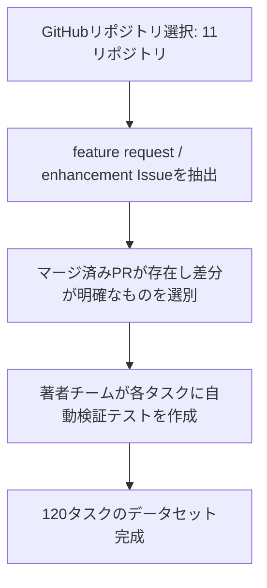

本記事は [arXiv:2602.10975 "FeatureBench: Benchmarking Agentic Coding for Complex Feature Development"](https://arxiv.org/abs/2602.10975)（Zhang, Wang, Xu, Hu, Liu, 2025年2月）の解説記事です。

## 論文概要（Abstract）

著者らは、コーディングエージェントの「新機能実装」能力を評価するベンチマーク**FeatureBench**を提案している。既存のSWE-benchがバグ修正を中心に評価するのに対し、FeatureBenchは11のオープンソースPythonリポジトリから収集した120のタスクで構成され、マルチファイル理解・長期計画・既存コードベースとの統合を要求する。評価の結果、最高性能のClaude 3.5 Sonnetでも成功率は**28.3%**にとどまり、現状のAIコーディングエージェントと実世界のソフトウェアエンジニアリングとの間に大きなギャップが存在することが示されている。

この記事は [Zenn記事: Agentic AIが引き起こす次の知能爆発 Science誌論文とSociety of Thoughtの全貌](https://zenn.dev/0h_n0/articles/672dc6adf8e50a) の深掘りです。

## 情報源

- **arXiv ID**: 2602.10975
- **URL**: [https://arxiv.org/abs/2602.10975](https://arxiv.org/abs/2602.10975)
- **著者**: Yuntong Zhang, Zejun Wang, Weiran Xu, Yiran Hu, Pengfei Liu
- **発表年**: 2025年
- **分野**: cs.SE, cs.AI

## 背景と動機（Background & Motivation）

Zenn記事では、AnthropicのCEO Dario Amodeiが「Anthropicのコードの70〜90%がClaudeによって書かれている」と言及していること、またSWE-bench Verifiedでの解決率が74.4%に達していることが紹介されている。しかし、Zenn記事はFeatureBenchの結果（11.0%）を引用し、「コード生成の量は増加しているが、複雑な設計判断や大規模リファクタリングでは依然として人間の関与が不可欠」と指摘している。

FeatureBenchはこの指摘の根拠となる論文である。SWE-benchがバグ修正（既存の壊れたものを直す能力）を測定するのに対し、FeatureBenchは「存在しないものを設計して作る」能力を測定する。この違いは、AIコーディングエージェントの実用性を評価する上で本質的に重要である。

## 主要な貢献（Key Contributions）

著者らは以下の貢献を報告している。

- **新ベンチマークの構築**: 11リポジトリ、120タスクから成るfeature-level実装ベンチマーク。各タスクはGitHubのfeature request / enhancement Issueから収集
- **難易度の再定義**: マルチファイル理解・長期計画・既存コードベースとの統合を要求するタスク設計で、既存ベンチマークでは評価できなかったエンジニアリング能力を測定
- **実態の定量化**: 最高性能モデルでも成功率28.3%という上限を示し、AIコーディングエージェントの実用限界を数値化
- **失敗モード分析**: 依存関係理解の欠如、API設計の誤りなど、タスク種別ごとの失敗パターンを分類
- **公開データセットと評価フレームワーク**: タスク・評価コードをオープンソースとして公開（MITライセンス）

## 技術的詳細（Technical Details）

### タスク収集プロセス

FeatureBenchのタスクは以下の手順で収集されている。



各タスクは以下の構造で構成されている。

| コンポーネント | 内容 | 用途 |
|---|---|---|
| `repo_snapshot/` | Issue提起時点のコードスナップショット | エージェントへの入力 |
| `task_description.md` | GitHub Issueの自然言語記述 | タスク仕様 |
| `reference_impl/` | マージ済みPRの実装 | 評価時の参照（エージェントには非公開） |
| `tests/` | 著者チーム作成の機能検証テスト | 自動評価 |

### 評価指標

著者らは以下の3段階の評価指標を設定している。

| 指標 | 内容 | 種別 |
|---|---|---|
| **Functional Correctness** | 著者作成テストの合格率 | Primary |
| **Code Quality Score** | Pylint/Flake8ベースの品質スコア | Secondary |
| **Reference Similarity** | 参照実装との類似度（BLEU/ASTベース） | Secondary |

さらに、20タスクのサブセットに対してhuman judgeによる評価を実施し、自動評価の妥当性を検証している。

### エージェント設定

各モデルはSWE-agentフレームワーク上で動作し、最大50ターンのtrialが許可される。使用可能なツールはbash, file_read, file_write, searchに限定されている。

## 実験結果（Results）

### モデル別成功率

著者らが報告する主要なベンチマーク結果は以下の通りである（論文のメインテーブルより）。

| モデル / エージェント | 成功率 |
|---|---|
| **Claude 3.5 Sonnet** | **28.3%** |
| GPT-4o | 21.7% |
| DeepSeek-V2.5 | 18.3% |
| Gemini 1.5 Pro | 16.7% |
| GPT-4o-mini | 11.7% |

Claude 3.5 Sonnetが全カテゴリでトップ性能を示し、特にAPI設計を要するタスクやインターフェース拡張タスクでGPT-4oに対して6〜10ポイントのリードを持つと報告されている。

### 難易度別の結果

論文Figure 3に基づく難易度別の概算結果は以下の通りである。

| 難易度 | Claude 3.5 Sonnet | GPT-4o |
|---|---|---|
| Easy | 約55% | 約45% |
| Medium | 約25% | 約18% |
| Hard | 約8% | 約5% |

Hard難易度のタスクでは全モデルが10%未満の成功率にとどまり、複雑な設計判断を伴うタスクでの限界が明確に示されている。

### SWE-benchとの比較

| 観点 | SWE-bench | FeatureBench |
|---|---|---|
| タスク種別 | バグ修正が主体（85%以上） | 新機能実装が100% |
| スコープ | 単一ファイル修正が多い | マルチファイル、新モジュール追加を含む |
| SOTA成功率 | 約50%（SWE-bench Lite） | 28.3% |
| 検証方法 | 既存テストの通過 | 著者作成の新規テスト |
| タスク数 | 2294（Lite: 300） | 120 |
| リポジトリ数 | 12 | 11（重複なし） |

著者らは「SWE-benchは壊れているものを直す能力を測定するが、FeatureBenchは存在しないものを設計して作る能力を測定する」と述べており、後者が現状のエージェントにとって著しく困難であることを強調している。

### 失敗モード分析

著者らは全モデルに共通する主要な失敗パターンとして以下を報告している。

1. **仕様理解の誤り**: テストは通過するが、機能の仕様を誤解した実装が多い。Human evalとの乖離が約10ポイント
2. **依存関係理解の欠如**: 既存コードとの依存関係を正しく把握できず、互換性のない変更を行う
3. **API設計の誤り**: 新しいインターフェースを設計する際に、既存のコードベースの設計パターンと一貫しない実装を行う
4. **リポジトリ規模の影響**: 小規模リポジトリ（5万行未満）では全モデルで比較的高い成功率を示すが、大規模リポジトリでは大幅に低下

## 実装のポイント（Implementation）

FeatureBenchを自身の環境で評価する際のポイントを整理する。

### 評価環境のセットアップ

```python
"""FeatureBench評価パイプラインの概念的構成

SWE-agentフレームワーク上でFeatureBenchタスクを実行する。

Requirements:
    Python 3.11+
    SWE-agent framework
    Docker (タスク実行用サンドボックス)
"""
from dataclasses import dataclass


@dataclass
class FeatureBenchTask:
    """FeatureBenchタスクの構成

    Attributes:
        repo_snapshot: Issue提起時点のコードスナップショット
        task_description: GitHub Issueの自然言語記述
        test_suite: 著者作成の機能検証テストパス
        max_turns: エージェントの最大ターン数
    """
    repo_snapshot: str
    task_description: str
    test_suite: str
    max_turns: int = 50


@dataclass
class EvaluationResult:
    """評価結果

    Attributes:
        functional_correctness: テスト合格率 (0.0-1.0)
        code_quality: Pylint/Flake8スコア
        reference_similarity: 参照実装との類似度
    """
    functional_correctness: float
    code_quality: float
    reference_similarity: float


def evaluate_task(
    task: FeatureBenchTask,
    agent_output: str,
) -> EvaluationResult:
    """タスク出力を評価

    Args:
        task: FeatureBenchタスク定義
        agent_output: エージェントが生成したコード差分

    Returns:
        評価結果
    """
    # 1. テスト実行（Docker sandbox内）
    # 2. コード品質チェック（Pylint/Flake8）
    # 3. 参照実装との類似度計算（BLEU/AST）
    raise NotImplementedError("実装はSWE-agentフレームワーク経由")
```

### 自社エージェントの評価への応用

FeatureBenchの知見を自社のコーディングエージェント評価に応用するポイントは以下の通りである。

- **Easy/Medium/Hardの3段階で分類**: 自社タスクもファイル変更数・新規モジュール追加有無・API設計の要否で難易度分類を行う
- **Human evalとの乖離を定量化**: 自動テスト合格率だけでなく、人手レビューとの一致度を計測する
- **リポジトリ規模の影響を考慮**: 大規模コードベースでは性能が大幅に低下するため、エージェントの適用範囲を明確にする

## 実運用への応用（Practical Applications）

FeatureBenchの結果は、AIコーディングエージェントの本番投入において以下の示唆を提供する。

- **適用領域の選定**: Easy難易度（単一ファイル変更、明確な仕様）のタスクでは55%の成功率が得られるため、定型的なfeature追加では実用的。Hard難易度（マルチファイル、設計判断が必要）のタスクでは8%以下であり、人間のレビューが必須
- **ハイブリッドワークフロー**: エージェントに初期実装を生成させ、人間がレビュー・修正するワークフローが現実的。Zenn記事で紹介したHuman-AI Centaurパターンに対応
- **SWE-benchとの併用**: バグ修正能力（SWE-bench）と新機能実装能力（FeatureBench）を併せて評価することで、エージェントの総合的な能力を把握できる
- **コスト効率**: 成功率28.3%は、エージェントの出力の約7割が無駄になることを意味する。エージェント実行コスト（API料金 + 計算資源）と人間エンジニアのコストを比較した上で導入判断を行う必要がある

## 関連研究（Related Work）

- **SWE-bench（Jimenez+23）**: 2294のバグ修正タスクで構成されるベンチマーク。SOTAは約50%（SWE-bench Lite）。FeatureBenchとの差異は上述
- **SWE-agent（Yang+24）**: FeatureBenchの評価フレームワークとして使用。エージェントにbash, file操作のツールを提供
- **AutoCodeRover（Zhang+24）**: コンテキスト検索に特化したコーディングエージェント。SWE-bench上で比較
- **Agentless（Xia+24）**: エージェントフレームワークなしで直接LLMにコード修正を行わせるアプローチ

## まとめと今後の展望

FeatureBenchは、AIコーディングエージェントの「新機能実装」能力を測定する初のベンチマークとして、SOTA（Claude 3.5 Sonnet）でも28.3%という低い成功率を報告している。この結果は、SWE-benchでの高い成功率（約50%）と対照的であり、バグ修正と新機能実装では必要とされる能力が根本的に異なることを示している。

論文の制約として、120タスクの規模の小ささ、Python限定、事前学習データ汚染の可能性が挙げられる。著者らは今後、多言語対応、タスク数の拡張（目標500+）、部分点評価、人間エンジニアとのベースライン比較を計画している。

Zenn記事でEvansらが主張する「AI R&D自動化の急速な進行」は、SWE-benchのようなバグ修正タスクでは裏付けられるが、FeatureBenchが測定する設計・実装能力ではまだ大きなギャップが存在する。この差異の理解が、Agentic AIの実用化において重要な判断材料となる。

## 参考文献

- **arXiv**: [https://arxiv.org/abs/2602.10975](https://arxiv.org/abs/2602.10975)
- **SWE-bench**: [https://epoch.ai/benchmarks/swe-bench-verified](https://epoch.ai/benchmarks/swe-bench-verified)
- **Related Zenn article**: [https://zenn.dev/0h_n0/articles/672dc6adf8e50a](https://zenn.dev/0h_n0/articles/672dc6adf8e50a)
- **SWE-agent**: Yang et al. (2024), SWE-agent: Agent-Computer Interfaces Enable Automated Software Engineering
