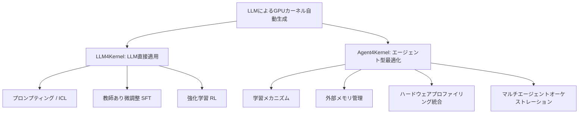
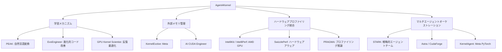

本記事は [arXiv:2601.15727 "Towards Automated Kernel Generation in the Era of LLMs"](https://arxiv.org/abs/2601.15727) の解説記事です。

## 論文概要（Abstract）

Yang Yu, Peiyu Zang, Chi Hsu Tsai ら14名（2026年1月）は、LLMを用いたGPUカーネル自動生成・最適化の研究分野を体系的に整理したサーベイ論文を発表した。著者らは、現代のAIシステムの性能がカーネル（高水準アルゴリズムを低水準ハードウェア操作に変換するコード）の品質に根本的に制約されていると指摘し、カーネルエンジニアリングが専門家レベルのハードウェア知識を要求する非スケーラブルなプロセスである問題を提起している。本サーベイは、LLMベースのアプローチとエージェント型最適化ワークフローの2大カテゴリに分類し、学習・評価を支えるデータセットとベンチマークを体系的にまとめた初の包括的サーベイである。

この記事は [Zenn記事: コーディングエージェントでコンパイラ・FPGA・カーネルドライバを実装する実践手法](https://zenn.dev/0h_n0/articles/1b8128982c9887) の深掘りです。

## 情報源

- **arXiv ID**: 2601.15727
- **URL**: [https://arxiv.org/abs/2601.15727](https://arxiv.org/abs/2601.15727)
- **著者**: Yang Yu, Peiyu Zang, Chi Hsu Tsai, Haiming Wu, Yixin Shen, Jialing Zhang, Haoyu Wang, Zhiyou Xiao, Jingze Shi, Yuyu Luo, Wentao Zhang, Chunlei Men, Guang Liu, Yonghua Lin
- **発表年**: 2026（v1: 2026-01-22, v2: 2026-01-26）
- **分野**: cs.PL, cs.AI, cs.LG
- **関連リポジトリ**: [flagos-ai/awesome-LLM-driven-kernel-generation](https://github.com/flagos-ai/awesome-LLM-driven-kernel-generation)

## 背景と動機（Background & Motivation）

GPUカーネルは、PyTorchやTensorFlowなどの深層学習フレームワークにおいて、行列演算・畳み込み・アテンション計算などの計算グラフを、GPU上の実際のハードウェア命令列に変換する「最後の翻訳層」である。高効率なカーネルを書くためには、メモリ階層（グローバルメモリ → 共有メモリ → レジスタ）の理解、ワープレベルの並列化戦略、バンクコンフリクトの回避、タイリングとループアンローリングなど、多岐にわたるハードウェア知識が必要とされる。

従来、この作業はCUDAやTritonに精通したエキスパートエンジニアに依存してきた。NVIDIAのcuBLASやcuDNNのようなベンダーライブラリは高度に最適化されているが、新しい演算パターン（FlashAttention、MoE向けカーネル等）への対応にはカスタムカーネル開発が不可欠である。この「カーネルエンジニアリングのボトルネック」が、AI研究とプロダクション展開の両方において深刻な課題となっている。

著者らは、LLMが以下の2つの観点からこの課題を解決しうると主張している。

1. **知識の圧縮**: LLMはCUDA/Tritonコードの大規模コーパスから、形式化が困難な暗黙的最適化パターンを学習できる
2. **反復的最適化**: エージェント型システムにより、コンパイラフィードバックやプロファイラ出力を活用した反復的な改善ループが構築可能

しかし、研究は急速に進展する一方で断片化しており、体系的な整理がなされていなかった。本サーベイはこのギャップを埋めることを目的としている。

## 主要な貢献（Key Contributions）

- **貢献1**: LLMベースのカーネル生成手法を、プロンプティング/ICL → 教師あり微調整（SFT）→ 強化学習（RL）→ エージェント型最適化の4段階で体系的に分類した初のタクソノミーを構築
- **貢献2**: データセット（The Stack v2 HPCサブセット、KernelBook等）とベンチマーク（KernelBench、TritonBench、MultiKernelBench等）を網羅的にカタログ化
- **貢献3**: エージェント型システムにおける学習メカニズム、外部メモリ管理、ハードウェアプロファイリング統合、マルチエージェントオーケストレーションの4つのサブカテゴリで整理
- **貢献4**: 研究のオープンチャレンジと今後の方向性を提示し、分野の包括的リファレンスを確立

## 技術的詳細（Technical Details）

### サーベイの全体構造

本サーベイは、カーネル自動生成の手法を大きく2つの柱で整理している。

以下、各アプローチの技術的詳細を解説する。

### アプローチ1: 教師あり微調整（SFT）

SFTアプローチは、PyTorchモジュールとTriton/CUDAカーネルの対応ペアを用いてLLMを微調整する手法である。代表的な研究にMeta FAIRの**KernelLLM**がある。

KernelLLMはLlama 3.1 Instruct（8Bパラメータ）をベースに、約25,000ペアの学習データ（KernelBookデータセット）で微調整された。KernelBookは、The Stackからフィルタリングしたコードと`torch.compile()`で合成生成したTritonカーネルで構成される。学習は16 GPU上で約12時間（192 GPU時間）で完了し、標準的なSFTレシピ（バッチサイズ32、10エポック）を使用している。

SFTアプローチの特徴は、8Bパラメータという比較的小規模なモデルでも、ドメイン特化型の微調整によりGPT-4oやDeepSeek V3を上回る単発生成性能を達成できる点である。著者らの報告によれば、KernelLLMはKernelBench-Triton Level 1において、2桁大きいパラメータ数を持つモデルを超える性能を示した。

一方で、SFTには以下の限界がある。

- 学習データの品質と量に性能が強く依存する
- 未知の最適化パターンへの汎化が困難
- 実行時フィードバックを学習ループに組み込めない

### アプローチ2: 強化学習（RL）

RLアプローチは、実行結果やプロファイラ出力を報酬信号として利用し、カーネルの正確性と性能を同時に最適化する。このカテゴリでは**CUDA-L1**と**CUDA-L2**が代表的な成果である。

**CUDA-L1**は対比強化学習（Contrastive RL）を採用し、「速いカーネルと遅いカーネルの違い」を直接学習させる手法である。具体的には、生成されたカーネルのペアを比較し、実行速度の差を報酬としてモデルを更新する。A100 GPU上で訓練した結果、KernelBenchの全250カーネルに対してベースライン比で平均3.12倍、中央値1.42倍の高速化を達成し、ピーク時には120倍の高速化を報告している。

**CUDA-L2**はCUDA-L1の拡張であり、行列乗算（HGEMM）に特化した最適化を行う。以下の技術的改良が加えられている。

1. **継続事前学習**: より多様なCUDAコードでの事前学習を追加
2. **多段階RL訓練**: 汎用カーネル → 行列乗算特化の段階的訓練
3. **NCUプロファイリングメトリクスの統合**: コンテキストに詳細なプロファイリング情報を付加
4. **検索拡張コンテキスト**: 新しいアーキテクチャ特性に対応するためのRAG的手法

CUDA-L2の報告では、A100 GPU上の1000設定に対して、NVIDIAのcuBLASLt-AutoTuning比で11.4%、`torch.matmul`比で22.0%、cuBLAS比で19.2%の高速化を達成したとされる。

RLアプローチの数学的な定式化として、カーネル最適化は以下のように記述できる。

$$
\pi^* = \arg\max_{\pi} \mathbb{E}_{k \sim \pi(\cdot | x)} \left[ R(k, x) \right]
$$

ここで $\pi$ はカーネル生成ポリシー、$x$ は入力仕様（PyTorchモジュール）、$k$ は生成されたカーネル、$R(k, x)$ は正確性と実行速度に基づく報酬関数である。

その他のRL手法として、**Kevin**（マルチターンCUDA合成）、**AutoTriton**（自動Tritonプログラミング）、**TritonRL**（評価時の「チート」を排除した訓練）、**Dr. Kernel**（Triton向けRL手法）などが挙げられている。

### アプローチ3: エージェント型最適化（Agentic Systems）

エージェント型アプローチは、カーネル開発を「反復的なフィードバック駆動ループ」として定式化し、計画・コード生成・デバッグ・プロファイリング解析を組み合わせる。本サーベイでは4つのサブカテゴリで整理している。

#### マルチエージェントオーケストレーション: STARKの詳細

マルチエージェント手法の代表例として**STARK（Strategic Team of Agents for Refining Kernels）**を詳述する。STARKはモノリシックなエージェントを、Plan / Code / Debug の3つの専門エージェントに分解し、ツリーメモリ上の戦略的探索と組み合わせる。

| エージェント | 温度 | 役割 |
|:---|:---:|:---|
| Plan Agent | 0.8 | メモリタイリング・演算子融合等の高水準変換を提案。`<<<IMPROVE BEGIN>>>` マーカーで具体的なコード箇所を指定 |
| Code Agent | 0.1 | 計画指示をCUDAカーネルコードに変換。低温度で精度重視。兄弟カーネルからの微小最適化の転送も実施 |
| Debug Agent | 0.1 | コンパイルエラー・正確性エラーの修復。ストライドアラインメントやoff-by-oneガードなどの構造的問題を修正 |

STARKの協調メカニズムは3層で構成される。

1. **マルチエージェントワークフロー**: 計画・コーディング・デバッグの分離
2. **グラウンデッドインストラクション**: 計画されたコード編集を具体的なコードスパンにアンカーし、動的コンテキストウィンドウで役割固有の履歴（過去の試行、失敗、プロファイラフィードバック）を各エージェントに提示
3. **戦略的探索ポリシー**: 探索と活用のバランスをとった反復的試行

著者らの報告では、STARKはLevel 1でReflexionベースライン比13.7倍、Level 2で16倍の高速化を達成し、Level 1-2で100%の成功率、Level 3で87.5%のfast₁達成率を示している。

#### 推論時スケーリング: NVIDIAのDeepSeek-R1活用事例

NVIDIAの技術ブログでは、DeepSeek-R1とインファレンスタイムスケーリングを組み合わせたGPUアテンションカーネルの自動生成が報告されている。このアプローチでは、DeepSeek-R1がカーネルを生成し、検証器がH100 GPU上で実行・分析し、フィードバックを次のプロンプトに反映する閉ループプロセスを形成する。15分間の反復プロセスで、KernelBench Level 1で100%、Level 2で96%の正確性を達成したと報告されている。

## ベンチマークと評価（Benchmarks）

本サーベイで整理されたベンチマークを以下の表にまとめる。

| ベンチマーク | 公開年月 | タスク数 | 対象DSL | 評価指標 | 特徴 |
|:---|:---:|:---:|:---|:---|:---|
| KernelBench | 2025-02 | 250 | CUDA / Triton | fast_p（正確性+高速化率） | 3段階難易度、PyTorchベースライン比較 |
| TritonBench | 2025-02 | - | Triton | 演算子レベル性能 | Triton特化評価 |
| ParEval | 2024-01 | - | CUDA / OpenMP / MPI | 並列コード正確性 | 並列プログラミング全般 |
| MultiKernelBench | 2025-07 | - | CUDA / Triton / 他 | マルチプラットフォーム性能 | 複数ハードウェアプラットフォーム対応 |
| TritonGym | 2025-10 | - | Triton | エージェントワークフロー評価 | エージェント向け環境 |
| BackendBench | 2025-09 | - | 複数 | 性能トレース | バックエンドレベル評価 |

### KernelBenchの詳細構造

KernelBenchは最も広く採用されているベンチマークであり、以下の3段階で構成される。

- **Level 1（100タスク）**: 単一演算（行列乗算、畳み込み、Swish等）
- **Level 2（100タスク）**: 演算シーケンス（融合最適化の機会を含む）
- **Level 3（50タスク）**: GitHubリポジトリから抽出した完全なMLアーキテクチャ

評価指標 **fast_p** は以下のように定義される。

$$
\text{fast}_p = \frac{|\{t \in T : \text{correct}(t) \wedge \text{speedup}(t) > p\}|}{|T|}
$$

ここで $T$ はタスク集合、$p$ は高速化の閾値である。$p=0$ は純粋な正確性、$p=1$ はPyTorch Eagerベースライン以上の性能を要求する。

### 主要データセット

| データセット | 種別 | 規模 | 内容 |
|:---|:---|:---|:---|
| The Stack v2（HPCサブセット） | 構造化 | 大規模 | HPC関連コードのフィルタリング済みコーパス |
| KernelBook | 構造化 | 約25,000ペア | PyTorchモジュール ↔ Tritonカーネルの対応 |
| HPC-Instruct | 構造化 | - | HPCコード向け指示チューニングデータ |
| CUTLASS / FlashAttention等 | コードリポジトリ | 14+ライブラリ | CUDAカーネルの実装参照 |

## 実験結果（Results）

### KernelBenchにおける各モデルの性能比較

サーベイ中で引用されているKernelBenchの単発生成（one-shot）結果を以下に示す（fast₁指標）。

| モデル | パラメータ規模 | Level 1 | Level 2 | Level 3 |
|:---|:---:|:---:|:---:|:---:|
| DeepSeek R1 | 671B（MoE） | 12% | 36% | 2% |
| OpenAI o1 | 非公開 | 10% | 24% | 12% |
| Claude 3.5 Sonnet | 非公開 | 10% | 7% | 2% |
| DeepSeek V3 | 671B（MoE） | 6% | 4% | 8% |
| GPT-4o | 非公開 | 4% | 5% | 0% |
| Llama 3.1-70B | 70B | 3% | 0% | 0% |
| KernelLLM（SFT） | 8B | KernelBench-Tritonで上位 | - | - |

この結果から、以下の重要な知見が得られる。

1. **推論モデルが優位**: DeepSeek R1やo1のような推論特化モデルが単発生成では最も高い性能を示す
2. **それでも20%未満**: 最高性能のモデルでもPyTorchベースラインを超えるカーネルは全体の20%未満にとどまる
3. **SFTの競争力**: 8BパラメータのKernelLLMが、数百倍のパラメータを持つ汎用モデルと同等以上の性能を達成

### 反復的改善による性能向上

実行フィードバックとプロファイラ出力を10ターンにわたって提供した場合、性能は大幅に向上する。

| モデル | Level 1（1-shot → 10-turn） | Level 2（1-shot → 10-turn） | Level 3（1-shot → 10-turn） |
|:---|:---:|:---:|:---:|
| DeepSeek R1 | 12% → 43% | 36% → 72% | 2% → 18% |

この結果は、カーネル生成においてインファレンスタイムスケーリング（反復的改善）が極めて重要であることを示している。

### RLアプローチの達成性能

| 手法 | 対象 | ベースライン比高速化 | 備考 |
|:---|:---|:---:|:---|
| CUDA-L1 | KernelBench全250カーネル | 平均3.12倍（中央値1.42倍） | ピーク120倍。A100上で訓練 |
| CUDA-L2 | HGEMM（行列乗算） | cuBLASLt比11.4%、torch.matmul比22.0% | A100上1000設定で評価 |

### マルチエージェント（STARK）の達成性能

| レベル | Reflexion比高速化 | Torchベースライン比 | 成功率 |
|:---|:---:|:---:|:---:|
| Level 1 | 13.7倍 | 3.03倍 | 100% |
| Level 2 | 16倍 | 2.69倍 | 100% |
| Level 3 | 5.5-6倍 | - | 87.5%（fast₁） |

## 関連研究（Related Work）

本サーベイが対象とする分野は、以下の複数の研究領域の交差点に位置する。

**LLMによるコード生成**: StarCoder、CodeLlama、DeepSeek-Coderなどの汎用コード生成モデルが基盤となっている。これらのモデルはPythonやJavaScriptなどの汎用言語では高い性能を示すが、CUDAやTritonといった低水準並列プログラミング言語でのカーネル生成はドメイン固有の課題を伴う。

**従来のカーネル自動チューニング**: Halide、TVM、Ansor、FlexTensor等のコンパイラベースの自動チューニングフレームワークは、探索空間を明示的に定義した上で最適化を行う。これらはルールベースであるため確実性が高いが、新しい演算パターンや最適化戦略の発見には限界がある。本サーベイの対象であるLLMベースの手法は、こうした明示的ルール化が困難な最適化知識を暗黙的に学習できる点で相補的である。

**エージェント型システム**: SWE-bench（ソフトウェアエンジニアリング）、SWE-Agent、OpenDevin等の自律的コーディングエージェントの発展を背景としている。カーネル生成では、コンパイラエラーの修正やプロファイラフィードバックの解析が「ツール利用」として自然にエージェントアーキテクチャに統合される。

**ハードウェアアウェア最適化**: NVIDIA NsightやNCUプロファイラからのメトリクス（メモリ帯域幅利用率、SM占有率、ワープストール等）をLLMのコンテキストに直接フィードするアプローチが増加している。SwizzlePerfやPRAGMAはこの方向の代表的研究であり、ハードウェアレベルの洞察をLLMの推論に統合している。

## まとめと今後の展望

本サーベイは、LLMによるGPUカーネル自動生成の急速に発展する分野を、LLM4Kernel（直接適用: プロンプティング、SFT、RL）とAgent4Kernel（エージェント型: 学習、メモリ、プロファイリング、マルチエージェント）の体系的なタクソノミーで整理した。

現時点での主要な知見を以下にまとめる。

1. **単発生成の限界**: 最先端の推論モデル（DeepSeek R1）でも、one-shotでPyTorchベースラインを超えるカーネルの生成率はLevel 1で12%にとどまる
2. **反復改善の有効性**: 実行フィードバックを用いた10ターンの反復で性能は3-4倍向上する（Level 2: 36% → 72%）
3. **SFTの効率性**: 8BパラメータのKernelLLMが671Bの汎用モデルと同等以上の性能を達成し、ドメイン特化型微調整の費用対効果の高さを実証
4. **RLの可能性**: CUDA-L2がcuBLASを11.4%上回る結果は、LLM+RLが手書きの高度最適化ライブラリすら超えうることを示唆
5. **マルチエージェントの優位性**: STARKがReflexion比13-16倍の高速化を達成し、専門家の分業ワークフローを模倣する設計が有効であることを示した

今後の課題として、著者らは以下を指摘している。

- **ハードウェア汎化**: 現在の研究の多くがNVIDIA GPU（特にA100/H100）に限定されており、AMD GPU、Intel GPU、NPU（Ascend等）への汎化が不十分
- **評価の標準化**: ベンチマーク間で評価プロトコルが統一されておらず、公平な手法比較が困難
- **スケーラビリティ**: 単一カーネルの最適化から、カーネルグラフ全体（複数カーネルの融合・パイプライン化）への拡張
- **安全性とロバスト性**: 自動生成カーネルの数値安定性・メモリ安全性の保証メカニズムが未確立

本サーベイは、カーネルエンジニアリングの自動化が「可能性の検証段階」から「実用化に向けた技術成熟段階」に移行しつつあることを示す重要なマイルストーンであると位置づけられる。

## 参考文献

1. Yang Yu et al., "Towards Automated Kernel Generation in the Era of LLMs," arXiv:2601.15727, 2026.
2. Anne Ouyang, Simon Guo et al., "KernelBench: Can LLMs Write Efficient GPU Kernels?" arXiv:2502.10517, 2025.
3. STARK: Strategic Team of Agents for Refining Kernels, arXiv:2510.16996, 2025.
4. CUDA-L1: Improving CUDA Optimization via Contrastive Reinforcement Learning, arXiv:2507.14111, 2025.
5. CUDA-L2: Surpassing cuBLAS Performance for Matrix Multiplication through Reinforcement Learning, arXiv:2512.02551, 2025.
6. Meta FAIR, "KernelLLM," [https://huggingface.co/facebook/KernelLLM](https://huggingface.co/facebook/KernelLLM).
7. NVIDIA, "Automating GPU Kernel Generation with DeepSeek-R1 and Inference Time Scaling," NVIDIA Technical Blog, 2025.
8. flagos-ai, "awesome-LLM-driven-kernel-generation," [https://github.com/flagos-ai/awesome-LLM-driven-kernel-generation](https://github.com/flagos-ai/awesome-LLM-driven-kernel-generation).
