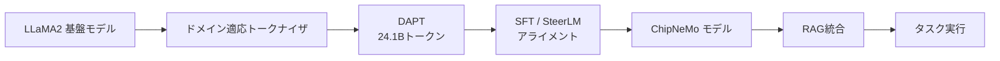
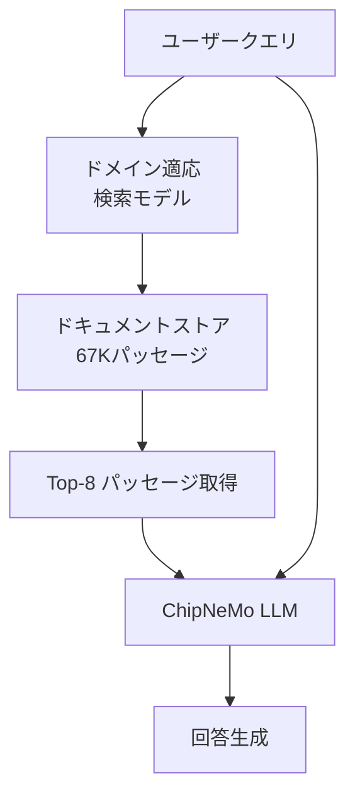

本記事は [arXiv:2311.00176 "ChipNeMo: Domain-Adapted LLMs for Chip Design"](https://arxiv.org/abs/2311.00176) の解説記事です。

## 論文概要（Abstract）

Liu et al.（2023）は、汎用LLMをチップ設計ドメインに適応させるための包括的手法「ChipNeMo」を提案した。著者らは、LLaMA2（7B/13B/70B）を基盤モデルとして、ドメイン適応事前学習（Domain-Adaptive Pretraining: DAPT）、検索拡張生成（Retrieval-Augmented Generation: RAG）、教師あり微調整（Supervised Fine-Tuning: SFT）の3つの手法を組み合わせることで、汎用モデルの事前学習コストの1.5%未満の追加コストで、チップ設計タスクにおいて大幅な性能向上を達成したと報告している。特に、ChipNeMo-70BはエンジニアリングチャットボットおよびEDAスクリプト生成タスクでGPT-4を上回る性能を示した。

この記事は [Zenn記事: コーディングエージェントでコンパイラ・FPGA・カーネルドライバを実装する実践手法](https://zenn.dev/0h_n0/articles/1b8128982c9887) の深掘りです。

## 情報源

- **arXiv ID**: 2311.00176
- **URL**: [https://arxiv.org/abs/2311.00176](https://arxiv.org/abs/2311.00176)
- **著者**: Mingjie Liu, Teodor-Dumitru Ene, Robert Kirby, Chris Sanchez 他（NVIDIA、計42名）
- **発表年**: 2023
- **分野**: cs.CL, cs.AI
- **発表**: ICCAD 2023で初公開

## 背景と動機（Background & Motivation）

半導体チップの設計プロセスは、RTL（Register Transfer Level）記述、論理合成、配置配線、検証に至るまで多段階にわたる高度に専門的な作業である。エンジニアは社内の膨大な設計ドキュメント、EDAツールのスクリプト、バグレポートを日常的に参照しており、これらの情報へのアクセスと処理を効率化するニーズがある。

GPT-4やLLaMA2といった汎用LLMは、一般的なコーディングや自然言語処理には優れた性能を示すものの、チップ設計固有の用語（Verilog、SystemVerilog、EDAツールAPI）や社内プロプライエタリな知識に対しては十分な精度を発揮できない。著者らはこの課題に対し、ドメイン適応型のアプローチを採用した。

先行研究として、BloombergGPT（金融ドメイン）、BioMedLLM（生物医学ドメイン）、Galactica（科学ドメイン）がそれぞれ100B以上のドメイン固有トークンでフルスクラッチまたは大規模学習を行っているが、これらは膨大な計算コストを要する。ChipNeMoは、既存の基盤モデルに対するDAPTという効率的なアプローチにより、フルスクラッチ学習の1.5%未満のコストでドメイン適応を実現する点に特徴がある。

## 主要な貢献（Key Contributions）

- **ドメイン適応事前学習（DAPT）**: 24.1Bトークンのチップ設計コーパスによる継続事前学習で、基盤モデルの事前学習コストの1.5%未満で大幅な性能向上を達成
- **ドメイン適応トークナイザ**: LLaMA2の32Kトークン語彙に約9Kのドメイン固有トークンを追加し、トークン化効率を1.6%〜3.3%改善
- **ドメイン適応検索モデル**: e5_small_unsupervisedを微調整し、既存の汎用検索モデルに対して2倍の検索精度を達成
- **3つの実用タスクでの評価**: エンジニアリングチャットボット、EDAスクリプト生成、バグ要約・分析の3タスクで網羅的な評価を実施
- **モデルサイズの効率化**: ドメイン適応により、5倍小さいモデルで同等以上の性能を達成可能であることを実証

## 技術的詳細（Technical Details）

### 全体アーキテクチャ

ChipNeMoのドメイン適応パイプラインは、以下の4段階で構成される。



### ドメイン適応事前学習（DAPT）

DAPTは、既に事前学習済みの基盤モデルに対して、ドメイン固有のデータで継続学習を行う手法である。

#### 学習データの構成

学習コーパスは社内データと公開データから構成される。

| データソース | 説明 | 比率 |
|:---|:---|:---|
| 社内チップ設計データ | 設計ドキュメント、検証コード、インフラコード、社内文書 | 23.1Bトークン |
| 公開データ（Wikipedia等） | 自然言語の多様性を維持するため | 約9.2% |
| 公開コード（GitHub） | C++、Python、Verilog | 約9.2%に含む |

著者らは、データブレンド戦略として、コードデータのダウンサンプリングと自然言語（設計ドキュメント）のアップサンプリングを行い、EDAツールスクリプトの比率を増加させたと報告している。社内データは2〜4エポック、公開データは1エポックで学習される。

#### 学習ハイパーパラメータ

| パラメータ | 値 |
|:---|:---|
| グローバルバッチサイズ | 256 |
| 学習ステップ数 | 23,200（約1エポック） |
| 実効バッチサイズ | 1Mトークン |
| 学習率 | $5 \times 10^{-6}$（固定、スケジューラなし） |
| オプティマイザ | Adam（$\beta_1 = 0.9, \beta_2 = 0.95$） |
| 重み減衰 | 0.01 |
| コンテキスト長 | 4096トークン |

#### 計算コスト

DAPTの計算コストは、基盤モデルのフルスクラッチ事前学習と比較して極めて小さい。

| モデル | 事前学習（LLaMA2） | DAPT | SFT |
|:---|---:|---:|---:|
| ChipNeMo-7B | 184,320 GPU時間 | 4,600 GPU時間 | 200 GPU時間 |
| ChipNeMo-13B | 368,640 GPU時間 | 6,800 GPU時間 | 400 GPU時間 |
| ChipNeMo-70B | 1,720,320 GPU時間 | 20,500 GPU時間 | 840 GPU時間 |

ChipNeMo-70BのDAPTは、LLaMA2-70Bの事前学習コストの約1.2%に相当する。

### ドメイン適応トークナイザ

LLaMA2のBPEトークナイザ（32Kトークン語彙）は汎用テキスト向けに最適化されており、チップ設計固有の用語（例: `clk_div_en`, `FIFO_DEPTH`）の分割効率が低い。著者らは約9Kのドメイン固有トークンを追加し、語彙サイズを拡張した。

トークナイザ拡張時、新規トークンに対応する埋め込みベクトルは未学習のため、学習初期に損失が一時的に増加する。著者らは、DAPTの1エポック学習後にはこの損失増加が解消され、同等の学習損失に収束したと報告している。

公開データに対するトークン化効率への影響は観察されず、ドメインデータに対して1.6%〜3.3%の効率改善が確認されている。

### RAGアーキテクチャ

チップ設計では、社内の設計仕様書やツールドキュメントなどのプロプライエタリな知識が不可欠である。ChipNeMoはRAGを導入し、検索モデルのドメイン適応も行っている。



#### 検索モデルの詳細

| 項目 | 詳細 |
|:---|:---|
| ベースモデル | e5_small_unsupervised |
| 微調整データ | 3,000件のドメイン固有自動生成サンプル |
| フレームワーク | Tevatron |
| ドキュメント数 | 約1,800件の設計文書 |
| パッセージ数 | 約67,000（約512文字/パッセージ） |
| Top-K | 8パッセージ |

ドメイン適応した検索モデルは、元のe5_small_unsupervisedに対して2倍、Sentence Transformerに対して30%のヒット率改善を達成したと報告されている。

#### RAGの効果

RAGは、検索がヒットしない場合でもスコアを低下させにくいことが確認されている。これは、検索結果が厳密に二値的な成功/失敗ではなく、部分的に関連するコンテキストでもLLMの回答品質を改善するためと著者らは分析している。

### SFTとモデルアライメント

ChipNeMoでは、DAPTの後に2種類のアライメント手法を検討している。

#### 指示データの構成

| データセット | サンプル数 | 用途 |
|:---|---:|:---|
| 汎用チャットデータ | 128,000 | 一般的な対話能力の維持 |
| 設計知識 | 302 | ドメイン固有QA |
| EDAスクリプト | 480 | ツールスクリプト生成 |
| バグ分析 | 648 | バグレポート要約 |
| **合計** | **約129,430** | |

SFT時のグローバルバッチサイズは128（DAPTの256から縮小）で、学習率とオプティマイザはDAPTと同一設定である。著者らは、ドメイン固有データでの複数エポック学習ではモデルが急速に過学習の兆候を示したと報告しており、1エポックでの学習を採用している。

#### SteerLM vs SFT

著者らはSteerLMとSFTの2つのアライメント手法を比較している。SteerLMは属性条件付き微調整であり、LLaMA2-13Bで訓練された属性モデルを使用する。

- SteerLMの学習: HelpSteerおよびOASST（56K）とドメインデータ（1.4K）の混合データで2エポック
- SteerLMはSFTに対して、エンジニアリングチャットボットの人間評価スコアを0.62ポイント改善

著者らはまた、DAPTを**チャット済みモデル**（LLaMA2-Chat）に適用すると、モデルのアライメントが大幅に劣化することを確認している。そのため、DAPTはベースモデルに対して実施し、その後にSFT/SteerLMでアライメントする順序が重要であると結論している。

### モデルアーキテクチャの詳細

ChipNeMoはLLaMA2アーキテクチャをそのまま使用しており、Tensor ParallelismとFlash Attentionを効率化のために導入している。コンテキスト長は4096トークンである。

損失関数は標準的な次トークン予測（Causal Language Modeling）であり、SFT時にはシステムプロンプトとユーザープロンプトのトークンに対して損失マスキングを適用している。

$$
\mathcal{L} = -\sum_{t \in \text{response}} \log P(x_t \mid x_{<t})
$$

## 実験結果（Results）

### AutoEval ドメインベンチマーク

著者らは、MMLUに準じたMultiple-Choice形式のAutoEvalベンチマークを構築し、ドメイン専門家と共同で作成した。

| モデル | 設計知識 | EDAスクリプト | バグ要約 | 回路設計 |
|:---|---:|---:|---:|---:|
| LLaMA2-70B | 52.3% | 64.9% | 56.9% | 67.0% |
| GPT-4 | 58.4% | 77.4% | 63.4% | 79.0% |
| **ChipNeMo-70B** | **76.6%** | **73.9%** | **65.8%** | **71.7%** |

ChipNeMo-70Bは設計知識で+24.3ポイント（LLaMA2-70B比）、+18.2ポイント（GPT-4比）の改善を示した。一方、回路設計ではGPT-4が79.0%と最高スコアを記録している。

### エンジニアリングチャットボット（7段階リッカートスケール）

88件の質問に対する人間評価の結果は以下の通りである。

| モデル | RAGなし | RAGあり | RAG改善幅 |
|:---|---:|---:|---:|
| LLaMA2-70B-Chat | 2.17 | 4.22 | +2.05 |
| GPT-4 | 5.06 | 6.74 | +1.68 |
| **ChipNeMo-70B-Steer** | **5.48** | **6.04** | **+0.56** |

ChipNeMo-70B-SteerはRAGなしでGPT-4を上回るスコア（5.48 vs 5.06）を達成している。RAG適用後はGPT-4がやや上回る（6.74 vs 6.04）が、これはGPT-4がRAGによるコンテキスト追加の恩恵をより大きく受けるためと著者らは分析している。

注目すべき点として、ChipNeMo-13B-ChatにRAGを適用した場合のスコア（7.4相当）が、5倍大きいLLaMA2-70B-ChatにRAGを適用した場合と同等であることが報告されている。

### EDAスクリプト生成

EDAツール（Python API）のスクリプト生成タスクでは、以下の結果が報告されている。

- **ChipNeMo-70B-Steer**: 自動評価で70%以上の正答率
- **GPT-4**: ほぼ0%の正答率（ドメイン固有APIの知識不足）
- **LLaMA2-70B-Chat**: ほぼ0%の正答率

このタスクでは、DAPTのみでは不十分であり、ドメイン固有のSFTデータ（480件のEDAスクリプト指示データ）が性能向上に不可欠であったと著者らは報告している。SFTによる追加学習により、EDAスクリプトの正答率が18%改善された。

### バグ要約・分析（7段階リッカートスケール）

30件のバグに対する人間評価結果は以下の通りである。ChipNeMo-13B-ChatとLLaMA2-13B-Chat*の比較では:

| 評価項目 | ChipNeMo改善幅 |
|:---|---:|
| 技術要約 | +0.82 |
| マネジメント要約 | +1.09 |
| 担当者推薦 | +0.61 |

### 汎用コード生成（参考）

ドメイン適応がコーディング能力全般に与える影響を確認するため、HumanEvalおよびVerilogEvalベンチマークでの評価も実施されている。

| モデル | HumanEval | VerilogEval-Human | VerilogEval-Machine |
|:---|---:|---:|---:|
| LLaMA2-70B | 28.0% | 30.8% | 51.0% |
| GPT-4 | 67.0% | 43.5% | 60.0% |
| ChipNeMo-70B | 30.5% | 27.6% | 53.8% |

ChipNeMo-70Bは汎用コード生成能力をおおむね維持しつつ、VerilogEval-Humanではやや低下（-3.2ポイント）が見られる。著者らは、DAPT時の公開データ混合がこの汎用能力の維持に寄与していると分析している。

## 実装のポイント（Implementation）

### DAPT実施時の注意点

1. **学習順序**: DAPTはベースモデルに対して実施し、チャットアライメント済みモデルには適用しない。LLaMA2-Chatに対するDAPTはアライメントを破壊する
2. **トークナイザ拡張**: 新規トークンの埋め込みは未学習のため、学習初期の損失増加は想定内の挙動である
3. **小さな学習率**: $5 \times 10^{-6}$ の固定学習率で、スケジューラは使用しない。基盤モデルの知識を破壊しないための配慮である

### RAG導入時の設計指針

1. **パッセージ長**: 約512文字を1パッセージとして分割。チップ設計ドキュメントの構造に合わせた分割が重要
2. **Top-K設定**: 8パッセージを取得し、LLMのコンテキストに追加。コンテキスト長4096トークンの制約内で設定
3. **検索モデルの微調整**: 3,000件の自動生成ペアで十分な改善が得られる。大量のアノテーションは不要

### SFTデータの効率的な作成

1. **少量データの有効性**: 1,430件のドメイン固有指示データで有意な改善が可能。ただし過学習に注意（1エポックが最適）
2. **汎用データとの混合**: 128Kの汎用チャットデータとの混合により、一般的な対話能力を維持しつつドメイン特化が可能

```python
# SFTデータブレンドの擬似コード
from dataclasses import dataclass


@dataclass(frozen=True)
class SFTConfig:
    """SFTの設定パラメータ。"""

    general_chat_samples: int = 128_000
    domain_samples: int = 1_430  # 設計知識302 + EDA480 + バグ648
    batch_size: int = 128
    learning_rate: float = 5e-6
    epochs: int = 1  # 過学習回避のため1エポック


def create_sft_dataset(
    general_data: list[dict],
    domain_data: list[dict],
    config: SFTConfig,
) -> list[dict]:
    """汎用データとドメインデータを混合したSFTデータセットを作成する。

    Args:
        general_data: 汎用チャットの指示データ
        domain_data: ドメイン固有の指示データ
        config: SFT設定

    Returns:
        混合されたSFTデータセット
    """
    dataset = general_data[:config.general_chat_samples] + domain_data
    return dataset
```

## 関連研究（Related Work）

### LLMのチップ設計への応用

- **Dave**: GPT-2を用いた英語からVerilogへの変換を最初に探求した研究
- **CodeGen**: GitHubおよび教科書のVerilogデータセットで微調整し、OpenAIのcode-davinci-002を上回る性能を報告
- **Chip-Chat**: GPT-4/GPT-3.5を用いた対話型の8ビットアキュムレータ設計・検証。エラー検出の限界を指摘
- **ChipEDA**: 微調整済みLLaMA2-70BがGPT-4を上回るEDAスクリプト生成性能を報告

### ドメイン適応事前学習

DAPTは、事前学習済みモデルにドメイン固有データで継続学習を行う手法であり、生物医学、コンピュータサイエンス、レビュードメインでの有効性が先行研究で示されている。ChipNeMoは、この手法を初めて産業規模のチップ設計に適用した研究と位置付けられる。

### 検索拡張生成（RAG）

RAGはLLMの知識を外部ドキュメントで補強する手法であり、TF-IDFやBM25のような疎な検索手法と、密な埋め込みベースの検索手法が存在する。ChipNeMoは密な検索手法を採用し、ドメインに適応した検索モデルの重要性を実証した。

## まとめと今後の展望

ChipNeMoは、汎用LLMをチップ設計ドメインに適応させるための体系的な手法を提案した研究である。主要な知見をまとめる。

1. **DAPTの費用対効果**: 基盤モデル事前学習の1.5%未満のコストで、ドメイン固有タスクにおいて大幅な性能向上を実現できる
2. **少量のドメイン固有SFTデータの有効性**: 約1,400件の指示データで実用的な改善が得られる
3. **ドメイン適応RAGの重要性**: 検索モデル自体のドメイン適応により、検索精度が2倍に向上する
4. **モデルサイズの効率化**: ドメイン適応した13Bモデルが、非適応の70Bモデルと同等の性能を発揮する

今後の展望として、著者らはより長いコンテキスト長のサポート、マルチモーダル入力（回路図やレイアウト画像）の対応、およびより大規模な指示データセットの構築が研究の方向性として考えられると述べている。また、2024年以降のオープンソースモデル（LLaMA3、Mistral等）の発展を踏まえると、より高性能な基盤モデルへのDAPT適用による更なる性能向上が期待される。

## 参考文献

1. Liu, M., Ene, T.D., Kirby, R., Sanchez, C., et al. "ChipNeMo: Domain-Adapted LLMs for Chip Design." arXiv:2311.00176, 2023. [https://arxiv.org/abs/2311.00176](https://arxiv.org/abs/2311.00176)
2. Touvron, H., et al. "Llama 2: Open Foundation and Fine-Tuned Chat Models." arXiv:2307.09288, 2023.
3. Wu, S., et al. "BloombergGPT: A Large Language Model for Finance." arXiv:2303.17564, 2023.
4. Gururangan, S., et al. "Don't Stop Pretraining: Adapt Language Models to Domains and Tasks." ACL, 2020.
5. Wang, Z., et al. "HelpSteer: Multi-attribute Helpfulness Dataset for SteerLM." NeurIPS Workshop, 2023.
6. Wang, Y., et al. "E5: Text Embeddings by Weakly-Supervised Contrastive Pre-training." ACL, 2024.
7. Thakur, S., et al. "VerilogEval: Evaluating Large Language Models for Verilog Code Generation." ICCAD, 2023.
