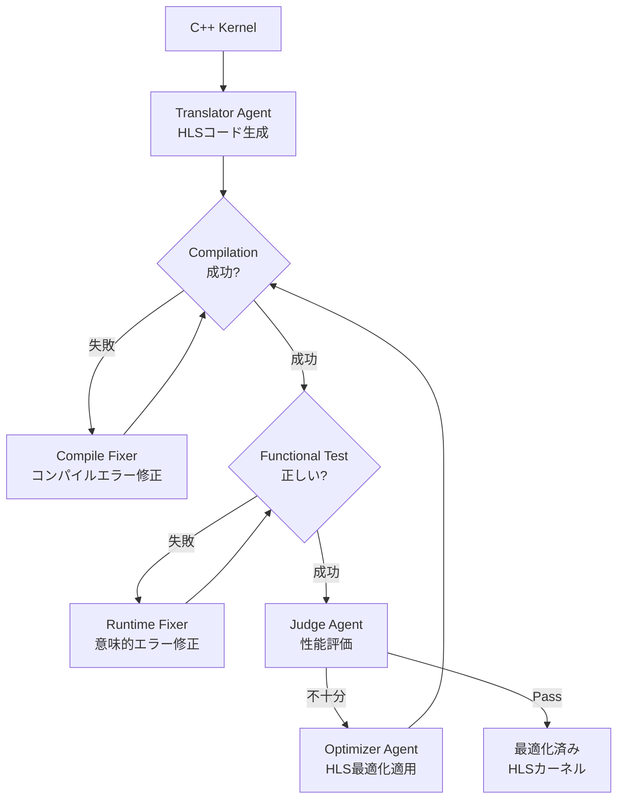

## 論文概要（Abstract）

本記事は [arXiv:2602.06085 "LAAFD: LLM-based Agents for Accelerated FPGA Design"](https://arxiv.org/abs/2602.06085)（2026年2月4日公開）の解説記事です。

LAAFDは、LLMエージェントを用いて汎用C++コードをVitis HLS（High-Level Synthesis）カーネルに変換・最適化するフレームワークです。15のHPCカーネルパターンで評価を行い、手動チューニングされたベースラインに対して幾何平均99.9%の性能を達成したと著者らは報告しています。ステンシル計算ではドメイン特化ジェネレータSODAと同等の性能をより少ないコード行数で実現しています。

この記事は [Zenn記事: コーディングエージェントでコンパイラ・FPGA・カーネルドライバを実装する実践手法](https://zenn.dev/0h_n0/articles/1b8128982c9887) の深掘りです。

## 情報源

- **arXiv ID**: 2602.06085
- **URL**: [https://arxiv.org/abs/2602.06085](https://arxiv.org/abs/2602.06085)
- **著者**: Maxim Moraru, Kamalavasan Kamalakkannan, Jered Dominguez-Trujillo, Patrick Diehl, Atanu Barai, Julien Loiseau, Zachary Kent Baker, Howard Pritchard, Galen M Shipman
- **発表年**: 2026
- **分野**: cs.DC（Distributed, Parallel, and Cluster Computing）
- **Report Number**: LA-UR-26-20594

## 背景と動機（Background & Motivation）

FPGA（Field-Programmable Gate Array）は低レイテンシ・高エネルギー効率な計算プラットフォームとして科学計算やHPC（High-Performance Computing）で活用されていますが、FPGAプログラミングにはHLS固有の最適化知識が必要です。パイプライニング、ベクトル化、データフロー分割といった最適化技法はC++の記述とは異なる専門スキルを要し、FPGAの普及を妨げる障壁となっています。

論文の著者らは、LLMエージェントがこのギャップを埋める可能性を検証するため、C++カーネルからVitis HLSカーネルへの自動変換と最適化を行うエージェントワークフローLAAFDを提案しています。

## 主要な貢献（Key Contributions）

- **エージェントベースの4フェーズワークフロー**: 翻訳→検証→最適化→フィードバックの反復ループによる自動FPGA設計
- **手動チューニング比99.9%性能**: 15のHPCカーネルで幾何平均99.9%のサイクル数性能を達成（論文Table I）
- **SODAジェネレータとの比較**: ステンシルカーネルで同等の性能を4.5〜30倍少ないコード行数で実現（論文Table IV）
- **コスト効率**: 15カーネル全体の変換・最適化にかかったAPIコストは約$50（論文のCost Analysis節）

## 技術的詳細（Technical Details）

### 4フェーズのエージェントワークフロー

LAAFDは5種類の専門エージェントが4つのフェーズを通じて協調動作します。

#### Phase 1: 翻訳（Translation）

Translator Agentが元のC++カーネルを受け取り、HLSコードを生成します。論文によると、この段階でパラメータ型の変更（例：スカラーから固定小数点や任意精度整数への変換）、ループトリップカウントの挿入、HLSインクルードディレクティブの追加が行われます。

#### Phase 2: 検証（Validation）

生成コードのコンパイルテストを実施し、失敗した場合はCompile Fixer Agentがエラーを解消します。コンパイル成功後、機能テストで元のC++実装との出力一致を検証します。不一致の場合はRuntime Fixer Agentが意味的な修正を行います。

#### Phase 3: 最適化（Optimization）

Judge AgentがHLS合成レポート（レイテンシ、イニシエーションインターバル、リソース使用率）を分析し、理論最小性能に達しているかを判定します。未達の場合、構造化されたフィードバックをOptimizer Agentに送り、最適化を適用させます。

#### Phase 4: フィードバックループ

Judgeが「Pass」を発行するか、イテレーション制限に達するまでPhase 2-3を反復します。タイムアウト時は最も良好な有効カーネルにロールバックします。

### HLS最適化技法

論文Table IIによると、以下の最適化技法が15カーネルに適用されています：

| 最適化技法 | 適用カーネル数 | 説明 |
|-----------|--------------|------|
| パイプライニング | 15/15 | ループイテレーションのオーバーラップ（II=1） |
| ベクトル化 | 15/15 | 128ビットデータパスによる4要素アンロール |
| データフロー | 15/15 | 計算ステージの分離（hls::stream接続） |
| ループフラット化 | 12/15 | ネストループの圧縮 |
| パーフェクトデータ再利用 | 7/15 | ステンシルデータのウィンドウバッファリング |
| シフトバッファ | 7/15 | スライディングウィンドウのレジスタ実装 |
| バッチ化/ループ再配置 | 3/15 | メモリアクセスの最適化 |

### 具体例：ベクトル加算カーネルの最適化過程

論文のFigure 3-8で示されている例を紹介します。

**入力**: 行単位のベクトル加算（C++、順次ネストループ、65,543サイクル）

**翻訳出力**: HLSアノテーション付きコードだが型未定義でコンパイル失敗

**コンパイル修正後**: typedef追加でコンパイル成功するが65,543サイクルのまま

**Judgeのフィードバック**（論文Figure 6より）:
1. `B[i]`のロードを内側ループの外に移動
2. 内側ループをII=1でパイプライン化
3. 128ビットパスで4要素ベクトル化
4. read/compute/writeのデータフロー分割

**最適化後**: モジュール化されたデータフロー（read_data_A, read_data_B, compute, write_data）で約16,396サイクルを達成。理論最小値にパイプラインオーバーヘッドを加えた値とほぼ一致しています。

## 実験結果（Results）

### 手動チューニングとの比較

論文Table Iの主要結果（抜粋）：

| カーネル | 理想サイクル数 | 手動チューニング | LAAFD | 性能比 |
|---------|-------------|-----------------|-------|--------|
| MX | 2,048 | 2,073 | 2,062 | 100.5% |
| AXPY | 2,048 | 2,069 | 2,069 | 100.0% |
| CSUM | 262,144 | 262,675 | 262,195 | 100.2% |
| S2D（2Dステンシル） | 262,400 | 262,413 | 262,421 | 100.0% |
| S3D（3Dステンシル） | 4,210,688 | 4,210,703 | 4,210,846 | 100.0% |

幾何平均で手動チューニングの99.9%の性能を達成しています。

### モデル比較

論文Figure 9によると、LLMモデルのサイズが結果に大きく影響します：

| モデル | 98%以上達成カーネル数 | 幾何平均性能 |
|--------|---------------------|-------------|
| GPT-5 | 15/15 | 99.9% |
| o4-mini | 10/15 | 52.5% |
| GPT-5-nano | 6/15 | 32.7% |

著者らは、複雑な最適化（パーフェクトデータ再利用、シフトバッファ）はより大規模なモデルでなければ成功しないと報告しています。

### SODAジェネレータとの比較

論文Table IVのステンシルカーネル比較（抜粋）：

| カーネル | SODA LoC | LAAFD LoC | LoC比率 | LAAFD性能 |
|---------|----------|-----------|---------|----------|
| Blur | 1,229 | 280 | 0.23× | 理想値の99.4% |
| Heat3D | 7,800 | 410 | 0.05× | 理想値の99.5% |

LAAFDはSODAの4.5〜30倍少ないコード行数でほぼ同等の性能を達成しています。

### リソース使用量のトレードオフ

論文Table Vによると、LAAFDはサイクル数最適化を優先するため、リソース使用量は手動ベースラインより大きくなります：

- **LUTs**: 平均1.2×（手動比）
- **FFs**: 平均1.3×
- **BRAMs**: 平均2.1×（特にステンシルカーネルで顕著）

例えば、S3Dカーネルでは手動: 11,072 LUTs / 122 BRAMs に対し、LAAFD: 29,840 LUTs / 584 BRAMsと報告されています。

## 実装のポイント（Implementation）

### 独立コンテキストセッション

各エージェントは独立したコンテキストセッションで動作し、コンテキストの無制御な増大を防止しています。論文によると、大規模カーネルではコンテキストサイズ上限を超過する場合があり、HLSレポートの要約やJudgeセッションの省略で対処しています。

### 確率的な結果のばらつき

著者らは「同一設定でも実行ごとに異なる結果が得られる」ことを明記しています。複雑なSODAカーネルでは、10回の実行中1〜2回のみが理論最小値の1%以内に収束し、残りは機能的には正しいが性能は最適ではない結果になると報告されています。

### 実験環境

論文Table IIIの設定：
- **HLSツール**: Vitis 2022.2
- **FPGAデバイス**: xcu250-figd2104-2L-e
- **ターゲット周波数**: 200 MHz
- **データパス**: 128ビット入出力

## 関連研究（Related Work）

- **RTLFixer** (arXiv:2309.12272): IVerilogエラーをフィードバックとしてLLMでRTL構文エラーを自動修正するパイプライン。LAAFDはRTLレベルではなくHLSレベルで動作する点が異なる
- **ChipNeMo** (arXiv:2311.00176): NVIDIAによるチップ設計ドメイン特化LLM。EDAスクリプト生成に特化しており、LAAFDのようなHLS最適化ループは含まない
- **Survey of Automated RTL Code Generation** (arXiv:2407.09408): LLMによるRTL生成の包括的サーベイ。LAAFDはサーベイで議論されているRTL生成よりも高い抽象度（HLS）で動作

## まとめと今後の展望

LAAFDは、LLMエージェントがFPGA設計の専門知識ギャップを埋める可能性を示した研究です。15のHPCカーネルで手動チューニングの99.9%性能を約$50のAPIコストで達成したことは、FPGA開発の民主化に向けた重要な一歩と位置づけられます。

一方で、著者らは以下の課題を明示しています：
- リソース使用量（特にBRAM）のオーバーヘッド
- 結果の確率的なばらつき（複雑なカーネルでの収束率の低さ）
- 個別カーネルからアプリケーション全体への拡張が未検証

論文の全文は [https://arxiv.org/abs/2602.06085](https://arxiv.org/abs/2602.06085) で公開されています。

## 参考文献

- **arXiv**: [https://arxiv.org/abs/2602.06085](https://arxiv.org/abs/2602.06085)
- **Related Zenn article**: [コーディングエージェントでコンパイラ・FPGA・カーネルドライバを実装する実践手法](https://zenn.dev/0h_n0/articles/1b8128982c9887)
