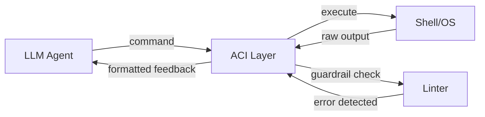
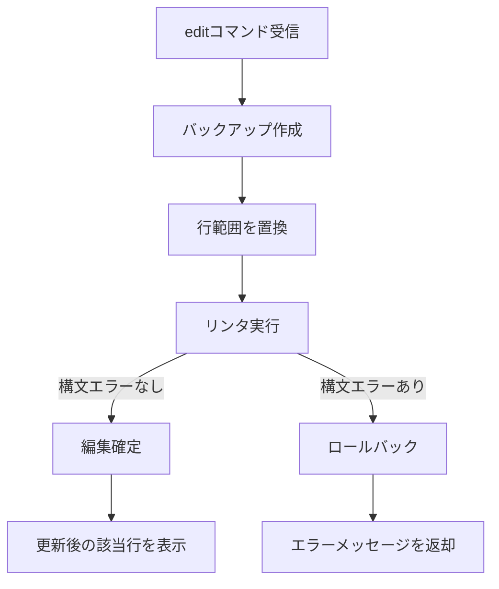
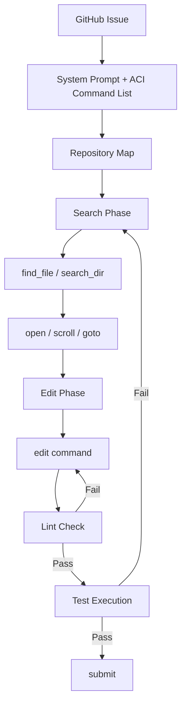

## 論文概要（Abstract）

[SWE-agent: Agent-Computer Interfaces Enable Automated Software Engineering](https://arxiv.org/abs/2405.15793) は、Princeton大学のJohn Yangらが2024年に発表した論文であり、LLMエージェントがソフトウェアエンジニアリングタスクを遂行するためのインターフェース設計（Agent-Computer Interface, ACI）を体系化した研究である。著者らは、LLMに最適化されたファイル閲覧・編集・検索コマンド群を設計し、SWE-benchにおいてGPT-4 Turbo使用時に12.47%（286/2,294件）の解決率を達成したと報告している。これは当時の非対話型RAGベースラインの3.8%から約3.3倍の改善であった。また、HumanEvalFixベンチマークでは87.7%のpass@1を達成している。NeurIPS 2024に採択された。

この記事は [Zenn記事: コーディングエージェントでコンパイラ・FPGA・カーネルドライバを実装する実践手法](https://zenn.dev/0h_n0/articles/1b8128982c9887) の深掘りです。

## 情報源

- **arXiv ID**: 2405.15793
- **URL**: [https://arxiv.org/abs/2405.15793](https://arxiv.org/abs/2405.15793)
- **著者**: John Yang, Carlos E. Jimenez, Alexander Wettig, Kilian Lieret, Shunyu Yao, Karthik Narasimhan, Ofir Press（Princeton University）
- **発表年**: 2024（NeurIPS 2024採択）
- **分野**: cs.SE, cs.AI, cs.CL
- **コード**: [https://github.com/SWE-agent/SWE-agent](https://github.com/SWE-agent/SWE-agent)

## 背景と動機（Background & Motivation）

ソフトウェアエンジニアリングにおけるGitHub Issueの自動解決は、コードベースの探索、関連ファイルの特定、コード編集、テスト実行という一連の操作を必要とする。2024年時点で、LLMをソフトウェアエンジニアリングに適用する研究は盛んであったが、多くのアプローチはLLMに対してLinuxシェルのコマンドをそのまま利用させていた。

著者らはこのアプローチに根本的な問題があることを指摘している。Linuxシェルのインターフェースは人間のプログラマが対話的に使用することを前提に設計されたものであり、LLMエージェントにとっては以下の課題がある。

1. **操作の冗長性**: ファイルの特定行を編集するために `sed` コマンドを構築する際、正規表現のエスケープやアドレス指定でエラーが頻発する
2. **フィードバックの欠如**: コマンドが成功しても出力がない場合があり、エージェントが現在の状態を把握できない
3. **コンテキストの浪費**: `cat` でファイル全体を表示すると、LLMのコンテキストウィンドウが急速に消費される
4. **エラーの連鎖**: 構文エラーを含む編集がそのまま適用されると、後続の操作がすべて失敗する

これらの課題は、HCI（Human-Computer Interface）が人間向けに最適化されてきたのと同様に、LLMエージェント向けに最適化されたインターフェース——すなわちACI（Agent-Computer Interface）——が必要であることを示唆している。著者らは、ACIの設計がモデルの性能と同等以上に重要であると主張している。

## 主要な貢献（Key Contributions）

- **ACI概念の体系化**: LLMエージェント向けインターフェース設計原則をHCIとの対比で位置づけ、設計ガイドラインを明文化した
- **SWE-agentシステムの実装**: ACIを具体化したオープンソースシステムを公開（MIT License）
- **SWE-benchでの性能実証**: GPT-4 Turboを用いてSWE-bench Full上で12.47%の解決率を達成し、当時の非対話型RAGベースライン（3.8%）を大幅に上回った
- **ACI設計要素の定量的分析**: アブレーション研究により、各設計要素（エディタ、ファイルビューア、検索コマンド、リント統合）の個別の寄与を定量化した
- **モデル間のポータビリティ検証**: GPT-4 Turbo向けに設計したACIがClaude 3 Opusでも有効であることを確認（10.5%の解決率）

## 技術的詳細（Technical Details）

### ACI（Agent-Computer Interface）の設計原則

著者らはACIの設計指針として以下の4つの原則を示している。

**原則1: シンプルさ（Simplicity）**

アクション（コマンド）は短く、曖昧性がなく、LLMが生成しやすい形式にすべきである。重要な操作（ファイルナビゲーション、編集）はできるだけ少数のアクションに統合する。Bashの `sed` や `awk` のような複雑なコマンドは、LLMにとって構文エラーの温床であり、専用の簡潔なコマンドに置き換えることで信頼性が向上する。

**原則2: フィードバック（Feedback）**

コマンド実行後のフィードバックは情報豊富かつ簡潔にすべきである。環境の現在の状態について実質的な情報を提供しつつ、不要な詳細は省く。出力が空のコマンドに対しても「Your command ran successfully and did not produce any output.」のような明示的な確認メッセージを返す。

**原則3: ガードレール（Guardrails）**

エージェントが致命的なミスを犯さないよう、自動的な検証と防護を組み込む。たとえば、編集コマンド実行後に自動でリンタを実行し、構文エラーが検出された場合は編集をロールバックする。

**原則4: エラー回復（Error Recovery）**

エラーが発生した際に、エージェントが状況を把握し、回復操作を行いやすくする。具体的なエラーメッセージの提供と、状態のロギングにより、エージェントがバックトラックできるようにする。



### カスタムシェル環境とコマンド

SWE-agentはDockerコンテナ内で動作するカスタムシェル環境を構築し、LLM向けに最適化されたコマンドセットを提供する。主要コマンドは以下の通りである。

| コマンド | 機能 | 引数 | Bash相当 |
|---|---|---|---|
| `open <file> [<line>]` | ファイルを開き、指定行付近を表示 | ファイルパス、行番号（任意） | `less +<line> <file>` |
| `goto <line>` | 開いているファイルの指定行へジャンプ | 行番号 | `:n` in vim |
| `scroll_up` | 表示窓を上に移動 | なし | PgUp |
| `scroll_down` | 表示窓を下に移動 | なし | PgDown |
| `create <file>` | 新規ファイルを作成して開く | ファイルパス | `touch <file>` |
| `edit <start>:<end>` | 行範囲の内容を置換 | 開始行、終了行、置換内容 | `sed` |
| `search_file <pattern> [<file>]` | ファイル内でパターンを検索 | 検索パターン、ファイル（任意） | `grep -n` |
| `search_dir <pattern> [<dir>]` | ディレクトリ内を再帰的に検索 | 検索パターン、ディレクトリ（任意） | `grep -rn` |
| `find_file <name> [<dir>]` | ファイル名で検索 | ファイル名、ディレクトリ（任意） | `find -name` |
| `submit` | パッチを提出してセッション終了 | なし | `git diff > patch` |

これらのコマンドはReAct（Reasoning + Acting）フレームワークに基づくエージェントループで使用される。各ターンでLLMはthought（思考）とaction（アクション）を出力し、環境からobservation（観測）を受け取る。

$$
a_t = \pi_\theta(o_{1:t}, a_{1:t-1})
$$

ここで $a_t$ は時刻 $t$ でのアクション、$o_{1:t}$ は累積観測、$\pi_\theta$ はLLMの方策である。エージェントは最大25ターンのインタラクションが許可される。

### ファイルナビゲーションと編集ツール

SWE-agentのファイルビューアは、従来の `cat` コマンドとは異なり、1回の表示を**100行の窓**に制限している。この設計には以下の利点がある。

1. **コンテキスト効率**: ファイル全体を表示するとLLMのコンテキストウィンドウが急速に消費されるが、100行窓により必要な部分のみを閲覧できる
2. **位置の明示**: 現在表示中のファイル名と行範囲が常にフィードバックに含まれるため、LLMは「自分が今どこを見ているか」を把握できる
3. **ナビゲーションの容易さ**: `scroll_up`、`scroll_down`、`goto` コマンドにより直感的に移動できる

`edit` コマンドの設計は特に重要である。従来の `sed` コマンドでは正規表現のエスケープが必要で、LLMが頻繁にエラーを起こしていた。SWE-agentの `edit` は行番号指定で内容を直接置換する簡潔なインターフェースを提供する。

```python
# SWE-agentのeditコマンドの簡略化した実装イメージ
def edit_file(
    file_path: str,
    start_line: int,
    end_line: int,
    new_content: str,
) -> str:
    """行範囲を指定して内容を置換する。

    構文チェックに失敗した場合は自動的にロールバックする。

    Args:
        file_path: 編集対象ファイルのパス
        start_line: 編集開始行（1-indexed）
        end_line: 編集終了行（inclusive）
        new_content: 置換する内容

    Returns:
        編集結果のメッセージ
    """
    backup = read_file(file_path)
    lines = backup.split("\n")
    lines[start_line - 1 : end_line] = new_content.split("\n")
    write_file(file_path, "\n".join(lines))

    lint_result = run_linter(file_path)
    if lint_result.has_errors:
        write_file(file_path, backup)
        return f"Edit failed: {lint_result.errors}. File restored."

    return format_file_view(file_path, start_line)
```

### 検索とコンテキスト管理

SWE-agentの検索コマンドは、出力量を制御する設計がなされている。

**`search_dir`**: ディレクトリ内の全ファイルを対象に文字列を検索するが、出力はマッチしたファイル名のリストに要約される。`grep -rn` のようにマッチした行の内容をすべて表示するのではなく、ファイルレベルの要約に留めることで、コンテキストウィンドウの浪費を防ぐ。

**`search_file`**: 特定ファイル内での検索結果は行番号とマッチ内容を含むが、コンテキストの前後行は最小限に抑えられる。

**`find_file`**: ファイル名の検索結果はパスのリストとして簡潔に返される。

これらの出力フォーマットの設計は、ACI原則2（フィードバック）を具体化したものである。LLMが次のアクションを決定するのに十分な情報を含みつつ、余計な情報でコンテキストを圧迫しない。

### エラー回復とガードレール

SWE-agentの中核的なガードレールはリント統合である。`edit` コマンドが実行されるたびに、変更後のファイルに対して構文チェッカー（リンタ）が自動実行される。



このガードレールの効果は定量的に確認されている。著者らのアブレーション研究によると、リント統合を除去すると解決率が18.0%から15.0%に低下する（SWE-bench Liteの300インスタンス上）。つまり、リント統合だけで3.0ポイントの改善に寄与している。

リント統合がなぜ重要かについて、著者らは以下の理由を挙げている。

1. **エラーの連鎖防止**: 構文エラーを含む編集がそのまま適用されると、後続の操作（テスト実行など）がすべて失敗し、エージェントが回復困難な状態に陥る
2. **即時フィードバック**: エラーが発生した時点で具体的なエラーメッセージが返されるため、エージェントは問題を認識して修正を試みることができる
3. **状態の保全**: ロールバックにより、ファイルが壊れた状態で放置されることを防ぐ

## 実験結果（Results）

### SWE-benchでの性能

著者らが報告しているSWE-bench上の主要結果は以下の通りである。

| モデル | アプローチ | SWE-bench Full (2,294件) | SWE-bench Lite (300件) |
|---|---|---|---|
| GPT-4 | RAG（非対話型） | 1.74% | 0.67% |
| Claude 3 Opus | RAG（非対話型） | 3.97% | 4.33% |
| GPT-4 Turbo | SWE-agent（Shell） | 8.33% | - |
| Claude 3 Opus | SWE-agent（ACI） | 6.67% | - |
| GPT-4 Turbo | SWE-agent（ACI） | **12.47%** | **18.00%** |

注目すべき比較は以下の2点である。

1. **Shell vs ACI**: 同じGPT-4 Turboで、Shellインターフェース（8.33%）とACI（12.47%）では4.14ポイントの差がある。著者らはこの差がインターフェース設計の効果であると報告している
2. **RAG vs SWE-agent**: 非対話型RAGベースライン（最大3.97%）と比較して、SWE-agentは約3.1倍の解決率を達成している

### HumanEvalFixでの性能

HumanEvalFixベンチマーク（バグのあるコードの修正タスク）では以下の結果が報告されている。

| モデル | アプローチ | pass@1 |
|---|---|---|
| GPT-4 | 直接修正 | 47.0% |
| GPT-4 Turbo | SWE-agent（ACI） | **87.7%** |

SWE-benchと比較して大幅に高い性能を示している。これは、HumanEvalFixが単一ファイルの修正タスクであり、リポジトリ全体のナビゲーションが不要であるためと考えられる。

### ACIデザイン要素のアブレーション

SWE-bench Liteの300インスタンスを用いたアブレーション研究により、各ACI設計要素の寄与が分析されている。

| 構成 | 解決率（SWE-bench Lite） | 差分 |
|---|---|---|
| SWE-agent（完全なACI） | 18.0% | baseline |
| リント統合なし | 15.0% | -3.0% |
| Shellのみ（ACIなし） | 7.3% | -10.7% |

これらの結果から以下のことが読み取れる。

- **ACIの総合効果**: Shell基準で+10.7ポイント。インターフェース設計がモデル性能と同等以上の影響を持つことを示唆
- **リント統合の効果**: 3.0ポイントの改善。構文チェックとロールバックが信頼性を大きく向上させる
- **その他の要素**: 残りの7.7ポイント分の改善はファイルビューア、検索コマンド、エディタなどの総合効果

### ファイルビューアの窓サイズの影響

著者らはファイルビューアの表示行数についても検証を行っている。100行の窓が最適であり、これより大きいとコンテキストウィンドウの消費が増加し、小さいとナビゲーションの効率が低下すると報告している。

### エラーパターン分析

エージェントの失敗原因の分析では、以下の内訳が報告されている。

- **ファイル特定の失敗**: 全失敗の約40%。修正すべきファイルをエージェントが見つけられなかった
- **修正の不完全**: 約30%。正しいファイルを特定したが、修正が不十分
- **テスト失敗**: 約20%。修正は行われたが、テストが通らない
- **その他**: 約10%。タイムアウト、環境エラーなど

この分析は、コーディングエージェントの改善において「コード探索能力の向上」が最も大きなインパクトを持つ可能性を示唆している。

## 実装のポイント（Implementation）

SWE-agentの実装における重要な設計判断を以下にまとめる。

**Dockerによるサンドボックス**: 各タスクは独立したDockerコンテナ内で実行される。これにより、エージェントのアクション（ファイル編集、コマンド実行）がホスト環境やほかのタスクに影響を与えない。コンパイラ実装やカーネルドライバのようなシステムレベルのタスクにおいて、この分離は安全性の確保に不可欠である。

**ReActフレームワークの採用**: エージェントはthought→action→observationのループで動作する。各ターンでLLMは自然言語で思考を記述した後、コマンドを出力する。この構造により、デバッグ時にエージェントの「意図」を追跡できる。

**リポジトリマップ**: セッション開始時にリポジトリ全体のディレクトリ構造を簡潔に表示する機能がある。これにより、LLMは探索の起点を効率的に決定できる。大規模なコードベース（コンパイラやOSカーネルのソースツリーなど）では、この初期コンテキストが特に重要となる。

**コンテキストウィンドウの管理**: 100行の窓制限、検索結果の要約出力、リポジトリマップによるコンテキスト効率の最適化は、長期間のマルチターン対話における「lost-in-the-middle」問題への対策である。

**モデルのポータビリティ**: GPT-4 Turbo向けに設計されたACIがClaude 3 Opusでも有効であることが確認されている（10.5%の解決率）。これは、ACIの設計原則が特定のモデルに依存しないことを示唆している。



## 関連研究（Related Work）

- **SWE-bench** (Jimenez et al., 2024): SWE-agentの評価に使用されたベンチマーク。GitHubの実際のリポジトリから収集された2,294件のIssue解決タスクを含む。著者の一人であるJimenezはSWE-benchの共著者でもある
- **ReAct** (Yao et al., 2023): SWE-agentが採用するReasoning + Actingフレームワーク。LLMにthought→action→observationのループを実行させる。著者の一人であるYaoはReActの著者でもある
- **Reflexion** (Shinn et al., 2023): 過去の失敗から反省的に学習するエージェントフレームワーク。SWE-agentは明示的なReflexionは使用していないが、リントによるフィードバックが類似の役割を果たしている
- **CodeAct** (Wang et al., 2024): コード実行をアクション空間として使用するアプローチ。SWE-agentとは対照的に、専用コマンドではなくPythonコードの実行を通じて環境と対話する
- **OpenDevin/Devin** (2024): コーディングエージェントの実用化を推進するプロジェクト。SWE-agentの設計原則を継承しつつ、Web UIやサンドボックス環境を強化している

## まとめと今後の展望

SWE-agentは、LLMエージェント向けのインターフェース設計（ACI）が性能に決定的な影響を持つことを実証した研究である。同じGPT-4 Turboでも、Linuxシェルをそのまま使う場合（8.33%）とACIを介した場合（12.47%）で4.14ポイントの差が生じるという結果は、「モデルの能力向上」だけでなく「ツール設計の最適化」がエージェント性能の鍵であることを示している。

ACIの設計原則——シンプルさ、フィードバック、ガードレール、エラー回復——は、コンパイラ実装やFPGA設計、カーネルドライバのようなシステムレベルのソフトウェアエンジニアリングにコーディングエージェントを適用する際にも有用な指針となる。特に、リント統合によるガードレール（3.0ポイントの改善）やファイル探索の効率化は、大規模コードベースでのエージェント活用において重要な設計要素である。

2026年現在のコーディングエージェント（Claude Code、GitHub Copilot Workspace、Devinなど）はSWE-agentの性能を大幅に上回っているが、SWE-agentが提唱したACIの原則はこれらのシステムの設計基盤として継承されている。今後は、マルチファイル編集の効率化、マルチ言語対応の拡充、長期的なコンテキスト管理の改善がコーディングエージェント研究の重要な方向性となると考えられる。

## 参考文献

- Yang, J., Jimenez, C. E., Wettig, A., Lieret, K., Yao, S., Narasimhan, K., & Press, O. (2024). SWE-agent: Agent-Computer Interfaces Enable Automated Software Engineering. *NeurIPS 2024*. [https://arxiv.org/abs/2405.15793](https://arxiv.org/abs/2405.15793)
- Jimenez, C. E., Yang, J., Wettig, A., Yao, S., Pei, K., Press, O., & Narasimhan, K. (2024). SWE-bench: Can Language Models Resolve Real-World GitHub Issues? *ICLR 2024*. [https://arxiv.org/abs/2310.06770](https://arxiv.org/abs/2310.06770)
- Yao, S., Zhao, J., Yu, D., Du, N., Shafran, I., Narasimhan, K., & Cao, Y. (2023). ReAct: Synergizing Reasoning and Acting in Language Models. *ICLR 2023*. [https://arxiv.org/abs/2210.03629](https://arxiv.org/abs/2210.03629)
- **GitHub**: [https://github.com/SWE-agent/SWE-agent](https://github.com/SWE-agent/SWE-agent)
- **関連Zenn記事**: [https://zenn.dev/0h_n0/articles/1b8128982c9887](https://zenn.dev/0h_n0/articles/1b8128982c9887)
