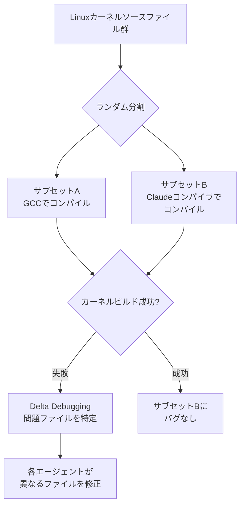

## ブログ概要（Summary）

本記事は [Anthropic Engineering Blog: "Building a C compiler with a team of parallel Claudes"](https://www.anthropic.com/engineering/building-c-compiler)（2026年2月5日公開）の解説記事です。

Anthropicの研究者Nicholas Carliniは、16並列のClaude Opus 4.6エージェントを使い、Linuxカーネルをコンパイル可能なCコンパイラを約2週間で構築する実験を行いました。成果物は約10万行のRustコードで構成され、x86、ARM、RISC-Vの3アーキテクチャでLinux 6.9のビルドに成功しています。GCC torture testの合格率は99%、QEMU・FFmpeg・SQLite・PostgreSQL・Redisなどの実プロジェクトもコンパイル可能です。APIコストは約$20,000（約300万円）でした。

この記事は [Zenn記事: コーディングエージェントでコンパイラ・FPGA・カーネルドライバを実装する実践手法](https://zenn.dev/0h_n0/articles/1b8128982c9887) の深掘りです。

## 情報源

- **種別**: 企業テックブログ（Anthropic Engineering Blog）
- **URL**: [https://www.anthropic.com/engineering/building-c-compiler](https://www.anthropic.com/engineering/building-c-compiler)
- **著者**: Nicholas Carlini（Anthropic Safeguardsチーム研究者）
- **公開日**: 2026年2月5日
- **関連リポジトリ**: [github.com/anthropics/claudes-c-compiler](https://github.com/anthropics/claudes-c-compiler)

## 技術的背景（Technical Background）

### なぜこの実験が必要だったのか

コーディングエージェントが単一ファイルの生成や小規模リファクタリングで有効なことは2025年時点で広く確認されていましたが、「大規模システム全体を自律的に構築できるか」という問いには明確な答えがありませんでした。Carliniはこの限界を検証するため、意図的にCコンパイラという複雑な低レイヤーソフトウェアをターゲットに選択しています。

Cコンパイラは以下の点でストレステストに適しています：

- **複数のフェーズが密結合**: プリプロセッサ、レキサ、パーサ、型チェック、最適化、コード生成が相互依存
- **正確性の基準が明確**: 既存テストスイート（GCC torture tests）で客観評価可能
- **実世界での検証が可能**: Linuxカーネルという大規模実プロジェクトでのコンパイル成否で判定

### 学術研究との関連

この実験はLLMによるコード生成研究の延長線上に位置します。SWE-bench（Yang et al., 2024, arXiv:2310.06770）がGitHub Issueの自動解決で12-18%の成功率を報告しているのに対し、本実験は「Issue解決」ではなく「システム全体の自律構築」という異なる難易度のタスクに取り組んでいます。

## 実装アーキテクチャ（Architecture）

### システム構成の全体像

Carliniが構築したシステムは、16のClaude Opus 4.6インスタンスが独立したDockerコンテナ内で動作し、bare gitリポジトリを中心とする協調メカニズムで連携します。

```mermaid
graph TD
    A[Bare Git Repository<br>中央協調ハブ] --> B[Docker Container 1<br>Core Compiler Agent]
    A --> C[Docker Container 2<br>Core Compiler Agent]
    A --> D[Docker Container 3<br>Performance Agent]
    A --> E[Docker Container 4<br>Quality Agent]
    A --> F[Docker Container ...<br>16 Agents Total]
    B --> G[/upstream<br>読み取り専用]
    B --> H[/workspace<br>作業ディレクトリ]
    G --> A
    H --> A
```

### エージェントの自律ループ

各エージェントは以下の無限ループで動作します。ブログで公開されているシェルスクリプトの概要は以下の通りです：

```bash
#!/bin/bash
# Carliniが使用した自律ループの概要
while true; do
    COMMIT=$(git rev-parse --short=6 HEAD)
    LOGFILE="agent_logs/agent_${COMMIT}.log"
    # Claude CLIを非対話モードで実行
    claude --dangerously-skip-permissions \
           -p "$(cat AGENT_PROMPT.md)" \
           --model claude-opus-X-Y &> "$LOGFILE"
done
```

ブログによると、エージェントは「1つのタスクが完了すると即座に次のタスクに取りかかる」設計になっています。

### タスクロックメカニズム

並列作業の競合を防ぐため、ファイルシステムベースのロック機構が導入されています：

1. エージェントAが `current_tasks/parse_if_statement.txt` を作成してタスクをロック
2. エージェントBは別のタスク `current_tasks/codegen_function_definition.txt` をロック
3. Git同期により重複作業を防止
4. タスク完了後にロックファイルを削除

### エージェントの役割分担

16エージェントは以下の役割に特化させて運用されたとブログで報告されています：

| 役割 | 担当内容 | エージェント数（推定） |
|------|---------|---------------------|
| Core Compiler | コンパイラ本体の実装 | 10+ |
| Deduplication | 冗長コードの統合 | 1 |
| Performance | コンパイラ速度の最適化 | 1 |
| Code Quality | Rustの設計パターン改善 | 1 |
| Documentation | README・進捗追跡 | 1 |
| Optimization | 生成コードの効率改善 | 1 |

## 主要な成果と定量的結果

### コンパイラの仕様と達成事項

ブログで報告されている主要な数値は以下の通りです：

| 項目 | 値 |
|------|-----|
| コード行数 | 約100,000行（Rust） |
| 開発期間 | 約2週間 |
| Claude Codeセッション数 | 約2,000セッション |
| 入力トークン数 | 約20億トークン |
| 出力トークン数 | 約1.4億トークン |
| APIコスト | 約$20,000（約300万円） |
| GCC torture test合格率 | 99% |
| 対応アーキテクチャ | x86, ARM, RISC-V |

### コンパイル成功したプロジェクト

Carliniによると、以下の実プロジェクトのコンパイルに成功しています：

- **Linux 6.9カーネル**: x86、ARM、RISC-Vの3アーキテクチャでブート可能
- **QEMU**: 仮想マシンモニタ
- **FFmpeg**: マルチメディアフレームワーク
- **SQLite**: 組み込みデータベース
- **PostgreSQL**: リレーショナルデータベース
- **Redis**: インメモリデータストア
- **Doom**: 最終的な検証（「究極のバリデーションベンチマーク」とCarliniが記述）

### モデル世代間の進歩

ブログでは、モデルの世代によるコンパイラ構築能力の差が報告されています：

- **Opus 4以前のモデル**: 「機能するコンパイラを生成する能力がほとんどなかった」
- **Opus 4.5**: 大規模テストスイートは通過するが、実プロジェクトのコンパイルは不可
- **Opus 4.6**: Linux カーネルの完全コンパイルを達成

Carlini自身、この実験を「LLMがぎりぎり達成できる限界のストレステスト」と位置づけています。

## 並列化の技術的課題と解決策

### Linuxカーネル問題

ブログで最も詳細に述べられている技術的課題は、並列エージェントがLinuxカーネルのバグ修正を行う際に発生した問題です。当初、16エージェント全員が同じバグに収束し、互いの修正を上書きして進捗が生まれない状態に陥りました。

### Oracle-Based Testing による解決

この問題に対し、Carliniは「GCCをオラクル（正解の参照）として使う」手法を導入しています：



この手法の要点は以下の通りです：

1. カーネルソースファイルをランダムに分割
2. 一部をGCC、残りをClaudeコンパイラでコンパイル
3. カーネルが動作すれば、Claudeコンパイラ側にバグなし
4. 動作しなければ、delta debuggingで問題のファイルペアを特定
5. 各エージェントが異なるファイルのバグ修正を担当

ブログによると、この手法により「数千のコンパイルユニットにまたがるバグ修正を並列化」できたとのことです。

## コンテキストウィンドウ管理の工夫

### コンテキスト汚染の問題

自律エージェントが長時間動作すると、コンテキストウィンドウが不要なログ出力で埋め尽くされる問題が発生します。Carliniは「数千バイトの無駄なデータ」がコンテキストに蓄積する問題を指摘しています。

### 対策: ログのファイル書き出しとサマリ出力

ブログで報告されている対策は以下の通りです：

- 詳細ログはファイルに書き出し、コンテキストには要約のみを表示
- `--fast`フラグの導入により、テスト実行のサンプリング率を制御
- エージェントごとに1-10%の決定論的サンプリング（VM間でランダム化）
- カバレッジを維持しつつ、暴走実行を防止

## 判明した限界と課題

### 未解決の問題

Carliniは以下の限界を明示的に報告しています：

1. **16ビットx86リアルモード**: GCCに委任。生成コードが約60KBとなり、Linuxの32KB制限を超過（オペコードプレフィックスの冗長性が原因）
2. **アセンブラ/リンカ**: 部分的に自動化されたが「やや不安定」。デモではGCCツールチェーンを使用
3. **互換性**: 「実用的なコンパイラの完全な代替にはまだなっていない」
4. **コード効率**: 「GCCの最適化を全て無効にした場合よりも効率が劣る」
5. **Rustコード品質**: 機能するが「イディオマティックなRustではない」

### 安全性に関するCarliniの見解

ブログの最後で、Carliniは自律的コード生成のリスクについて以下のように述べています：

> 「人間がClaudeと一緒に開発する場合、品質の一貫性を確保できる。しかし自律システムでは、テストが通過したからといって作業が完了したと思いがちだが、実際にはそうであることは稀である。」

検証されていないコードが本番環境に到達するリスク、不完全なテストによるリグレッションの隠蔽、開発サイクルからの人間の検証の欠如が主要なリスクとして指摘されています。

## コスト分析

### 投資対効果

ブログで報告されている数値に基づく分析です：

| コスト項目 | 金額 |
|-----------|------|
| APIコスト | 約$20,000 |
| 入力トークン | 20億（$10/MTokで$20,000相当） |
| 出力トークン | 1.4億（$30/MTokで$4,200相当） |

Carliniは「これは自分自身が作るのに必要なコストのほんの一部であり、チーム全体でも同様」と述べています。

### コスト効率の考察

16エージェントが2週間で約2,000セッション実行したことから、1セッションあたりのコストは約$10と推定されます。10万行のRustコードに対する1行あたりのコストは約$0.20です。ただし、この数値にはインフラコスト（Dockerコンテナ、Git サーバーなど）は含まれていません。

## 実践への示唆

### エージェント並列化の設計原則

本実験から抽出できる設計原則は以下の通りです：

1. **タスクの独立性確保**: ファイルシステムベースのロック機構で作業の重複を防止
2. **オラクルテスト**: 既存の正しい実装（GCC）を参照として活用し、バグの局所化を並列化
3. **役割の特化**: 全エージェントが同じ作業をするのではなく、品質管理・最適化・ドキュメントなど専門的な役割を割り当て
4. **コンテキスト管理**: ログの外部化とサンプリングによるコンテキストウィンドウの効率的な利用
5. **段階的な目標設定**: まずテストスイート通過、次に実プロジェクトのコンパイル、最後にLinuxカーネルと段階的にゴールを引き上げ

### 適用可能な領域

本実験の手法は、以下のような大規模低レイヤーソフトウェア開発に応用可能と考えられます：

- OS・ドライバの移植作業
- レガシーコードのRust書き換え
- テストスイートが充実したライブラリの再実装
- 言語処理系（インタプリタ、トランスパイラ）の構築

ただし、テストスイートや参照実装が存在しない領域への適用は困難であることも示唆されています。

## まとめと実践への示唆

Carliniの実験は、16並列のLLMエージェントが「大規模システムの自律構築」という従来困難とされていたタスクに対して一定の成果を示した事例です。APIコスト$20,000で10万行のRustコンパイラを構築し、Linux カーネルのコンパイルに成功したことは、エージェントチームによる自律開発の可能性を示しています。

一方で、コード品質がGCCに大きく劣ること、16ビットリアルモードなど一部機能が未実装であること、安全性の検証プロセスが不十分であることなど、実用化への課題も明確になりました。ブログの原文は [https://www.anthropic.com/engineering/building-c-compiler](https://www.anthropic.com/engineering/building-c-compiler) で公開されており、ソースコードは [github.com/anthropics/claudes-c-compiler](https://github.com/anthropics/claudes-c-compiler) で確認できます。

## 参考文献

- **Blog URL**: [Building a C compiler with a team of parallel Claudes — Anthropic Engineering Blog](https://www.anthropic.com/engineering/building-c-compiler)
- **Source Code**: [github.com/anthropics/claudes-c-compiler](https://github.com/anthropics/claudes-c-compiler)
- **Related Paper**: [SWE-bench: Can Language Models Resolve Real-World GitHub Issues? (arXiv:2310.06770)](https://arxiv.org/abs/2310.06770)
- **Related Zenn article**: [コーディングエージェントでコンパイラ・FPGA・カーネルドライバを実装する実践手法](https://zenn.dev/0h_n0/articles/1b8128982c9887)
