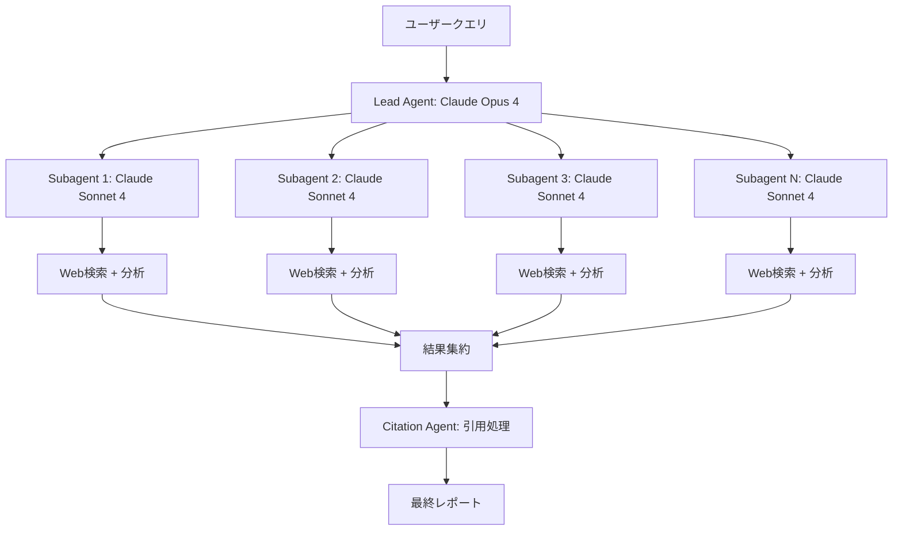

本記事は [Anthropic Engineering Blog "How we built our multi-agent research system"](https://www.anthropic.com/engineering/multi-agent-research-system)（Hadfield, Zhang, Lien, Scholz, Fox, Ford, 2025年6月）の解説記事です。

## ブログ概要（Summary）

Anthropicのエンジニアリングチームは、マルチエージェント研究システムの設計と構築過程を公開した。このシステムはオーケストレータ・ワーカーパターンを採用し、Lead Agent（Claude Opus 4）が複数のSubagent（Claude Sonnet 4）に並列にタスクを委任する構成を取る。内部評価において、このマルチエージェント構成は単一エージェント（Claude Opus 4単体）と比較して**90.2%の性能向上**を達成したと報告されている。ブログでは、トークン使用量がBrowseComp評価で性能分散の80%を説明すること、並列ツール呼び出しが複雑なクエリの処理時間を最大90%短縮したことなど、具体的な設計判断と数値が公開されている。

この記事は [Zenn記事: Agentic AIが引き起こす次の知能爆発 Science誌論文とSociety of Thoughtの全貌](https://zenn.dev/0h_n0/articles/672dc6adf8e50a) の深掘りです。

## 情報源

- **種別**: 企業テックブログ
- **URL**: [https://www.anthropic.com/engineering/multi-agent-research-system](https://www.anthropic.com/engineering/multi-agent-research-system)
- **組織**: Anthropic Engineering
- **著者**: Jeremy Hadfield, Barry Zhang, Kenneth Lien, Florian Scholz, Jeremy Fox, Daniel Ford
- **発表日**: 2025年6月13日

## 技術的背景（Technical Background）

Zenn記事で紹介したEvansらのScience誌論文は、知能爆発が「複数的・社会的」に起きると主張している。Anthropicのマルチエージェント研究システムは、この主張の実用的な実装例として位置づけられる。単一のLLMでは処理が困難な広範な調査タスクを、複数の専門化されたエージェントに分割して並列処理することで、品質と速度の両面で大幅な改善を実現している。

この取り組みの背景には、AI研究タスクの複雑化がある。単一モデルが1回のAPI呼び出しで処理できる範囲を超えた、多段階の情報収集・分析・統合が求められるタスクが増加している。Anthropicは自社のResearch機能にこのマルチエージェントアーキテクチャを導入することで、より深い調査を自動化した。

## 実装アーキテクチャ（Architecture）

### オーケストレータ・ワーカーパターン

ブログで公開されたアーキテクチャは、3つの主要コンポーネントで構成される。



**1. Lead Agent（オーケストレータ）**
- モデル: Claude Opus 4
- 役割: クエリ分析、戦略立案、サブエージェントへのタスク委任、結果の統合
- Extended Thinkingモードを使用して計画と評価を実行

**2. Subagents（ワーカー）**
- モデル: Claude Sonnet 4
- 同時に3〜5体が並列稼働
- 各サブエージェントは独立した調査タスクを実行
- 「Interleaved Thinking（交互思考）」を用いてWeb検索と分析を反復

**3. Citation Agent**
- 調査結果を処理し、各主張に対する出典の紐づけを実行
- 情報源の信頼性と正確性を検証

### スケーリングルールの設計

ブログでは、クエリの複雑さに応じたスケーリングルールがプロンプトに明示的に埋め込まれていると報告されている。

| クエリ複雑度 | サブエージェント数 | ツール呼び出し回数 |
|---|---|---|
| 単純 | 1体 | 3〜10回 |
| 中程度 | 3〜5体 | 10〜30回 |
| 複雑 | 10体以上 | 30回以上 |

この設計はZenn記事で紹介したHuman-AI Centaurの「1対多（人間→AI）」パターンに対応する。

## パフォーマンス最適化（Performance）

### 定量的な性能指標

ブログで報告されている主要な性能指標は以下の通りである。

| 指標 | 数値 | 備考 |
|---|---|---|
| 性能向上（単一エージェント比） | **90.2%** | 内部研究評価（Claude Opus 4単体比） |
| トークン使用量の性能説明力 | **80%** | BrowseComp評価における分散の80%を説明 |
| エージェントのトークン消費量 | チャットの**4倍** | 通常のチャットインタラクション比 |
| マルチエージェントのトークン消費量 | チャットの**15倍** | 通常のチャットインタラクション比 |
| 並列化による処理時間短縮 | 最大**90%** | 複雑なクエリでの比較 |

著者らは、トークン使用量が性能を決定する最も重要な要因であり、3つの因子にわたる性能分散の95%を説明すると報告している。この発見は、Test-Time Computeスケーリングの文脈で重要であり、「より多くのトークンを使うことがより良い結果につながる」という経験則を裏付けている。

### トレードオフの分析

ブログでは、マルチエージェントシステムの適用が有効なケースとそうでないケースが明確に区別されている。

**有効なケース（breadth-firstクエリ）**:
- 複数の情報源を並列に調査する必要がある
- 異なるサブ問題に分解可能
- 各サブエージェントが独立に作業できる

**非効率なケース**:
- 共有コンテキストが必要なタスク
- エージェント間の強い依存関係があるタスク
- コーディングタスク（並列化可能な要素が少ない）

この知見はZenn記事で紹介したGoogle Researchの「エージェントスケーリング科学」の発見とも整合している。

## 運用での学び（Production Lessons）

### プロンプトエンジニアリング戦略

ブログで共有されている主要なプロンプト戦略は以下の3つである。

1. **タスク分解の教示**: クエリを明確な境界を持つサブタスクに分解する方法をエージェントに教える
2. **スケーリングルールの埋め込み**: クエリ複雑度に応じたエージェント数とツール呼び出し回数のルールを直接プロンプトに記載
3. **Extended Thinkingの活用**: オーケストレータの意思決定にExtended Thinkingモードを使用

### 評価手法

著者らは評価手法について以下のアプローチを報告している。

- **初期テストセット**: 約20件のテストケースで即座に影響を確認
- **LLM-as-Judge**: 0.0〜1.0のスコアを出力するルーブリック（事実正確性、引用正確性、完全性、情報源品質、ツール効率の5軸）
- **単一LLM呼び出し**: 複数回の比較評価より、1回の呼び出しで0.0-1.0スコアを出力する方が一貫性が高い
- **Human evaluation**: エッジケースや情報源選択バイアスの発見に不可欠

### 本番運用の工夫

- **Rainbow deployments**: 実行中のエージェントを中断せずにデプロイ
- **Durable execution**: チェックポイント/レジューム機能で長時間タスクに対応
- **Full production tracing**: 非決定的な動作のデバッグ用に全推論パスを記録
- **External memory**: 長時間の会話でのコンテキスト管理

### 発見されたセマンティック検索の課題

著者らは運用を通じて、エージェントが権威ある学術ソースよりも「SEO最適化されたコンテンツファーム」を優先してしまうバイアスを発見したと報告している。ツール記述の最適化により、タスク完了時間を40%改善できたことも報告されている。

## 学術研究との関連（Academic Connection）

Anthropicのマルチエージェント研究システムは、Zenn記事で紹介した以下の学術的概念と直接的に関連する。

- **Society of Thought（Wu+25）**: 単一モデル内の内部エージェント構造を、外部の複数モデル（Opus + Sonnet）で明示的に再現した構造
- **Evans+26のHuman-AI Centaur**: 「1対多」型ケンタウロスワークフローの実装例。1つのLead Agentが複数のSubagentを指揮する
- **Test-Time Compute Scaling**: トークン使用量と性能の強い相関（分散の80-95%を説明）は、推論時の計算量増加が直接的に品質向上につながることの実証

## Production Deployment Guide

### AWS実装パターン（コスト最適化重視）

AnthropicのマルチエージェントパターンをAWS上で再現する場合の構成を示す。Anthropic APIのBedrock統合を前提とする。

**トラフィック量別の推奨構成**:

| 規模 | 月間リクエスト | 推奨構成 | 月額コスト | 主要サービス |
|------|--------------|---------|-----------|------------|
| **Small** | ~3,000 (100/日) | Serverless | $500-1,200 | Lambda + Bedrock + DynamoDB |
| **Medium** | ~30,000 (1,000/日) | Hybrid | $3,000-6,000 | Step Functions + Bedrock + ElastiCache |
| **Large** | 300,000+ (10,000/日) | Container | $15,000-30,000 | EKS + Bedrock Batch + S3 |

**コスト構造の注意点**: マルチエージェントシステムは通常のチャットの約15倍のトークンを消費するため（ブログ記載値）、Bedrockの推論コストが支配的になる。Prompt Cachingの活用が最重要のコスト削減手段となる。

**コスト試算の注意事項**:
- 上記は2026年3月時点のAWS ap-northeast-1（東京）リージョン料金に基づく概算値
- Bedrockのトークン料金が全体コストの70-85%を占める
- 実際のコストはクエリ複雑度、サブエージェント数、トークン消費量により大きく変動
- 最新料金は [AWS料金計算ツール](https://calculator.aws/) で確認してください

### Terraformインフラコード

**Small構成: Lambda + Bedrock + Step Functions**

```hcl
module "vpc" {
  source  = "terraform-aws-modules/vpc/aws"
  version = "~> 5.0"

  name = "multi-agent-vpc"
  cidr = "10.0.0.0/16"
  azs  = ["ap-northeast-1a", "ap-northeast-1c"]
  private_subnets = ["10.0.1.0/24", "10.0.2.0/24"]

  enable_nat_gateway   = false
  enable_dns_hostnames = true
}

resource "aws_iam_role" "orchestrator_lambda" {
  name = "orchestrator-lambda-role"
  assume_role_policy = jsonencode({
    Version = "2012-10-17"
    Statement = [{
      Action    = "sts:AssumeRole"
      Effect    = "Allow"
      Principal = { Service = "lambda.amazonaws.com" }
    }]
  })
}

resource "aws_iam_role_policy" "bedrock_invoke" {
  role = aws_iam_role.orchestrator_lambda.id
  policy = jsonencode({
    Version = "2012-10-17"
    Statement = [{
      Effect   = "Allow"
      Action   = ["bedrock:InvokeModel", "bedrock:InvokeModelWithResponseStream"]
      Resource = [
        "arn:aws:bedrock:ap-northeast-1::foundation-model/anthropic.claude-opus-4*",
        "arn:aws:bedrock:ap-northeast-1::foundation-model/anthropic.claude-sonnet-4*"
      ]
    }]
  })
}

resource "aws_lambda_function" "lead_agent" {
  filename      = "lead_agent.zip"
  function_name = "multi-agent-lead"
  role          = aws_iam_role.orchestrator_lambda.arn
  handler       = "index.handler"
  runtime       = "python3.12"
  timeout       = 900  # 15分（マルチエージェント処理に対応）
  memory_size   = 1024

  environment {
    variables = {
      LEAD_MODEL_ID     = "anthropic.claude-opus-4-20250514-v1:0"
      SUBAGENT_MODEL_ID = "anthropic.claude-sonnet-4-20250514-v1:0"
      MAX_SUBAGENTS     = "5"
      DYNAMODB_TABLE    = aws_dynamodb_table.research_cache.name
    }
  }
}

resource "aws_dynamodb_table" "research_cache" {
  name         = "multi-agent-research-cache"
  billing_mode = "PAY_PER_REQUEST"
  hash_key     = "query_hash"

  attribute {
    name = "query_hash"
    type = "S"
  }

  ttl {
    attribute_name = "expire_at"
    enabled        = true
  }
}

resource "aws_cloudwatch_metric_alarm" "token_cost_spike" {
  alarm_name          = "bedrock-token-cost-spike"
  comparison_operator = "GreaterThanThreshold"
  evaluation_periods  = 1
  metric_name         = "InvocationTokenCount"
  namespace           = "AWS/Bedrock"
  period              = 3600
  statistic           = "Sum"
  threshold           = 500000
  alarm_description   = "Bedrockトークン使用量異常（コスト急増の可能性）"
}
```

### セキュリティベストプラクティス

- **IAMロール**: Lambda/Step Functionsに最小権限（Bedrock InvokeModelのみ、モデルARN指定）
- **ネットワーク**: VPCプライベートサブネット内で実行、Bedrock VPC Endpoint経由
- **シークレット管理**: API設定はSecrets Managerに格納
- **監査ログ**: 全API呼び出しをCloudTrailで記録
- **データ保護**: DynamoDB/S3のKMS暗号化有効化

### コスト最適化チェックリスト

- [ ] Bedrock Prompt Caching有効化（システムプロンプト固定部分で30-90%削減）
- [ ] 単純クエリはサブエージェント1体に制限（不要な並列化を回避）
- [ ] Bedrock Batch API活用（非リアルタイム処理で50%削減）
- [ ] DynamoDBキャッシュ（同一クエリの再処理を回避）
- [ ] Lambda Provisioned Concurrencyは使用しない（コスト増、On-Demandで十分）
- [ ] AWS Budgets: 月額予算設定（Bedrockコストが支配的）
- [ ] CloudWatch: トークン使用量スパイク検知アラーム
- [ ] Cost Anomaly Detection有効化
- [ ] トークン制限: max_tokensをタスクに応じて設定
- [ ] モデル選択: 単純サブタスクにはHaiku、複雑タスクにはSonnet/Opus

## まとめと実践への示唆

Anthropicのマルチエージェント研究システムは、単一エージェント比で90.2%の性能向上を達成した実用的なマルチエージェントアーキテクチャの事例である。トークン使用量が性能の主要決定因子であるという発見は、「より多く考えさせることがより良い結果につながる」というTest-Time Computeスケーリングの原則を裏付けている。一方で、トークン消費量が通常の15倍になるというコスト面のトレードオフも明確であり、経済的に成立するユースケースの選定が重要である。並列化可能なbreadth-first型タスクで最も効果が高く、逐次的な推論が必要なタスクでは効果が限定的である点は、アーキテクチャ選定の重要な判断基準となる。

## 参考文献

- **Blog URL**: [https://www.anthropic.com/engineering/multi-agent-research-system](https://www.anthropic.com/engineering/multi-agent-research-system)
- **Related Zenn article**: [https://zenn.dev/0h_n0/articles/672dc6adf8e50a](https://zenn.dev/0h_n0/articles/672dc6adf8e50a)
- **Evans et al. (2026)**: Agentic AI and the next intelligence explosion, Science
- **Wu et al. (2025)**: Reasoning Models Generate Societies of Thought, arXiv:2601.10825
