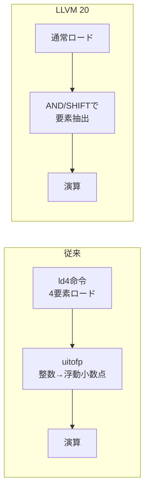

本記事は [What is new in LLVM 20?（Arm Community Blog）](https://developer.arm.com/community/arm-community-blogs/b/tools-software-ides-blog/posts/whats-new-in-llvm-20) の解説記事です。

## ブログ概要（Summary）

Arm社は2025年4月29日付のブログ記事で、LLVM 20.1.0（2025年3月11日リリース）へのArmチームの貢献を詳述しています。AWS Graviton 4プロセッサ上のSPEC CPU 2017ベンチマークにおいて、浮動小数点Rate全体で3%、整数Rate全体で1%の性能向上を達成したと報告されています。個別ベンチマークでは538.imagick_rで22%の劇的な改善が見られます。本記事ではこれらの最適化の技術的背景を解説します。

この記事は [Zenn記事: LLVM 20〜22の進化を総整理](https://zenn.dev/0h_n0/articles/0a233ce0c2d576) の深掘りです。

## 情報源

- **種別**: 企業テックブログ
- **URL**: [https://developer.arm.com/.../whats-new-in-llvm-20](https://developer.arm.com/community/arm-community-blogs/b/tools-software-ides-blog/posts/whats-new-in-llvm-20)
- **組織**: Arm Ltd. Tools, Software & IDEs チーム
- **発表日**: 2025年4月29日

## 技術的背景（Technical Background）

SPEC CPU 2017はコンパイラの最適化能力を測定する業界標準ベンチマークです。Rate（スループット）テストでは複数コピーの並列実行で性能を測定します。Armプロセッサ向けLLVMバックエンドの改善は、GCC比で長年劣勢にあったLLVMのAArch64性能を引き上げる継続的な取り組みの一環です。

LLVM 20ではArmv9.6-Aアーキテクチャの完全なアセンブリサポートが追加されています。これには2024年12月のArchitecture XML（Exploration Tools）との互換性が含まれます。SVE2.1およびSME2.1のACLE（Arm C Language Extensions）サポートも追加されており、C/C++コードからベクトル拡張命令を直接生成可能になっています。

## SPEC2017ベンチマーク結果の詳細

### 全体結果（ブログ記載値）

| ベンチマークスイート | 改善率 | 対象プロセッサ |
|---------------------|--------|---------------|
| SPEC2017 浮動小数点 Rate (fprate) | 全体で3%向上 | AWS Graviton 4 |
| SPEC2017 整数 Rate (intrate) | 全体で1%向上 | AWS Graviton 4 |

### 個別ベンチマークと最適化手法

以下は、ブログで具体的な数値と最適化手法が報告されているベンチマークの一覧です。

#### 538.imagick_r（画像処理）: 22%向上

この劇的な改善は、AArch64バックエンドにおける`uitofp(ld4)`パターンの最適化に起因しています。ブログによると、従来のコード生成では符号なし整数から浮動小数点への変換（`uitofp`）に伴う`ld4`（4要素インターリーブロード）命令が非効率なコードを生成していました。



LLVM 20では`ld4`命令の使用を回避し、よりコストの低いAND/SHIFT操作に置き換えています。`ld4`はマイクロアーキテクチャ上で複数サイクルを要し、レジスタプレッシャーも高いため、この回避は大きな性能効果をもたらしています。

#### 548.exchange2_r（数独ソルバ）: 3%超向上

GEP（getelementptr）命令の正規化（canonicalization）が原因です。ブログでは「定数ベースポインタとオフセットを持つGEP命令の正規化により、より良い定数畳み込みと共有オフセット計算が可能になった」と説明されています。

GEP正規化の効果は以下の通りです。

- 共通のGEPプレフィックスに対するCSE（Common Subexpression Elimination）が可能に
- 定数オフセット計算の重複排除
- アドレス計算のコード量削減

#### 525.x264_r（動画エンコーダ）: 3%向上

SLP（Superword Level Parallelism）ベクトライザのロード命令の順序付けとクラスタリングの改善に起因します。SLPベクトライザは、スカラー命令の並列実行可能なグループを検出してベクトル命令に変換するLLVMの最適化パスです。

ロードのクラスタリングとは、メモリアクセスパターンが連続するロード命令をグループ化し、ベクトルロード命令で一括処理する最適化です。

#### 519.lbm_r（流体力学）: 2.5%向上

スケジューリングモデルの改善により、`fdiv`（浮動小数点除算）と平方根演算のパイプライン利用率が向上しています。Graviton 4のマイクロアーキテクチャ特性に合わせたレイテンシ・スループット情報の更新が行われています。

#### 503.bwaves_r（波動方程式）: 性能向上

Flangコンパイラ（LLVM FortranフロントエンドのFunction Specializationによる改善です。参照渡しされた定数引数に対して、関数の特殊化バージョンを生成しています。Fortranのコードでは参照渡しが多用されるため、この最適化の効果が大きくなっています。

#### 557.xz_r（圧縮）: 0.89%向上

LICM（Loop-Invariant Code Motion）の改善に起因します。Clangが`nuw`（no unsigned wrap）フラグ付きGEP命令を出力するよう教育されたことで、BasicAA（Basic Alias Analysis）がより正確なエイリアス情報を利用でき、構造体フィールド更新のホイスト/シンクが改善されています。

## SVE2/NEON最適化の詳細

### NEON Dot Product命令生成

LLVM 20では3種類のドット積命令を生成できるようになりました。

| 命令 | 動作 | 用途 |
|------|------|------|
| `udot` | 符号なし8bit × 4要素を32bitに累積 | 推論時の量子化モデル |
| `sdot` | 符号付き8bit × 4要素を32bitに累積 | 符号付き量子化 |
| `usdot` | 符号なし×符号付き8bitの混合ドット積 | 混合精度演算 |

コンパイルフラグ: `-O3 -march=armv8-a+dotprod+i8mm`

```c
#include <arm_neon.h>

// 4つの8ビット乗算+32ビット累積を1命令で実行
int32x4_t dot_example(int32x4_t acc, int8x16_t a, int8x16_t b) {
    return vdotq_s32(acc, a, b);
}
```

### SVE2 Complex Dot Product

ブログによると、cdot（複素ドット積）演算のうち回転角が90度または180度のパターンに対応しています。

必要フラグ:

```bash
-O2 -march=armv9-a \
  -mllvm -vectorizer-maximize-bandwidth=1 \
  -mllvm -force-target-instruction-cost=1
```

### SVE2 histcnt命令によるヒストグラムベクトル化

従来スカラーでしか処理できなかったヒストグラム計算ループを、SVE2の`histcnt`命令によりベクトル化可能にしています。

必要フラグ:

```bash
-O3 -march=armv9-a \
  -mllvm -force-vector-interleave=1 \
  -mllvm -enable-histogram-loop-vectorization
```

## SME ZA-agnostic サポート

`__arm_agnostic("sme_za_state")`属性により、関数がSMEのZA（Scalable Matrix Array）状態を保持するかどうかを明示できるようになりました。ブログでは「ZA状態に関係なく任意の関数から呼び出せるようになり、lazy-saveのコストを回避できる」と説明されています。

```c
// ZA状態を使わないことを宣言
__arm_agnostic("sme_za_state")
void utility_function(void) {
    // ZA状態の保存/復元コストが発生しない
}
```

## Function Multiversioning改善

ブログでは5つの改善が報告されています。

1. **FMV機能の整理**: コンパイラ未サポートのFMV機能を削除し、ACLEに基づく統合
2. **TableGen依存関係生成**: FMV機能の依存関係をTableGenで自動生成
3. **ランタイム検出の簡素化**: 依存FMV機能のランタイム検出を効率化
4. **新メタデータ形式**: マルチバージョン関数のメタデータを整理
5. **GlobalOpt静的解決**: ifuncリゾルバを経由せず、静的に解決可能な呼び出しを直接化

## 学術研究との関連（Academic Connection）

Arm社のLLVMへの貢献は、コンパイラバックエンド最適化の実践的な成果を示しています。SLP ベクトライザの改善はGoldsborough et al. (2021) のSuper-Word Level Parallelism研究を基盤としており、GEP正規化はLLVMコミュニティのptradd移行プロジェクトと連動しています。

SPEC CPU 2017での3%向上は、GCC比でのLLVM競争力向上という長期目標の一環であり、特にArm Gravitonシリーズがクラウドワークロードで採用が進む中、コンパイラ最適化の実ビジネスインパクトを示す事例となっています。

## Flangコンパイラの改善

LLVM 20ではFlang（LLVMベースのFortranフロントエンド）も多くの改善を受けています。ブログでは以下が報告されています。

### ドライバフラグの追加

- `-B`: ツールチェインのパス指定
- `-f[no-]unroll-loops`: ループアンロールの制御
- `-fno-openmp`: OpenMPの無効化
- `-fveclib=ArmPL`: Arm Performance Library（ArmPL）との自動リンク

`-fveclib=ArmPL`は、数学関数のベクトル化版をArmPLから自動的にリンクする機能です。`sin`、`cos`、`exp`などの数学関数がNEON/SVEベクトル命令を使ったArmPL実装に置き換えられ、科学技術計算の性能が向上します。

### 新規組み込み関数

| 関数 | 用途 |
|------|------|
| `GETUID` / `GETGID` | ユーザー/グループID取得 |
| `MALLOC` / `FREE` | 動的メモリ管理 |
| `SYSTEM` | シェルコマンド実行（関数形式） |
| `LNBLNK` | 文字列の末尾非空白位置 |

### OpenMPサポート拡充

Flangでの新規OpenMPディレクティブ対応:

- `scope`、`dispatch`、`error`ディレクティブ
- `map`/`declare mapper`
- `atomic compare`
- `master`、`align`、`fail`、`grainsize`、`num_tasks`句

### AArch64 ABI準拠

`BIND(C)`インターフェースにおける`VALUE`属性のサポートが改善され、AArch64 ABIに準拠した値渡しと戻り値の処理が可能になっています。これにより、Fortran-C間のインターオペラビリティが向上しています。

## LLVM 21での継続的改善

Arm社は[LLVM 21ブログ（2025年10月）](https://developer.arm.com/community/arm-community-blogs/b/tools-software-ides-blog/posts/what-is-new-in-llvm-21)で、さらなる改善を報告しています。

- **523.xalancbmk**: Graviton 4で+8%、Graviton 3で+6%（小規模マルチ出口ループのアンロール改善）
- **ループベクトライザのレジスタプレッシャー推定**: ML推論ワークロードでDOT命令活用により最大2.5倍の高速化
- **Neoverse V2/N2スケジューリングモデル更新**: パイプラインモデルの精緻化
- **Cortex-A320サポート**: Armv9.2-Aアーキテクチャ
- **BTI命令削除**: カーネル性能向上のためのBranch Target Identification命令の不要箇所削除
- **Early exit vectorization**: データ依存の早期脱出を持つループのベクトル化
- **TOSA 1.0 MLIR Dialectサポート**: ML向けMLIRエコシステムへの初期対応

これらの改善は、LLVM 20からの継続的な取り組みの成果であり、半年リリースサイクルごとに着実な性能向上が積み重ねられていることを示しています。

## パフォーマンス最適化の方法論

Arm社のSPEC2017最適化アプローチは、以下のプロセスに基づいていると推察されます。

1. **プロファイリング**: `perf`等のツールでホットスポットを特定
2. **ボトルネック分析**: 生成されたアセンブリと理想的なアセンブリの比較
3. **パス改善**: LLVMの該当最適化パスを改修
4. **回帰テスト**: SPEC2017全体での回帰がないことを確認

特に538.imagick_rの22%改善のように、特定の命令選択パターン（`ld4`回避）がベンチマーク全体に大きな影響を与えるケースは、マイクロアーキテクチャの深い理解が不可欠であることを示しています。

## まとめと実践への示唆

Arm社のLLVM 20貢献は、以下の実践的な示唆を含んでいます。

- **バックエンド固有の最適化は依然として重要**: `ld4`回避のようなマイクロアーキテクチャ固有の最適化が22%もの改善をもたらす
- **GEP正規化などのIRレベル改善**: 特定ベンチマークだけでなく汎用的な性能向上に寄与する
- **SVE2/SMEのACLEサポート**: C/C++から最新のベクトル拡張命令を活用可能に

Graviton 4でのビルドでは`-march=armv9-a`の指定と、必要に応じて`-mllvm`フラグによるベクトル化オプションの調整を検討すべきです。

## 参考文献

- **Blog URL**: [https://developer.arm.com/.../whats-new-in-llvm-20](https://developer.arm.com/community/arm-community-blogs/b/tools-software-ides-blog/posts/whats-new-in-llvm-20)
- **LLVM 20.1.0 Release Notes**: [https://releases.llvm.org/20.1.0/docs/ReleaseNotes.html](https://releases.llvm.org/20.1.0/docs/ReleaseNotes.html)
- **Arm LLVM 21 Blog**: [https://developer.arm.com/.../what-is-new-in-llvm-21](https://developer.arm.com/community/arm-community-blogs/b/tools-software-ides-blog/posts/what-is-new-in-llvm-21)
- **Related Zenn article**: [https://zenn.dev/0h_n0/articles/0a233ce0c2d576](https://zenn.dev/0h_n0/articles/0a233ce0c2d576)
