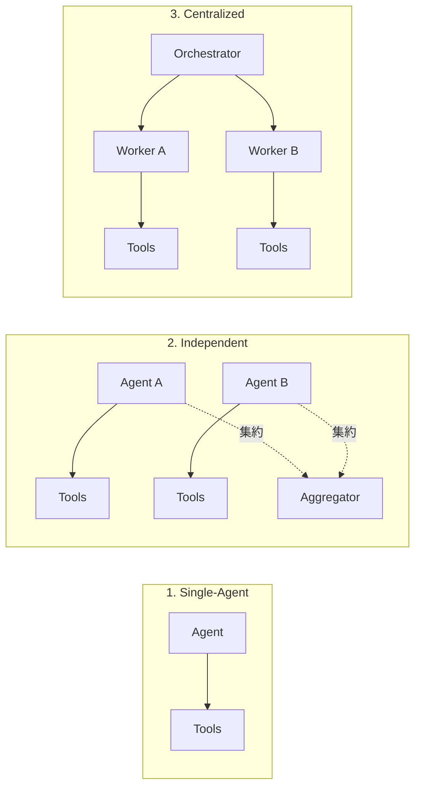

本記事は [Google Research Blog "Towards a science of scaling agent systems: When and why agent systems work"](https://research.google/blog/towards-a-science-of-scaling-agent-systems-when-and-why-agent-systems-work/)（Kim, Liu, 2026年1月、arXiv:2512.08296）の解説記事です。

## ブログ概要（Summary）

Google Researchの研究者らは、「エージェントを増やせば性能が上がる」という通説に異議を唱え、180のエージェント構成を体系的に評価した研究結果を発表した。並列化可能なタスク（金融分析等）では集中型マルチエージェントシステムが単一エージェント比で**80.9%の性能向上**を達成した一方、厳密な逐次推論が必要なタスクでは全てのマルチエージェント構成が**39〜70%の性能劣化**を示したと報告されている。著者らは、タスクの測定可能な特性からアーキテクチャを予測するモデル（$R^2 = 0.513$、未知タスクの87%で正解）を構築し、エージェントシステムの設計を科学的基盤に置くことを提案している。

この記事は [Zenn記事: Agentic AIが引き起こす次の知能爆発 Science誌論文とSociety of Thoughtの全貌](https://zenn.dev/0h_n0/articles/672dc6adf8e50a) の深掘りです。

## 情報源

- **種別**: 企業テックブログ / 研究論文
- **URL**: [https://research.google/blog/towards-a-science-of-scaling-agent-systems-when-and-why-agent-systems-work/](https://research.google/blog/towards-a-science-of-scaling-agent-systems-when-and-why-agent-systems-work/)
- **論文**: [arXiv:2512.08296](https://arxiv.org/abs/2512.08296)
- **組織**: Google Research
- **著者**: Yubin Kim (Research Intern), Xin Liu (Senior Research Scientist)
- **発表日**: 2026年1月28日

## 技術的背景（Technical Background）

Zenn記事で紹介したEvansらのScience誌論文は、知能爆発が「社会的」に起きると主張している。しかし、この主張に対する実証的裏付け、特に「どのような条件下でマルチエージェント構成が有効か」という定量的な知見は不足していた。

Google Researchのこの研究は、マルチエージェントシステムの有効性をヒューリスティックではなく科学的に理解するための体系的な実験を提供する。180の異なるエージェント構成（5つのアーキテクチャ × 複数のモデル × 4つのベンチマーク）を評価することで、「いつ」「なぜ」マルチエージェントが機能するかの定量的原則を導出している。

## 実装アーキテクチャ（Architecture）

### 5つの正準アーキテクチャ

著者らが評価した5つのアーキテクチャは以下の通りである。



| # | アーキテクチャ | 構造 | 通信パターン | 特徴 |
|---|---|---|---|---|
| 1 | **Single-Agent (SAS)** | 単一エージェント | なし | 逐次実行、統一メモリ |
| 2 | **Independent** | 並列エージェント | 集約のみ | 各エージェントが独立に作業、最後に結果集約 |
| 3 | **Centralized** | ハブ・スポーク型 | オーケストレータ経由 | 中央のオーケストレータがタスク分配・結果統合 |
| 4 | **Decentralized** | ピアツーピア | メッシュ通信 | エージェント間で直接通信 |
| 5 | **Hybrid** | 階層型 | 階層的監督 + 柔軟なピア連携 | 集中型と分散型のハイブリッド |

### 使用ベンチマーク

| ベンチマーク | タスク種別 | 特性 |
|---|---|---|
| **Finance-Agent** | 金融推論 | 並列化可能（異なるデータソースの同時分析） |
| **BrowseComp-Plus** | Web検索ナビゲーション | 並列化可能（複数ページの同時探索） |
| **PlanCraft** | 計画立案 | 逐次推論（ステップ間の依存関係が強い） |
| **Workbench** | ツール使用 | 混合（並列・逐次の両要素） |

## パフォーマンス最適化（Performance）

### 主要な定量結果

ブログおよび論文で報告されている主要な実験結果は以下の通りである。

**並列化可能タスク（Finance-Agent）の結果**:

著者らによると、集中型マルチエージェントシステムは単一エージェント比で**+80.9%**の性能向上を示した。複数のエージェントが同時に収益動向、コスト構造、市場比較などの異なるサブ問題を分析することで、網羅的な分析が可能になったと報告されている。

**逐次推論タスク（PlanCraft）の結果**:

著者らによると、テストした全てのマルチエージェント構成が単一エージェントより劣化し、性能低下は**39〜70%**に達した。通信オーバーヘッドが推論プロセスを分断し、実際のタスク実行に使える「認知予算」が不足したためと分析されている。

**ツール協調時のエラー増幅**:

| システム種別 | エラー増幅率 | 備考 |
|---|---|---|
| Independent（独立型） | **17.2倍** | エラーが制御なく伝播 |
| Centralized（集中型） | **4.4倍** | オーケストレータが検証ボトルネックとして機能 |

著者らは、ツール数が16を超えるとすべての構成で性能が低下する傾向を報告している。

### 3つのスケーリング原則

著者らが180構成の実験から導出した原則は以下の3つである。

**1. Alignment Principle（整合原則）**

マルチエージェントシステムは、タスクが独立したサブ問題に分解可能な場合に最も効果を発揮する。タスクの分解可能性が高いほど、エージェント追加による性能向上が大きい。

**2. Sequential Penalty（逐次ペナルティ）**

厳密な逐次推論が必要なタスクでは、エージェント間の通信オーバーヘッドが推論プロセスを分断する。各エージェントに割り当てられる認知予算（トークン数）が減少し、個々のエージェントの推論品質が低下する。

**3. Architecture as Safety（アーキテクチャ安全性）**

集中型システムはオーケストレータが「検証ボトルネック」として機能し、エラーの連鎖的伝播を防止する。独立型と比較してエラー増幅率が17.2倍から4.4倍に低減される。

### 予測モデル

著者らは、タスクの測定可能な特性（ツール数、分解可能性、逐次性など）からアーキテクチャを予測するモデルを構築した。

- **決定係数**: $R^2 = 0.513$（モデルの説明力）
- **予測精度**: 未知タスク構成の**87%**で最適アーキテクチャを正しく予測

このモデルにより、新しいタスクに対してヒューリスティックではなくデータ駆動でアーキテクチャを選択できるようになる。

## 運用での学び（Production Lessons）

### アーキテクチャ選択の実践的ガイドライン

ブログの知見を実践的なガイドラインにまとめると以下のようになる。

```python
"""タスク特性に基づくアーキテクチャ選択の概念的実装

Google Research (arXiv:2512.08296) の知見に基づく。

Requirements:
    Python 3.11+
"""
from dataclasses import dataclass
from enum import Enum


class Architecture(Enum):
    """5つの正準アーキテクチャ"""
    SINGLE_AGENT = "single_agent"
    INDEPENDENT = "independent"
    CENTRALIZED = "centralized"
    DECENTRALIZED = "decentralized"
    HYBRID = "hybrid"


@dataclass
class TaskProperties:
    """タスクの測定可能な特性

    Attributes:
        decomposability: タスクの分解可能性 (0.0-1.0)
        sequential_dependency: ステップ間依存度 (0.0-1.0)
        tool_count: 使用ツール数
        requires_shared_context: 共有コンテキスト必要性
    """
    decomposability: float
    sequential_dependency: float
    tool_count: int
    requires_shared_context: bool


def select_architecture(task: TaskProperties) -> Architecture:
    """タスク特性に基づくアーキテクチャ選択

    Google Research論文の3原則に基づく判定ロジック:
    1. Alignment Principle: 分解可能 → マルチエージェント有効
    2. Sequential Penalty: 逐次依存度高 → シングルエージェント推奨
    3. Architecture as Safety: ツール多数 → 集中型推奨

    Args:
        task: タスクの測定可能な特性

    Returns:
        推奨アーキテクチャ
    """
    # Sequential Penalty: 逐次依存度が高い場合はシングルエージェント
    if task.sequential_dependency > 0.7:
        return Architecture.SINGLE_AGENT

    # ツール数が多い場合は集中型（エラー増幅の抑制）
    if task.tool_count > 16:
        return Architecture.CENTRALIZED

    # 分解可能性が高く、共有コンテキスト不要
    if task.decomposability > 0.7 and not task.requires_shared_context:
        return Architecture.INDEPENDENT

    # 分解可能性が中程度、または共有コンテキストが必要
    if task.decomposability > 0.4:
        return Architecture.CENTRALIZED

    return Architecture.SINGLE_AGENT
```

### Zenn記事のフレームワーク比較との対応

Zenn記事で紹介したフレームワーク比較に、本研究の知見を重ねると以下のようになる。

| フレームワーク | Google Research分類 | 推奨タスク種別 |
|---|---|---|
| **LangGraph** | Centralized / Hybrid | ツール数多、エラー制御が必要なタスク |
| **CrewAI** | Independent / Centralized | 並列分解可能なビジネスワークフロー |
| **OpenAI Agents SDK** | Centralized | 低レイテンシが必要なタスク |

## 学術研究との関連（Academic Connection）

- **Evans+26のScience論文**: 知能爆発が「社会的」に起きるという主張に対し、本研究は「どの条件下で社会的知能が機能するか」の定量的裏付けを提供
- **Society of Thought（Wu+25）**: 単一モデル内部の多エージェント構造に対し、本研究は外部の複数モデル間の協調パターンの有効性を定量化
- **Anthropicのマルチエージェントシステム**: 本研究の集中型アーキテクチャの有効性は、Anthropicのオーケストレータ・ワーカーパターンの設計判断を裏付ける

## Production Deployment Guide

### AWS実装パターン（コスト最適化重視）

タスク特性に応じたアーキテクチャ選択をAWS上で実現する構成を示す。

**トラフィック量別の推奨構成**:

| 規模 | 月間リクエスト | 推奨構成 | 月額コスト | 主要サービス |
|------|--------------|---------|-----------|------------|
| **Small** | ~3,000 (100/日) | Serverless | $200-500 | Lambda + Bedrock + Step Functions |
| **Medium** | ~30,000 (1,000/日) | Hybrid | $1,500-3,000 | Step Functions + ECS Fargate + Bedrock |
| **Large** | 300,000+ (10,000/日) | Container | $8,000-15,000 | EKS + Bedrock + ElastiCache |

**コスト試算の注意事項**:
- 上記は2026年3月時点のAWS ap-northeast-1（東京）リージョン料金に基づく概算値
- マルチエージェント構成のコストはエージェント数に比例して増加
- 逐次タスクではシングルエージェントが性能・コストの両面で最適
- 最新料金は [AWS料金計算ツール](https://calculator.aws/) で確認してください

### Terraformインフラコード

**動的アーキテクチャ選択: Step Functions + Lambda**

```hcl
resource "aws_sfn_state_machine" "agent_orchestrator" {
  name     = "agent-architecture-selector"
  role_arn = aws_iam_role.step_functions.arn

  definition = jsonencode({
    Comment = "タスク特性に基づく動的アーキテクチャ選択"
    StartAt = "AnalyzeTask"
    States = {
      AnalyzeTask = {
        Type     = "Task"
        Resource = aws_lambda_function.task_analyzer.arn
        Next     = "SelectArchitecture"
      }
      SelectArchitecture = {
        Type = "Choice"
        Choices = [
          {
            Variable     = "$.architecture"
            StringEquals = "single_agent"
            Next         = "SingleAgentExecution"
          },
          {
            Variable     = "$.architecture"
            StringEquals = "centralized"
            Next         = "CentralizedExecution"
          },
          {
            Variable     = "$.architecture"
            StringEquals = "independent"
            Next         = "IndependentExecution"
          }
        ]
        Default = "SingleAgentExecution"
      }
      SingleAgentExecution = {
        Type     = "Task"
        Resource = aws_lambda_function.single_agent.arn
        End      = true
      }
      CentralizedExecution = {
        Type     = "Task"
        Resource = aws_lambda_function.orchestrator_agent.arn
        End      = true
      }
      IndependentExecution = {
        Type = "Parallel"
        Branches = [
          { StartAt = "Worker1", States = { Worker1 = { Type = "Task", Resource = aws_lambda_function.worker_agent.arn, End = true } } },
          { StartAt = "Worker2", States = { Worker2 = { Type = "Task", Resource = aws_lambda_function.worker_agent.arn, End = true } } },
          { StartAt = "Worker3", States = { Worker3 = { Type = "Task", Resource = aws_lambda_function.worker_agent.arn, End = true } } }
        ]
        Next = "AggregateResults"
      }
      AggregateResults = {
        Type     = "Task"
        Resource = aws_lambda_function.aggregator.arn
        End      = true
      }
    }
  })
}

resource "aws_lambda_function" "task_analyzer" {
  filename      = "task_analyzer.zip"
  function_name = "task-property-analyzer"
  role          = aws_iam_role.lambda_execution.arn
  handler       = "index.handler"
  runtime       = "python3.12"
  timeout       = 60
  memory_size   = 512

  environment {
    variables = {
      BEDROCK_MODEL_ID = "anthropic.claude-haiku-4-5-20251001-v1:0"
    }
  }
}

resource "aws_cloudwatch_metric_alarm" "architecture_cost" {
  alarm_name          = "agent-architecture-cost"
  comparison_operator = "GreaterThanThreshold"
  evaluation_periods  = 1
  metric_name         = "ExecutionCost"
  namespace           = "Custom/AgentSystem"
  period              = 86400
  statistic           = "Sum"
  threshold           = 500
  alarm_description   = "日次エージェント実行コスト閾値超過"
}
```

### セキュリティベストプラクティス

- **IAMロール**: Step Functions/Lambdaに最小権限（BedrockとDynamoDBのみ）
- **ネットワーク**: VPCプライベートサブネット内実行
- **ログ**: Step Functions実行ログをCloudWatch Logsに記録
- **暗号化**: 全データKMS暗号化

### コスト最適化チェックリスト

- [ ] タスク分析でシングルエージェント推奨の場合はマルチエージェントを使わない
- [ ] 逐次タスク（sequential_dependency > 0.7）にマルチエージェントを適用しない
- [ ] ツール数16超の場合は集中型を選択（エラー増幅17.2倍→4.4倍に低減）
- [ ] タスク分析にはHaikuを使用（低コストで十分）
- [ ] Step Functions Express Workflowを活用（低コスト・短時間タスク向け）
- [ ] Bedrock Prompt Caching有効化
- [ ] AWS Budgets: 月額予算アラート設定
- [ ] CloudWatch: Step Functions実行時間・コスト監視
- [ ] Cost Anomaly Detection有効化
- [ ] 並列ワーカー数の上限設定（コスト制御）

## まとめと実践への示唆

Google Researchの研究は、マルチエージェントシステムの有効性が「タスクの性質」によって決定的に異なることを180構成の体系的実験で実証した。並列化可能タスクでの80.9%向上と逐次タスクでの39-70%劣化という結果は、「エージェントを増やせば良い」という単純な思考を戒めている。著者らが導出した3つのスケーリング原則（Alignment Principle、Sequential Penalty、Architecture as Safety）と、タスク特性から最適アーキテクチャを87%の精度で予測するモデルは、マルチエージェントシステムの設計をヒューリスティックから科学的基盤に移行させる重要な一歩である。

## 参考文献

- **Blog URL**: [https://research.google/blog/towards-a-science-of-scaling-agent-systems-when-and-why-agent-systems-work/](https://research.google/blog/towards-a-science-of-scaling-agent-systems-when-and-why-agent-systems-work/)
- **arXiv**: [https://arxiv.org/abs/2512.08296](https://arxiv.org/abs/2512.08296)
- **Related Zenn article**: [https://zenn.dev/0h_n0/articles/672dc6adf8e50a](https://zenn.dev/0h_n0/articles/672dc6adf8e50a)
- **Evans et al. (2026)**: Agentic AI and the next intelligence explosion, Science
