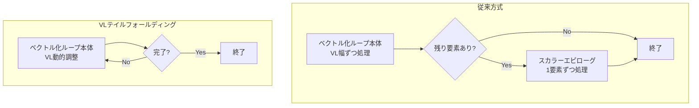
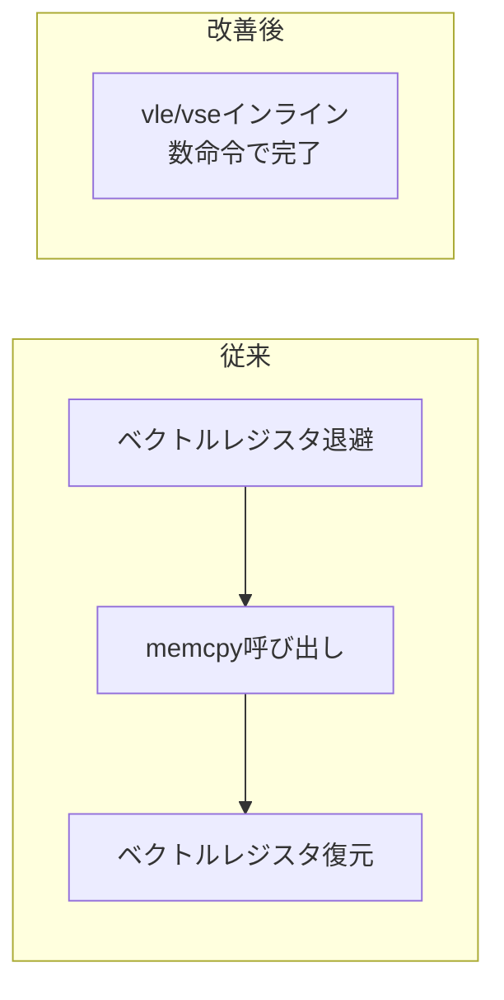

本記事は [Improvements to RISC-V Vector Code Generation in LLVM（Igalia Compilers Team Blog）](https://blogs.igalia.com/compilers/2025/05/28/improvements-to-risc-v-vector-code-generation-in-llvm/) の解説記事です。

## ブログ概要（Summary）

Igalia社のコンパイラチーム（Alex Bradbury、Luke Lau）は、2025年5月のRISC-V Summit Europe（パリ）で発表した内容をブログ記事としてまとめています。LLVM RISC-VバックエンドのVLテイルフォールディング、非2冪ベクトル化、libcall展開、半精度/bf16サポートの4つの主要改善を報告しています。SpacemiT X60プロセッサ上のSPEC CPU 2017で約9%のgeomean改善（18ヶ月前のClangとの比較）を達成し、16ベンチマーク中12で5%以上、7で10%以上の改善が報告されています。

この記事は [Zenn記事: LLVM 20〜22の進化を総整理](https://zenn.dev/0h_n0/articles/0a233ce0c2d576) の深掘りです。

## 情報源

- **種別**: 企業テックブログ
- **URL**: [https://blogs.igalia.com/compilers/2025/05/28/...](https://blogs.igalia.com/compilers/2025/05/28/improvements-to-risc-v-vector-code-generation-in-llvm/)
- **組織**: Igalia S.L. Compilers Team
- **発表日**: 2025年5月28日
- **関連発表**: RISC-V Summit Europe 2025（パリ）

## 技術的背景（Technical Background）

RISC-V Vector Extension（RVV）は、RISC-Vアーキテクチャのベクトル演算拡張です。RVVの特徴は、ベクトル長がハードウェア実装に依存する「Scalable Vector」設計を採用している点です。これはArmのSVE（Scalable Vector Extension）と同様のアプローチで、固定長ベクトル（x86 SSE/AVX）とは異なります。

LLVMのRISC-Vバックエンドは、このRVVの特性を活かしたコード生成を行いますが、2024年時点ではGCCに比べてベクトルコード生成の品質に課題がありました。Igalia社の取り組みは、RISEプロジェクト（RISC-V Software Ecosystem）のRP009として、LLVMのSPEC最適化に特化したプロジェクトの一環です。

### SPEC2017全体結果

ブログによると、SpacemiT X60（インオーダー8コアRISC-Vプロセッサ）上での結果は以下の通りです。

| 指標 | 結果 |
|------|------|
| geomean改善率 | 約9%（18ヶ月前のClang比） |
| 5%以上改善 | 16ベンチマーク中12 |
| 10%以上改善 | 16ベンチマーク中7 |
| GCC比較 | 16中11でLLVMが高速、3で劣後、2で同等 |

## VLテイルフォールディング（VL Tail Folding）

### 問題：スカラーエピローグのコスト

ベクトル化されたループでは、入力サイズがベクトル幅で割り切れない場合、残りの要素（テイル）を処理する「スカラーエピローグ」が必要になります。



RVVでは`vsetvli`命令により、残り要素数に応じてベクトル長（VL）を動的に設定できます。これにより、ループ本体1つで全要素を処理でき、スカラーエピローグが不要になります。

### 技術的詳細

```c
// テイルフォールディングの恩恵を受けるループ例
void add_arrays(float* dst, const float* a, const float* b, int n) {
    for (int i = 0; i < n; i++) {
        dst[i] = a[i] + b[i];
    }
}
```

VLテイルフォールディングが有効な場合、コンパイラは以下のような疑似アセンブリを生成します。

```
loop:
    vsetvli t0, a3, e32, m1    # VL = min(残り要素数, VLEN/32)
    vle32.v v0, (a1)           # a[i:i+VL]をロード
    vle32.v v1, (a2)           # b[i:i+VL]をロード
    vfadd.vv v2, v0, v1       # ベクトル加算
    vse32.v v2, (a0)           # 結果を格納
    sub a3, a3, t0             # 残り要素数を更新
    # ... ポインタ更新 ...
    bnez a3, loop              # 残りがあればループ継続
```

`vsetvli`が各イテレーションで処理する要素数を動的に調整するため、最後のイテレーションでは残り要素のみが処理されます。スカラーエピローグへの分岐が不要になることで、分岐予測ミスの削減とコードサイズの削減が同時に達成されます。

ブログによると、x264（動画エンコーダ）のように短いループが頻繁に実行されるベンチマークで、スカラーテイルの実行回数が多い場合に大きな効果が得られると報告されています。

LLVM 22ではこのVLテイルフォールディングがRISC-Vバックエンドでデフォルト有効化されました。性能低下が見られる特定パターンでは`-mllvm -prefer-predicate-over-epilogue=scalar-epilogue`で無効化可能です。

## 非2冪ベクトル化（Non-Power-of-Two Vectorization）

### 問題：3要素ベクトルの非効率性

従来のSLP（Superword Level Parallelism）ベクトライザは、2の冪乗幅（2, 4, 8, ...）のベクトル演算のみを生成していました。RGBピクセル処理のような3要素データでは、2要素をベクトル化し残り1要素をスカラー処理するか、4要素にパディングする必要がありました。

### 改善内容

ブログによると、SLPベクトライザが3要素ベクトルを直接処理できるよう改善されています。RVVでは`vsetvli`で任意のベクトル長を指定できるため、3要素のベクトル演算をネイティブに表現可能です。

```c
// RGB輝度調整の例
struct RGB { uint8_t r, g, b; };

void adjust_brightness(struct RGB* pixels, int n, float factor) {
    for (int i = 0; i < n; i++) {
        // 3要素を直接ベクトル化可能
        pixels[i].r = clamp(pixels[i].r * factor);
        pixels[i].g = clamp(pixels[i].g * factor);
        pixels[i].b = clamp(pixels[i].b * factor);
    }
}
```

従来は`r, g`の2要素をベクトル化し`b`をスカラーで処理するか、4要素目にダミーデータを追加してベクトル化していました。非2冪対応により、3要素すべてを1つのベクトル命令で処理できます。

## Libcall展開（Libcall Expansion）

### 問題：ベクトルレジスタのスピル

`memcpy`や`memset`のようなメモリ操作関数は、通常ライブラリコール（`libc`内の最適化された実装）として生成されます。しかし、RISC-Vの標準呼出規約ではベクトルレジスタがすべてcaller-savedであるため、関数呼び出し前にベクトルレジスタの内容をスタックに退避（スピル）する必要があります。

### 改善内容

ブログによると、小さなサイズの`memcpy`/`memset`をライブラリコールではなくインライン展開し、ベクトル命令を使って直接処理するよう改善されています。



ベクトルレジスタのスピル/リストアコストがなくなるため、ベクトル化されたコード内での`memcpy`呼び出しが多いパターンで性能が向上しています。

## 半精度（FP16）/ BF16サポート

### 改善内容

RVVのZfhmin拡張（最小限のhalf-precision浮動小数点サポート）環境では、FP16演算の多くが32ビットへの拡張（widening）で処理されます。ブログによると、従来はライブラリコールやスカラー化にフォールバックしていた処理が、少数の命令でのwidening処理に改善されています。

BF16（Brain Floating Point 16）についても同様のwidening戦略が適用されています。ML推論ワークロードでBF16が広く使われているため、この改善はRISC-V上でのML推論性能に直接影響します。

## 関連する追加改善

### SpacemiT X60スケジューリングモデル

Igalia社のMikhail R. Gadelhaは、[別のブログ記事（2025年11月）](https://blogs.igalia.com/compilers/2025/11/22/unlocking-15-more-performance-a-case-study-in-llvm-optimization-for-risc-v/)でSpacemiT X60向けのスケジューリングモデル開発を報告しています。

- **201スカラー命令** + **82浮動小数点命令** + **9,185 RVV命令**のレイテンシ情報を定義
- スカラーコードでgeomean **-4.75%**、ベクトル化コードでgeomean **-3.28%**の実行時間削減

### IPRA（Inter-Procedural Register Allocation）

同ブログ記事（2025年11月）では、IPRA（手続き間レジスタ割り当て）のRISC-V対応も報告されています。IPRAは、呼び出し先関数が実際に使用するレジスタを分析し、呼び出し元での不要なレジスタ退避を削減する最適化です。

標準の呼出規約ではcaller-savedレジスタ（RISC-Vのt0-t6, a0-a7等）はすべて退避が必要ですが、IPRAにより「呼び出し先がt3-t6を使わない」と判明した場合、これらのレジスタの退避を省略できます。ベクトル化されたコードで最大3.4%の改善が報告されています。

### Cross-call vectorization

SLPベクトライザの収益性分析が関数呼び出しを無視していた問題の修正も報告されています。関数呼び出しを跨ぐベクトル化パターンを正しく評価することで、特定ベンチマークで最大11.9%の改善が達成されています。

### llvm-exegesisのRVV対応

マイクロアーキテクチャのレイテンシ/スループット測定ツール`llvm-exegesis`がRVV命令に対応しました。これにより、RISC-Vプロセッサ実機のパイプライン特性を計測し、スケジューリングモデルの精度向上に活用できます。

### VLオプティマイザ

EuroLLVMで発表されたVLオプティマイザは、`vsetvli`命令の冗長な挿入を削減し、VL設定のオーバーヘッドを最小化する最適化パスです。

## GCC比較の意義

ブログで報告されている「16ベンチマーク中11でLLVMが高速」という結果は、RISC-V向けコンパイラの成熟度を示す指標として注目に値します。歴史的に、RISC-V向けのGCCサポートはLLVMより先行しており、特にベクトル化の品質でGCCが優位でした。Igalia社の8ヶ月のプロジェクト（2024年9月〜2025年5月）により、LLVMがGCCと同等以上の性能を達成したことは、RISC-Vエコシステムにおけるツールチェーン選択肢の拡大を意味します。

GCCが依然として優位な3ベンチマークについては、具体的なベンチマーク名と原因は報告されていませんが、特定のループパターンやメモリアクセスパターンでの差異が想定されます。

## 学術研究との関連（Academic Connection）

RISC-V向けベクトルコード生成の研究は、Arm SVEのスケーラブルベクトル化研究と並行して進んでいます。テイルフォールディングのアプローチはArmのSVE predicated loopsと概念的に類似しており、LLVMの`LoopVectorize`パス内で共通のフレームワークとして実装されています。

非2冪ベクトル化は、SLP vectorizationの拡張としてはLLVMで初めての本格的な実装であり、ABI上の制約が少ないRVVの柔軟性（任意VL設定）を活用した改善です。

## まとめと実践への示唆

Igalia社のRISC-V向けLLVM改善は、以下の実践的な示唆を含んでいます。

- **VLテイルフォールディング**: LLVM 22以降ではデフォルト有効。短いループが頻繁に実行されるワークロードで大きな効果
- **スケジューリングモデルの重要性**: プロセッサ固有のレイテンシ情報がgeomean 3-5%の改善に直結
- **GCC比較**: 16ベンチマーク中11でLLVMが高速になっており、RISC-V向けLLVMの成熟が進行中
- **RISE Project**: RISC-Vエコシステムとして組織的にコンパイラ改善が進められている

RISC-V開発者は、最新のClang/LLVMを使用し、ターゲットプロセッサ向けの`-mcpu`指定（スケジューリングモデル活用）と`-march=rv64gcv`（RVV有効化）を推奨します。

## 参考文献

- **Blog URL**: [https://blogs.igalia.com/compilers/2025/05/28/...](https://blogs.igalia.com/compilers/2025/05/28/improvements-to-risc-v-vector-code-generation-in-llvm/)
- **15% Performance Case Study**: [https://blogs.igalia.com/compilers/2025/11/22/...](https://blogs.igalia.com/compilers/2025/11/22/unlocking-15-more-performance-a-case-study-in-llvm-optimization-for-risc-v/)
- **RISE Project RP009**: [https://riseproject.dev/2025/05/08/project-rp009-llvm-spec-optimization/](https://riseproject.dev/2025/05/08/project-rp009-llvm-spec-optimization/)
- **LLVM RISC-V Vector Extension docs**: [https://llvm.org/docs/RISCV/RISCVVectorExtension.html](https://llvm.org/docs/RISCV/RISCVVectorExtension.html)
- **Related Zenn article**: [https://zenn.dev/0h_n0/articles/0a233ce0c2d576](https://zenn.dev/0h_n0/articles/0a233ce0c2d576)
