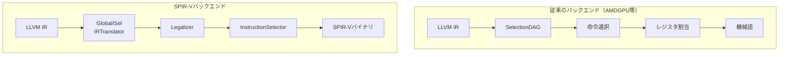
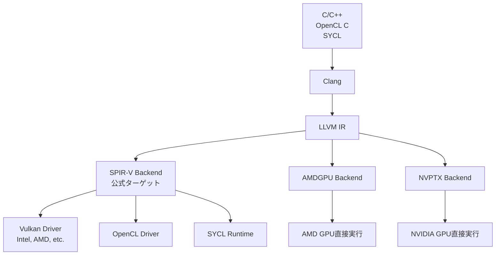

本記事は [LLVM 20 Promotes SPIR-V to Official Backend（Khronos Group）](https://www.khronos.org/news/archives/llvm-20-promotes-spir-v-to-official-backend) および [SPIR-V Target User Guide（LLVM 20.1.0公式ドキュメント）](https://releases.llvm.org/20.1.0/docs/SPIRVUsage.html) の解説記事です。

## ブログ概要（Summary）

2025年1月28日、Khronos Groupは「LLVMの開発者がSPIR-VバックエンドをLLVM 20で実験的ステータスから公式ターゲットに昇格することに合意した」と発表しました。LLVM 20.1.0（2025年3月11日リリース）により、SPIR-Vバックエンドはデフォルトビルドに組み込まれ、`-DLLVM_TARGETS_TO_BUILD`で通常のターゲットとして有効化されます。Intel社が主要な貢献者として、SPIR-V LLVM Translatorとの互換性を維持しつつGlobalISelベースの命令選択を実装しています。

この記事は [Zenn記事: LLVM 20〜22の進化を総整理](https://zenn.dev/0h_n0/articles/0a233ce0c2d576) の深掘りです。

## 情報源

- **種別**: 標準化団体公式アナウンス + LLVMドキュメント
- **URL (アナウンス)**: [https://www.khronos.org/news/archives/llvm-20-promotes-spir-v-to-official-backend](https://www.khronos.org/news/archives/llvm-20-promotes-spir-v-to-official-backend)
- **URL (ドキュメント)**: [https://releases.llvm.org/20.1.0/docs/SPIRVUsage.html](https://releases.llvm.org/20.1.0/docs/SPIRVUsage.html)
- **組織**: Khronos Group / LLVM Project
- **発表日**: 2025年1月28日（アナウンス）、2025年3月11日（LLVM 20.1.0リリース）

## 技術的背景（Technical Background）

### SPIR-Vとは

SPIR-V（Standard Portable Intermediate Representation）は、Khronos Groupが策定するGPU向けバイナリ中間表現フォーマットです。以下のAPIのシェーダー/カーネルプログラムを統一的に表現します。

| API | SPIR-Vバージョン | 用途 |
|-----|-----------------|------|
| Vulkan 1.0 | SPIR-V 1.0 | グラフィックス・Computeシェーダー |
| Vulkan 1.2 | SPIR-V 1.5 | レイトレーシング拡張等 |
| Vulkan 1.3 | SPIR-V 1.6 | メッシュシェーダー等 |
| OpenCL 2.0+ | SPIR-V 1.0+ | GPGPUカーネル |
| SYCL | SPIR-V 1.0+ | クロスプラットフォームGPU |

### 従来の「実験的」ステータスの意味

LLVM 20以前、SPIR-Vバックエンドは`-DLLVM_EXPERIMENTAL_TARGETS_TO_BUILD=SPIRV`でのみ有効化できる実験的ターゲットでした。これにより以下の制約がありました。

- デフォルトのLLVMビルドに含まれないため、多くのLinuxディストリビューションのLLVMパッケージに非搭載
- テストインフラが限定的であり、リグレッション検出が不十分
- APIの安定性が保証されず、破壊的変更のリスク

## 公式昇格の技術的変更点

### ビルドシステムの変更

```cmake
# LLVM 19以前: 実験的ターゲットとして指定
-DLLVM_EXPERIMENTAL_TARGETS_TO_BUILD=SPIRV

# LLVM 20以降: 通常のターゲットとして指定
-DLLVM_TARGETS_TO_BUILD="X86;AArch64;SPIRV"

# またはallを指定すればSPIR-Vも含まれる
-DLLVM_TARGETS_TO_BUILD=all
```

### GlobalISelベースの命令選択

SPIR-Vバックエンドの特筆すべき設計判断は、SelectionDAGではなくGlobalISel（Global Instruction Selection）を採用している点です。LLVMドキュメントによると、SelectionDAGへのフォールバックなしでGlobalISelのみで命令選択が行われます。



GlobalISelの採用理由は以下と推測されます。

1. **SPIR-Vの特殊性**: SPIR-Vは物理レジスタを持たない仮想的なISAであり、SelectionDAGのDAGベースの命令選択が不要
2. **型情報の保持**: GlobalISelのGeneric MIR（Machine IR）はLLVM IRの型情報をより忠実に保持できる
3. **拡張性**: 新しいSPIR-V拡張への対応がGlobalISelの方が容易

### サポートされるターゲットトリプル

LLVM 20.1.0ドキュメントによると、3つのターゲットアーキテクチャが定義されています。

| ターゲット | ポインタ幅 | メモリモデル | 主な用途 |
|-----------|-----------|-------------|---------|
| `spirv32` | 32-bit | 物理メモリ | OpenCL（32bitデバイス） |
| `spirv64` | 64-bit | 物理メモリ | OpenCL（64bitデバイス） |
| `spirv` | 論理的 | 論理メモリレイアウト | Vulkanシェーダー |

```bash
# OpenCL向け（64bitポインタ）
clang --target=spirv64 -O2 -c kernel.cl -o kernel.spv

# Vulkan向け（論理メモリ）
clang --target=spirv -O2 -c shader.cl -o shader.spv

# Vulkan 1.3ランタイム指定
clang --target=spirv-unknown-vulkan1.3 -O2 -c shader.cl -o shader.spv

# AMD HSAランタイム指定
clang --target=spirv64-unknown-amdhsa -O2 -c kernel.cl -o kernel.spv
```

## サポートされるSPIR-V拡張

LLVM 20.1.0ドキュメントには30以上のSPIR-V拡張が記載されています。`-spirv-ext`フラグで個別に有効化できます。

### Intel固有拡張

| 拡張 | 機能 |
|------|------|
| `SPV_INTEL_arbitrary_precision_integers` | 任意精度整数型 |
| `SPV_INTEL_bfloat16_conversion` | BF16変換命令 |
| `SPV_INTEL_function_pointers` | 関数ポインタ |
| `SPV_INTEL_joint_matrix` | 行列演算（Xe GPU向け） |
| `SPV_INTEL_subgroups` | サブグループ操作 |
| `SPV_INTEL_variable_length_array` | 可変長配列 |

### Khronos標準拡張

| 拡張 | 機能 |
|------|------|
| `SPV_KHR_bit_instructions` | ビット操作命令 |
| `SPV_KHR_float_controls` | 浮動小数点制御 |
| `SPV_KHR_integer_dot_product` | 整数ドット積 |
| `SPV_KHR_subgroup_rotate` | サブグループローテーション |

```bash
# 特定拡張を有効化
clang --target=spirv64 -Xclang -spirv-ext=+SPV_KHR_float_controls kernel.cl

# 複数拡張を同時有効化
clang --target=spirv64 -Xclang -spirv-ext=+SPV_KHR_float_controls,+SPV_INTEL_subgroups kernel.cl

# 全拡張を有効化
clang --target=spirv64 -Xclang -spirv-ext=all kernel.cl
```

## SPIR-V固有のLLVM IR表現

### Opaque Type Encoding

SPIR-Vの特殊型はLLVMのTarget Extension Typeとして表現されます。

| SPIR-V型 | LLVM表現 |
|----------|---------|
| Image | `target("spirv.Image", ...)` |
| Sampler | `target("spirv.Sampler")` |
| SampledImage | `target("spirv.SampledImage", ...)` |
| Event | `target("spirv.Event")` |
| Pipe | `target("spirv.Pipe", ...)` |

### Builtin関数の命名規則

SPIR-Vの組み込み関数は以下の命名規則に従います。

```
__spirv_{OpCodeName}{_OptionalPostfixes}
```

例:
- `__spirv_BuiltInGlobalInvocationId`: グローバルインボケーションID取得
- `__spirv_AtomicIAdd`: アトミック整数加算
- `__spirv_GroupNonUniformBallot`: Non-uniformバロット操作

## 制約事項と今後の課題

### 現在の制約

LLVMドキュメントおよびiWOCL 2025（Intel Alexey Sachkovの発表）によると、以下の制約が存在します。

1. **Compute��ェーダー中心**: グラフィックスシェーダー（Vertex、Fragment等）の完全サポートは今後の課題
2. **LLVM IRの制約**: すべてのLLVM IR構造がSPIR-Vに1対1でマッピングされるわけではなく、一部の最適化パスの結果がSPIR-Vの制約に合わない場合がある
3. **SYCL統合**: SYCL実装（Intel oneAPI DPC++等）でのLLVM SPIR-Vバックエンドの採用は段階的に進行中
4. **デバッグ情報**: `NonSemantic.Shader.DebugInfo.100`による非セマンティックデバッグ情報のサポートは`-spv-emit-nonsemantic-debug-info`フラグで有効化可能だが、機能は限定的

### SPIR-V LLVM Translatorとの関係

LLVMプロジェクト内のSPIR-Vバックエンドと、Khronosが維持する外部プロジェクト「SPIR-V LLVM Translator」（llvm-spirv）は別のプロジェクトです。ただし、LLVM IR上でのSPIR-V表現規則（Builtin関数命名、型エンコーディング等）は互換性が維持されています。

## GPUコンパイルエコシステムにおける位置づけ



SPIR-Vバックエンドの公式化により、以下のワークフローが統一されます。

- **ベンダー非依存**: AMDGPUやNVPTXバックエンドではベンダー固有のISAが生成されるが、SPIR-Vは各ベンダーのドライバが最終的なISA変換を行う
- **ポータビリティ**: 同じSPIR-Vバイナリを異なるGPUベンダーのドライバで実��可能
- **テスト品質**: 公式���ーゲットとしてLLVMのCI/CDパイプラインに組み込まれ、リグレッション検出が強化される

## 学術研究との関連（Academic Connection）

SPIR-Vバックエンドの公式化は、GPU向けコンパイラ研究に新しい基盤を提供します。特に以下の研究テーマに影響があります。

- **MLIR→SPIR-V変換**: MLIRのGPU Dialectから直接SPIR-Vを生成するパスの品質向上が期待される
- **ClangIR→SPIR-V**: GSoC 2024で開始されたClangIRからのSPIR-V生成パスは、公式バックエンドの安定性に依存
- **自動最適化**: SPIR-V��高レベル構造（StructuredControlFlow等）を活用した最適化研究

## まとめと実践への示唆

SPIR-Vバックエンドの公式昇格は、以下の点で重要です。

- **デフォルトビルド組み込み**: LLVMパッケージにSPIR-Vサポートが標準搭載される
- **GlobalISel採用**: 将来のLLVMバックエンド開発のリファレンス実装として参照可能
- **30以上のSPIR-V拡張対応**: Intel、AMD、Khronos標準の拡張を`-spirv-ext`で制御
- **OpenCL/Vulkan/SYCL統一**: GPUコンパイルの統一パイプラインとして機能

GPU向けソフトウェア開発者は、`--target=spirv64`（OpenCL）または`--target=spirv`（Vulkan）でのコンパイルを試す際に、[SPIR-V Target User Guide](https://llvm.org/docs/SPIRVUsage.html)を参照してください。

## 参考文献

- **Khronos Announcement**: [https://www.khronos.org/news/archives/llvm-20-promotes-spir-v-to-official-backend](https://www.khronos.org/news/archives/llvm-20-promotes-spir-v-to-official-backend)
- **LLVM SPIR-V User Guide (20.1.0)**: [https://releases.llvm.org/20.1.0/docs/SPIRVUsage.html](https://releases.llvm.org/20.1.0/docs/SPIRVUsage.html)
- **iWOCL 2025 (Intel)**: [https://www.iwocl.org/wp-content/uploads/iwocl-2025-alexey-sachkov-adapting-llvm-backend.pdf](https://www.iwocl.org/wp-content/uploads/iwocl-2025-alexey-sachkov-adapting-llvm-backend.pdf)
- **Related Zenn article**: [https://zenn.dev/0h_n0/articles/0a233ce0c2d576](https://zenn.dev/0h_n0/articles/0a233ce0c2d576)
