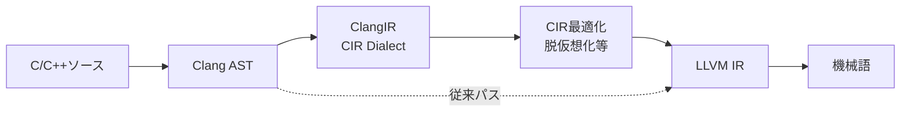
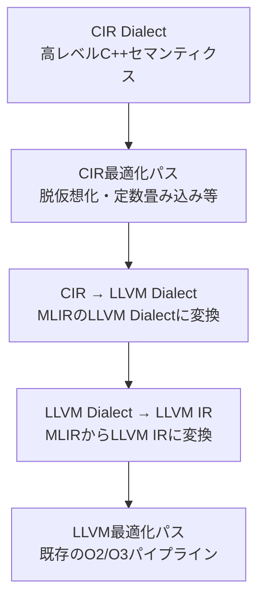

本記事は [GSoC 2025: ClangIR Upstreaming（LLVM Project Blog）](https://blog.llvm.org/posts/2025-gsoc-clangir-upstreaming/) の解説記事です。

## ブログ概要（Summary）

2025年のGoogle Summer of Code（GSoC）において、Amr HeshamがClangIRのアップストリーミング（LLVMメインリポジトリへの統合）を大規模に推進しました。メインLLVMリポジトリに191件のPR、ClangIRリポジトリに75件のPRを投入し、VectorType、ComplexType、例外処理（try-catch）の3つの主要機能を実装しています。作業中にClang本体（classic codegen）のバグも発見されており、ClangIRの開発がClang全体の品質向上にも寄与していることが報告されています。

この記事は [Zenn記事: LLVM 20〜22の進化を総整理](https://zenn.dev/0h_n0/articles/0a233ce0c2d576) の深掘りです。

## 情報源

- **種別**: 公式プロジェクトブログ
- **URL**: [https://blog.llvm.org/posts/2025-gsoc-clangir-upstreaming/](https://blog.llvm.org/posts/2025-gsoc-clangir-upstreaming/)
- **組織**: LLVM Project / Google Summer of Code 2025
- **発表日**: 2025年12月1日
- **開発者**: Amr Hesham (amrdeveloper)
- **メンター**: Bruno Cardoso Lopes, Andy Kaylor, Erich Keane, Anton Korobeynikov

## 技術的背景（Technical Background）

ClangIR（CIR）は、ClangのAST（抽象構文木）からLLVM IRへの降下を行う中間段階として設計されたMLIR Dialectです。従来のClangパイプラインではAST → LLVM IRへの直接変換が行われますが、ClangIRを経由することでC/C++の高レベルセマンティクス（型情報、例外構造、仮想関数テーブル等）をMLIRの解析・変換フレームワークで活用できるようになります。



ClangIRはSwiftのSIL（Swift Intermediate Language）やRustのMIR（Mid-level IR）に触発された設計であり、MLIRのODS（Operation Definition Specification）を使ってOperationを宣言的に定義しています。

### アップストリーミングの意義

ClangIRの開発は2022年頃からincubatorリポジトリ（github.com/llvm/clangir）で進められてきましたが、メインリポジトリへの統合（アップストリーミング）が進まないと、LLVM本体の変更との同期コストが増大し、最終的にプロジェクトが維持不能になるリスクがあります。GSoC 2025でのAmr Heshamの大量PR投入は、このリスクを軽減する重要なマイルストーンです。

## Built-in VectorTypeの実装

### 概要

C/C++の`__attribute__((vector_size(N)))`および`__attribute__((ext_vector_type(N)))`で宣言されるベクトル型のCIR表現が実装されました。

### 実装されたオペレータ

- **算術演算**: 加算、減算、乗算、除算
- **比較演算**: 等値、大小比較
- **シフト演算**: 左シフト、右シフト
- **論理演算**: AND、OR、XOR
- **インデックスアクセス**: ベクトル要素への添字アクセス
- **三項演算子**: 条件式によるベクトル要素選択

### 定数畳み込み（Constant Folding）

ブログでは、CIRレベルでの定数畳み込みの実装が紹介されています。

```
// 最適化前: 定数ベクトルからのインデックスアクセス
%vector = cir.const #cir.const_vector<[#cir.int<1> : !s32i,
                                        #cir.int<2> : !s32i,
                                        #cir.int<3> : !s32i,
                                        #cir.int<4> : !s32i]>
%index = cir.const #cir.int<1> : !s32i
%element = cir.vec.extract %vector[%index : !s32i]

// 最適化後: コンパイル時に値が確定
%element = cir.const #cir.int<2> : !s32i
```

この定数畳み込みはMLIRのFolderインターフェースとして実装されており、CIRの最適化パイプライン内で自動的に適用されます。Shuffle、DynamicShuffle、Comparisonの各Operationにもフォールダーが実装されています。

### VectorTypeの設計判断

CIRのVectorTypeはMLIRのVectorTypeとは異なり、C/C++のベクトル拡張セマンティクスに厳密に従っています。具体的には、要素型がスカラー型（整数または浮動小数点）に限定され、ネストしたベクトル型は許可されません。

## ComplexTypeの実装

### 設計思想

ブログによると、ComplexTypeの設計では当初、汎用的なOperationで複素数演算を表現するアプローチが検討されましたが、最終的に演算ごとに個別のOperationを定義する方式が採用されました。

```
// ComplexAddOp, ComplexSubOp, ComplexMulOp, ComplexDivOp
%result = cir.complex.add %a, %b : !cir.complex<!cir.float>
%result = cir.complex.mul %a, %b range(basic) : !cir.complex<!cir.float>
```

### Complex Rangeの対応

C言語の`-fcomplex-range`フラグに対応する4つのレンジモードが実装されています。

| モード | 動作 | 用途 |
|--------|------|------|
| `basic` | 直接的な乗算/除算 | 高速だが精度低下の可能性 |
| `improved` | 無限大/NaN処理付き | デフォルトの安全な実装 |
| `promoted` | 倍精度に昇格して計算 | 精度重視 |
| `full` | Smith Algorithm使用 | 最高精度 |

```
// range指定付きの複素数乗算
%result = cir.complex.mul %a, %b range(basic)
%result = cir.complex.mul %a, %b range(improved)
%result = cir.complex.mul %a, %b range(promoted)
```

Smith Algorithm（Smith, R. L. "Algorithm 116: Complex division"）は、オーバーフローを回避しつつ正確な複素数除算を行うアルゴリズムです。CIR上でレンジ情報が保持されることで、LLVM IRへの降下時に適切な実装が選択されます。

### __real__ / __imag__ 対応

C/C++の`__real__`と`__imag__`単項演算子が、複素数型だけでなくスカラー型に対しても動作するよう実装されています。スカラー型に`__real__`を適用した場合は値そのもの、`__imag__`を適用した場合はゼロが返されます。

### 浮動小数点組み込み関数

`acos`、`asin`、`atan`等の浮動小数点組み込み関数の複素数版オペレータが実装されています。ただし、ブログによると、呼出規約のアップストリーミング完了後に`__builtin_cabs`、`__builtin_ccos`等の完全サポートが予定されています。

## 例外処理（try-catch）の再設計

### CIRでの表現

例外処理はClangIRの中でも最も複雑な実装課題として報告されています。CIRでは`cir.try`オペレーションとして表現されます。

```
cir.try {
    // tryブロック本体
    %result = cir.call @may_throw() : () -> !s32i
    cir.yield
} catch [type #cir.global_view<@_ZTIi> : !cir.ptr<!u8i>] {
    // catch (int e) に対応
    %e = cir.catch_param ...
    cir.yield
} unwind {
    // クリーンアップ処理
    cir.yield
}
```

`type`属性にはC++ RTTI（Run-Time Type Information）へのグローバルビューが指定されます。これにより、CIRレベルで例外の型マッチングを解析でき、例外が到達しないcatchブロックの除去などの最適化が可能になります。

### rethrow対応

`throw;`（現在の例外の再送出）と`throw expr;`（新しい例外の送出）の両方が実装されています。

### 従来パイプラインとの差異

LLVM IRでの例外処理は`invoke`/`landingpad`命令で表現されますが、これらは低レベルの制御フロー構造であり、C++の例外セマンティクスを復元するのが困難です。CIRの`cir.try`構造を経由することで、例外の型情報が保持されたまま最適化パイプラインを通過できます。

## CIRからLLVM IRへの降下（Lowering）パイプライン

ClangIRの重要な設計要素として、CIR DialectからLLVM IRへの降下パイプラインがあります。この降下は段階的に行われます。

### 降下の流れ



CIR最適化パスでは、C++の型情報が保持された状態で以下の最適化が可能です。

- **脱仮想化（Devirtualization）**: CIRレベルで型が確定している仮想関数呼び出しを直接呼び出しに変換
- **定数畳み込み**: VectorType/ComplexTypeのコンパイル時評価
- **例外の到達性解析**: 到達不能なcatchブロックの検出と除去
- **RAII最適化**: デストラクタ呼び出しの最適化

従来のLLVM IRベースの最適化では、これらの情報は失われているため適用が困難でした。

### GSoC 2024からの継続

GSoC 2024ではZhi Ma（Ma Zhi）によるOpenCL CサポートのClangIR対応が行われており、CIRからSPIR-Vバックエンドへの降下パスの基盤が構築されています。これにより、ClangIRは従来のCPU向けだけでなく、GPU向けのコンパイルパイプラインとしても機能する可能性が示されています。

## Classic Clangのバグ発見

ブログでは、ComplexTypeの型昇格テスト中に、Clang本体（classic codegen）で有効なコードがクラッシュするバグが発見されたことが報告されています。修正はPR #160583として提出され、Clang 22リリースに含まれています（PR #160609）。

ClangIRの開発がClang本体のバグ発見にも寄与するケースは、新しい中間表現を導入することで既存コードの未テスト領域が露呈する好例です。

## 貢献の規模と今後の計画

### 数値的な成果

| リポジトリ | PR数 | 内容 |
|-----------|------|------|
| LLVM メインリポジトリ | 191件 | 機能実装とアップストリーミング |
| ClangIR リポジトリ | 75件 | バックポートと機能開発 |
| Classic Clang修正 | 1件 | バグ修正 (PR #160609) |

### 今後の計画

ブログによると、以下の作業が計画されています。

1. **整数型からブールベクトルへの暗黙変換**: 最近のClang PR #158369と連携する改善
2. **ComplexType組み込み関数の完全サポート**: 呼出規約のアップストリーミング完了後
3. **Unwind/Cleanupリージョンの混合サポート**: 例外処理におけるリソース管理の正確な表現

## 学術研究との関連（Academic Connection）

ClangIRの設計は、コンパイラIRにおける「情報損失の最小化」という研究テーマに直結しています。SwiftのSILがSwift固有の所有権セマンティクスを保持するように、ClangIRはC++の型階層・例外構造・メモリモデルをMLIR上で保持することを目指しています。

arXiv:2401.17967（CIR: Bringing MLIR Closer to C++ Semantics）は、ClangIRの設計思想を学術的に論じた論文であり、GSoC 2025の実装はこの設計に基づいています。

## まとめと実践への示唆

GSoC 2025でのClangIRアップストリーミングは、以下の点で重要です。

- **MLIRベースのC++ IR**: VectorType、ComplexType、例外処理という基盤的な機能がメインリポジトリに統合された
- **定数畳み込みの実証**: CIRレベルでの最適化が実用的に機能することが示された
- **バグ発見効果**: 新しいIR経路の追加が既存パイプラインの品質向上にも寄与
- **実験的利用**: `-fclangir`フラグで試験可能だが、サポートされるC++機能は限定的

ClangIRは現時点ではプロダクション利用には推奨されていませんが、C++コンパイラの将来アーキテクチャとして注目すべきプロジェクトです。C++静的解析ツールやリファクタリングツールの開発者にとっては、MLIRフレームワーク上でC++セマンティクスを扱える点が大きな魅力となっています。

## 参考文献

- **Blog URL**: [https://blog.llvm.org/posts/2025-gsoc-clangir-upstreaming/](https://blog.llvm.org/posts/2025-gsoc-clangir-upstreaming/)
- **ClangIR Project**: [https://llvm.github.io/clangir/](https://llvm.github.io/clangir/)
- **GSoC 2024: GPU Kernels via ClangIR**: [https://blog.llvm.org/posts/2024-08-29-gsoc-opencl-c-support-for-clangir/](https://blog.llvm.org/posts/2024-08-29-gsoc-opencl-c-support-for-clangir/)
- **arXiv:2401.17967 (CIR Paper)**: [https://arxiv.org/abs/2401.17967](https://arxiv.org/abs/2401.17967)
- **Related Zenn article**: [https://zenn.dev/0h_n0/articles/0a233ce0c2d576](https://zenn.dev/0h_n0/articles/0a233ce0c2d576)
