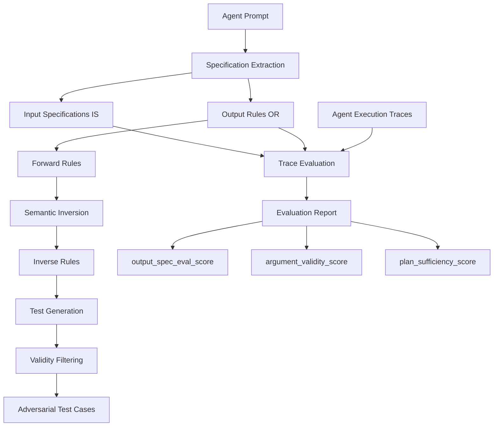
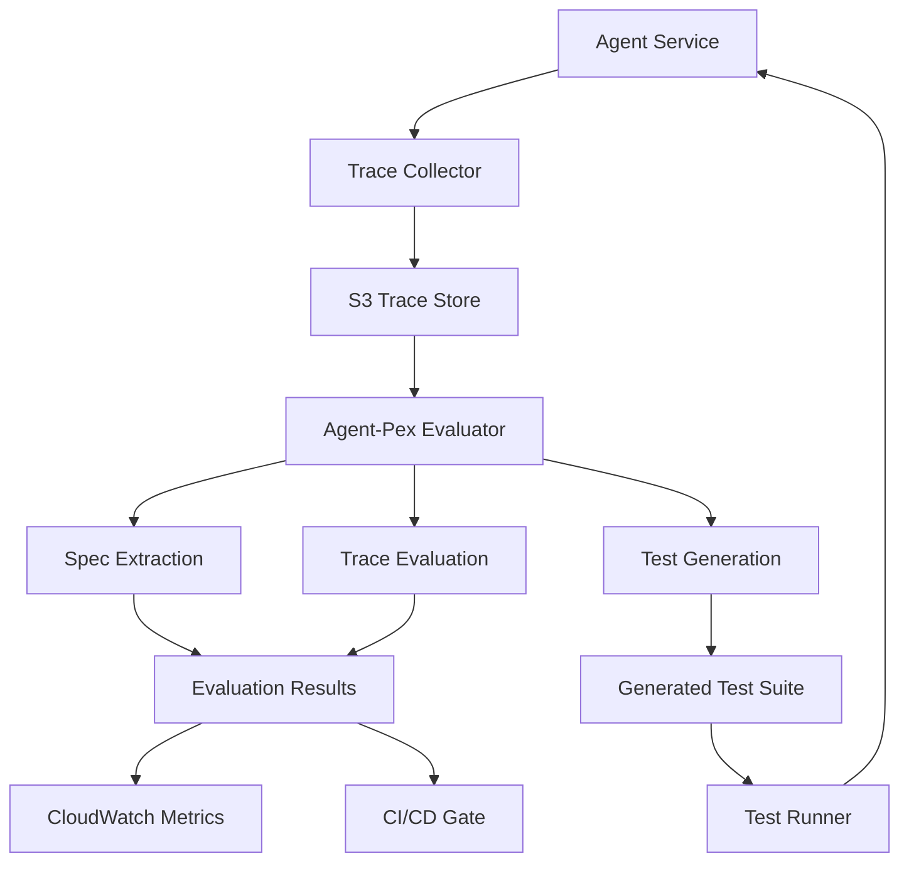

本記事は [Agent-Pex: Automated Evaluation and Testing of AI Agents](https://www.microsoft.com/en-us/research/project/agent-pex-automated-evaluation-and-testing-of-ai-agents/) の解説記事です。

AIエージェントの品質評価は、従来のソフトウェアテストとは根本的に異なる課題を含んでいる。LLMベースのエージェントは確率的な推論を行うため、同一入力に対しても異なる出力を返しうる。さらに、エージェントの振る舞いを定義する「仕様」はプロンプト内に自然言語で記述されており、形式的な検証が困難である。Microsoft Researchが2026年1月に公開したAgent-Pexは、この課題に対してプロンプトからの仕様自動抽出、トレース評価、および敵対的テスト生成を統合的に実現するツールである。

## ブログ概要

Agent-Pexは、Microsoft Researchが開発したAIエージェントの自動評価・テスト生成フレームワークである。プロジェクトページ（[Microsoft Research](https://www.microsoft.com/en-us/research/project/agent-pex-automated-evaluation-and-testing-of-ai-agents/)）によれば、Agent-Pexは以下の3つの機能を統合している。

1. **仕様抽出（Specification Extraction）**: エージェントのプロンプトを解析し、検証可能な行動ルールを自動抽出する
2. **自動評価（Automated Evaluation）**: 抽出した仕様に基づき、エージェントの実行トレースを評価する（例: `output_spec_eval_score: 95.0`）
3. **自動テスト生成（Automated Test Generation）**: 抽出したルールを反転（semantic inversion）させ、敵対的テストケースを生成する

Agent-Pexの技術的基盤は、同じくMicrosoft Researchが発表したPromptPex（arXiv:2503.05070）にある。PromptPexはプロンプトの仕様抽出とテスト生成に特化したツールであり、Agent-PexはこれをエージェントのトレースレベルのEnd-to-End評価に拡張した位置づけである。

## 技術的背景

### エージェントテストの固有課題

AIエージェントのテストが従来のソフトウェアテストと異なる点は、主に以下の3つである。

**不透明な推論プロセス（Opaque Reasoning）**: エージェントはLLMの内部推論に基づいて行動を選択するが、その推論過程は外部から直接観察できない。従来のソフトウェアであればコードパスを追跡できるが、LLMベースのエージェントでは推論の中間状態が不透明である。テスト設計においては、観察可能な入出力のみから振る舞いの正しさを判定する必要がある。

**仕様のドリフト（Specification Drift）**: エージェントの仕様はプロンプト内に自然言語で記述されるため、開発者がプロンプトを更新するたびに仕様が暗黙的に変化する。形式仕様（formal specification）が存在しないため、「何が正しい振る舞いか」の定義自体が曖昧になりやすい。Agent-Pexはプロンプトから仕様を自動抽出することで、このドリフトを検出可能にしている。

**スケーラブルなテストの困難さ（Testing at Scale）**: エージェントは複数のツールを組み合わせた複雑なワークフローを実行する。ツール呼び出しの組み合わせ爆発により、手動でのテストケース作成はスケールしない。Agent-Pexは仕様から自動的にテストを生成することで、この問題に対処している。

### PromptPexの位置づけ

PromptPex（arXiv:2503.05070）は、Agent-Pexの技術的基盤となる研究である。プロンプトを「テスト対象のプログラム」として捉え、入力仕様の抽出、出力ルールの抽出、テスト生成を体系的に行う。Agent-Pexはこの手法をエージェントの実行トレース全体に拡張したものであり、両者は密接な関係にある。

## 実装アーキテクチャ

Agent-Pexのパイプラインは、3段階の処理で構成される。



### 第1段階: 仕様抽出

エージェントのシステムプロンプトを入力とし、2種類の仕様を抽出する。

- **Input Specifications（IS）**: エージェントが受け付ける入力の範囲と制約を定義する。例えば「ユーザーの質問はテレコム関連でなければならない」「注文IDは数値型でなければならない」といった制約がISとして抽出される。
- **Output Rules（OR）**: エージェントの出力が満たすべき条件を定義する。PromptPexの論文では、出力ルールは以下の5つの品質基準を満たす必要があるとされている。
  - **Concrete（具体的）**: 曖昧さがなく、明確に検証可能であること
  - **Checkable（検証可能）**: 出力のみから判定できること
  - **Input-agnostic（入力非依存）**: 特定の入力に依存しない一般的なルールであること
  - **Independent（独立）**: 他のルールに依存しないこと
  - **Grounded（根拠付き）**: プロンプトの記述に基づいていること

### 第2段階: トレース評価

抽出した仕様に基づき、エージェントの実行トレース（ツール呼び出し履歴、中間出力、最終応答）を多次元で評価する。

- **Argument Validity（引数妥当性）**: ツール呼び出しの引数が仕様に適合しているか
- **Output Compliance（出力準拠性）**: 最終出力がORに準拠しているか
- **Plan Sufficiency（計画充足性）**: エージェントの行動計画がタスク達成に十分であるか

### 第3段階: テスト生成

抽出したルールからテストケースを生成する。特に、ルールの意味的反転（semantic inversion）を用いた敵対的テストが特徴である。

## PromptPex技術詳細

PromptPex（arXiv:2503.05070）の技術的な詳細を以下に整理する。

### Input Specification（IS）の抽出

プロンプトから入力の制約条件を抽出するプロセスである。LLMを用いてプロンプトを解析し、入力パラメータとその許容範囲を構造化データとして出力する。

抽出されたISは、テスト生成時の入力空間の分割に用いられる。例えば、テレコムドメインのエージェントであれば「通信プラン変更リクエスト」「料金照会」「障害報告」といった入力カテゴリが自動的に識別される。

### Output Rules（OR）の抽出

プロンプトから出力に関するルールを抽出する。抽出されたORは、以下の形式で表現される。

```
IF <condition> THEN <output_constraint>
```

例として、航空会社ドメインのエージェントでは以下のようなORが抽出される。

```
IF ユーザーがフライト変更を要求 THEN エージェントは変更ポリシーを確認した上で回答する
IF 予約が存在しない THEN エージェントは該当予約がない旨を明示する
IF ユーザーが対象外の質問をした THEN エージェントは対応範囲外であることを伝える
```

PromptPexの評価では、抽出されたORの**Spec Agreement（仕様一致率）**は平均96.8%、**Groundedness（根拠性）**は平均89%と報告されている（arXiv:2503.05070）。これは、抽出された仕様がプロンプトの意図を高い精度で反映していることを示す。

### Forward Rules から Inverse Rules への変換

PromptPexの核心的な技術の一つが、Forward Rules（順方向ルール）をInverse Rules（逆方向ルール）に変換するsemantic inversion（意味的反転）である。

Forward Ruleは「正しい振る舞い」を記述するルールであり、例えば以下のようなものである。

```
Forward: ユーザーがアカウント情報を要求した場合、認証済みであることを確認してから情報を提供する
```

これをsemantic inversionすると、以下のようなInverse Ruleが得られる。

```
Inverse: 認証されていないユーザーがアカウント情報を要求するケースを生成する
```

Inverse Ruleから生成されたテストケースは、エージェントの境界条件やエラーハンドリングを検証するために用いられる。PromptPexの論文によれば、Inverse Rulesから生成されたテストはForward Rulesから生成されたテストと比較して、**8.5%多くの非準拠（non-compliant）応答を検出**したと報告されている。

### テスト生成と妥当性フィルタリング

Inverse Rulesから生成された初期テストケースは、妥当性フィルタリングを経て最終的なテストスイートとなる。フィルタリングでは、ISに基づいて「現実的に発生しうる入力であるか」を判定し、非現実的なテストケースを除外する。これにより、実運用環境で意味のあるテストケースのみが残る。

### 主要な実験結果

PromptPex論文では、複数のLLMモデルに対して非準拠率（Non-Compliance Rate）を測定している。

| モデル | PromptPex非準拠率 | ベースライン非準拠率 | 差分 |
|---|---|---|---|
| gpt-4o-mini | 8% | 1% | +7% |
| gemma2:9b | 13% | 11% | +2% |
| qwen2.5:3b | 28% | 16% | +12% |
| llama3.2:1b | 51% | 50% | +1% |

この結果から、いくつかの傾向を読み取ることができる。

1. **モデルサイズと非準拠率の関係**: パラメータ数が小さいモデル（llama3.2:1b, qwen2.5:3b）ほど非準拠率が高い。これは小規模モデルがプロンプトの仕様を正確に遵守する能力が相対的に低いことを示唆する。
2. **PromptPexの検出能力**: gpt-4o-miniでは、ベースラインでは1%しか検出されなかった非準拠が、PromptPexのテストでは8%に増加している。これは、PromptPexの敵対的テストがモデルの弱点を効果的に露出させることを示す。
3. **Inverse Rulesの有効性**: 論文全体の結果として、Inverse Rulesはモデルの潜在的な不具合を検出する上で有効に機能しており、Forward Rulesのみのテストでは見落とされるケースをカバーしている。

## プロダクション環境への導入ガイド

Agent-Pexをプロダクション環境のCI/CDパイプラインに統合するための構成を以下に示す。以降では、AWSを基盤としたインフラ構成を例として解説する。

### インフラアーキテクチャ

Agent-Pexの評価パイプラインをプロダクションで運用するには、以下の3つのコンポーネントが必要である。

1. **評価実行基盤**: テスト生成と評価を実行するコンピュートリソース
2. **トレース収集基盤**: エージェントの実行トレースを収集・保存するストレージ
3. **結果レポート基盤**: 評価結果を開発チームにフィードバックする仕組み



### Terraformによるインフラ定義

評価パイプラインの主要コンポーネントをTerraformで定義する。以下は、Step Functionsによるオーケストレーション、S3によるトレース保存、DynamoDBによる仕様キャッシュの構成例である。

```hcl
# Agent-Pex評価パイプライン: Step Functions
resource "aws_sfn_state_machine" "agent_pex_pipeline" {
  name     = "agent-pex-evaluation-pipeline"
  role_arn = aws_iam_role.step_functions_role.arn

  definition = jsonencode({
    StartAt = "ExtractSpecifications"
    States = {
      ExtractSpecifications = {
        Type     = "Task"
        Resource = aws_lambda_function.spec_extractor.arn
        Next     = "ParallelEvaluation"
        Retry = [{
          ErrorEquals     = ["States.TaskFailed"]
          IntervalSeconds = 30
          MaxAttempts     = 3
          BackoffRate     = 2.0
        }]
      }
      ParallelEvaluation = {
        Type     = "Parallel"
        Branches = [
          { StartAt = "EvaluateTraces", States = {
              EvaluateTraces = { Type = "Task", Resource = aws_lambda_function.trace_evaluator.arn, End = true }
          }},
          { StartAt = "GenerateTests", States = {
              GenerateTests = { Type = "Task", Resource = aws_lambda_function.test_generator.arn, End = true }
          }}
        ]
        Next = "PublishResults"
      }
      PublishResults = { Type = "Task", Resource = aws_lambda_function.result_publisher.arn, End = true }
    }
  })
}

# トレース保存用S3 + ライフサイクル（30日でGlacier、365日で削除）
resource "aws_s3_bucket" "agent_traces" {
  bucket = "agent-pex-traces-${var.environment}"
}

# 仕様キャッシュ用DynamoDB（prompt_hashをキーにTTL付き）
resource "aws_dynamodb_table" "specifications" {
  name         = "agent-pex-specifications"
  billing_mode = "PAY_PER_REQUEST"
  hash_key     = "prompt_hash"
  range_key    = "spec_version"

  attribute { name = "prompt_hash"; type = "S" }
  attribute { name = "spec_version"; type = "N" }

  ttl { attribute_name = "expires_at"; enabled = true }
}
```

### モニタリングと品質ゲート

評価結果をCloudWatchメトリクスとして公開し、CI/CDパイプラインの品質ゲートとして使用する。

```python
"""Agent-Pex評価結果のモニタリング・品質ゲートモジュール"""

from dataclasses import dataclass
from typing import Any

import boto3


@dataclass(frozen=True)
class EvaluationThresholds:
    """評価の閾値設定"""
    output_spec_eval_min: float = 90.0
    argument_validity_min: float = 85.0
    plan_sufficiency_min: float = 80.0
    non_compliance_max: float = 10.0


def check_quality_gate(
    evaluation_result: dict[str, Any],
    thresholds: EvaluationThresholds | None = None,
) -> tuple[bool, list[str]]:
    """品質ゲートの判定を行う。

    Args:
        evaluation_result: Agent-Pexの評価結果辞書
        thresholds: 閾値設定。Noneの場合はデフォルト値を使用

    Returns:
        (通過判定, 違反理由リスト)のタプル
    """
    if thresholds is None:
        thresholds = EvaluationThresholds()

    checks = [
        ("output_spec_eval_score", thresholds.output_spec_eval_min, ">="),
        ("argument_validity_score", thresholds.argument_validity_min, ">="),
        ("plan_sufficiency_score", thresholds.plan_sufficiency_min, ">="),
        ("non_compliance_rate", thresholds.non_compliance_max, "<="),
    ]
    violations = [
        f"{key} {evaluation_result[key]:.1f} {'<' if op == '>=' else '>'} {limit}"
        for key, limit, op in checks
        if (op == ">=" and evaluation_result[key] < limit)
        or (op == "<=" and evaluation_result[key] > limit)
    ]
    return (len(violations) == 0, violations)
```

上記の`check_quality_gate`関数は、Agent-Pexの4つの評価スコアを閾値と比較し、品質ゲートの通過可否を判定する。CloudWatchメトリクスとして`OutputSpecEvalScore`、`ArgumentValidityScore`、`PlanSufficiencyScore`、`NonComplianceRate`の4指標を公開し、ダッシュボードとアラームで継続的に監視する構成が推奨される。

### CI/CDパイプラインへの組み込み

GitHub Actionsでは、`prompts/**`パスの変更をトリガーとして仕様抽出→トレース評価→テスト生成→品質ゲートの4ステップを自動実行する。品質ゲートで閾値を下回った場合はPRをブロックすることで、プロンプト変更による品質劣化を防止する。

### 運用上の考慮事項

プロダクション導入時には以下の点に注意が必要である。

**コスト管理**: 仕様抽出とテスト生成にはLLM呼び出しが必要であり、エージェント数とプロンプト更新頻度に比例してコストが増加する。仕様のキャッシュ（上記DynamoDBテーブル）を活用し、プロンプトが変更されていない場合は再抽出をスキップすることが重要である。

**レイテンシ**: 仕様抽出は1プロンプトあたり数十秒を要するため、CI/CDのクリティカルパスには配置せず、非同期パイプライン（Step Functions）で実行することを推奨する。

**セキュリティ**: エージェントのプロンプトには機密情報が含まれる場合がある。トレースデータとともに、S3バケットの暗号化（SSE-KMS）とアクセス制御（IAMポリシー）を適切に設定する必要がある。

## パフォーマンス最適化

### Agent-Pexの評価スケール

Agent-PexプロジェクトページおよびPromptPex論文によれば、Tau-2ベンチマークから収集した**5,000件以上のトレース**に対して評価を実施している。評価対象は以下の通りである。

- **3ドメイン**: テレコム（通信）、リテール（小売）、エアライン（航空）
- **4モデル**: 複数のLLMモデルを比較評価
- **多次元カバレッジ**: 引数妥当性、出力準拠性、計画充足性の3軸で包括的に評価

この規模の評価を効率的に実行するための最適化手法がいくつか存在する。

### 仕様キャッシュ戦略

プロンプトのハッシュ値をキーとして抽出済み仕様をキャッシュすることで、同一プロンプトに対する重複抽出を防ぐ。プロンプトが更新された場合のみ再抽出を行う。この手法により、評価パイプライン全体のLLM呼び出し回数を大幅に削減できる。

### バッチ評価

5,000件以上のトレースを個別に評価するのではなく、ドメイン・モデル・仕様ごとにグルーピングし、バッチ処理として実行する。これにより、LLMのコンテキストウィンドウを効率的に活用できる。

### 並列テスト生成

Inverse Rulesからのテスト生成は各ルールが独立しているため、並列実行が可能である。AWS Step Functionsの`Map`ステートやLambdaの並列呼び出しを用いることで、テスト生成時間を短縮できる。

## 運用での学び

### 仕様抽出の精度と限界

PromptPexの実験結果では、Spec Agreement（仕様一致率）は平均96.8%、Groundedness（根拠性）は平均89%である。この数値は十分に高いが、約11%のルールがプロンプトの記述に明確に根拠を持たない「推論されたルール」であることを意味する。運用においては、抽出された仕様の人間によるレビューを初回実行時に行い、誤抽出を修正するプロセスを設けることが望ましい。

### モデルごとの非準拠率の差異

実験結果が示す通り、モデルサイズによって非準拠率に大きな差がある。特にqwen2.5:3bでは、PromptPexのテストによりベースラインから+12%の非準拠が検出されている。これは、小規模モデルをエージェントのバックエンドに採用する場合、Agent-Pexによるテストが品質保証において特に有効であることを示唆する。

一方、gpt-4o-miniのような大規模モデルでも、PromptPexのテストによりベースラインでは検出できなかった7%の非準拠が発見されている。したがって、モデルサイズにかかわらず、Agent-Pexの評価パイプラインを導入する価値は存在する。

### Azure AI Foundry Evaluatorsとの関係

Microsoft ResearchのAgent-Pexプロジェクトに関連して、Azure AI Foundryでは以下の評価器（Evaluator）が提供されている。

- **IntentResolutionEvaluator**: ユーザーの意図がエージェントの応答で解決されたかを評価
- **ToolCallAccuracyEvaluator**: ツール呼び出しの正確性を評価
- **TaskAdherenceEvaluator**: タスク指示への準拠度を評価

これらのEvaluatorは、Agent-Pexの仕様抽出・テスト生成とは異なるアプローチ（事前定義された評価基準に基づく評価）であるが、Agent-Pexと組み合わせて使用することで、プロンプト由来の仕様検証と一般的な品質基準の両面から評価を行うことが可能である。

### 仕様ドリフトの継続的監視

プロンプトが更新されるたびに仕様を再抽出し、前回の仕様との差分を検出するプロセスを構築することが重要である。差分が検出された場合、既存のテストスイートが新しい仕様に対して依然として有効であるかを検証し、必要に応じてテストを再生成する。このサイクルを自動化することで、仕様ドリフトによる品質劣化を防止できる。

## 学術研究との関連

### PromptPex論文（arXiv:2503.05070）

Agent-Pexの技術的基盤であるPromptPexは、arXiv:2503.05070として公開されている。主要な学術的貢献は以下の通りである。

1. **プロンプトの仕様化**: 自然言語プロンプトから形式的に検証可能な仕様を自動抽出する手法を提案した。これは、プロンプトエンジニアリングの品質を計量的に評価するための基盤技術である。

2. **Semantic Inversion**: Forward Rulesを意味的に反転させてテストケースを生成する手法を提案した。これは、ソフトウェアテストにおけるミューテーションテスト（mutation testing）の考え方をプロンプトベースのシステムに適用したものと解釈できる。

3. **Non-Compliance検出**: 既存のベンチマークでは検出されなかった非準拠パターンを、PromptPexのテストが検出できることを実験的に示した。特に、Inverse Rulesが通常のテストより8.5%多くの非準拠を検出した点は注目に値する。

### 関連研究との比較

Agent-Pexの位置づけを理解するために、関連するテスト・評価フレームワークとの比較を整理する。

**ToolSandbox（2024）**: ツール呼び出しの正確性を制御された環境で評価するフレームワーク。Agent-Pexとは異なり、仕様の自動抽出機能は持たず、評価基準は事前に人手で定義する必要がある。

**AgentDojo（2024）**: エージェントのセキュリティ評価に特化したベンチマーク。プロンプトインジェクション攻撃に対する耐性を測定する。Agent-Pexが仕様準拠性を評価するのに対し、AgentDojoはセキュリティという特定の側面に焦点を当てている。

**AgentBench（2023）**: 複数のドメインにわたるエージェントの汎用能力を評価するベンチマーク。Agent-Pexのようなプロンプト固有の仕様抽出は行わず、タスク完了率という単一指標での評価が中心である。

Agent-Pexの独自性は、**プロンプトそのものから仕様を自動抽出する**点にある。他のフレームワークが事前定義された評価基準に依存するのに対し、Agent-Pexはエージェントのプロンプトが変更されるたびに評価基準自体を自動更新できる。

## まとめ

Agent-Pexは、AIエージェントの品質保証における以下の課題に対して、体系的なアプローチを提供するツールである。

1. **仕様の形式化**: プロンプトから検証可能な仕様を自動抽出することで、曖昧な自然言語仕様を構造化された評価基準に変換する
2. **多次元評価**: 引数妥当性・出力準拠性・計画充足性の3軸でエージェントの振る舞いを包括的に評価する
3. **敵対的テスト生成**: Semantic Inversionにより、エージェントの境界条件やエラーハンドリングを検証するテストを自動生成する

PromptPexの実験結果（Spec Agreement 96.8%、Inverse Rulesによる非準拠検出+8.5%）は、このアプローチの有効性を示している。特に、プロンプトの変更に追従して仕様とテストを自動更新できる点は、エージェント開発の反復速度を維持しつつ品質を担保するために有用な特性である。

一方で、仕様抽出のGroundedness（89%）が示す通り、完全に自動化された品質保証にはまだ課題が残る。実運用においては、抽出された仕様の初期レビューと、継続的なドリフト監視を組み合わせた運用プロセスの構築が推奨される。

## 参考文献

1. Microsoft Research. "Agent-Pex: Automated Evaluation and Testing of AI Agents." [https://www.microsoft.com/en-us/research/project/agent-pex-automated-evaluation-and-testing-of-ai-agents/](https://www.microsoft.com/en-us/research/project/agent-pex-automated-evaluation-and-testing-of-ai-agents/)
2. PromptPex: Automated Testing of LLM Prompts. arXiv:2503.05070. [https://arxiv.org/abs/2503.05070](https://arxiv.org/abs/2503.05070)
3. Azure AI Foundry Agent Evaluators. [https://learn.microsoft.com/en-us/azure/ai-foundry/](https://learn.microsoft.com/en-us/azure/ai-foundry/)
4. Tau-2 Benchmark. Microsoft Research.
5. ToolSandbox: A Stateful, Conversational, Interactive Evaluation Framework for LLM Tool Use Capabilities. arXiv:2408.04682.
6. AgentDojo: A Dynamic Environment to Evaluate Prompt Injection Attacks and Defenses for LLM Agents. arXiv:2406.13352.
7. AgentBench: Evaluating LLMs as Agents. arXiv:2308.03688.
