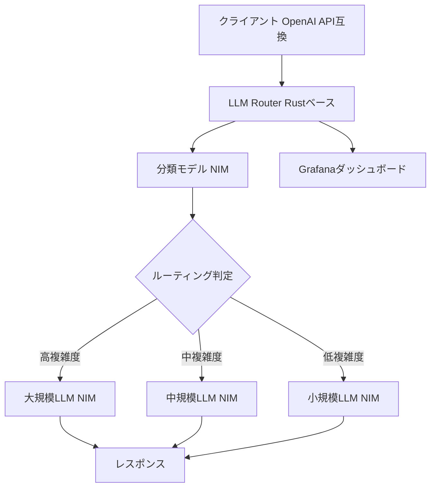

本記事は [NVIDIA AI Blueprint for Cost-Efficient LLM Routing](https://developer.nvidia.com/blog/deploying-the-nvidia-ai-blueprint-for-cost-efficient-llm-routing/)（Arun Raman, Sean Lopp、2025年3月公開）の解説記事です。

## ブログ概要（Summary）

NVIDIAが公開したAI Blueprint for LLM Routerは、複数のLLMに対してクエリの複雑度やタスク種別に応じてインテリジェントにリクエストを振り分ける、Rustベースの高性能リバースプロキシである。NVIDIA NIMとTriton Inference Serverを統合し、タスク分類・複雑度推定の2つのルーティング戦略を提供する。OpenAI API互換インターフェースを備え、既存のアプリケーションへの統合が容易である。

この記事は [Zenn記事: Portkey Gateway 2.0でLLMアプリの信頼性を設計する](https://zenn.dev/0h_n0/articles/babea176772c33) の深掘りです。Portkey Gatewayが提供するルーティング機能の背景にある、エンタープライズグレードのLLMルーティングアーキテクチャを理解するために、NVIDIAの設計思想と実装パターンを解説します。

## 情報源

- **種別**: 企業テックブログ
- **URL**: [https://developer.nvidia.com/blog/deploying-the-nvidia-ai-blueprint-for-cost-efficient-llm-routing/](https://developer.nvidia.com/blog/deploying-the-nvidia-ai-blueprint-for-cost-efficient-llm-routing/)
- **組織**: NVIDIA
- **発表日**: 2025年3月26日（最終更新: 2025年4月23日）

## 技術的背景（Technical Background）

LLMの推論コストはモデルサイズに比例して増加する。たとえばGPT-4クラスのモデルは高品質な回答を生成するが、入出力トークンあたりのコストはGPT-4o miniの10倍以上になる。一方で、全リクエストが最大モデルを必要とするわけではなく、簡単な質問応答やテンプレート生成は軽量モデルで十分対応できる。

NVIDIAのAI Blueprintは、この課題に対して分類モデルによるインテリジェントルーティングを提案している。クエリを受け取った時点でその複雑度やタスク種別を推定し、適切なコスト帯のモデルに振り分けることで、全体のコストを削減しつつ品質を維持する設計である。

## 実装アーキテクチャ（Architecture）

### システム全体構成

AI Blueprint for LLM Routerは以下のコンポーネントで構成される。



### コアコンポーネント

**1. LLM Router（Rustベース）**

リバースプロキシとして動作し、受信したリクエストを分類モデルに送信した後、その結果に基づいて適切なLLMにプロキシする。Rustで実装されているため、ルーティング自体のレイテンシオーバーヘッドは最小限に抑えられている。OpenAI API互換のインターフェースを公開しており、既存のOpenAI SDKやPortkey Gatewayのようなプロキシとの統合が容易である。

**2. NVIDIA NIM（Neural Inference Microservices）**

LLMの推論をマイクロサービスとして提供するNVIDIAのインフラストラクチャ。各モデルがNIMコンテナとして独立にデプロイされ、GPU上で最適化された推論を実行する。Triton Inference Serverをバックエンドとして使用し、動的バッチングやテンソル並列化をサポートする。

**3. 分類モデル**

リクエストの内容を分析し、タスク種別（コード生成、要約、質疑応答など）または複雑度レベル（推論力、ドメイン知識、制約分析など）を推定する軽量モデル。分類モデル自体もNIMとしてデプロイされる。

### 2つのルーティング戦略

**タスクベースルーティング**

クエリをタスクカテゴリ（コード生成、要約、質疑応答、一般会話など）に分類し、各カテゴリに最適なモデルにルーティングする。たとえば、コード生成タスクはCode Llama系モデルに、一般会話はGPT-4o mini相当のモデルに振り分ける。

**複雑度ベースルーティング**

クエリの複雑度を推論力（reasoning）、ドメイン知識（domain-knowledge）、制約分析（constraint analysis）の3軸で評価し、複雑度レベルに応じたモデルを選択する。高複雑度タスクは大規模モデルに、低複雑度タスクは軽量モデルに振り分ける。

### マルチターン対応

AI Blueprintはマルチターン会話の文脈一貫性を維持するルーティングもサポートしている。会話の途中でモデルが切り替わる場合でも、前のターンのコンテキストが引き継がれる設計になっている。

## Production Deployment Guide

### AWS実装パターン（コスト最適化重視）

NVIDIAのAI Blueprintアーキテクチャに準じたLLMルーティング基盤をAWS上で構築する場合の構成を示す。

| 規模 | 月間リクエスト | 推奨構成 | 月額コスト目安 | 主要サービス |
|------|--------------|---------|-------------|------------|
| **Small** | ~3,000 (100/日) | Serverless | $50-150 | Lambda + Bedrock + DynamoDB |
| **Medium** | ~30,000 (1,000/日) | Hybrid | $500-1,200 | ECS Fargate + Bedrock + ElastiCache |
| **Large** | 300,000+ (10,000/日) | Container | $3,000-8,000 | EKS + GPU Instances + Karpenter |

**Small構成の詳細**（月額$50-150）:
- Lambda: ルーティングロジック実行（$20/月）
- Bedrock: Claude 3.5 Haiku（弱）+ Claude 3.5 Sonnet（強）（$80/月）
- DynamoDB: ルーティング結果キャッシュ（$10/月）

**Large構成の詳細**（月額$3,000-8,000）:
- EKS: コントロールプレーン（$72/月）
- EC2 g5.xlarge Spot: 分類モデル推論（$200/月）
- Bedrock: 複数モデルエンドポイント（$2,000-5,000/月）
- Karpenter: GPU自動スケーリング

**コスト削減テクニック**:
- 分類モデルはCPU推論可能なBERT-Baseサイズ → Lambda上で実行し、GPU不要
- Spot Instances使用でGPU推論コストを最大90%削減
- Bedrock Batch API使用で非リアルタイム処理を50%割引
- ルーティング結果のキャッシュで同一パターンの再分類を回避

**コスト試算の注意事項**: 上記は2026年3月時点のAWS ap-northeast-1リージョン料金に基づく概算値です。GPU Instanceの料金はSpot市場の需給により大幅に変動します。最新料金は[AWS料金計算ツール](https://calculator.aws/)で確認してください。

### Terraformインフラコード

**Small構成: Lambda + Bedrock + ルーティングロジック**

```hcl
# --- Lambda: ルーティングロジック ---
resource "aws_lambda_function" "llm_router" {
  filename      = "llm_router.zip"
  function_name = "nvidia-style-llm-router"
  role          = aws_iam_role.router_role.arn
  handler       = "router.handler"
  runtime       = "python3.12"
  timeout       = 60
  memory_size   = 512

  environment {
    variables = {
      ROUTING_STRATEGY  = "complexity"
      STRONG_MODEL_ID   = "anthropic.claude-3-5-sonnet-20241022-v2:0"
      WEAK_MODEL_ID     = "anthropic.claude-3-5-haiku-20241022-v1:0"
      CACHE_TABLE       = aws_dynamodb_table.routing_cache.name
    }
  }
}

# --- IAMロール（Bedrock + DynamoDB最小権限） ---
resource "aws_iam_role" "router_role" {
  name = "llm-router-role"
  assume_role_policy = jsonencode({
    Version = "2012-10-17"
    Statement = [{
      Action    = "sts:AssumeRole"
      Effect    = "Allow"
      Principal = { Service = "lambda.amazonaws.com" }
    }]
  })
}

resource "aws_iam_role_policy" "router_policy" {
  role = aws_iam_role.router_role.id
  policy = jsonencode({
    Version = "2012-10-17"
    Statement = [
      {
        Effect   = "Allow"
        Action   = ["bedrock:InvokeModel"]
        Resource = "arn:aws:bedrock:ap-northeast-1::foundation-model/*"
      },
      {
        Effect   = "Allow"
        Action   = ["dynamodb:GetItem", "dynamodb:PutItem"]
        Resource = aws_dynamodb_table.routing_cache.arn
      }
    ]
  })
}

# --- DynamoDB: ルーティングキャッシュ ---
resource "aws_dynamodb_table" "routing_cache" {
  name         = "llm-routing-cache"
  billing_mode = "PAY_PER_REQUEST"
  hash_key     = "query_hash"

  attribute {
    name = "query_hash"
    type = "S"
  }

  ttl {
    attribute_name = "ttl"
    enabled        = true
  }
}
```

### 運用・監視設定

**CloudWatch Logs Insights クエリ**:
```sql
-- ルーティング先モデルの分布
fields @timestamp, routed_model, routing_strategy, latency_ms
| stats count(*) as requests by routed_model
| sort requests desc

-- ルーティングレイテンシのP95/P99
fields @timestamp, routing_latency_ms
| stats pct(routing_latency_ms, 95) as p95,
        pct(routing_latency_ms, 99) as p99
  by bin(5m)
```

### コスト最適化チェックリスト

- [ ] ルーティング分類モデル: CPU推論（Lambda）でGPU不要
- [ ] 強いモデル: 本当に必要なリクエストのみに限定（目標: 全体の30%以下）
- [ ] 弱いモデル: Haiku/GPT-4o mini相当で$0.25/MToken
- [ ] キャッシュ: 同一パターンの再分類を回避（DynamoDB TTL: 1時間）
- [ ] Spot Instances: GPU推論にはSpot優先（最大90%削減）
- [ ] AWS Budgets: 月額予算設定（80%で警告、100%でアラート）
- [ ] ルーティングログ: S3に長期保存しコスト分析に活用

## パフォーマンス最適化（Performance）

NVIDIAのブログによると、AI Blueprintの主な性能特性は以下の通りである。

- **ルーティングレイテンシ**: 分類モデルの推論時間に依存するが、Rustベースのプロキシ部分のオーバーヘッドは最小限
- **スケーラビリティ**: 各LLMが独立したNIMコンテナとしてデプロイされるため、モデル単位での水平スケーリングが可能
- **GPU要件**: 分類モデル用にNVIDIA V100以上（4GB VRAM以上）、推論モデル用に別途GPU

**チューニングポイント**:
- 分類モデルの精度がルーティング全体の品質を決定するため、ドメイン固有のファインチューニングが推奨される
- マルチターン会話ではセッション単位でモデルを固定する戦略も有効（コンテキスト切り替えコストの回避）
- Grafanaダッシュボードでルーティング分布を監視し、特定モデルへの偏りを検出する

## 運用での学び（Production Lessons）

NVIDIAのブログが示唆する運用上の考慮点は以下の通りである。

- **モデルの追加・削除**: 新しいモデルの追加はNIMコンテナの追加とルーティング設定の更新で完了するが、分類モデルの再訓練が必要になる場合がある
- **障害時の挙動**: 特定モデルのNIMコンテナが停止した場合、ルーターが自動的に代替モデルにフォールバックする機能はブログ内では明示されていない。Portkey Gatewayのようなフォールバック機能を別レイヤーで組み合わせることが推奨される
- **コスト追跡**: ルーティングの結果としてどのモデルがどれだけ使われたかをログに記録し、月次のコスト分析に活用する

## 学術研究との関連（Academic Connection）

NVIDIAのAI Blueprintは、LLMルーティングの学術研究を実用化した事例と位置づけられる。

- **RouteLLM**（Ong et al., ICLR 2025）: 選好データからルーターを学習する手法。AI Blueprintの分類モデルは、RouteLLMの発想をエンタープライズ向けに簡素化したものと解釈できる
- **FrugalGPT**（Chen et al., 2023）: LLMカスケードによるコスト最適化。AI Blueprintのタスクベースルーティングは、カスケードではなく並列選択方式を採用している点が異なる
- **Cascade Routing**（Dekoninck et al., ICLR 2025）: ルーティングとカスケードの統合フレームワーク。AI Blueprintの複雑度ベースルーティングは、この統合的視点を実装レベルで具現化したものと見なせる

## まとめと実践への示唆

NVIDIAのAI Blueprint for LLM Routerは、LLMルーティングを本番環境で実装するための具体的なリファレンスアーキテクチャである。Rustベースの高性能プロキシ、NIMによるモデル管理、分類モデルによるインテリジェントルーティングの3層構成は、Portkey Gatewayのようなソフトウェアゲートウェイと相補的な関係にある。Portkey Gatewayがソフトウェアレイヤーでの信頼性設計（フォールバック、ガードレール等）を担い、NVIDIA AI Blueprintがハードウェアレイヤーでのコスト最適化を担うという棲み分けが考えられる。

## 参考文献

- **Blog URL**: [https://developer.nvidia.com/blog/deploying-the-nvidia-ai-blueprint-for-cost-efficient-llm-routing/](https://developer.nvidia.com/blog/deploying-the-nvidia-ai-blueprint-for-cost-efficient-llm-routing/)
- **Related Papers**: [RouteLLM (arXiv:2406.18665)](https://arxiv.org/abs/2406.18665)
- **Related Zenn article**: [https://zenn.dev/0h_n0/articles/babea176772c33](https://zenn.dev/0h_n0/articles/babea176772c33)
