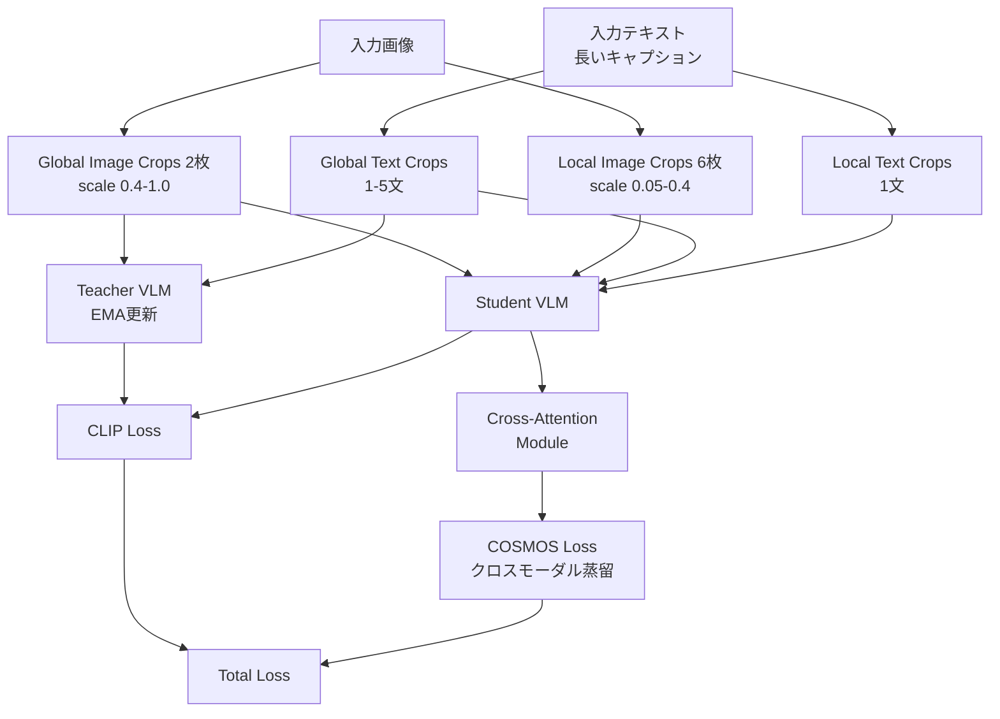

本記事は [COSMOS: Cross-Modality Self-Distillation for Vision Language Pre-training](https://arxiv.org/abs/2412.01814)（Kim et al., CVPR 2025）の解説記事です。

## 論文概要（Abstract）

COSMOSは、Vision-Language Model（VLM）のコントラスティブ事前学習に自己蒸留を導入した手法であり、CVPR 2025に採択されている。従来のCLIPベースの学習では、画像中の前景オブジェクトに注意が集中し、背景や文脈情報が無視される傾向があった。著者らはDINOのマルチクロップ戦略を画像だけでなくテキストにも拡張し、クロスアテンションモジュールを組み合わせたクロスモーダル自己蒸留損失を提案している。CC3Mの2.8M画像のみの学習でImageNet zero-shot 37.1%を達成し、CLIPの23.9%を上回る結果が報告されている。

この記事は [Zenn記事: Self-Distillation入門](https://zenn.dev/0h_n0/articles/94e6c079501239) の深掘りです。

## 情報源

- **会議名**: CVPR 2025（Computer Vision and Pattern Recognition）
- **年**: 2025
- **URL**: [https://arxiv.org/abs/2412.01814](https://arxiv.org/abs/2412.01814)
- **著者**: Sanghwan Kim, Rui Xiao, Mariana-Iuliana Georgescu, Stephan Alaniz, Zeynep Akata
- **コード**: [https://github.com/ExplainableML/cosmos](https://github.com/ExplainableML/cosmos)

## カンファレンス情報

CVPRはコンピュータビジョン分野における最高峰の国際会議の1つであり、毎年の採択率は約25%前後である。COSMOSはVision-Language事前学習における自己蒸留の新しい応用として採択されている。

## 技術的詳細（Technical Details）

### COSMOSの全体構成

COSMOSの核となるアイデアは、DINOの画像マルチクロップ戦略をテキストモダリティにも拡張し、クロスモーダルな自己蒸留を実現することである。

### テキストクロッピング戦略

COSMOSの新規性の1つが、画像のマルチクロップと並列にテキストのマルチクロップを実施する点にある。著者らは長い合成キャプション（synthetic caption）からランダムに文を抽出する戦略を採用している。

- **グローバルテキストクロップ**: キャプションから1〜5文をランダムに抽出（文数は各学習イテレーションでランダムに決定）
- **ローカルテキストクロップ**: 1文のみをランダムに抽出

画像クロッピングとテキストクロッピングは独立に実行されるため、グローバルクロップとローカルクロップが同一の情報を含むとは限らない。この独立性が「ローカルからグローバルへの対応関係学習」を促進し、モデルが画像とテキストの部分的な対応だけでなく全体的な意味関係を捉えることを促す設計となっている。

### クロスアテンションモジュール

クロスアテンションモジュールは、画像トークンとテキストトークンの間で情報を双方向に交換する。

**画像側のクロスモーダル埋め込み**（論文Eq. 1）:

$$
h_I = C_\theta^T(q = [\text{CLS}],\ kv = \text{txt-tok}) + [\text{CLS}]
$$

**テキスト側のクロスモーダル埋め込み**（論文Eq. 2）:

$$
h_T = C_\theta^I(q = [\text{EOT}],\ kv = \text{img-tok}) + [\text{EOT}]
$$

ここで：
- $C_\theta^T$: テキストトークンからの情報を受け取るクロスアテンション
- $C_\theta^I$: 画像トークンからの情報を受け取るクロスアテンション
- $[\text{CLS}]$: 画像エンコーダのクラストークン出力
- $[\text{EOT}]$: テキストエンコーダの終端トークン出力
- 残差接続により、元のモダリティ固有の情報を保持

グローバルクロップの画像トークンとテキストトークンがキー・バリューとして使用され、他方のモダリティの情報を効率的にプールする設計である。

### 損失関数の設計

COSMOSの全体損失は、CLIP損失とCOSMOS損失の和として定義される。

**CLIP損失**:

$$
\mathcal{L}_{\text{CLIP}} = \mathcal{L}_{\text{sym-nce}}(\text{CLS}_s, \text{EOT}_s)
$$

**COSMOS損失**（論文Eq. 6）:

$$
\mathcal{L}_{\text{COSMOS}} = \frac{1}{4}\left(\mathcal{L}_{\text{sym-nce}}(h_I, \text{CLS}_t) + \mathcal{L}_{\text{sym-nce}}(h_I, \text{EOT}_t) + \mathcal{L}_{\text{sym-nce}}(h_T, \text{CLS}_t) + \mathcal{L}_{\text{sym-nce}}(h_T, \text{EOT}_t)\right)
$$

ここで：
- $h_I, h_T$: 生徒側のクロスモーダル埋め込み（クロスアテンション出力）
- $\text{CLS}_t, \text{EOT}_t$: 教師側（EMA）の画像・テキスト出力
- $\mathcal{L}_{\text{sym-nce}}$: 対称InfoNCE損失

**全体損失**:

$$
\mathcal{L}_{\text{total}} = \mathcal{L}_{\text{CLIP}} + \mathcal{L}_{\text{COSMOS}}
$$

COSMOS損失は4つのクロスモーダル対応関係（画像クロスモーダル→教師画像、画像クロスモーダル→教師テキスト、テキストクロスモーダル→教師画像、テキストクロスモーダル→教師テキスト）を均等に学習する設計であり、モダリティ間の情報統合を促進している。

### マルチクロップ設定

DINOに倣い、グローバルクロップのみが教師エンコーダに入力される。

| クロップ種別 | 画像 | テキスト |
|-----------|------|--------|
| グローバル | 2枚、scale 0.4-1.0、224×224 | 2個、1-5文 |
| ローカル | 6枚、scale 0.05-0.4、96×96 | 6個、1文 |

## 実験結果（Results）

### 画像-テキスト検索

著者らが報告しているMSCOCOでの検索結果（Recall@1）は以下のとおりである。

| データセット | 手法 | I2T R@1 | T2I R@1 |
|-----------|------|---------|---------|
| CC3M | CLIP | 45.1% | 31.0% |
| CC3M | COSMOS | 53.1% | 40.1% |
| CC12M | COSMOS | 64.2% | 48.9% |
| Merged-30M | COSMOS | 68.0% | 52.5% |

CC3Mの2.8M画像のみでもCLIPを+8.0pt（I2T）/+9.1pt（T2I）上回っている（論文Table 1より）。

### Zero-Shot分類（ImageNet top-1）

| データセット | COSMOS | CLIP |
|-----------|--------|------|
| CC3M | 37.1% | 23.9% |
| Merged-30M | 57.6% | - |

### Zero-Shotセマンティックセグメンテーション

著者らは、30Mサンプルでの学習で平均mIoU 20.0%を達成し、10億サンプルで学習されたOpenCLIPの16.5%を上回ったと報告している。データ効率の観点で約33倍のデータ効率が示されている。

### 視覚的知覚・文脈理解ベンチマーク

COSMOSが特に優位性を示すのが、画像の文脈的理解を評価するベンチマークである（論文Table 3より）。

| ベンチマーク | COSMOS (30M) | DreamLIP | OpenCLIP (1B) |
|-----------|------------|----------|---------------|
| SugarCrepe（構成理解） | 86.6% | 81.8% | - |
| SVO（動詞理解） | 68.5% | 66.5% | - |
| MMVP-VLM（マルチモーダル） | 25.9% | - | 25.9% |

SugarCrepeは画像の構成的理解（オブジェクト間の関係性）を評価するベンチマークであり、COSMOSのクロスアテンションモジュールが前景以外の情報も適切に捉えていることが示唆される結果となっている。

### アブレーション結果

著者らが報告しているアブレーション（CC3Mデータセット）は以下のとおりである（論文Table 5より）。

| コンポーネント | ImageNet | MSCOCO I2T |
|-------------|---------|-----------|
| CLIP baseline | 17.5% | 15.0% |
| + 画像Augmentation | 19.1% | 17.5% |
| + 画像自己蒸留 | 22.8% | 20.6% |
| + テキストAugmentation | 34.4% | 50.4% |
| + テキスト自己蒸留 | 35.4% | 51.0% |
| + クロスアテンション | 37.1% | 53.1% |

テキストAugmentation（テキストクロッピング）が最大の改善（+11.6pt on ImageNet）をもたらしており、これがCOSMOSの核心的な貢献であることが確認できる。クロスアテンションモジュールの追加効果は+1.7pt（ImageNet）であるが、検索タスクでは+2.1pt（MSCOCO I2T）の改善が得られている。

## 実装のポイント（Implementation）

### 学習設定

論文で報告されている主要な学習パラメータは以下のとおりである。

- **ビジョンエンコーダ**: ViT-B/16（入力解像度224×224）
- **テキストエンコーダ**: 最大トークン長77
- **学習率**: $5 \times 10^{-4}$
- **バッチサイズ**: 1,024（CC3M）/ 4,096（大規模データセット）
- **教師モメンタム**: $\lambda = 0.999$（CC3M）/ $\lambda = 0.99$（その他）
- **学習エポック数**: 32
- **ハードウェア**: A100 GPU

### 合成キャプションの重要性

COSMOSのテキストクロッピングは、十分に長い（複数文からなる）キャプションを前提としている。MS-COCOのような短いキャプション（1文）ではテキストクロッピングの効果が限定的であるため、長い合成キャプションを生成するパイプライン（LLaVA等のキャプション生成モデル）との組み合わせが重要である。

### クロスアテンションの計算コスト

クロスアテンションモジュールは追加の計算コストを要するが、グローバルクロップのトークンのみを使用するため、実装上のオーバーヘッドは限定的である。著者らの実装（GitHub公開済み）では、PyTorchの標準的なMultiheadAttentionを使用しており、追加パラメータ数はバックボーンの数%程度に収まる。

## 実運用への応用（Practical Applications）

COSMOSの実用的な利点は以下の点にある。

- **データ効率**: 30Mサンプルで10億サンプルのOpenCLIPを上回るセグメンテーション性能を達成しており、データ収集コストの削減に寄与する
- **密な特徴量**: CLIPが苦手とするセマンティックセグメンテーション等の密な予測タスクの改善
- **マルチモーダル理解**: 画像の前景だけでなく背景や文脈情報も捉えるため、画像検索やキャプション生成の品質向上が期待される

ただし、テキストクロッピング戦略は長いキャプションを前提としているため、ドメイン固有のデータセットでは合成キャプション生成パイプラインの構築が追加コストとなる。

## 関連研究（Related Work）

- **CLIP**（Radford et al., ICML 2021）: COSMOSのベースラインとなるコントラスティブVLM事前学習手法
- **DINO**（Caron et al., ICCV 2021）: マルチクロップ自己蒸留の原提案。COSMOSはこの戦略をテキストモダリティに拡張
- **SigLIP**（Zhai et al., ICCV 2023）: シグモイドベースのコントラスティブ損失。COSMOSと相補的に使用可能
- **DreamLIP**（Zheng et al., 2024）: 合成キャプションを活用したVLM学習。COSMOSとの比較でMSCOCO検索で+12.3pt（I2T）の差が報告されている

## まとめと今後の展望

COSMOSは、DINOの自己蒸留フレームワークをVision-Language事前学習に拡張し、テキストクロッピング戦略とクロスアテンションモジュールを組み合わせることで、少量のデータでCLIPを大幅に上回る性能を達成している。特にテキストAugmentationの寄与が大きく（ImageNetで+11.6pt）、マルチモーダル学習における自己蒸留の有効性を示す結果である。

自己蒸留のVision-Languageへの適用は発展途上であり、DINOv2/v3のスケーリング手法をCOSMOSに統合した大規模マルチモーダル基盤モデルや、テキストクロッピングの自動最適化（文数・選択基準のメタ学習）などが今後の研究方向として考えられる。

## 参考文献

- **Conference URL**: [https://openaccess.thecvf.com/content/CVPR2025/html/Kim_COSMOS_Cross-Modality_Self-Distillation_for_Vision_Language_Pre-training_CVPR_2025_paper.html](https://openaccess.thecvf.com/content/CVPR2025/html/Kim_COSMOS_Cross-Modality_Self-Distillation_for_Vision_Language_Pre-training_CVPR_2025_paper.html)
- **arXiv**: [https://arxiv.org/abs/2412.01814](https://arxiv.org/abs/2412.01814)
- **Code**: [https://github.com/ExplainableML/cosmos](https://github.com/ExplainableML/cosmos)
- **Related Zenn article**: [https://zenn.dev/0h_n0/articles/94e6c079501239](https://zenn.dev/0h_n0/articles/94e6c079501239)
