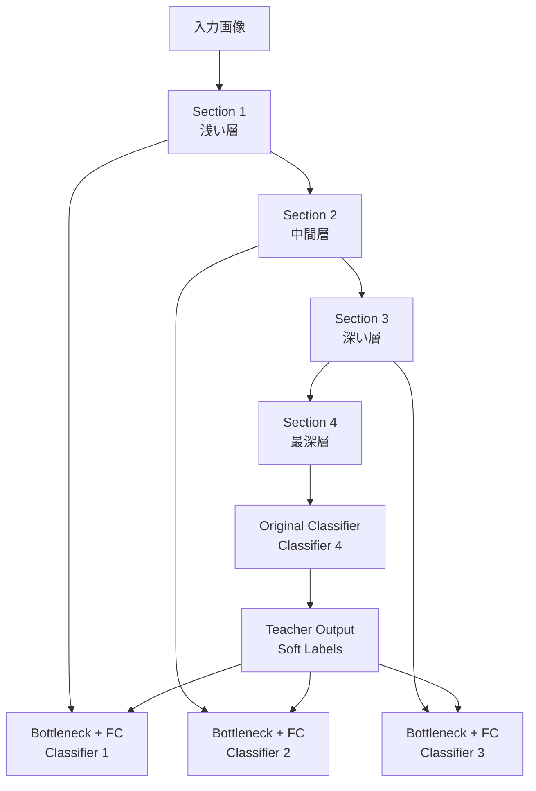

本記事は [Be Your Own Teacher: Improve the Performance of Convolutional Neural Networks via Self Distillation](https://arxiv.org/abs/1905.08094)（Zhang et al., ICCV 2019）の解説記事です。

## 論文概要（Abstract）

本論文は、Self-Distillation（自己蒸留）の概念を初めて体系的に提案した先駆的研究である。従来のKnowledge Distillation（知識蒸留）が大きな教師モデルから小さな生徒モデルへの知識転送を行うのに対し、著者らは**同一ネットワーク内部**で深い層から浅い層への知識転送を行う手法を提案している。CNNアーキテクチャ（ResNet、VGG、WideResNet等）において、ネットワークを複数のセクションに分割し、深いセクションの知識を浅いセクションに蒸留することで、追加パラメータなしで平均+2.65%の精度改善を達成したと報告されている。

この記事は [Zenn記事: Self-Distillation入門](https://zenn.dev/0h_n0/articles/94e6c079501239) の深掘りです。

## 情報源

- **会議名**: ICCV 2019（International Conference on Computer Vision）
- **年**: 2019
- **URL**: [https://arxiv.org/abs/1905.08094](https://arxiv.org/abs/1905.08094)
- **著者**: Linfeng Zhang, Jiebo Song, Anni Gao, Jingwei Chen, Chenglong Bao, Kaisheng Ma
- **分野**: cs.LG, stat.ML

## カンファレンス情報

ICCVはコンピュータビジョン分野の3大国際会議（CVPR、ICCV、ECCV）の1つであり、隔年で開催される。採択率は通常25%前後と高い競争率を持つ。本論文はICCV 2019で発表され、自己蒸留の概念を確立した重要な研究として広く引用されている。

## 背景と動機（Background & Motivation）

2015年にHintonらが提案したKnowledge Distillation（KD）は、大規模な教師モデルの「暗い知識（dark knowledge）」を小さな生徒モデルに転送する手法として広く採用されていた。しかし、KDには以下の課題があった。

1. **教師モデルの事前学習コスト**: 別途大規模な教師モデルを学習する必要があり、2段階の学習プロセスが要求される
2. **教師-生徒のアーキテクチャ制約**: 教師モデルと生徒モデルの間でアーキテクチャの互換性が必要
3. **モデル圧縮の限界**: 生徒モデルは教師モデルよりも必ず性能が低下する

著者らは、「ネットワーク自身が自分自身の教師となる」というアイデアに基づき、外部の教師モデルを必要としない自己蒸留フレームワークを提案している。

## 技術的詳細（Technical Details）

### ネットワーク分割と補助分類器

自己蒸留の基本的な構造は、CNNネットワークを深さ方向に複数のセクションに分割し、各セクションの出力に補助分類器（Bottleneck + FC層）を配置するものである。

ResNetの場合、各Residual Blockグループをセクションとして分割する。例えばResNet-18では4つのResidual Blockグループがあり、各グループの出力に補助分類器を配置する。

### 損失関数の定式化

自己蒸留の損失関数は、3つの成分から構成される。

**1. クロスエントロピー損失（ハードラベル）**:

$$
\mathcal{L}_{\text{CE}}^{(k)} = -\sum_{i=1}^{C} y_i \log q_i^{(k)}
$$

ここで $y_i$ はOne-hotラベル、$q_i^{(k)}$ はセクション $k$ の分類器出力、$C$ はクラス数である。

**2. KL Divergence損失（ソフトラベル蒸留）**:

$$
\mathcal{L}_{\text{KD}}^{(k)} = T^2 \cdot D_{\text{KL}}\left(\sigma\left(\frac{\mathbf{z}^{(K)}}{T}\right) \middle\| \sigma\left(\frac{\mathbf{z}^{(k)}}{T}\right)\right)
$$

ここで：
- $\mathbf{z}^{(K)}$: 最深層（セクション $K$、教師側）のlogits
- $\mathbf{z}^{(k)}$: セクション $k$（生徒側）のlogits
- $T$: 温度パラメータ（蒸留のソフト化度合いを制御）
- $\sigma(\cdot)$: softmax関数
- $T^2$: Hinton et al. (2015) に従うスケーリング係数

温度 $T$ を上げるとsoftmax出力が「ソフト」になり、クラス間の類似度情報（暗い知識）がより多く転送される。著者らの実験では $T = 3$ が推奨されている。

**3. 特徴量アライメント損失（Feature Hint）**:

$$
\mathcal{L}_{\text{hint}}^{(k)} = \left\| \phi^{(k)}(\mathbf{f}^{(k)}) - \mathbf{f}^{(K)} \right\|_2^2
$$

ここで $\mathbf{f}^{(k)}$ はセクション $k$ のBottleneck出力特徴量、$\phi^{(k)}$ は次元を合わせるための線形変換、$\mathbf{f}^{(K)}$ は最深層の特徴量である。

**全体損失**:

$$
\mathcal{L}_{\text{total}} = \sum_{k=1}^{K} \left( \mathcal{L}_{\text{CE}}^{(k)} + \alpha \cdot \mathcal{L}_{\text{KD}}^{(k)} + \beta \cdot \mathcal{L}_{\text{hint}}^{(k)} \right)
$$

$\alpha$ と $\beta$ はそれぞれ蒸留損失と特徴量アライメント損失の重みである。

### Bottleneck構造

各セクションの補助分類器には、特徴マップを分類に適した次元に圧縮するBottleneck構造が配置される。具体的には、3×3畳み込み → バッチ正規化 → ReLU → Adaptive Average Pooling → 全結合層の構成である。Bottleneckは学習時のみ使用され、推論時にはEarly Exitの判定に使用される。

## 実験結果（Results）

### アーキテクチャ別の精度改善

著者らがCIFAR-100で報告している主要な実験結果は以下のとおりである（論文Table 1より）。

| アーキテクチャ | ベースライン | 自己蒸留後 | 改善幅 |
|-------------|-----------|---------|-------|
| ResNet-18 | — | — | +2.65% |
| VGG-19 | — | — | +4.07%（最大） |
| ResNeXt | — | — | +0.61%（最小） |
| WideResNet | — | — | +1.29% |

全アーキテクチャにわたり一貫した改善が得られており、平均+2.65%の精度向上が報告されている。VGG-19で最大の改善（+4.07%）が得られた理由について、著者らはVGGのシーケンシャルな構造が深い層→浅い層への知識転送に適しているためと分析している。一方、ResNeXtでの改善が小さい（+0.61%）理由は、ResNeXtのカーディナリティ（並列パス）構造が既に層間の情報流通を促進しているためと考えられている。

### 深さ方向のスケーラブル推論

自己蒸留の実用的な利点として、推論時にネットワークの深さを動的に調整できる点がある。浅いセクションの補助分類器で十分な精度が得られる入力に対しては、深い層の計算をスキップすることで推論コストを削減できる。

| 使用セクション | 計算量（相対） | 精度（CIFAR-100） |
|-------------|------------|-----------------|
| Section 1のみ | ~25% | ベースライン比-5〜10% |
| Section 1-2 | ~50% | ベースライン比-2〜5% |
| Section 1-3 | ~75% | ベースライン比-0.5〜1% |
| 全セクション | 100% | ベースライン+2.65% |

このスケーラビリティにより、エッジデバイスやリアルタイム推論の要件に応じて計算量と精度のトレードオフを動的に調整できる。

### Knowledge Distillationとの比較

著者らは、同一アーキテクチャ間での通常のKnowledge Distillation（別途学習した同一アーキテクチャの教師モデルからの蒸留）と自己蒸留の比較も行っている。自己蒸留は1回の学習で完結するため学習コストが低く、かつ精度改善幅も通常のKDと同等以上であることが報告されている。

具体的には、通常のKDでは以下の2段階の学習プロセスが必要となる。

1. **教師モデルの学習**: 同一アーキテクチャ（例: ResNet-18）をフルに学習
2. **生徒モデルの蒸留学習**: 教師モデルのソフトラベルを用いて同一アーキテクチャを再学習

これに対し自己蒸留では、1回の学習で教師（最深層）と生徒（浅いセクション）の同時最適化が行われる。著者らの実験では、自己蒸留の最深層分類器の精度が通常のKDの生徒モデルの精度を上回るケースも報告されており、自己蒸留が正則化効果（暗黙的なデータ拡張に類似した効果）を持つことが示唆されている。

### アブレーションスタディ

著者らは損失関数の各成分の寄与を検証するアブレーションスタディも実施している。ResNet-18/CIFAR-100での結果として、KL Divergence損失のみ（$\alpha > 0, \beta = 0$）では+1.8%、Feature Hint損失のみ（$\alpha = 0, \beta > 0$）では+1.2%、両方を組み合わせた場合に+2.65%の精度改善が得られたと報告されている。このことから、ソフトラベルによるクラス間関係の転送と、特徴量空間でのアライメントが相補的に機能していることが確認されている。

## 実装のポイント（Implementation）

### 温度パラメータの選択

蒸留の温度パラメータ $T$ は、ソフトラベルの「滑らかさ」を制御する重要なハイパーパラメータである。$T = 1$ は通常のsoftmax、$T \to \infty$ は均一分布に近づく。著者らの実験では $T = 3$ が推奨されているが、タスクやデータセットに応じて $T = 2 \sim 5$ の範囲で調整することが一般的である。

### セクション分割の粒度

ネットワークの分割粒度は性能に影響する。ResNet-18（4つのResidual Blockグループ）では4セクション分割が自然であるが、より深いネットワーク（ResNet-50、ResNet-101等）ではセクション数を増やすことも可能である。ただし、セクション数が多すぎると補助分類器のオーバーヘッドが増加し、学習の安定性が低下する可能性がある。著者らの実験では3〜4セクションが安定した結果を示している。

### ViTへの拡張

本論文はCNNアーキテクチャを対象としているが、自己蒸留の概念はViT（Vision Transformer）にも直接適用可能である。後続研究のSDSSL（WACV 2023）では、ViTのTransformerブロックをセクションとして分割し、同様の中間層蒸留を実施している。CNNでのセクション分割がResidual Blockグループに対応するのに対し、ViTではTransformerブロックの等間隔配置（例: 12層中Layer 3, 6, 9）が標準的なアプローチとなっている。

## 実運用への応用（Practical Applications）

本論文で提案された自己蒸留は、以下の実用的な応用シナリオが考えられる。

- **エッジデバイスへの展開**: 深さ方向のスケーラブル推論により、デバイスの計算能力に応じて推論コストを動的に調整可能。単一のモデルで複数のデバイスクラスに対応できる
- **リアルタイム推論**: 入力の「難易度」に応じて浅い層で推論を打ち切るEarly Exit戦略が可能。簡単な入力（例: 明確に識別可能な画像）では浅い層で済ませ、困難な入力のみ全層を使用する
- **学習コスト削減**: 外部教師モデルが不要であるため、Knowledge Distillationと比較して学習パイプラインが簡素化される

ただし、本論文の実験はCIFAR-100等の小規模データセットが中心であり、ImageNet規模やプロダクション環境での検証は後続研究（DINOv2、DINOv3等）に委ねられている。

## 関連研究（Related Work）

- **Knowledge Distillation**（Hinton et al., 2015）: 教師-生徒間の知識転送の原提案。本論文の直接の出発点
- **FitNets**（Romero et al., 2015）: 中間層の特徴量を「ヒント」として使用する蒸留手法。本論文のFeature Hint損失はFitNetsの影響を受けている
- **Born Again Networks**（Furlanello et al., 2018）: 同一アーキテクチャ間での反復的蒸留。自己蒸留の概念に近いが、複数回の学習が必要
- **DINO**（Caron et al., ICCV 2021）: 自己蒸留をSSLに適用した後続研究。Be Your Own Teacherの考え方をラベルなし学習に拡張

## まとめと今後の展望

Be Your Own Teacherは、「同一ネットワーク内での深い層→浅い層への知識転送」という自己蒸留の概念を初めて体系的に提案し、CNNアーキテクチャで平均+2.65%の精度改善を追加パラメータなしで達成した先駆的研究である。温度付きソフトラベル蒸留と特徴量アライメント損失の組み合わせ、深さ方向のスケーラブル推論という設計は、後続のDINO系列やSDSSLに継承されている。

2019年の発表以降、自己蒸留はCNN→ViT→マルチモーダルモデル（COSMOS）へと適用範囲を拡大し、現在ではSSLの標準的な学習技法の1つとなっている。本論文が示した「外部教師なしで自己改善する学習フレームワーク」のコンセプトは、LLMの自己改善学習やReinforcement Learning from Human Feedback（RLHF）の自己蒸留的アプローチにも影響を与えている。

## 参考文献

- **arXiv**: [https://arxiv.org/abs/1905.08094](https://arxiv.org/abs/1905.08094)
- **Related Zenn article**: [https://zenn.dev/0h_n0/articles/94e6c079501239](https://zenn.dev/0h_n0/articles/94e6c079501239)
- **Knowledge Distillation (Hinton et al., 2015)**: [https://arxiv.org/abs/1503.02531](https://arxiv.org/abs/1503.02531)
- **SDSSL (WACV 2023)**: [https://arxiv.org/abs/2111.12958](https://arxiv.org/abs/2111.12958)
