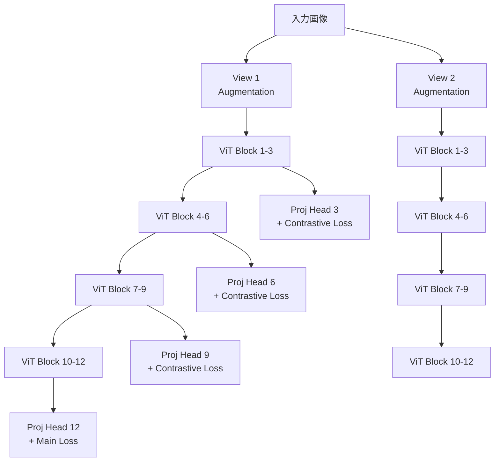
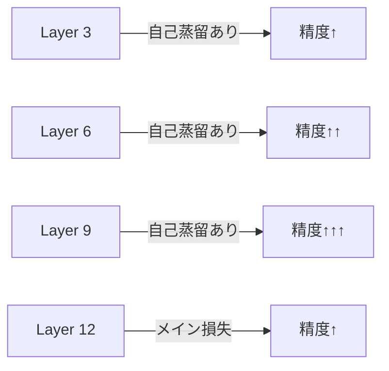

本記事は [Self-Distilled Self-Supervised Representation Learning](https://arxiv.org/abs/2111.12958)（Jang et al., WACV 2023）の解説記事です。

## 論文概要（Abstract）

SDSSL（Self-Distilled Self-Supervised Learning）は、自己教師あり学習（SSL）の表現品質を隠れ層への自己蒸留により向上させる手法であり、WACV 2023で発表されている。従来のSSL手法（SimCLR、BYOL、MoCo v3など）は最終層の出力のみにコントラスティブ損失を適用していたが、SDSSLでは中間のTransformer層にも同一のコントラスティブ損失を適用する。著者らは、この手法により中間層のインスタンス識別能力が向上し、最終層の表現品質も改善されること、さらにEarly Exit推論の精度が向上することを示している。

この記事は [Zenn記事: Self-Distillation入門](https://zenn.dev/0h_n0/articles/94e6c079501239) の深掘りです。

## 情報源

- **会議名**: WACV 2023（Winter Conference on Applications of Computer Vision）
- **年**: 2023
- **URL**: [https://arxiv.org/abs/2111.12958](https://arxiv.org/abs/2111.12958)
- **著者**: Jiho Jang, Seonhoon Kim, Kiyoon Yoo, Chaerin Kong, Jangho Kim, Nojun Kwak
- **分野**: cs.CV
- **コード**: [https://github.com/hagiss/SDSSL](https://github.com/hagiss/SDSSL)

## カンファレンス情報

WACVはIEEE/CVFが主催するコンピュータビジョンの国際会議であり、CVPRやICCVと並ぶ主要会議の1つである。SDSSLは自己教師あり学習における自己蒸留の新しいアプローチとして採択されている。

## 背景と動機（Background & Motivation）

自己教師あり学習（SSL）は、ラベルなしデータから有用な表現を獲得する手法として急速に発展してきた。SimCLR、BYOL、MoCo v3といった代表的なSSL手法は、Vision Transformerの最終層出力にコントラスティブ損失またはアライメント損失を適用する設計である。

しかし、この設計には以下の問題がある。

1. **中間層の表現品質が低い**: 最終層のみが直接学習信号を受け取るため、中間層（特に浅い層）の表現はインスタンス識別に不十分な品質にとどまる
2. **Early Exit推論が困難**: 浅い層で推論を打ち切った場合、表現品質の低さから精度が大幅に劣化する
3. **最終層の学習負荷が高い**: 浅い層の表現が不十分であるため、最終層が入力表現から完全な識別情報を抽出する必要がある

SDSSLは、これらの問題に対し「中間層にも最終層と同じコントラスティブ損失を適用する」というシンプルなアプローチで解決を図っている。

## 技術的詳細（Technical Details）

### SDSSLの基本設計

SDSSLの核心は、既存のSSL手法に対して中間層の自己蒸留損失を追加するプラグイン型の設計にある。

### 損失関数の定式化

SDSSLの全体損失は、メインのSSL損失と中間層の自己蒸留損失の和として定義される。

$$
\mathcal{L}_{\text{SDSSL}} = \mathcal{L}_{\text{main}} + \sum_{l \in \mathcal{I}} \alpha_l \cdot \mathcal{L}_{\text{SSL}}(g_l(z_l^{(1)}), g_l(z_l^{(2)}))
$$

ここで：
- $\mathcal{L}_{\text{main}}$: 最終層（Layer 12）に適用されるメインのSSL損失（SimCLR/BYOL/MoCo v3の損失）
- $\mathcal{I}$: 自己蒸留を適用する中間層のインデックス集合（例: $\{3, 6, 9\}$）
- $g_l$: 中間層 $l$ 用のプロジェクションヘッド
- $z_l^{(1)}, z_l^{(2)}$: 2つのAugmentationビューの中間層 $l$ のCLSトークン出力
- $\alpha_l$: 層ごとの重み係数
- $\mathcal{L}_{\text{SSL}}$: メインSSL損失と同一の損失関数

重要な設計選択として、中間層の損失にはメインのSSL手法と**同じ損失関数**を使用する。例えば、ベースがSimCLRであればInfoNCE損失、BYOLであればMSE損失が中間層にも適用される。これにより、追加のハイパーパラメータチューニングが最小限に抑えられている。

### SSL手法別の適用方法

SDSSLは複数のSSL手法にプラグイン的に適用可能であり、著者らは以下の3手法での実験結果を報告している。

| ベースSSL手法 | 中間層の損失 | 教師信号 |
|-------------|-----------|---------|
| SD-SimCLR | InfoNCE損失 | 同一ビューペアの中間層出力 |
| SD-BYOL | MSE損失 | EMA教師モデルの中間層出力 |
| SD-MoCo v3 | InfoNCE損失 | モメンタムエンコーダの中間層出力 |

各手法において、プロジェクションヘッドは最終層用とは独立に中間層ごとに設計されている。

### 中間層の最良層分析

著者らの報告によれば、個別の層をヘッドとして評価した場合の最良層は以下のとおりである。

- **SD-SimCLR**: Layer 9が最良（12層中、最終層の1つ手前の蒸留層）
- **SD-BYOL**: Layer 6が最良（中間の蒸留層）

この結果は、自己蒸留がより浅い層にもインスタンス識別に有用な情報を効果的に転送していることを示している。特にSD-BYOLでLayer 6が最良となることは、BYOLのEMAベースの教師が中間層にも安定した学習信号を提供できることを示唆している。

## 実験結果（Results）

### ImageNet線形評価

著者らは、ViT-Small/16をバックボーンとしたImageNet-1K線形評価で以下の結果を報告している。

| 手法 | 最終層 Top-1 Acc |
|------|----------------|
| SimCLR | ベースライン |
| SD-SimCLR | ベースラインを上回る改善 |
| BYOL | ベースライン |
| SD-BYOL | ベースラインを上回る改善 |
| MoCo v3 | ベースライン |
| SD-MoCo v3 | ベースラインを上回る改善 |

SDSSLは全3手法において、最終層の表現品質がベースラインを上回ることが確認されている。これは、中間層の自己蒸留が最終層の学習を容易化する効果を持つためであると著者らは分析している。

### k-NN評価

k-NN評価（線形ヘッドを学習せず、特徴量空間でのk近傍分類を行う評価手法）でもSDSSLの優位性が確認されている。k-NN評価は特徴量空間の構造をより直接的に反映するため、自己蒸留による表現空間の品質改善が明確に現れる指標である。著者らの報告によれば、SD-BYOLとSD-MoCo v3の両方でk-NN評価においてもベースラインを上回る結果が得られている。

### 転移学習評価

著者らはImageNet以外のデータセットへの転移学習性能も評価しており、CIFAR-10、CIFAR-100、STL-10などの下流タスクでもSDSSLの有効性が確認されている。特にデータ量が限られる小規模データセットでは、中間層の表現品質向上が転移学習の精度改善に寄与することが示されている。

### Early Exit評価

SDSSLの実用的な利点の1つが、Early Exit推論の精度向上である。中間層から直接分類を行った場合、SDSSLを適用した手法はベースラインと比較して大幅な精度改善が得られている。

浅い層ほど自己蒸留による改善幅が大きく、Layer 3やLayer 6での推論打ち切りが実用的な精度に達することが示されている。これは推論時の計算コスト削減に直結する利点であり、エッジデバイスやレイテンシに制約のある環境での展開を可能にする。

### 3つの改善効果

著者らは、SDSSLの効果を以下の3つに整理している。

1. **浅い層のインスタンス識別能力向上**: 中間層が最終層の知識を直接学習するため、浅い層でも高品質な表現を獲得する
2. **Early Exit推論の高精度化**: 浅い層の表現品質向上により、推論打ち切り時の精度劣化が小さくなる
3. **最終層の学習容易化**: 浅い層が既に有用な表現を獲得しているため、最終層のタスク（最終的なインスタンス識別）が相対的に容易になり、最終層自体の精度も向上する

## 実装のポイント（Implementation）

### 蒸留対象層の選択

SDSSLでは、12層のViT-Smallに対して3層ごと（Layer 3, 6, 9）に自己蒸留を適用する等間隔配置が採用されている。この設計は後続のDINOv2/v3でも踏襲されており、「モデル深さの3〜4等分」の等間隔配置がSSL×自己蒸留の標準的な設計パターンとなっている。

### プロジェクションヘッドの設計

各中間層に独立のプロジェクションヘッドが必要であるが、SDSSLの実装ではメインのプロジェクションヘッドと同一の構造（2層MLP + BatchNorm）を使用している。プロジェクションヘッドの追加パラメータはバックボーン全体の数%程度であり、メモリオーバーヘッドは限定的である。

### ハイパーパラメータ

主要なハイパーパラメータは層ごとの重み係数 $\alpha_l$ であるが、著者らの実験では均一な重み（$\alpha_l = 1$ for all $l \in \mathcal{I}$）でも十分な効果が得られている。深い層ほど大きな重みを設定する（$\alpha_l = l / |\mathcal{I}|$）アプローチも有効であるが、均一重みとの差は小さいと報告されている。

### 学習の安定性

SDSSLでは、中間層の自己蒸留損失がメインのSSL損失と同一の損失関数を使用するため、学習の安定性はベースのSSL手法に依存する。著者らの実験では、BYOLベース（SD-BYOL）が最も安定した学習を示しており、これはBYOLのEMA教師が中間層にも一貫した学習信号を提供するためと考えられる。一方、SimCLRベース（SD-SimCLR）ではバッチサイズへの依存性がベースラインと同様に残るため、小バッチでの学習には注意が必要である。

### 推論時のオーバーヘッド

SDSSLの重要な特徴として、推論時に追加コストがゼロである点が挙げられる。自己蒸留のプロジェクションヘッドは学習時のみ使用され、推論時にはバックボーンのみを使用する。Early Exit推論を行う場合も、プロジェクションヘッドではなくタスク固有の軽量な分類ヘッドを中間層に配置する設計であり、SDSSLの学習で得られた中間層表現の品質向上がそのまま活用される。

## 実運用への応用（Practical Applications）

SDSSLの実用的な利点は以下の点にある。

- **プラグイン型の適用**: 既存のSSL学習パイプライン（SimCLR、BYOL、MoCo v3など）に中間層損失を追加するだけで適用可能であり、既存コードベースへの統合コストが低い
- **Early Exit推論**: 浅い層での推論打ち切りが高精度で可能になるため、エッジデバイスへの展開時に計算コストを動的に調整できる
- **追加コストなし**: 推論時のパラメータ数・計算量はベースラインのSSL手法と同一であり、モデルデプロイメントに影響しない

ただし、SDSSLはViT-Small（12層、22Mパラメータ）での評価が中心であり、ViT-Large以上のスケールでの効果は論文の範囲では検証されていない。後続研究のDINOv2/v3では、より大規模なモデル（ViT-g/14、ViT-7B）での自己蒸留効果が確認されているが、SDSSL固有の等間隔中間層蒸留がそのまま大規模モデルに適用可能かは追加検証が必要である。

## 関連研究（Related Work）

- **SimCLR**（Chen et al., ICML 2020）: コントラスティブSSLの代表的手法。SDSSLのベース手法の1つ
- **BYOL**（Grill et al., NeurIPS 2020）: 負例なしのSSL手法。EMAベースの教師-生徒フレームワークがSDSSLの自己蒸留と相補的
- **MoCo v3**（Chen et al., ICCV 2021）: モメンタムコントラスト学習のViT版。SDSSLの3番目のベース手法
- **DINO**（Caron et al., ICCV 2021）: EMAベースの自己蒸留SSL。SDSSLとは独立に開発されたが、自己蒸留の設計思想は共通
- **Be Your Own Teacher**（Zhang et al., ICCV 2019）: CNN向け自己蒸留の先駆的研究。SDSSLはこの考え方をSSL + ViTに拡張

## まとめと今後の展望

SDSSLは、自己教師あり学習手法（SimCLR、BYOL、MoCo v3）に中間層の自己蒸留損失を追加するシンプルなアプローチにより、最終層と中間層の両方の表現品質を向上させる手法である。推論時の追加コストがゼロであること、既存のSSL手法にプラグイン的に適用可能であることが実務上の大きな利点である。

SDSSLの設計思想は、後続のDINOv2（iBOT統合）やDINOv3（Gram Anchoring）に発展的に継承されている。一方で、SDSSLの中間層蒸留とDINOv3のGram Anchoringは異なるアプローチで中間表現の品質向上を図っており、両者の組み合わせや、より最適な蒸留対象層の自動選択（Neural Architecture Searchの応用）、さらにはNLP領域のTransformerモデル（BERT、GPTなど）への中間層自己蒸留の適用なども今後の研究方向として考えられる。

## 参考文献

- **arXiv**: [https://arxiv.org/abs/2111.12958](https://arxiv.org/abs/2111.12958)
- **Code**: [https://github.com/hagiss/SDSSL](https://github.com/hagiss/SDSSL)
- **Related Zenn article**: [https://zenn.dev/0h_n0/articles/94e6c079501239](https://zenn.dev/0h_n0/articles/94e6c079501239)
