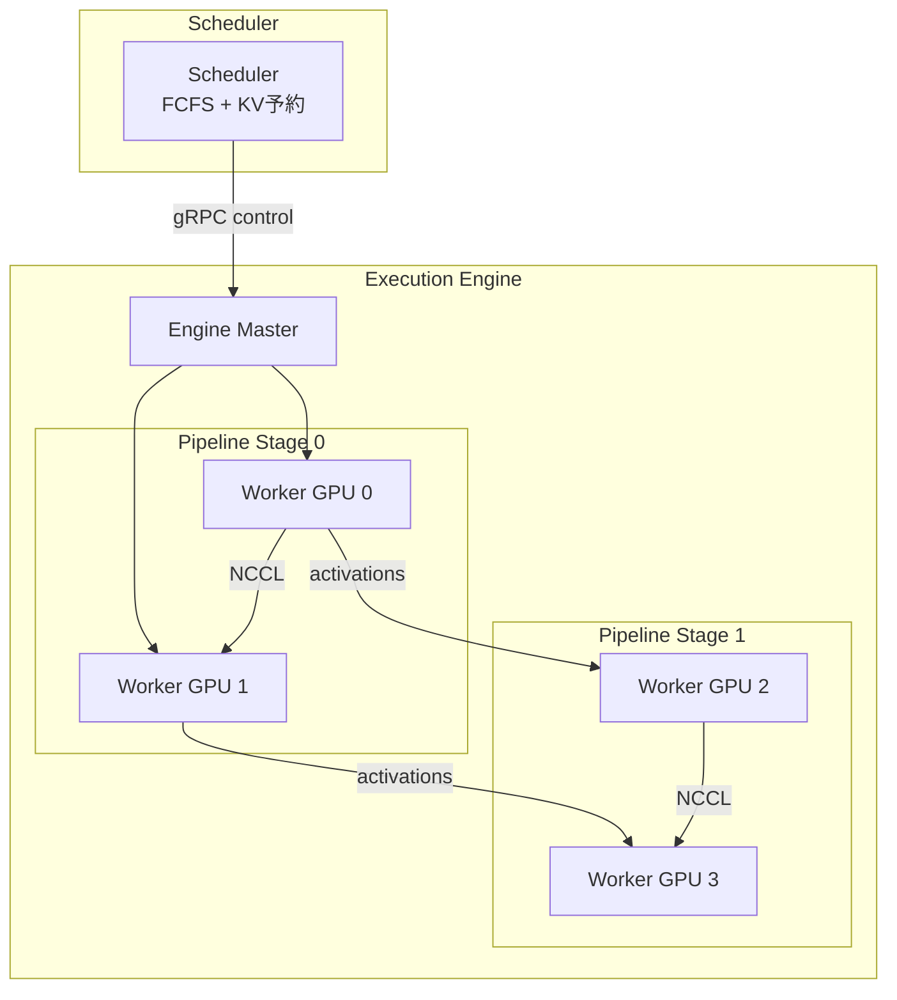

## 論文概要（Abstract）

Orcaは、Transformer系生成モデルの推論サービングにおいて**Iteration-Level Scheduling**（反復レベルスケジューリング）を導入したシステムである。従来のRequest-Level Scheduling（リクエストレベルスケジューリング）では、バッチ内の全リクエストが生成を完了するまで新たなリクエストを受け付けられなかった。Orcaはこの制約を排除し、各forwardパスの完了後にリクエストの追加・排出を可能にすることで、GPT-3 175Bモデルで従来手法（FasterTransformer）比**最大36.9倍**のスループット向上を報告している。

この記事は [Zenn記事: rvLLM：Rust製vLLM代替で学ぶGPU推論エンジンの実装最適化](https://zenn.dev/0h_n0/articles/48d89cb18bf0e1) の深掘りです。

## 情報源

- **会議**: OSDI 2022（16th USENIX Symposium on Operating Systems Design and Implementation）
- **URL**: [https://www.usenix.org/conference/osdi22/presentation/yu](https://www.usenix.org/conference/osdi22/presentation/yu)
- **著者**: Gyeong-In Yu, Joo Seong Jeong, Geon-Woo Kim, Soojeong Kim, Byung-Gon Chun（Seoul National University / FriendliAI）
- **発表年**: 2022
- **分野**: Systems for ML, Operating Systems

## 背景と動機（Background & Motivation）

2022年当時、GPT-3に代表される大規模言語モデル（LLM）のサービング基盤は、NVIDIA Triton Inference Server + FasterTransformerの組み合わせが主流であった。しかし、これらのシステムには根本的な非効率があった。

**Request-Level Scheduling（静的バッチング）の問題**:

自己回帰生成では、各リクエストの出力長が事前に不明である。静的バッチングでは、バッチ内の全リクエストが生成を完了するまで次のバッチを開始できない。結果として、短い応答を生成したリクエストは長い応答を待つ間GPUリソースを浪費し、新規リクエストもバッチ完了まで待機する必要があった。

Yu et al.はこの問題を「バッチ内の生成長の分散が大きいほどGPU利用率が低下する」と定式化し、反復（iteration）単位でスケジューリングを行うOrcaを提案した。

## 主要な貢献（Key Contributions）

- **Iteration-Level Scheduling**: forwardパス1回（= 1 iteration）ごとにスケジューラが介入し、完了リクエストの排出と新規リクエストの投入を行う仕組みを提案
- **Selective Batching**: Attention演算とそれ以外の演算を区別し、非Attention演算のみをバッチ処理することで可変長シーケンスの効率的な並列実行を実現
- **分散推論アーキテクチャ**: パイプライン並列とテンソル並列を組み合わせた分散実行エンジンを設計し、GPT-3 175B（16 GPU）規模での動作を実証

## 技術的詳細（Technical Details）

### Request-Level vs Iteration-Level Scheduling

従来の**Request-Level Scheduling**では、バッチ $B = \{r_1, r_2, \ldots, r_n\}$ を形成した後、全リクエストが終了トークン（EOS）を生成するまで連続してforwardパスを実行する。

$$
T_{\text{batch}} = \max_{r_i \in B} T_{\text{gen}}(r_i)
$$

ここで $T_{\text{gen}}(r_i)$ はリクエスト $r_i$ の生成に要するiterations数である。リクエスト $r_j$ が早期に完了しても、$T_{\text{batch}} - T_{\text{gen}}(r_j)$ iterations分のGPU計算が浪費される。

**Iteration-Level Scheduling**では、各iterationの完了後にスケジューラが以下を実行する:

1. EOSを生成したリクエストをバッチから除外
2. 待機キューから新規リクエストを空きスロットに投入
3. 更新されたバッチで次のiterationを実行

この結果、GPUは常に最大バッチサイズ近傍で稼働し、個々のリクエスト完了を待つ無駄時間が排除される。

### Selective Batching

Transformerの各レイヤーは、Attention演算と非Attention演算（Linear, LayerNorm, GeLU等）で構成される。バッチ内の各リクエストはシーケンス長が異なるため、単純にテンソルを結合できない問題がある。

**非Attention演算**（token-independent）:

入力テンソルの形状は $(B, L, H)$ だが、各トークンは独立に処理可能である。Orcaでは全リクエストのトークンを1次元に連結し、形状 $(\sum_{i} L_i, H)$ のテンソルとして一括処理する。

$$
\text{concat}(X_1, X_2, \ldots, X_n) \in \mathbb{R}^{(\sum_i L_i) \times H}
$$

**Attention演算**（sequence-dependent）:

Self-Attentionでは $Q K^T$ の計算にシーケンス全体の文脈が必要であり、異なるリクエスト間で混合できない。Orcaでは、Attention層の直前でテンソルをリクエストごとに分割し、個別に処理した後、再度連結する。

```
Non-Attention op:  [concat all tokens] → compute → [concat result]
Attention op:      [split per request] → compute individually → [merge]
```

著者らは、Attentionはメモリバウンドであり計算バウンドではないため、バッチ処理しないことによる効率低下は限定的であると報告している。

### スケジューラのアルゴリズム

```python
class OrcaScheduler:
    """Iteration-Level Scheduler（論文Section 3に基づく擬似コード）"""

    def __init__(self, max_batch: int, max_tokens: int, kv_slots: int):
        self.max_batch = max_batch
        self.max_tokens = max_tokens
        self.kv_slots = kv_slots  # GPU上のKVキャッシュ総スロット数
        self.active: list[Request] = []
        self.waiting: deque[Request] = deque()
        self.used_slots = 0

    def schedule_iteration(self) -> list[Request]:
        """1 iteration分のバッチを決定"""
        # Step 1: 完了リクエストの排出
        finished = [r for r in self.active if r.is_finished()]
        for r in finished:
            self.used_slots -= r.current_length
            self.active.remove(r)

        # Step 2: 新規リクエストの投入（FCFS順）
        while self.waiting and len(self.active) < self.max_batch:
            candidate = self.waiting[0]
            # デッドロック防止: max_tokens分のスロットを予約確認
            required = candidate.prompt_length + self.max_tokens
            if self.used_slots + required <= self.kv_slots:
                self.waiting.popleft()
                self.active.append(candidate)
                self.used_slots += required
            else:
                break  # メモリ不足 → 待機継続

        return self.active
```

**デッドロック防止メカニズム**: 新規リクエスト投入時に `prompt_length + max_tokens` 分のKVキャッシュスロットを予約する。これにより、投入後のメモリ不足による停止を防ぐ。ただし、この予約方式は実際の生成長が `max_tokens` より短い場合にメモリの内部断片化（internal fragmentation）を引き起こす。この問題は後続研究であるvLLM（Kwon et al., SOSP 2023）のPagedAttentionで解決された。

### 分散実行アーキテクチャ



Orcaは制御プレーン（gRPC）とデータプレーン（NCCL）を分離している。スケジューラはgRPCでEngine Masterにバッチ情報を送信し、GPU間のテンソル転送はNCCLで行う。パイプライン並列では、ステージ間で活性化値（activations）が転送され、テンソル並列では同一ステージ内のGPU間でAllReduceが実行される。

## 実装のポイント（Implementation）

Orcaの実装は約13,000行のC++コードで構成され、以下のカスタムCUDAカーネルが含まれる:

- **Fused LayerNorm**: レイヤー正規化の統計量計算とスケーリングを1カーネルに融合
- **Fused Attention**: Selective Batchingに対応したAttentionカーネル（リクエストごとに異なるシーケンス長を処理）
- **Fused GeLU**: 活性化関数の融合カーネル

実装上の注意点として、著者らは以下を報告している:

1. **KVキャッシュの事前確保**: 推論開始時に全スロット分のGPUメモリを確保する必要がある。動的確保はCUDA malloc/freeのオーバーヘッドが大きいため推奨されない
2. **Attention Managerの設計**: 各レイヤー・各リクエストのKVキャッシュ位置を管理するインデックステーブルが必要
3. **パイプライン並列のバブル最小化**: マイクロバッチの投入タイミングを調整し、パイプラインステージ間の待ち時間を削減

## 実験結果（Results）

### 実験環境

| 項目 | 詳細 |
|------|------|
| GPU | NVIDIA A100 40GB (NVLink接続) |
| ノード | Azure ND96asr A100 v4 VM |
| モデル | GPT-3 13B, 101B, 175B, 341B |
| GPU数 | 1 (13B), 8 (101B), 16 (175B/341B) |
| ベースライン | FasterTransformer (NVIDIA) |

### スループット比較

| モデル | Orca | FasterTransformer | 改善率 |
|--------|------|-------------------|--------|
| GPT-3 175B (latency 190ms) | 6.81 req/s | 0.185 req/s | **36.9x** |
| GPT-3 175B (engine level) | — | — | **最大47%改善** |

著者らは、特にリクエストの生成長が大きく分散する現実的なワークロードで改善が顕著であると報告している。一方、全リクエストの生成長がほぼ同一の場合（例: 固定長要約タスク）、静的バッチングとの差は縮小する。

### レイテンシ特性

低スループット（バッチサイズが小さい）シナリオでは、Orcaのスケジューリングオーバーヘッド（各iterationでのスケジューラ呼び出し）により、FasterTransformerの方が低レイテンシを実現する場合があると報告されている。これは、Orcaが高スループット向けに設計されていることを示している。

## 後続研究との関係

Orcaが導入したContinuous Batchingは、現在のLLM推論エンジンの**事実上の標準**となっている。

| システム | 年 | Orcaからの発展 |
|----------|------|----------------|
| vLLM | 2023 (SOSP) | PagedAttentionでKVキャッシュの内部断片化を解消 → 同一GPUメモリで2-4倍の同時リクエスト処理 |
| Sarathi-Serve | 2024 (OSDI) | Chunked Prefillで長プロンプト投入時の生成停止（generation stall）を解消 → Orca比最大4.0倍の容量改善 |
| TensorRT-LLM | 2023- | NVIDIAの商用推論エンジン。Continuous Batchingを標準搭載 |
| SGLang | 2024 | RadixAttentionによるプレフィックスキャッシュと組み合わせたContinuous Batching |

Zenn記事で解説されているrvLLMも、OrcaのContinuous Batchingを基盤技術として採用しており、Rustでの再実装により安全性とパフォーマンスの両立を目指している。

## Production Deployment Guide

### AWS実装パターン（コスト最適化重視）

Continuous Batchingを活用したLLM推論サービスのAWSデプロイ構成を、トラフィック量別に示す。

**Small構成（～100 req/日）**: 月額 $50-200

| サービス | 用途 | 月額概算 |
|----------|------|----------|
| Amazon Bedrock | LLM推論（Continuous Batching内蔵） | $30-150 |
| Lambda | API Gateway + 前処理 | $5-20 |
| DynamoDB | リクエストログ | $5-15 |
| CloudWatch | 監視・アラート | $10-20 |

小規模ではBedrock（マネージド推論）が最もコスト効率が高い。Continuous Batchingの最適化はBedrock内部で自動適用される。

**Medium構成（～1,000 req/日）**: 月額 $500-1,500

| サービス | 用途 | 月額概算 |
|----------|------|----------|
| ECS Fargate + g5.xlarge | vLLM/TGIコンテナ（Continuous Batching） | $350-1,000 |
| ALB | ロードバランシング | $30-50 |
| ElastiCache Redis | リクエストキュー | $50-100 |
| S3 + CloudWatch | ログ・監視 | $20-50 |

Medium構成では、vLLMやText Generation Inference（TGI）をコンテナで運用し、Continuous Batchingの `max_num_seqs`（最大同時バッチサイズ）を明示的にチューニングする。

**Large構成（10,000+ req/日）**: 月額 $3,000-8,000

| サービス | 用途 | 月額概算 |
|----------|------|----------|
| EKS + Karpenter | vLLMクラスタ（Spot優先） | $2,000-5,000 |
| NLB | L4ロードバランシング（gRPC対応） | $50-100 |
| ElastiCache Redis Cluster | 分散リクエストキュー | $150-300 |
| Prometheus + Grafana | 推論メトリクス監視 | $100-200 |
| S3 + Athena | 推論ログ分析 | $50-150 |

### Terraformインフラコード

**Small構成（Serverless）**:

```hcl
# Continuous Batching推論サービス — Bedrock + Lambda構成
terraform {
  required_version = ">= 1.5"
  required_providers {
    aws = { source = "hashicorp/aws", version = "~> 5.0" }
  }
}

provider "aws" {
  region = "ap-northeast-1"
}

# Lambda関数（API前処理）
resource "aws_lambda_function" "inference_api" {
  function_name = "orca-inference-api"
  runtime       = "python3.12"
  handler       = "handler.lambda_handler"
  memory_size   = 512
  timeout       = 60

  filename         = "lambda.zip"
  source_code_hash = filebase64sha256("lambda.zip")
  role             = aws_iam_role.lambda_role.arn

  environment {
    variables = {
      BEDROCK_MODEL_ID = "anthropic.claude-sonnet-4-20250514"
      MAX_TOKENS       = "4096"
    }
  }
}

resource "aws_iam_role" "lambda_role" {
  name = "orca-lambda-role"
  assume_role_policy = jsonencode({
    Version = "2012-10-17"
    Statement = [{
      Action = "sts:AssumeRole"
      Effect = "Allow"
      Principal = { Service = "lambda.amazonaws.com" }
    }]
  })
}

resource "aws_iam_role_policy" "bedrock_invoke" {
  name = "bedrock-invoke"
  role = aws_iam_role.lambda_role.id
  policy = jsonencode({
    Version = "2012-10-17"
    Statement = [{
      Effect   = "Allow"
      Action   = ["bedrock:InvokeModel", "bedrock:InvokeModelWithResponseStream"]
      Resource = "arn:aws:bedrock:ap-northeast-1::foundation-model/*"
    }]
  })
}

# DynamoDBリクエストログ
resource "aws_dynamodb_table" "request_log" {
  name         = "orca-request-log"
  billing_mode = "PAY_PER_REQUEST"
  hash_key     = "request_id"
  range_key    = "timestamp"

  attribute {
    name = "request_id"
    type = "S"
  }
  attribute {
    name = "timestamp"
    type = "N"
  }
}

# CloudWatchアラーム
resource "aws_cloudwatch_metric_alarm" "lambda_errors" {
  alarm_name          = "orca-lambda-errors"
  comparison_operator = "GreaterThanThreshold"
  evaluation_periods  = 2
  metric_name         = "Errors"
  namespace           = "AWS/Lambda"
  period              = 300
  statistic           = "Sum"
  threshold           = 5
  alarm_actions       = [aws_sns_topic.alerts.arn]

  dimensions = {
    FunctionName = aws_lambda_function.inference_api.function_name
  }
}

resource "aws_sns_topic" "alerts" {
  name = "orca-inference-alerts"
}
```

**Large構成（EKS + vLLM）**:

```hcl
# Continuous Batching推論クラスタ — EKS + vLLM + Karpenter
module "eks" {
  source  = "terraform-aws-modules/eks/aws"
  version = "~> 20.0"

  cluster_name    = "orca-inference-cluster"
  cluster_version = "1.29"
  vpc_id          = module.vpc.vpc_id
  subnet_ids      = module.vpc.private_subnets

  eks_managed_node_groups = {
    system = {
      instance_types = ["m6i.large"]
      min_size       = 2
      max_size       = 4
      desired_size   = 2
    }
  }
}

# Karpenter Provisioner（GPU Spot優先）
resource "kubectl_manifest" "gpu_provisioner" {
  yaml_body = yamlencode({
    apiVersion = "karpenter.sh/v1beta1"
    kind       = "NodePool"
    metadata   = { name = "gpu-inference" }
    spec = {
      template = {
        spec = {
          requirements = [
            { key = "node.kubernetes.io/instance-type", operator = "In", values = ["g5.xlarge", "g5.2xlarge"] },
            { key = "karpenter.sh/capacity-type", operator = "In", values = ["spot", "on-demand"] },
            { key = "topology.kubernetes.io/zone", operator = "In", values = ["ap-northeast-1a", "ap-northeast-1c"] }
          ]
          nodeClassRef = { name = "default" }
        }
      }
      limits   = { cpu = "64", "nvidia.com/gpu" = "8" }
      disruption = {
        consolidationPolicy = "WhenUnderutilized"
        expireAfter         = "720h"
      }
    }
  })
}

# vLLM Deployment（Continuous Batching設定込み）
resource "kubectl_manifest" "vllm_deployment" {
  yaml_body = yamlencode({
    apiVersion = "apps/v1"
    kind       = "Deployment"
    metadata   = { name = "vllm-server", namespace = "inference" }
    spec = {
      replicas = 2
      selector = { matchLabels = { app = "vllm" } }
      template = {
        metadata = { labels = { app = "vllm" } }
        spec = {
          containers = [{
            name  = "vllm"
            image = "vllm/vllm-openai:latest"
            args = [
              "--model", "meta-llama/Llama-3.1-8B-Instruct",
              "--max-num-seqs", "256",        # Continuous Batchingバッチサイズ上限
              "--max-num-batched-tokens", "8192",
              "--gpu-memory-utilization", "0.9",
              "--enable-chunked-prefill"       # Sarathi-Serve方式
            ]
            resources = {
              limits   = { "nvidia.com/gpu" = "1" }
              requests = { "nvidia.com/gpu" = "1", memory = "24Gi" }
            }
            ports = [{ containerPort = 8000 }]
          }]
          tolerations = [{ key = "nvidia.com/gpu", operator = "Exists", effect = "NoSchedule" }]
        }
      }
    }
  })
}

# Secrets Manager（APIキー管理）
resource "aws_secretsmanager_secret" "hf_token" {
  name = "orca-hf-token"
}
```

### 運用・監視設定

**CloudWatch Logs Insights — Continuous Batchingメトリクス分析**:

```
# バッチ利用率の時系列分析
fields @timestamp, batch_size, max_batch_size
| stats avg(batch_size) as avg_batch,
        max(batch_size) as peak_batch,
        avg(batch_size / max_batch_size) as utilization
  by bin(5m)
| sort @timestamp desc
```

**Prometheusメトリクス（vLLM組み込み）**:

```yaml
# vLLMが公開する主要メトリクス
- vllm:num_requests_running      # 現在のアクティブリクエスト数
- vllm:num_requests_waiting      # 待機キュー長
- vllm:gpu_cache_usage_perc      # KVキャッシュ使用率
- vllm:avg_generation_throughput  # 生成トークン/秒
```

**CloudWatchアラーム — KVキャッシュ使用率**:

```json
{
  "AlarmName": "orca-kv-cache-high",
  "MetricName": "gpu_cache_usage_perc",
  "Threshold": 90,
  "ComparisonOperator": "GreaterThanThreshold",
  "EvaluationPeriods": 3,
  "Period": 60,
  "AlarmActions": ["arn:aws:sns:ap-northeast-1:ACCOUNT:orca-alerts"]
}
```

KVキャッシュ使用率が90%を超えるとOrcaのデッドロック防止機構により新規リクエストの受付が停止するため、このアラームは重要である。

### コスト最適化チェックリスト

- **アーキテクチャ選択**: ～100 req/日はBedrock（Serverless）、～1,000はECS + vLLM、10,000+はEKS + Karpenter（Spot優先）
- **Continuous Batching設定**: `max_num_seqs` をGPUメモリに応じて最大化（A100 40GB: 128-256、L4 24GB: 64-128）
- **Spot Instances活用**: g5系インスタンスでSpot Savings最大70%。Karpenterで自動フォールバック設定
- **KVキャッシュ最適化**: `gpu-memory-utilization` を0.85-0.92に設定。低すぎるとバッチサイズが制限され、高すぎるとOOMリスク
- **Chunked Prefill有効化**: 長プロンプトによる生成停止を防ぎ、スループットの安定性を確保
- **監視必須項目**: KVキャッシュ使用率、待機キュー長、バッチ利用率、P99レイテンシ
- **コスト監視**: AWS Cost Anomaly Detection + 日次SNS通知で予算超過を早期検知

## まとめと今後の展望

Orcaは、LLM推論サービングにおけるIteration-Level Scheduling（Continuous Batching）の概念を確立した先駆的研究である。静的バッチングからの脱却により、GPT-3 175Bで36.9倍のスループット改善を実証した。

Orcaの設計思想は、vLLM（PagedAttention）、Sarathi-Serve（Chunked Prefill）、TensorRT-LLM、SGLangなど、現在のほぼすべてのLLM推論エンジンに継承されている。Zenn記事で取り上げられているrvLLMもこの系譜に位置し、RustによるメモリセーフなContinuous Batching実装を追求している。

一方で、Orcaには`max_tokens`分のKVキャッシュ事前予約による内部断片化の問題があり、これはvLLMのPagedAttentionで解決された。また、Prefill処理がDecode処理を阻害するGeneration Stall問題は、Sarathi-ServeのChunked Prefillで対処された。これらの後続研究は、Orcaが切り開いた「iteration単位のスケジューリング」というパラダイム上に構築されている。
