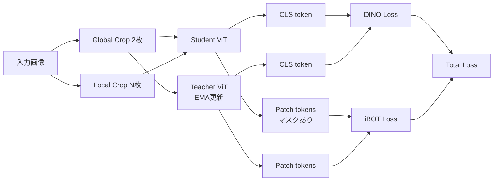

本記事は [DINOv2: Learning Robust Visual Features without Supervision](https://arxiv.org/abs/2304.07193)（Oquab et al., 2023）の解説記事です。

## 論文概要（Abstract）

DINOv2は、Meta AIが2023年に発表した自己教師あり学習フレームワークであり、ラベルなしで汎用的な視覚特徴量を獲得することを目指している。著者らは、既存の自己教師あり手法（DINO損失とiBOT損失）を統合し、142M枚の精選画像データセット（LVD-142M）上で最大1.1Bパラメータの Vision Transformer（ViT-g/14）を学習させた。学習済みモデルからの蒸留により、より小さなモデル（ViT-S/B/L）でも当時のOpenCLIPを上回る性能を達成したと報告されている。

この記事は [Zenn記事: Self-Distillation入門](https://zenn.dev/0h_n0/articles/94e6c079501239) の深掘りです。

## 情報源

- **arXiv ID**: 2304.07193
- **URL**: [https://arxiv.org/abs/2304.07193](https://arxiv.org/abs/2304.07193)
- **著者**: Maxime Oquab, Timothée Darcet, Théo Moutakanni et al.（Meta AI）
- **発表年**: 2023（v2: 2024年2月）
- **分野**: cs.CV
- **コード**: [facebookresearch/dinov2](https://github.com/facebookresearch/dinov2)（Apache 2.0ライセンス）

## 背景と動機（Background & Motivation）

自己教師あり学習（SSL）はNLP分野ではBERTやGPTにより大きな成功を収めたが、コンピュータビジョン分野では同等の「汎用的な基盤特徴量」の確立が遅れていた。従来のSSL手法（DINO, iBOT, MAEなど）は個々のベンチマークでは高精度を達成するものの、画像分類・セマンティックセグメンテーション・深度推定・インスタンス検索といった多様なタスクを単一モデルで横断的にカバーすることは困難であった。

著者らはこの課題に対し、「データの質と量」「学習手法の統合」「モデルスケーリング」の3軸を同時に改善するアプローチを採用している。特に、教師あり学習やテキスト-画像ペア（CLIP系）に頼らず、画像のみから汎用特徴量を獲得する点がDINOv2の設計上の特徴である。

## 主要な貢献（Key Contributions）

- **自動データキュレーションパイプライン**: 12億枚のWeb画像から、ImageNet-22Kなどのキュレート済みデータセットとの類似性に基づき142M枚を自動選別するLVD-142Mパイプラインを構築
- **DINO+iBOT統合学習**: 画像レベルの自己蒸留損失（DINO）とパッチレベルのマスク画像モデリング損失（iBOT）を単一フレームワークで統合
- **学習安定化技術**: KoLeo正則化による特徴量の均一分散化、Sinkhorn-Knopp正規化による教師出力の安定化
- **効率的な蒸留**: ViT-g教師モデルからViT-S/B/Lへの蒸留により、小型モデルでもスクラッチ学習を上回る性能を達成

## 技術的詳細（Technical Details）

### 学習パイプライン全体像

DINOv2の学習パイプラインは、画像レベルの自己蒸留損失（DINO損失）とパッチレベルのマスク画像モデリング損失（iBOT損失）の2つの目的関数を組み合わせている。

### DINO損失（画像レベル自己蒸留）

DINO損失は、生徒ネットワークと教師ネットワークのCLSトークン出力間のクロスエントロピーとして定義される。

$$
\mathcal{L}_{\text{DINO}} = -\sum_{x \in \{x_1^g, x_2^g\}} \sum_{x' \neq x} p_t(x') \log p_s(x)
$$

ここで：
- $x_1^g, x_2^g$: 2つのグローバルクロップ（画像面積の32-100%）
- $p_s$: 生徒ネットワークのsoftmax出力
- $p_t$: 教師ネットワークの出力（Sinkhorn-Knopp正規化適用後）

教師ネットワークのパラメータ $\theta_t$ は、生徒パラメータ $\theta_s$ の指数移動平均（EMA）で更新される。

$$
\theta_t \leftarrow m \cdot \theta_t + (1 - m) \cdot \theta_s
$$

モメンタム係数 $m$ は0.994に設定されている（論文Section 3より）。

### iBOT損失（パッチレベルマスクモデリング）

iBOT損失は、生徒側でランダムにマスクされたパッチトークンの出力と、教師側の対応するパッチトークン出力の間のクロスエントロピーとして定義される。

$$
\mathcal{L}_{\text{iBOT}} = -\sum_{i \in \mathcal{M}} p_t^{(i)} \log p_s^{(i)}
$$

ここで $\mathcal{M}$ はマスクされたパッチのインデックス集合である。DINOv2では、DINO損失とiBOT損失のプロジェクションヘッドを独立に設計している点が、オリジナルのiBOTとの差異である（論文Section 3）。

### KoLeo正則化

Kozachenko-Leonenko微分エントロピー推定量に基づく正則化項であり、バッチ内の特徴量が超球面上で均一に分布するよう促す。

$$
\mathcal{L}_{\text{KoLeo}} = -\frac{1}{n} \sum_{i=1}^{n} \log d_{n,i}
$$

ここで $d_{n,i}$ は、$\ell_2$正規化後の特徴量 $\mathbf{x}_i$ と同一バッチ内の最近傍点との距離である。著者らの報告（論文Table 3a）では、KoLeo正則化の導入によりインスタンス検索（Oxford-Medium）で+8.3%の改善が得られている。

### Sinkhorn-Knopp正規化

教師ネットワークの出力正規化に、DINOのsoftmax centeringに代えてSinkhorn-Knoppアルゴリズム（3イテレーション）を適用している。これはSwAVフレームワークで導入されたバッチ正規化手法であり、プロトタイプ分布の均一化を通じて表現崩壊（collapse）を防止する。

## データキュレーション（LVD-142M）

DINOv2の性能を支える重要な要素が、自動データキュレーションパイプラインである。

### パイプライン構成

1. **ソース収集**: 12億枚のWeb未キュレート画像を収集
2. **重複除去**: コピー検出モデルにより近似重複画像を除去。ベンチマークのtest/validationセットとの重複も除去
3. **自己教師あり検索**: ImageNet-22Kで事前学習済みのViT-H/16でエンベディングを計算し、Faissライブラリ（GPU加速IVF+PQ）を用いてk-NN検索を実行。キュレート済みデータセットに類似する画像を取得
4. **クラスタリング**: K-meansクラスタリングで未キュレートデータを構造化し、各クラスタから均等にサンプリング

著者らによると、20ノードクラスタ（各ノード8×V100-32GB）で48時間以内に全処理が完了する。

## モデルアーキテクチャ

DINOv2はVision Transformer（ViT）をバックボーンとし、4つのモデルサイズを提供している。

| アーキテクチャ | パラメータ数 | パッチサイズ | 埋め込み次元 | ヘッド数 |
|-------------|-----------|-----------|-----------|---------|
| ViT-S/14 | 22M | 14×14 | 384 | 6 |
| ViT-B/14 | 86M | 14×14 | 768 | 12 |
| ViT-L/14 | 300M | 14×14 | 1024 | 16 |
| ViT-g/14 | 1.1B | 14×14 | 1536 | 24 |

ViT-g/14は、Zhai et al.（2022）のオリジナル設計を修正し、埋め込み次元を1408→1536に変更している。これは1536が64の倍数であるため、GPU演算効率が向上するためである（論文Section 3より）。

## 実装のポイント（Implementation）

### 学習の効率化技術

DINOv2では、大規模学習を実現するために以下の実装上の工夫が報告されている。

- **FlashAttention**: カスタム実装により、64の倍数の埋め込み次元で最適化されたAttention計算を実現
- **シーケンスパッキング**: グローバルクロップとローカルクロップの可変長トークン列を連結し、ブロック対角Attentionマスクで系列間のAttentionを遮断。計算量を等価に保ちながらバッチ処理効率を向上
- **確率的深度（Stochastic Depth）最適化**: ドロップされた残差接続の計算をスキップすることで、ドロップ率に比例してメモリ・計算を削減（実験では40%のドロップ率を使用）
- **FSDP（Fully-Sharded Data Parallel）**: 4つのモデルレプリカをGPU間で分散。float16でのブロードキャスト/リダクションとfloat32での重み保持により、DDPと比較して通信コストを約50%削減

### 学習設定

論文で報告されている主要な学習設定は以下のとおりである。

- **ハードウェア**: A100 GPU
- **バッチサイズ**: 3,000サンプル
- **教師モメンタム**: 0.994
- **解像度**: 224×224（学習中）→ 416×416（最終10,000イテレーション）
- **ViT-gの学習時間**: 約22,016 GPU時間

高解像度への段階的切り替え（224→416）により、フル高解像度学習と比較して計算コストを約3分の1に削減している。

## 蒸留手順

ViT-g教師モデルからの蒸留は以下の手順で実施されている。

1. ViT-gの重みを固定し、教師モデルとして使用
2. 生徒モデル（ViT-S/B/L）は教師の出力を模倣するよう学習
3. マスキングと確率的深度を除去し、iBOT損失をグローバルクロップ2枚の両方に適用
4. 生徒のEMA（指数移動平均）モデルを最終モデルとして採用

著者らの報告によれば、蒸留によりViT-L/14はImageNet線形評価で86.3%を達成し、スクラッチ学習の84.5%を+1.8ポイント上回っている（論文Table 4より）。

## 実験結果（Results）

### 主要ベンチマーク

| タスク | データセット | 指標 | ViT-S/14 | ViT-B/14 | ViT-L/14 | ViT-g/14 |
|-------|-----------|------|---------|---------|---------|---------|
| 画像分類 | ImageNet-1K（線形） | Top-1 Acc | 81.1% | 84.5% | 86.3% | 86.5% |
| 画像分類 | ImageNet-1K（k-NN） | Top-1 Acc | 79.0% | 82.1% | 83.5% | 83.5% |
| セグメンテーション | ADE20k（線形） | mIoU | - | - | - | 49.0 |
| セグメンテーション | ADE20k（マルチスケール） | mIoU | - | - | - | 53.0 |
| インスタンス検索 | Oxford-Hard | mAP | - | - | - | 52.3 |
| 深度推定 | NYUd（DPTデコーダ） | RMSE | - | - | - | 0.279 |

※ 上記の数値はDINOv2論文（arXiv:2304.07193）Table 4, 9, 10, 11に基づく。

### ドメイン汎化性能

著者らは、frozen特徴量でのドメインシフトベンチマーク（論文Table 6）で、DINOv2がiBOTを大幅に上回ると報告している。

| データセット | DINOv2 ViT-g | iBOT ViT-L | 差分 |
|-----------|-------------|-----------|------|
| ImageNet-A | 75.9% | 41.5% | +34.4pt |
| ImageNet-R | 78.8% | 51.0% | +27.8pt |
| ImageNet-Sketch | 62.5% | 38.5% | +24.0pt |

### 環境負荷

論文では環境負荷についても言及されており、ViT-gの学習に伴うCO2排出量は3.7 tCO2eq（22,016 GPU時間、A100-40GB、PUE 1.1）と報告されている。プロジェクト全体では0.5k〜1k tCO2eqと見積もられている。

## 実運用への応用（Practical Applications）

DINOv2の特徴量は、ファインチューニングなしで多様なタスクに適用可能であるため、以下の実運用事例が報告されている。

- **医用画像解析**: ラベル付きデータが極めて少ない医用画像領域において、DINOv2のfrozen特徴量による少数ショット学習が有効であるとされている
- **惑星探査ロボット**: NASA JPLが火星探査ロボットの視覚タスクにDINOv2を採用したことが公開されている
- **NVIDIA TAO**: DINOv2-Lを画像エンコーダとして組み込んだセグメンテーションモデルのトレーニング・推論パイプラインが提供されている

モデルの重みはApache 2.0ライセンスで公開されており、PyTorch Hubからの直接ロードに対応している。これにより、プロダクション環境での導入障壁が低い点が実務上の利点である。

## 関連研究（Related Work）

- **DINO**（Caron et al., ICCV 2021）: DINOv2の基盤となる自己蒸留SSL手法。EMAベースの教師-生徒フレームワークを提案
- **iBOT**（Zhou et al., ICLR 2022）: マスク画像モデリングとオンライントークナイザーを組み合わせた手法。DINOv2のパッチレベル損失の基盤
- **MAE**（He et al., CVPR 2022）: マスクオートエンコーダによる自己教師あり学習。再構成ベースのアプローチでDINOv2の対照的アプローチとは相補的
- **OpenCLIP**（Ilharco et al., 2021）: テキスト-画像ペアを用いたコントラスティブ学習。DINOv2はテキスト監視なしでOpenCLIPを上回る性能を達成

## まとめと今後の展望

DINOv2は、データキュレーション（LVD-142M）、学習手法の統合（DINO+iBOT）、学習安定化技術（KoLeo、Sinkhorn-Knopp）の3つの軸を同時に改善することで、ラベルなしの自己教師あり学習から汎用視覚特徴量を獲得するフレームワークを確立した。ViT-g/14はImageNet線形評価86.5%を達成し、frozen特徴量のみでセグメンテーション・深度推定・インスタンス検索にも適用可能であることが示されている。

一方で、LVD-142Mのデータキュレーションパイプラインは内部データセットに依存しており、完全な再現には課題が残る。また、ViT-gの学習には約22,000 GPU時間のA100計算が必要であり、計算資源の制約が大きい。実務的には、公開済みの事前学習済みモデルをfrozen特徴量として使用し、タスク固有の軽量なヘッドのみを学習する方法が現実的である。

後続研究であるDINOv3（2025年）では、Gram Anchoring損失の導入により密な特徴量の安定化が図られ、ImageNet 88.4%（+1.1pt）、ADE20k +6.0 mIoUの改善が報告されている。

## 参考文献

- **arXiv**: [https://arxiv.org/abs/2304.07193](https://arxiv.org/abs/2304.07193)
- **Code**: [https://github.com/facebookresearch/dinov2](https://github.com/facebookresearch/dinov2)
- **Related Zenn article**: [https://zenn.dev/0h_n0/articles/94e6c079501239](https://zenn.dev/0h_n0/articles/94e6c079501239)
- **DINOv3**: [https://arxiv.org/abs/2508.10104](https://arxiv.org/abs/2508.10104)
- **DINO**: [https://arxiv.org/abs/2104.14294](https://arxiv.org/abs/2104.14294)
- **iBOT**: [https://arxiv.org/abs/2111.07832](https://arxiv.org/abs/2111.07832)
