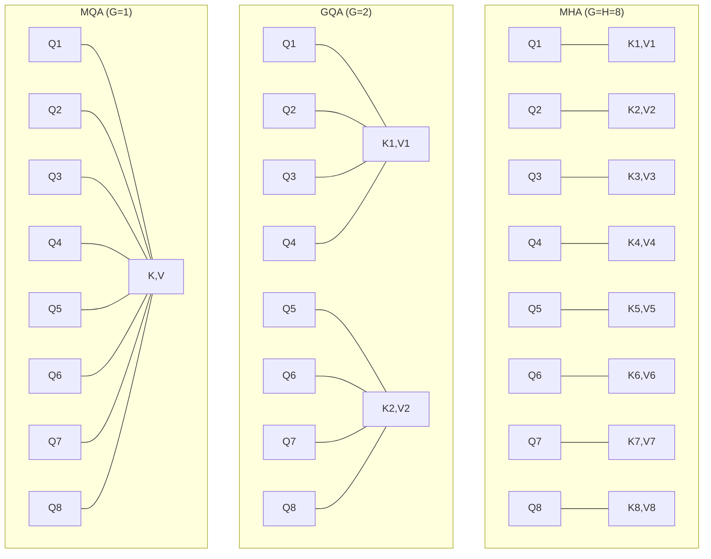

本記事は [GQA: Training Generalized Multi-Query Transformer Models from Multi-Head Checkpoints (arXiv:2305.13245)](https://arxiv.org/abs/2305.13245) の解説記事です。

## 論文概要（Abstract）

Grouped-Query Attention（GQA）は、Multi-Head Attention（MHA）とMulti-Query Attention（MQA）の中間に位置するアテンション設計である。著者らは、複数のQueryヘッドが同一のKey-Valueグループを共有する構造を提案し、既存のMHAチェックポイントからGQAへの変換手法（uptrain）も併せて示している。T5モデルでの実験において、GQAがMHAと同等の品質を維持しつつMQA並みの推論速度を実現したと報告している。現在、Llama 3、Qwen3、Gemma 3、Mistralなど主要なオープンウェイトLLMの大半がGQAを採用しており、事実上の業界標準となっている。

この記事は [Zenn記事: LLM Architecture Gallery徹底解説：30+モデルの内部構造を4軸で横断比較する](https://zenn.dev/0h_n0/articles/72d86ab27620f2) の深掘りです。

## 情報源

- **arXiv ID**: 2305.13245
- **URL**: https://arxiv.org/abs/2305.13245
- **著者**: Joshua Ainslie, James Lee-Thorp, Michiel de Jong, et al.（Google Research）
- **発表年**: 2023
- **分野**: cs.CL

## 背景と動機（Background & Motivation）

Transformerの推論において、KVキャッシュのメモリ消費がボトルネックとなる。MHAでは全$H$ヘッドが独立したKey・Value投射を持つため、1トークンあたり$2 \times H \times d_h$個の値をキャッシュに格納する必要がある。

Shazeer（2019）が提案したMulti-Query Attention（MQA）は、全Queryヘッドが**単一の**Key-Value投射を共有することで、KVキャッシュを$1/H$に削減する。しかし、MQAは品質低下と学習の不安定性が報告されており、大規模モデルでの採用には慎重な判断が必要とされてきた。

著者らは、MHAとMQAの間にGQAという中間設計を提案した。$H$個のQueryヘッドを$G$個のグループに分割し、各グループ内でKey-Valueを共有する。$G=H$ならMHA、$G=1$ならMQAに帰着する。さらに、既存のMHAモデルをGQAに変換するuptrain手法を提案し、追加学習コストを抑えたモデル変換を実現した。

## 主要な貢献（Key Contributions）

- **Grouped-Query Attention（GQA）**: MHAとMQAの連続的な中間設計。KVグループ数$G$でメモリと品質のトレードオフを柔軟に制御可能
- **Uptrain手法**: MHAチェックポイントからGQA/MQAへの変換手法。元の学習量の約5%の追加学習で変換が完了
- **品質・速度の実証**: T5 Large/XXLでの実験において、GQAがMHA品質を維持しつつMQA速度を達成することを実証（論文Table 2より）

## 技術的詳細（Technical Details）

### MHA・MQA・GQAの関係

3方式の関係を数式で表す。入力$\mathbf{x} \in \mathbb{R}^d$に対して、Queryは全方式で共通の構造を持つ。

$$
\mathbf{q}^{(i)} = W_Q^{(i)} \mathbf{x}, \quad i = 1, \ldots, H
$$

Key-Valueの投射方法が異なる。

**MHA**（$G = H$）:

$$
\mathbf{k}^{(i)} = W_K^{(i)} \mathbf{x}, \quad \mathbf{v}^{(i)} = W_V^{(i)} \mathbf{x}, \quad i = 1, \ldots, H
$$

各ヘッドが独立したKV投射を持つ。KVキャッシュ: $2 \times H \times d_h$ 値/トークン。

**MQA**（$G = 1$）:

$$
\mathbf{k} = W_K \mathbf{x}, \quad \mathbf{v} = W_V \mathbf{x}
$$

全ヘッドが単一のKV投射を共有。KVキャッシュ: $2 \times d_h$ 値/トークン。

**GQA**（$1 < G < H$）:

$$
\mathbf{k}^{(g)} = W_K^{(g)} \mathbf{x}, \quad \mathbf{v}^{(g)} = W_V^{(g)} \mathbf{x}, \quad g = 1, \ldots, G
$$

$H/G$個のQueryヘッドがグループ$g$のKVを共有。KVキャッシュ: $2 \times G \times d_h$ 値/トークン。



### KVキャッシュ削減率

KVキャッシュの削減率はグループ数$G$とヘッド数$H$の比で決まる。

$$
\text{KVキャッシュ削減率} = 1 - \frac{G}{H}
$$

| 構成 | $H$ | $G$ | KV削減率 | 採用モデル例 |
|------|-----|-----|----------|-------------|
| MHA | 32 | 32 | 0% | GPT-2 XL, OLMo 2 |
| GQA-8 | 32 | 8 | 75% | Llama 3 (8B) |
| GQA-8 | 64 | 8 | 87.5% | Llama 3 (70B) |
| GQA-1 (=MQA) | 32 | 1 | 96.875% | — |

Llama 3（8B）は32ヘッドに対して8KVグループ（4:1比）で75%削減、Llama 3（70B）は64ヘッドに対して8KVグループ（8:1比）で87.5%削減を実現している。

### Uptrain: MHAからGQAへの変換

著者らは、既存のMHAチェックポイントからGQAに変換するuptrain手法を提案している。

**変換手順**:

1. **KVヘッドのグループ化**: MHAの$H$個のKVヘッドを$G$グループに分割
2. **平均プーリング**: 各グループ内のKV重みを平均して初期値とする

$$
W_K^{(g)} = \frac{1}{|G_g|} \sum_{i \in G_g} W_K^{(i)}, \quad W_V^{(g)} = \frac{1}{|G_g|} \sum_{i \in G_g} W_V^{(i)}
$$

3. **追加学習**: 元の学習量の約5%（$\alpha$比率）で追加学習

```python
# MHAからGQAへの重み変換の概念的な実装
import torch
import torch.nn as nn

def convert_mha_to_gqa(
    mha_k_weight: torch.Tensor,
    mha_v_weight: torch.Tensor,
    n_heads: int,
    n_kv_groups: int,
) -> tuple[torch.Tensor, torch.Tensor]:
    """MHAのKV重みをGQA用に変換（平均プーリング）

    Args:
        mha_k_weight: MHAのKey投射重み (n_heads * d_h, d_model)
        mha_v_weight: MHAのValue投射重み (n_heads * d_h, d_model)
        n_heads: MHAのヘッド数
        n_kv_groups: GQAのKVグループ数
    Returns:
        gqa_k_weight: GQAのKey投射重み (n_kv_groups * d_h, d_model)
        gqa_v_weight: GQAのValue投射重み (n_kv_groups * d_h, d_model)
    """
    d_h = mha_k_weight.shape[0] // n_heads
    heads_per_group = n_heads // n_kv_groups

    # (n_heads, d_h, d_model) にreshape
    k_heads = mha_k_weight.view(n_heads, d_h, -1)
    v_heads = mha_v_weight.view(n_heads, d_h, -1)

    # グループごとに平均
    k_groups = k_heads.view(n_kv_groups, heads_per_group, d_h, -1).mean(dim=1)
    v_groups = v_heads.view(n_kv_groups, heads_per_group, d_h, -1).mean(dim=1)

    # (n_kv_groups * d_h, d_model) にreshape
    gqa_k_weight = k_groups.view(n_kv_groups * d_h, -1)
    gqa_v_weight = v_groups.view(n_kv_groups * d_h, -1)

    return gqa_k_weight, gqa_v_weight
```

**Uptrain手法の利点**: 既存のMHAモデルを再学習なしでGQAに変換できるため、大規模モデルの推論効率化に実用的である。著者らは、5%の追加学習でMHA品質の98%以上を回復できると報告している（論文Table 3）。

### PyTorchでのGQA実装

PyTorch 2.0以降では`torch.nn.functional.scaled_dot_product_attention`（SDPA）がGQAをネイティブサポートしている。

```python
import torch
import torch.nn as nn
import torch.nn.functional as F

class GroupedQueryAttention(nn.Module):
    """Grouped-Query Attention

    Args:
        d_model: モデル次元
        n_heads: Queryヘッド数
        n_kv_groups: Key-Valueグループ数
    """
    def __init__(self, d_model: int, n_heads: int, n_kv_groups: int):
        super().__init__()
        assert n_heads % n_kv_groups == 0
        self.n_heads = n_heads
        self.n_kv_groups = n_kv_groups
        self.head_dim = d_model // n_heads
        self.heads_per_group = n_heads // n_kv_groups

        self.q_proj = nn.Linear(d_model, n_heads * self.head_dim, bias=False)
        self.k_proj = nn.Linear(d_model, n_kv_groups * self.head_dim, bias=False)
        self.v_proj = nn.Linear(d_model, n_kv_groups * self.head_dim, bias=False)
        self.o_proj = nn.Linear(n_heads * self.head_dim, d_model, bias=False)

    def forward(self, x: torch.Tensor) -> torch.Tensor:
        """GQAの順伝播

        Args:
            x: 入力テンソル (B, T, d_model)
        Returns:
            出力テンソル (B, T, d_model)
        """
        B, T, _ = x.shape

        q = self.q_proj(x).view(B, T, self.n_heads, self.head_dim).transpose(1, 2)
        k = self.k_proj(x).view(B, T, self.n_kv_groups, self.head_dim).transpose(1, 2)
        v = self.v_proj(x).view(B, T, self.n_kv_groups, self.head_dim).transpose(1, 2)

        # KVグループをQueryヘッド数に合わせてexpand
        # (B, G, T, d_h) -> (B, G, 1, T, d_h) -> (B, G, R, T, d_h) -> (B, H, T, d_h)
        k = k.unsqueeze(2).expand(-1, -1, self.heads_per_group, -1, -1)
        k = k.reshape(B, self.n_heads, T, self.head_dim)
        v = v.unsqueeze(2).expand(-1, -1, self.heads_per_group, -1, -1)
        v = v.reshape(B, self.n_heads, T, self.head_dim)

        # SDPA (FlashAttention互換)
        attn = F.scaled_dot_product_attention(q, k, v, is_causal=True)

        attn = attn.transpose(1, 2).contiguous().view(B, T, -1)
        return self.o_proj(attn)
```

## 実装のポイント（Implementation）

**グループ数$G$の選択**: 論文のアブレーション実験（Section 4）によると、$G = H/4$〜$H/8$程度が品質とメモリのバランスが良い。Llama 3は$G = 8$を採用している。$G$は$H$の約数である必要がある。

**FlashAttentionとの互換性**: GQAはFlashAttention 2/3とネイティブ互換であり、カーネル改修なしで使用可能。`repeat_interleave`または`expand`によるKV展開はメモリコピーを伴わない（viewベースの実装の場合）。

**KVキャッシュの実装**: vLLM等の推論エンジンでは、GQAのKVキャッシュは$G$グループ分のみ格納される。PagedAttentionとの組み合わせで、メモリフラグメンテーションも最小化される。

**注意点**: $G$を小さくしすぎると（特に$G=1$のMQA）、長コンテキストでの検索精度が低下する場合がある。論文ではT5 XXLでMQA（$G=1$）がMHA比でROUGEスコアが0.3ポイント低下したと報告されている。

## 実験結果（Results）

論文Table 2より、T5 XXL（11Bパラメータ）でのベンチマーク結果を示す。

| 方式 | ROUGE-1 | ROUGE-2 | 推論速度 (tokens/s) | KVキャッシュ |
|------|---------|---------|-------------------|-----------|
| MHA | 42.1 | 19.8 | 1.0x（ベースライン） | 100% |
| MQA（uptrained） | 41.8 | 19.5 | 1.8x | 3.1% |
| **GQA-8（uptrained）** | **42.0** | **19.7** | **1.7x** | **25%** |

著者らは、GQA-8がMHAと統計的に同等のROUGEスコアを維持しつつ、推論速度をMQA並みの1.7倍に向上させたと報告している。KVキャッシュは75%削減されている。

**Uptrainのコスト**: 元の学習量の5%の追加学習で、MHA品質の98%以上を回復。完全なスクラッチ学習と比較して大幅なコスト削減である。

## 実運用への応用（Practical Applications）

**標準的なLLM推論**: GQAは現在のLLMの事実上の標準であるため、vLLM、TensorRT-LLM、SGLang等の推論エンジンで広くサポートされている。特別な実装なしに利用可能。

**既存モデルの効率化**: Uptrainにより、MHAで学習済みのモデルをGQAに変換して推論効率を改善できる。再学習コストは元の5%程度。

**コンテキスト長の拡張**: KVキャッシュ削減により、同一VRAM上でより長いコンテキストを処理可能。Llama 3（8B）の場合、GQA-8により128Kトークンのコンテキストが24GB VRAM（A10G等）に収まる。

## 関連研究（Related Work）

- **Multi-Query Attention（Shazeer, 2019）**: 全ヘッドで単一KVを共有する方式。GQAの$G=1$に相当する極端なケース。品質低下のリスクがあるが最もメモリ効率が高い
- **Multi-Head Latent Attention（MLA, DeepSeek-V2, 2024）**: GQAのヘッド方向共有に加え、次元方向の圧縮を追加。KVキャッシュをGQAよりさらに削減するが実装が複雑
- **FlashAttention（Dao et al., 2022）**: IO-Awareなアテンション計算のカーネル最適化。GQAとネイティブ互換であり、両者の組み合わせが現在の推論最適化の標準
- **PagedAttention（vLLM, Kwon et al., 2023）**: KVキャッシュのメモリ管理最適化。GQAの少ないKVキャッシュと組み合わせることで、バッチ推論のメモリ効率がさらに向上

## まとめと今後の展望

GQAは、MHAとMQAの中間設計として、品質と推論効率のバランスを柔軟に制御可能なアテンション方式である。2023年の提案以降、Llama 3、Qwen3、Gemma 3など主要なオープンウェイトLLMに広く採用され、事実上の業界標準となった。

実務への示唆として、新規モデルの設計ではGQAを第一選択とし、$G = H/4$〜$H/8$を出発点とするのが合理的である。既存のMHAモデルがある場合はuptrain手法で変換が可能である。一方、KVキャッシュをさらに削減する必要がある場合は、DeepSeek-V2のMLA等のより高度な手法を検討することになる。

## 参考文献

- **arXiv**: https://arxiv.org/abs/2305.13245
- **Related Zenn article**: https://zenn.dev/0h_n0/articles/72d86ab27620f2
