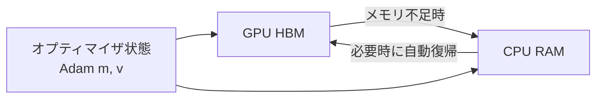

本記事は [arXiv:2305.14314 "QLoRA: Efficient Finetuning of Quantized Large Language Models"](https://arxiv.org/abs/2305.14314) の解説記事です。

## 論文概要（Abstract）

Dettmers et al.は、凍結された4bit量子化言語モデルに対してLoRA（Low-Rank Adapter）の勾配を逆伝播するQLoRAを提案した。著者らの報告では、QLoRAは65Bパラメータモデルを単一48GB GPUでファインチューニングしつつ、16bitフルファインチューニングと同等のタスク性能を維持する。QLoRAの3つの技術的革新として、(a) 正規分布に対して情報理論的に最適な4bit NormalFloat（NF4）データ型、(b) 量子化定数自体を量子化するダブル量子化、(c) メモリスパイクを管理するページドオプティマイザが導入された。著者らが訓練したGuanaco-65Bモデルは、Vicunaベンチマークにおいて ChatGPTの性能レベルの99.3%を達成したと報告されている。

この記事は [Zenn記事: LLM面接対策2026 Transformer・RAG・推論最適化の技術知識50問](https://zenn.dev/0h_n0/articles/07ff6e1a7fc13b) の深掘りです。

## 情報源

- **arXiv ID**: 2305.14314
- **URL**: [https://arxiv.org/abs/2305.14314](https://arxiv.org/abs/2305.14314)
- **著者**: Tim Dettmers, Artidoro Pagnoni, Ari Holtzman, Luke Zettlemoyer（University of Washington）
- **発表年**: 2023（NeurIPS 2023採択）
- **分野**: cs.LG

## 背景と動機（Background & Motivation）

大規模言語モデルのファインチューニングは膨大なGPUメモリを必要とする。例えば、65Bパラメータモデルを16bit精度でフルファインチューニングするには780GB以上のGPUメモリが必要であり、A100-80GBを10枚以上要する。

LoRA（Hu et al., 2021）は低ランクアダプタにより学習パラメータ数を削減する手法であるが、ベースモデル自体はFP16/BF16でメモリに保持する必要がある。一方、GPTQ（Frantar et al., 2022）は推論時の量子化手法であり、量子化モデルでの学習（勾配逆伝播）は想定していない。QLoRAは、量子化されたモデルを通じてLoRAの勾配を逆伝播することで、両者の利点を統合した。

## 主要な貢献（Key Contributions）

- **NF4（4-bit NormalFloat）**: 正規分布する重みに対して情報理論的に最適な4bitデータ型
- **ダブル量子化（Double Quantization）**: 量子化定数自体を8bitに再量子化し、メモリオーバーヘッドを削減
- **ページドオプティマイザ**: NVIDIAの統合メモリ機能を利用し、メモリスパイク時にオプティマイザ状態をGPU-CPU間で自動転送
- **Guanacoモデルファミリー**: QLoRAで訓練したLLaMAベースモデル群（7B〜65B）

## 技術的詳細（Technical Details）

### NF4データ型

モデルの重みは事前学習後に近似的に正規分布する。INT4やFP4は均一間隔のbin配置を行うため、正規分布の密度が高い中心部分の精度が不十分になる。NF4は**分位点量子化**（quantile quantization）を適用し、各binが等確率となるよう配置する。

NF4の量子化レベルは標準正規分布の分位関数 $Q_X$ から決定される（論文Section 3.1より）：

$$
q_i = \frac{1}{2}\left(Q_X\left(\frac{i-1}{2^k - 1}\right) + Q_X\left(\frac{i}{2^k - 1}\right)\right), \quad k = 4
$$

ここで $Q_X$ は標準正規分布の分位関数（逆累積分布関数）。これにより得られる16個の量子化レベルは：

```
[-1.0, -0.6962, -0.5251, -0.3949, -0.2844, -0.1848, -0.0911, 0.0,
  0.0796,  0.1609,  0.2461,  0.3379,  0.4407,  0.5626,  0.7229, 1.0]
```

各量子化レベルの間隔が中心付近で狭く（密度が高い）、端で広くなっているのは、正規分布の特性に最適化されているためである。

### ダブル量子化

標準的なブロック単位量子化では、ブロックサイズ $B = 64$ 、スケール用FP32（32bit）として、1パラメータあたりの量子化定数オーバーヘッドは：

$$
\text{overhead} = \frac{32}{B} = \frac{32}{64} = 0.5 \text{ bits/param}
$$

ダブル量子化では、このスケール値自体をFP8で再量子化する。ブロックサイズ256のスーパーブロックでスケールを管理することで：

$$
\text{overhead}_{\text{DQ}} = \frac{8}{64} + \frac{32}{64 \times 256} \approx 0.127 \text{ bits/param}
$$

これにより量子化定数のオーバーヘッドが**0.5 → 0.127 bits/param**に削減される。

### ページドオプティマイザ

勾配チェックポインティングやミニバッチの勾配蓄積時に、GPUメモリの一時的なスパイクが発生する。ページドオプティマイザはNVIDIAの統合メモリ（Unified Memory）を利用し、GPU↔CPU間のデータ転送を自動管理する：



### QLoRAの学習アーキテクチャ

QLoRAの学習手順は以下の通り：

1. 事前学習済みモデルを4bit NF4に量子化（凍結）
2. **全ての線形層**にLoRAアダプタを追加（Q, K, V, O, MLP全て）
3. 量子化モデルを通じてLoRAアダプタへ勾配を逆伝播
4. LoRAアダプタのみを更新（BF16/FP32精度）

```python
from peft import LoraConfig, get_peft_model
from transformers import AutoModelForCausalLM, BitsAndBytesConfig

# 4bit量子化設定（NF4 + ダブル量子化）
bnb_config = BitsAndBytesConfig(
    load_in_4bit=True,
    bnb_4bit_quant_type="nf4",             # NF4データ型
    bnb_4bit_use_double_quant=True,         # ダブル量子化有効
    bnb_4bit_compute_dtype=torch.bfloat16,  # 計算はBF16
)

# モデルを4bit NF4でロード
model = AutoModelForCausalLM.from_pretrained(
    "meta-llama/Llama-3.1-8B",
    quantization_config=bnb_config,
    device_map="auto",
)

# LoRA設定（全線形層に適用）
lora_config = LoraConfig(
    r=64,                                   # ランク64
    lora_alpha=16,                          # alpha/r = 0.25
    target_modules="all-linear",            # 全線形層に適用
    lora_dropout=0.05,
    task_type="CAUSAL_LM",
)

model = get_peft_model(model, lora_config)
model.print_trainable_parameters()
# 出力例: trainable params: ~0.08% of total
```

**メモリ使用量の計算（65Bモデル）**:

| コンポーネント | メモリ使用量 |
|------------|-----------|
| 4bit量子化モデル | 65B × 4bit ÷ 8 ≈ 32.5 GB |
| LoRAアダプタ (rank 64) | ~1 GB |
| Adamオプティマイザ状態 | ~1 GB |
| アクティベーション | ~2 GB |
| **合計** | **~37 GB（A100-48GBに収まる）** |

### LoRA適用先の重要性

著者らの実験（論文Table 5付近）では、LoRAの適用先が性能に大きく影響することが報告されている：

- **Attention層のみ（Q, V）**: 標準的なLoRAの設定だが、QLoRAではサブオプティマル
- **全線形層（Q, K, V, O, MLP）**: QLoRAで最良の性能。フルファインチューニングに匹敵

## 実験結果（Results）

### Vicunaベンチマーク（GPT-4評価、論文Table 1より）

| モデル | ChatGPT対比性能 | 学習時間（1 GPU） |
|-------|---------------|------------------|
| Guanaco-65B | 99.3% | 24時間 |
| Guanaco-33B | 97.8% | 14時間 |
| Guanaco-13B | 91.7% | 8時間 |
| Guanaco-7B | 87.4% | 5時間 |

### NF4 vs FP4 vs INT4（論文Table 3相当）

MMLUベンチマークでの比較において、著者らは以下を報告している：
- **NF4**: 全モデルサイズで最良の性能
- **FP4**: NF4よりわずかに劣る
- **INT4**: 大規模モデルで性能低下が顕著
- **NF4 + ダブル量子化**: NF4単体と実質同等の性能（メモリ削減のデメリットなし）

### メモリ効率

- 65Bモデル16bit: 780 GB → QLoRA: **~48 GB**（**16倍の削減**）
- 7Bモデル: QLoRA で ~4 GB（RTX 3090で実行可能）

### データ品質 vs データ量（論文Section 5より）

著者らの分析では、ファインチューニングデータの品質と量について以下の傾向が報告されている：
- **OASST1**（9,846件、高品質人手作成）: チャットボット評価で最良
- **FLAN-v2**（100万件以上、合成）: MMLUスコアで最良
- **自己指示データセット**（Alpaca等）: 中間的な性能

## 実装のポイント（Implementation）

実践上の注意点：

1. **LoRAランク $r$**: 著者らは $r = 64$ を使用。$r = 16$ でも多くのタスクで十分だが、複雑なタスクでは64以上が有効
2. **学習率**: 2e-4（通常のファインチューニングより高め。量子化による勾配ノイズを補償するため）
3. **学習速度のオーバーヘッド**: 非量子化LoRAと比較して30-50%程度遅くなる（デクォンタイズ処理のため）
4. **全線形層への適用**: QLoRAの性能を最大化するにはAttention層だけでなくMLP層にもLoRAを適用することが重要

## Production Deployment Guide

### AWS実装パターン（コスト最適化重視）

QLoRAファインチューニング用のAWS構成：

| 規模 | 対象モデル | 推奨構成 | 月額コスト | GPU |
|------|----------|---------|-----------|-----|
| **Small** | 7-13B | 単一GPU | $200-400 | g5.xlarge (A10G 24GB) |
| **Medium** | 33-70B | 単一大型GPU | $800-1,500 | p4d.24xlarge (A100 80GB) |
| **Large** | 70B+ multi | マルチGPU | $3,000-6,000 | p4d.24xlarge × 2 |

**コスト試算の注意事項**: 上記は2026年3月時点のAWS ap-northeast-1（東京）リージョンのSpot Instance料金に基づく概算値です。

### Terraformインフラコード

```hcl
# QLoRAファインチューニング用 EC2 Spot Instance
resource "aws_spot_instance_request" "qlora_training" {
  ami                    = "ami-xxxxxxxxx"  # Deep Learning AMI (Ubuntu)
  instance_type          = "g5.xlarge"       # A10G 24GB
  spot_price             = "0.60"            # Spot上限価格
  wait_for_fulfillment   = true

  root_block_device {
    volume_size = 200  # モデル + データ用
    volume_type = "gp3"
  }

  tags = {
    Name = "qlora-finetune"
  }
}

resource "aws_s3_bucket" "model_artifacts" {
  bucket = "qlora-model-artifacts"

  server_side_encryption_configuration {
    rule {
      apply_server_side_encryption_by_default {
        sse_algorithm = "aws:kms"
      }
    }
  }
}
```

### コスト最適化チェックリスト

- [ ] Spot Instances使用（最大90%削減）
- [ ] QLoRA 4bit量子化でGPU要件を最小化（65B → 1× A100で十分）
- [ ] S3へのモデルアーティファクト保存（KMS暗号化）
- [ ] 学習完了後のインスタンス自動停止
- [ ] CloudWatch で学習メトリクスを監視

## 関連研究（Related Work）

- **LoRA** (Hu et al., 2021): 低ランクアダプタによるパラメータ効率的ファインチューニングの原論文。QLoRAはLoRAを量子化モデルに拡張
- **GPTQ** (Frantar et al., 2022): ヘッセ行列の近似を用いたPost-Training Quantization。QLoRAは推論だけでなく学習にも量子化を適用
- **LLM.int8()** (Dettmers et al., 2022): 8bit推論の手法。同著者グループによるQLoRAは4bitでの学習まで拡張

## まとめと今後の展望

QLoRAは、NF4量子化・ダブル量子化・ページドオプティマイザの3つの技術革新により、65Bパラメータモデルを単一48GB GPU上でファインチューニング可能にした。著者らの報告では、Guanaco-65BがVicunaベンチマークでChatGPTの99.3%の性能を達成し、16bitフルファインチューニングとの性能差はほぼないとされている。

QLoRAの登場により、大規模モデルのファインチューニングが消費者向けGPU（RTX 3090/4090）でも実行可能となり、LLMの民主化に大きく貢献した。後続研究として、DoRA（重みの大きさと方向を分離）、LongLoRA（長コンテキスト対応）、LoRA+（学習率の行列別調整）など、LoRA系手法の改良が活発に進められている。

## 参考文献

- **arXiv**: [https://arxiv.org/abs/2305.14314](https://arxiv.org/abs/2305.14314)
- **Code**: [https://github.com/artidoro/qlora](https://github.com/artidoro/qlora)
- **Related Zenn article**: [https://zenn.dev/0h_n0/articles/07ff6e1a7fc13b](https://zenn.dev/0h_n0/articles/07ff6e1a7fc13b)
