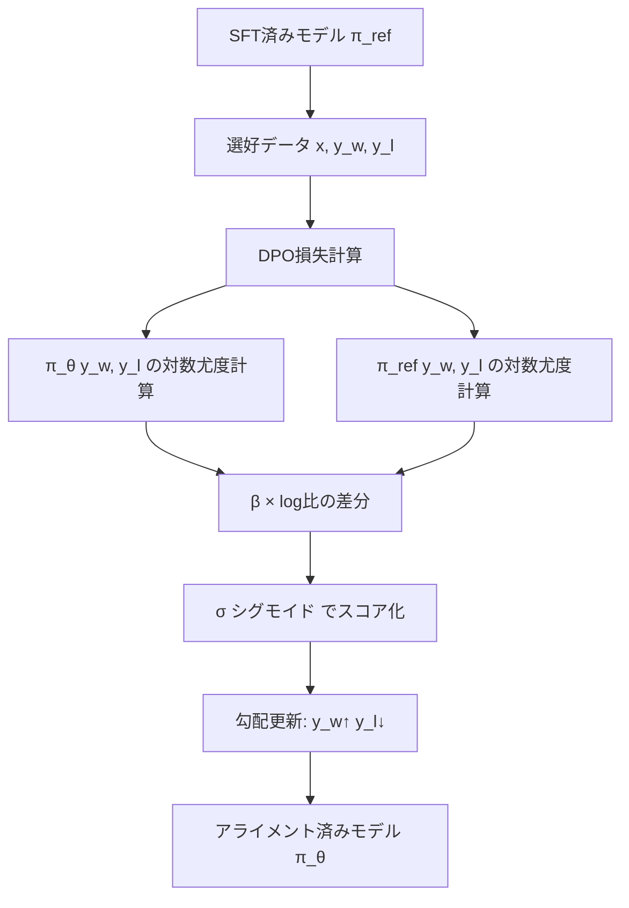

本記事は [arXiv:2305.18290 "Direct Preference Optimization: Your Language Model is Secretly a Reward Model"](https://arxiv.org/abs/2305.18290) の解説記事です。

## 論文概要（Abstract）

大規模言語モデルのアライメントにおいて、RLHF（Reinforcement Learning from Human Feedback）は報酬モデルの学習とPPO（Proximal Policy Optimization）による強化学習の2段階を必要とし、計算コストが高く学習が不安定になりやすい。Rafailov et al.は、RLHF目的関数の最適方策が閉形式で表現できることを示し、報酬モデルやRL学習ループを必要としない**Direct Preference Optimization（DPO）**を提案した。著者らの実験では、DPOは感情制御生成・要約・対話タスクにおいてPPOベースのRLHFと同等以上の性能を達成し、学習時間は約3分の1であったと報告されている。

この記事は [Zenn記事: LLM面接対策2026 Transformer・RAG・推論最適化の技術知識50問](https://zenn.dev/0h_n0/articles/07ff6e1a7fc13b) の深掘りです。

## 情報源

- **arXiv ID**: 2305.18290
- **URL**: [https://arxiv.org/abs/2305.18290](https://arxiv.org/abs/2305.18290)
- **著者**: Rafael Rafailov, Archit Sharma, Eric Mitchell, Christopher D. Manning, Stefano Ermon, Chelsea Finn（Stanford University）
- **発表年**: 2023（NeurIPS 2023採択）
- **分野**: cs.LG

## 背景と動機（Background & Motivation）

LLMを人間の意図に沿った出力に調整する「アライメント」は、安全性と有用性の両立に不可欠なプロセスである。2023年時点で標準的なアライメント手法であったRLHFは以下の3段階で構成されていた：

1. **SFT（Supervised Fine-Tuning）**: 指示-応答ペアで教師あり学習
2. **報酬モデル学習**: 人間の選好データで報酬関数 $r(x, y)$ を訓練
3. **PPO最適化**: 報酬モデルのフィードバックで方策 $\pi_\theta$ を強化学習

この3段階パイプラインには以下の課題がある：
- 報酬モデルの学習に別途データとGPUメモリが必要
- PPOは学習が不安定で、ハイパーパラメータ調整が困難
- 方策、参照モデル、報酬モデル、価値関数の4モデルを同時にメモリに保持する必要がある

## 主要な貢献（Key Contributions）

- **閉形式最適方策の導出**: RLHF目的関数の最適方策を参照モデルと報酬関数で陽に表現
- **DPO損失関数**: 報酬モデルを介さず、選好データから直接方策を最適化する分類損失の導出
- **暗黙的報酬モデル**: 学習済み方策自体が報酬モデルとして機能することの理論的証明
- **実験的検証**: 感情制御・要約・対話の3タスクでPPOと同等以上の性能達成

## 技術的詳細（Technical Details）

### RLHF目的関数からDPOへの導出

RLHFの目的関数は、報酬の最大化とKLダイバージェンス正則化のバランスである：

$$
\max_{\pi} \mathbb{E}_{x \sim \mathcal{D},\, y \sim \pi(y|x)} \left[ r(x, y) \right] - \beta \, D_{\text{KL}} \left[ \pi(y|x) \| \pi_{\text{ref}}(y|x) \right]
$$

ここで、
- $\pi$: 最適化対象の方策（LLM）
- $\pi_{\text{ref}}$: 参照方策（SFT済みモデル、凍結）
- $r(x, y)$: 報酬関数
- $\beta$: KLペナルティ係数（参照モデルからの乖離を制御）
- $\mathcal{D}$: プロンプトの分布

この目的関数の最適方策は閉形式で以下のように求まる（著者らの導出による）：

$$
\pi^*(y|x) = \frac{1}{Z(x)} \pi_{\text{ref}}(y|x) \exp\left(\frac{1}{\beta} r(x, y)\right)
$$

ここで $Z(x) = \sum_y \pi_{\text{ref}}(y|x) \exp\left(\frac{1}{\beta} r(x, y)\right)$ は正規化定数（分配関数）である。

### 報酬関数の再パラメータ化

上式を報酬関数について整理すると：

$$
r(x, y) = \beta \log \frac{\pi^*(y|x)}{\pi_{\text{ref}}(y|x)} + \beta \log Z(x)
$$

これをBradley-Terryモデル $p^*(y_1 \succ y_2 | x) = \sigma(r(x, y_1) - r(x, y_2))$ に代入すると、**分配関数 $Z(x)$ がキャンセルされる**：

$$
p^*(y_w \succ y_l | x) = \sigma\left(\beta \log \frac{\pi^*(y_w|x)}{\pi_{\text{ref}}(y_w|x)} - \beta \log \frac{\pi^*(y_l|x)}{\pi_{\text{ref}}(y_l|x)}\right)
$$

### DPO損失関数

最終的なDPO損失関数は以下の通り：

$$
\mathcal{L}_{\text{DPO}}(\pi_\theta; \pi_{\text{ref}}) = -\mathbb{E}_{(x, y_w, y_l) \sim \mathcal{D}} \left[ \log \sigma\left(\beta \log \frac{\pi_\theta(y_w|x)}{\pi_{\text{ref}}(y_w|x)} - \beta \log \frac{\pi_\theta(y_l|x)}{\pi_{\text{ref}}(y_l|x)}\right) \right]
$$

ここで、
- $y_w$: 選好された（勝利）応答
- $y_l$: 非選好の（敗北）応答
- $\sigma$: シグモイド関数

### DPO勾配の直感的解釈

DPO損失関数の勾配は以下のように分解される（論文Section 5より）：

$$
\nabla_\theta \mathcal{L}_{\text{DPO}} = -\beta \, \mathbb{E} \left[ \underbrace{\sigma(\hat{r}_\theta(x, y_l) - \hat{r}_\theta(x, y_w))}_{\text{モデルが間違っている度合い}} \cdot \underbrace{\left[ \nabla_\theta \log \pi_\theta(y_w|x) - \nabla_\theta \log \pi_\theta(y_l|x) \right]}_{\text{$y_w$の尤度を上げ、$y_l$を下げる}} \right]
$$

暗黙的報酬 $\hat{r}_\theta(x, y) = \beta \log \frac{\pi_\theta(y|x)}{\pi_{\text{ref}}(y|x)}$ がモデル自身から計算される。モデルが $y_l$ を $y_w$ より高く評価している場合（つまり間違っている場合）、勾配の重みが大きくなり、強く修正される。



### 実装例

```python
import torch
import torch.nn.functional as F

def dpo_loss(
    policy_chosen_logps: torch.Tensor,
    policy_rejected_logps: torch.Tensor,
    reference_chosen_logps: torch.Tensor,
    reference_rejected_logps: torch.Tensor,
    beta: float = 0.1,
) -> torch.Tensor:
    """DPO損失関数の実装

    Args:
        policy_chosen_logps: π_θ(y_w|x) の対数確率
        policy_rejected_logps: π_θ(y_l|x) の対数確率
        reference_chosen_logps: π_ref(y_w|x) の対数確率
        reference_rejected_logps: π_ref(y_l|x) の対数確率
        beta: KLペナルティ係数（大きいほど参照モデルに近い出力を維持）

    Returns:
        DPO損失値（スカラー）
    """
    # 暗黙的報酬の差分を計算
    chosen_rewards = beta * (policy_chosen_logps - reference_chosen_logps)
    rejected_rewards = beta * (policy_rejected_logps - reference_rejected_logps)

    # Bradley-Terry モデルに基づく分類損失
    logits = chosen_rewards - rejected_rewards
    loss = -F.logsigmoid(logits).mean()

    return loss
```

## 実験結果（Results）

著者らは3つのタスクで評価を行っている。

**感情制御生成（IMDb、論文Table 1相当）**:
- KL=5での勝率: DPO約60% vs PPO約52%
- DPOはPPOと同一KL予算でより高い勝率を達成

**要約タスク（TL;DR、論文Section 6より）**:
- GPT-4評価による勝率: DPO 61% vs PPO 57%
- 学習時間: DPOはPPOの約3分の1

**対話タスク（Anthropic HH、論文Section 6より）**:
- GPT-4評価による勝率: DPO 62% vs PPO 58%

**スケーリング（GPT-2 124M〜2.8B）**:
- 著者らの報告では、モデルサイズに対して一貫してDPOがSFTおよびPPOを上回る

## 実運用への応用（Practical Applications）

DPOは2026年時点でLLMアライメントの主要手法の一つとなっている。実務上の活用ポイント：

- **簡素な実装**: PPOループが不要で、教師あり学習と同じフレームワーク（SFTと同一のTrainerで実装可能）で学習可能
- **メモリ効率**: 報酬モデルと価値関数が不要なため、2モデル（方策+参照）のみで学習可能
- **ハイパーパラメータ**: $\beta$ が主要なハイパーパラメータ。論文では $\beta = 0.1$ を使用。$\beta$ が大きいほど参照モデルに近い保守的な出力を維持する
- **派生手法**: KTO（ペアデータ不要）、ORPO（参照モデル不要）、SimPO（参照モデル不要+シンプル化）など、DPOの課題を解決する後続手法が多数提案されている

## 関連研究（Related Work）

- **InstructGPT** (Ouyang et al., 2022): PPOベースのRLHFでGPT-3をアライメント。DPOはこのRLHFパイプラインを簡素化した代替手法
- **Constitutional AI** (Bai et al., 2022): AI自身のフィードバック（RLAIF）を使用。DPOは人間の選好データを直接使用するアプローチ
- **SLiC** (Zhao et al., 2023): マージンベースの対照損失によるアライメント。著者らの実験では全タスクでDPOがSLiCを上回ったと報告されている

## まとめと今後の展望

DPOは、RLHF目的関数の最適方策が閉形式で表現できるという理論的洞察に基づき、報酬モデルやRL学習ループを排除した効率的なアライメント手法である。著者らの報告では、要約・対話・感情制御の各タスクでPPOベースのRLHFと同等以上の性能を達成しつつ、学習時間を約3分の1に短縮している。

一方で、DPOにはペアの選好データが必要である点、分布シフトの問題、オンラインデータ収集の柔軟性でRLHFに劣る点などの制約がある。これらの制約を解決するKTO（ペアデータ不要）、ORPO（参照モデル不要）、SimPO（より安定した学習）などの後続手法が活発に研究されている。

## 参考文献

- **arXiv**: [https://arxiv.org/abs/2305.18290](https://arxiv.org/abs/2305.18290)
- **Related Zenn article**: [https://zenn.dev/0h_n0/articles/07ff6e1a7fc13b](https://zenn.dev/0h_n0/articles/07ff6e1a7fc13b)
