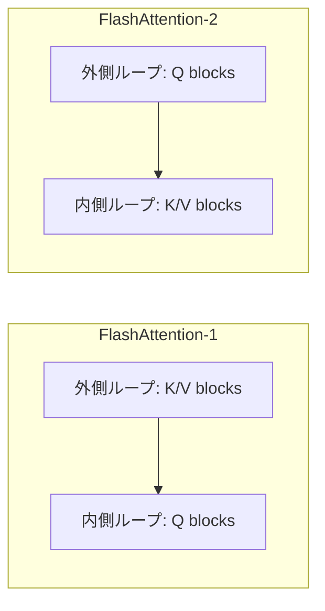

本記事は [arXiv:2307.08691 "FlashAttention-2: Faster Attention with Better Parallelism and Work Partitioning"](https://arxiv.org/abs/2307.08691) の解説記事です。

## 論文概要（Abstract）

TransformerのスケーリングにおいてAttention計算は主要なボトルネックである。FlashAttention（Dao et al., 2022）はGPUメモリ階層の非対称性を利用し、メモリ消費を線形に抑えつつ2-4倍の高速化を達成した。しかしFlashAttention-1はA100 GPUの理論ピークFLOPSの25-40%しか達成できていなかった。Dao氏はFlashAttention-2において、スレッドブロック間・ワープ間のワーク分割を最適化し、**FlashAttention-1の2倍の速度**、A100上で**理論ピークFLOPSの50-73%**を達成したと報告している。

この記事は [Zenn記事: LLM面接対策2026 Transformer・RAG・推論最適化の技術知識50問](https://zenn.dev/0h_n0/articles/07ff6e1a7fc13b) の深掘りです。

## 情報源

- **arXiv ID**: 2307.08691
- **URL**: [https://arxiv.org/abs/2307.08691](https://arxiv.org/abs/2307.08691)
- **著者**: Tri Dao（Stanford University / Together AI）
- **発表年**: 2023
- **分野**: cs.LG

## 背景と動機（Background & Motivation）

Attentionの標準的な実装は $O(n^2)$ のメモリを消費し、シーケンス長 $n$ の増加に伴い計算コストが急激に増大する。FlashAttention-1はタイリング（ブロック分割）によりHBM（High Bandwidth Memory）へのアクセスを最小化し、メモリ使用量を線形に抑えることに成功した。しかし、最適化されたGEMM（General Matrix Multiply）演算と比較すると、FlashAttention-1はA100のピーク性能の25-40%にとどまっていた。

著者の分析により、以下の3つのボトルネックが特定された：
1. スレッドブロック間のワーク分割が非最適（GPU占有率の低下）
2. 共有メモリの不要な読み書きが発生
3. シーケンス次元での並列性が不十分

## 主要な貢献（Key Contributions）

- **非MatMul演算の削減**: ソフトマックスのリスケーリングを最後にまとめることで、非MatMul演算を約28%削減
- **シーケンス次元での並列化**: バッチ・ヘッド次元に加え、シーケンス次元でもスレッドブロックを並列化
- **ループ順序の入れ替え**: 外側ループをQ、内側ループをK/Vに変更し、共有メモリアクセスを最適化
- **A100でピーク性能の73%を達成**: FlashAttention-1の2倍の速度

## 技術的詳細（Technical Details）

### FlashAttention-1のアルゴリズム

FlashAttention-1は**オンラインソフトマックス**を使用してAttentionをタイル単位で計算する。K/Vブロックを外側ループで走査し、各Qブロックに対してAttentionスコアを逐次計算する：

$$
m^{(j)} = \max\left(m^{(j-1)},\, \text{rowmax}(S^{(j)})\right)
$$

$$
\ell^{(j)} = e^{m^{(j-1)} - m^{(j)}} \ell^{(j-1)} + \text{rowsum}\left(e^{S^{(j)} - m^{(j)}}\right)
$$

$$
O^{(j)} = \text{diag}\left(e^{m^{(j-1)} - m^{(j)}}\right) O^{(j-1)} + e^{S^{(j)} - m^{(j)}} V^{(j)}
$$

ここで、
- $S^{(j)} = Q \cdot K^{(j)\top} / \sqrt{d_k}$: $j$番目のK/Vブロックに対するAttentionスコア
- $m^{(j)}$: 行方向の最大値（数値安定性のため）
- $\ell^{(j)}$: ソフトマックスの分母（行方向の和）
- $O^{(j)}$: 累積出力

### FlashAttention-2の改善点

#### 改善1: 非MatMul演算の削減

FlashAttention-1では各K/Vブロック処理後にリスケーリング $\text{diag}(\ell^{(j-1)} / \ell^{(j)})$ を適用していた。これは非MatMul演算であり、GPUのTensor Core（MatMul専用）を活用できない。

FlashAttention-2では、このリスケーリングを**全ブロック処理後に1回だけ実行**する：

$$
O_{\text{final}} = \text{diag}(\ell^{(\text{last})})^{-1} \tilde{O}
$$

これにより非MatMul演算を約28%削減する。A100ではTensor Coreの演算スループットが非Tensor Core演算の16倍であるため、この削減の効果は大きい。

#### 改善2: シーケンス次元での並列化

FlashAttention-1はバッチサイズ $B$ とヘッド数 $h$ の積 $B \times h$ でスレッドブロックを並列化していた。長いシーケンスではバッチサイズが小さくなる傾向があり、GPU占有率が低下する。

FlashAttention-2は**シーケンス次元でも並列化**を追加：

$$
\text{並列度} = B \times h \times \lceil N / B_r \rceil
$$

ここで $B_r$ はQのブロックサイズ、$N$ はシーケンス長。これにより、バッチサイズ1・ヘッド数8のような設定でもGPU占有率が大幅に向上する。

#### 改善3: ループ順序の入れ替え

FlashAttention-1ではK/Vが外側ループ、Qが内側ループであった。この構成ではQを繰り返し共有メモリから読み出す必要があり、バンクコンフリクトの原因となる。

FlashAttention-2では**Qを外側ループ**に移動し、各スレッドブロックが1つのQブロックを担当する。Qは最初に1回だけ共有メモリにロードされ、K/Vブロックを内側ループで走査する。これにより共有メモリの読み出し回数が削減される。

### パフォーマンスモデル

Attention計算のメモリI/O量は以下で概算される：

$$
\text{IO} = O\left(\frac{N^2 d}{M}\right)
$$

ここで $N$ はシーケンス長、$d$ はヘッド次元、$M$ はSRAMサイズ。FlashAttention-2は計算量 $O(N^2 d)$ は変えず、メモリI/Oの定数項を改善している。

## 実装のポイント（Implementation）

FlashAttention-2の実装における注意点：

1. **ブロックサイズの選択**: ヘッド次元とGPUの共有メモリサイズに依存。A100では $B_r = B_c = 64$ または $128$ が一般的
2. **Causal Masking**: 因果マスクの適用時、上三角ブロックをスキップすることで計算量を約半減可能
3. **GQA/MQAサポート**: FlashAttention-2はGrouped-Query AttentionとMulti-Query Attentionをネイティブにサポートし、K/Vヘッドの共有パターンに応じたメモリアクセス最適化を実装
4. **精度**: FP16/BF16での計算は数値的に正確（近似なし）。FP32のアキュムレータを使用

## 実験結果（Results）

著者はNVIDIA A100-80GB SXM4上で評価を行っている。

**フォワードパス性能（論文Figure 3より）**:

| シーケンス長 | FlashAttention-1 | FlashAttention-2 | 改善率 |
|------------|------------------|------------------|--------|
| 512 | ~70 TFLOPs/s | ~130 TFLOPs/s | 1.9x |
| 2048 | ~80 TFLOPs/s | ~130 TFLOPs/s | 1.6x |
| 8192 | ~80 TFLOPs/s | ~130 TFLOPs/s | 1.6x |

**バックワードパス性能（論文Figure 4より）**:

| シーケンス長 | FlashAttention-1 | FlashAttention-2 | 改善率 |
|------------|------------------|------------------|--------|
| 512 | ~50 TFLOPs/s | ~105 TFLOPs/s | 2.1x |
| 2048 | ~60 TFLOPs/s | ~120 TFLOPs/s | 2.0x |

**A100ピーク性能に対するMFU（Model FLOPs Utilization）**:
- FlashAttention-1: 25-40%
- FlashAttention-2: **50-73%**

**エンドツーエンドの学習速度（GPTモデル）**:
- FlashAttention-2: 172 TFLOPs/s（FlashAttention-1: 100 TFLOPs/s、**1.7倍**）
- 標準Attention比: **2.8倍**の高速化

## 実運用への応用（Practical Applications）

FlashAttention-2は2026年時点でTransformerモデルの学習・推論の両方で広く採用されている：

- **学習**: PyTorch 2.0以降の `torch.nn.functional.scaled_dot_product_attention` でFlashAttention-2がデフォルトバックエンドとして使用される
- **推論**: vLLM、TGI（Text Generation Inference）、TensorRT-LLMなどの主要推論フレームワークに統合
- **長コンテキスト**: 128K〜1Mトークンの長コンテキストモデル（GPT-4o、Claude、Gemini等）の実現に不可欠
- **後続技術**: FlashAttention-3（H100向け非同期実行+FP8）、FlashDecoding（推論特化）、Ring Attention（マルチデバイス分散）へと発展

## 関連研究（Related Work）

- **FlashAttention** (Dao et al., 2022): 原論文。タイリングによるIO-awareなAttention計算。FlashAttention-2はその並列性とワーク分割を改善
- **Flash-Decoding** (Dao et al., 2023): 推論（デコード）フェーズに特化した並列化手法。シーケンス次元での並列化をデコードステップに適用
- **Memory-efficient attention** (Rabe & Staats, 2021): 勾配チェックポインティングによるメモリ効率化。FlashAttentionとは異なるアプローチだが、メモリ削減の目標は共通

## まとめと今後の展望

FlashAttention-2は、非MatMul演算の削減、シーケンス次元での並列化、ループ順序の入れ替えという3つの最適化により、FlashAttention-1から2倍の高速化を達成した。これはGPUのメモリ階層と計算リソースの特性を深く理解した最適化であり、計算量自体（$O(n^2 d)$）は変えずにメモリI/Oの効率を改善するアプローチである。

後続のFlashAttention-3（2024年、H100 Hopper GPU向け）では、非同期実行とFP8低精度演算を活用してさらなる高速化を実現している。また、AlphaEvolve（Google DeepMind）がFlashAttentionカーネルの最適化で最大32.5%の追加高速化を達成したとの報告もあり、GPU上のAttention計算最適化は今後も活発に研究が続く分野である。

## 参考文献

- **arXiv**: [https://arxiv.org/abs/2307.08691](https://arxiv.org/abs/2307.08691)
- **Code**: [https://github.com/Dao-AILab/flash-attention](https://github.com/Dao-AILab/flash-attention)
- **Related Zenn article**: [https://zenn.dev/0h_n0/articles/07ff6e1a7fc13b](https://zenn.dev/0h_n0/articles/07ff6e1a7fc13b)
