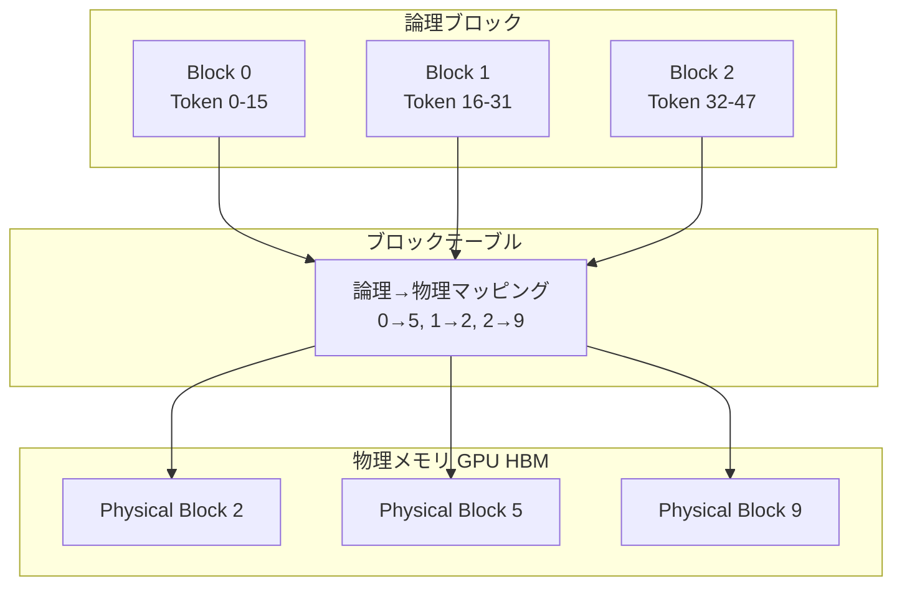

本記事は [arXiv:2309.06180 "Efficient Memory Management for Large Language Model Serving with PagedAttention"](https://arxiv.org/abs/2309.06180) の解説記事です。

## 論文概要（Abstract）

大規模言語モデル（LLM）のサービングにおいて、高スループットを達成するには多数のリクエストを同時にバッチ処理する必要がある。しかし既存システムではKVキャッシュのメモリ管理が非効率であり、KVキャッシュのサイズが大きくかつ可変であるため、並列リクエスト数が制限される。Kwon et al.はOSの仮想メモリとページングの概念を応用したPagedAttentionアルゴリズムを提案し、これを基盤としたLLMサービングシステムvLLMを構築した。著者らの評価では、vLLMはFasterTransformerやTriton Inference Serverと比較して2-4倍のスループット向上を達成したと報告している。

この記事は [Zenn記事: LLM面接対策2026 Transformer・RAG・推論最適化の技術知識50問](https://zenn.dev/0h_n0/articles/07ff6e1a7fc13b) の深掘りです。

## 情報源

- **arXiv ID**: 2309.06180
- **URL**: [https://arxiv.org/abs/2309.06180](https://arxiv.org/abs/2309.06180)
- **著者**: Woosuk Kwon, Zhuohan Li, Siyuan Zhuang, Ying Sheng, Lianmin Zheng et al.（UC Berkeley）
- **発表年**: 2023（SOSP 2023採択）
- **分野**: cs.LG

## 背景と動機（Background & Motivation）

LLMの自己回帰的な推論では、各生成ステップで過去のトークンに対するKey-Valueペアを再計算せずにキャッシュ（KVキャッシュ）として保持する。このKVキャッシュはシーケンス長に比例して増大し、リクエストごとのメモリ消費が大きい。

既存のLLMサービングシステム（FasterTransformer、Orca等）では、KVキャッシュを連続メモリ領域に配置し、最大シーケンス長分のメモリを事前確保する方式を採用していた。著者らの測定によると、この方式では**KVキャッシュメモリの60-80%が無駄になっている**と報告されている。無駄の原因は主に2つである：

1. **内部断片化（Internal fragmentation）**: 事前確保したメモリのうち、実際に使用されない部分
2. **外部断片化（External fragmentation）**: メモリ割り当て間の使用不能な領域

## 主要な貢献（Key Contributions）

- **PagedAttentionアルゴリズム**: KVキャッシュを固定サイズのブロックに分割し、非連続な物理メモリに格納可能にするAttention計算手法
- **Copy-on-Writeメモリ共有**: 並列サンプリングやビームサーチにおいて、共通プレフィックスのKVキャッシュをリクエスト間で共有
- **vLLMシステム**: PagedAttentionを基盤とした本番レベルのLLMサービングシステム（プリエンプション付きFCFSスケジューリング）
- **分散実行サポート**: テンソル並列化によるマルチGPU対応

## 技術的詳細（Technical Details）

### KVキャッシュのメモリ問題

LLMのKVキャッシュサイズは以下のように計算される。例としてLLaMA-13B相当のモデルを考える：

- レイヤー数: 40
- KVヘッド数: 各40（Key 40 + Value 40）
- ヘッド次元: 128
- 精度: FP16（2バイト）

1トークンあたり1レイヤーのKVキャッシュサイズ:

$$
\text{KV}_{\text{per\_token\_per\_layer}} = 2 \times n_{\text{heads}} \times d_{\text{head}} \times \text{dtype\_bytes} = 2 \times 40 \times 128 \times 2 = 20{,}480 \text{ bytes} \approx 20\text{ KB}
$$

2048トークンのシーケンス全体では:

$$
\text{KV}_{\text{total}} = n_{\text{layers}} \times \text{seq\_len} \times \text{KV}_{\text{per\_token\_per\_layer}} = 40 \times 2048 \times 20\text{ KB} \approx 1.6\text{ GB}
$$

ここで、
- $n_{\text{heads}}$: KVヘッド数
- $d_{\text{head}}$: ヘッド次元
- $n_{\text{layers}}$: Transformerレイヤー数

### PagedAttentionアルゴリズム

PagedAttentionの核心は、KVキャッシュを固定サイズの**ブロック**（通常16トークン分）に分割し、OSのページテーブルと同様の**ブロックテーブル**で論理アドレスから物理アドレスへのマッピングを管理する点にある。



Attention計算自体は標準的なScaled Dot-Product Attentionと同一である：

$$
A_{ij} = \frac{\exp(q_i \cdot k_j / \sqrt{d_k})}{\sum_t \exp(q_i \cdot k_t / \sqrt{d_k})}, \quad o_i = \sum_j A_{ij} v_j
$$

ただしPagedAttentionでは、$k_j$ と $v_j$ が非連続な物理ブロックから読み出される点が異なる。カーネル実装では、ブロックテーブルを参照して正しい物理アドレスからKVベクトルをフェッチする。

### vLLMのメモリ管理

vLLMのメモリ管理は、OSのバディシステムを簡素化した**ブロックアロケータ**で構成される：

1. **オンデマンド割り当て**: リクエスト受信時に最大シーケンス長分を確保せず、トークン生成に伴い逐次ブロックを割り当て
2. **Copy-on-Write**: 並列サンプリング時、共通プレフィックスの物理ブロックを共有し、分岐点で初めてコピーを作成
3. **プリエンプション**: メモリ不足時、最多生成トークンのリクエストを一時退避（swap to CPUまたはrecompute）

```python
class BlockAllocator:
    """vLLMのブロックアロケータの概念的な実装

    OSの物理メモリページアロケータに相当する。
    """
    def __init__(self, num_blocks: int, block_size: int):
        self.free_blocks: list[int] = list(range(num_blocks))
        self.block_size = block_size  # トークン数/ブロック（通常16）
        self.ref_count: dict[int, int] = {}  # CoW用参照カウント

    def allocate(self) -> int:
        """空きブロックを1つ割り当て"""
        if not self.free_blocks:
            raise MemoryError("No free blocks available")
        block_id = self.free_blocks.pop()
        self.ref_count[block_id] = 1
        return block_id

    def free(self, block_id: int) -> None:
        """参照カウントを減算し、0になったら解放"""
        self.ref_count[block_id] -= 1
        if self.ref_count[block_id] == 0:
            self.free_blocks.append(block_id)
            del self.ref_count[block_id]

    def copy_on_write(self, block_id: int) -> int:
        """CoW: 共有ブロックへの書き込み時に物理コピーを作成"""
        if self.ref_count[block_id] == 1:
            return block_id  # 単独所有ならコピー不要
        new_block = self.allocate()
        # 物理メモリ上でブロックの内容をコピー（GPU kernel）
        self.ref_count[block_id] -= 1
        return new_block
```

### KVキャッシュ共有の効果

PagedAttentionのメモリ共有は、以下のシナリオで有効に機能する：

| シナリオ | 共有方法 | メモリ削減 |
|---------|---------|-----------|
| 並列サンプリング | 共通プレフィックスのKVブロック共有 | 論文Table 3より55% |
| ビームサーチ（幅4） | ビーム候補間のプレフィックス共有 | 論文Table 3より60% |
| システムプロンプト共有 | 複数リクエストで同一プロンプト部分を共有 | リクエスト数に比例 |

## 実装のポイント（Implementation）

PagedAttentionの実装における注意点：

1. **ブロックサイズの選択**: 著者らは16または32トークン/ブロックを推奨している。小さすぎるとブロックテーブルのオーバーヘッドが増加し、大きすぎると内部断片化が発生する
2. **カーネル最適化**: Attention計算のCUDAカーネルでは、ブロックテーブルのルックアップがメモリアクセスパターンを非連続にするため、キャッシュライン効率を考慮した実装が必要
3. **スケジューリング戦略**: FCFSスケジューリングにプリエンプション機構を組み合わせ、短いリクエストの待ち時間増加を抑制

## 実験結果（Results）

著者らはNVIDIA A100-80GB GPU上で、複数のモデルとワークロードでvLLMを評価している。

**スループット比較（論文Figure 9, 10より）**:

| モデル | 構成 | vLLM | FasterTransformer | 改善率 |
|-------|------|------|-------------------|--------|
| OPT-13B | 1GPU, single sampling | 7.4 req/s | 3.4 req/s | 2.2x |
| LLaMA-13B | 1GPU | 可変 | 可変 | 1.7-2.7x |
| OPT-66B | 4GPU tensor parallel | 高 | 低 | 2.7x |

**メモリ共有の効果（論文Table 3より）**:

| ワークロード | メモリ削減率 | スループット改善 |
|-------------|-------------|----------------|
| Parallel sampling | 55% | 2.2x |
| Beam search (width=4) | 60% | 4.3x |

**Orcaとの比較**: vLLMはOrcaの静的バッチング方式と比較して2-4倍のスループット向上を達成したと著者らは報告している。

## 実運用への応用（Practical Applications）

PagedAttention/vLLMは2026年時点でLLMサービングのデファクトスタンダードとなっている。プロダクション環境での活用ポイント：

- **マルチテナント環境**: システムプロンプト共有により、同一プロンプトを使用する複数ユーザーのメモリ使用量を大幅に削減可能
- **バッチ推論**: PagedAttentionのメモリ効率により、同一GPU上でより多くのリクエストを同時処理でき、GPU稼働率が向上
- **長コンテキスト対応**: 128Kトークン以上のコンテキストでもメモリ断片化なく処理可能
- **スケーリング**: テンソル並列化により、モデルサイズに応じてGPU数を増やせる

## Production Deployment Guide

### AWS実装パターン（コスト最適化重視）

**トラフィック量別の推奨構成**:

| 規模 | 月間リクエスト | 推奨構成 | 月額コスト | 主要サービス |
|------|--------------|---------|-----------|------------|
| **Small** | ~3,000 (100/日) | Serverless | $50-150 | Lambda + Bedrock + DynamoDB |
| **Medium** | ~30,000 (1,000/日) | Hybrid | $300-800 | Lambda + ECS Fargate + ElastiCache |
| **Large** | 300,000+ (10,000/日) | Container | $2,000-5,000 | EKS + Karpenter + EC2 Spot |

**Small構成の詳細** (月額$50-150):
- **Lambda**: 1GB RAM, 60秒タイムアウト ($20/月)
- **Bedrock**: Claude 3.5 Haiku, Prompt Caching有効 ($80/月)
- **DynamoDB**: On-Demand ($10/月)

**Large構成の詳細** (月額$2,000-5,000):
- **EKS**: コントロールプレーン ($72/月)
- **EC2 Spot Instances**: g5.xlarge × 2-4台 (平均$800/月)
- **Karpenter**: 自動スケーリング
- **vLLM on EKS**: PagedAttentionによるメモリ効率化でGPU台数削減

**コスト試算の注意事項**:
上記は2026年3月時点のAWS ap-northeast-1（東京）リージョン料金に基づく概算値です。実際のコストはトラフィックパターンにより変動します。最新料金は [AWS料金計算ツール](https://calculator.aws/) で確認してください。

### Terraformインフラコード

**Large構成: EKS + vLLM + Karpenter**

```hcl
module "eks" {
  source  = "terraform-aws-modules/eks/aws"
  version = "~> 20.0"

  cluster_name    = "vllm-inference-cluster"
  cluster_version = "1.31"

  vpc_id     = module.vpc.vpc_id
  subnet_ids = module.vpc.private_subnets

  cluster_endpoint_public_access = true
  enable_cluster_creator_admin_permissions = true
}

resource "kubectl_manifest" "karpenter_provisioner" {
  yaml_body = <<-YAML
    apiVersion: karpenter.sh/v1alpha5
    kind: Provisioner
    metadata:
      name: vllm-gpu-provisioner
    spec:
      requirements:
        - key: karpenter.sh/capacity-type
          operator: In
          values: ["spot"]
        - key: node.kubernetes.io/instance-type
          operator: In
          values: ["g5.xlarge", "g5.2xlarge"]
      limits:
        resources:
          cpu: "32"
          memory: "128Gi"
          nvidia.com/gpu: "4"
      ttlSecondsAfterEmpty: 60
  YAML
}

resource "aws_budgets_budget" "vllm_monthly" {
  name         = "vllm-monthly-budget"
  budget_type  = "COST"
  limit_amount = "5000"
  limit_unit   = "USD"
  time_unit    = "MONTHLY"

  notification {
    comparison_operator        = "GREATER_THAN"
    threshold                  = 80
    threshold_type             = "PERCENTAGE"
    notification_type          = "ACTUAL"
    subscriber_email_addresses = ["ops@example.com"]
  }
}
```

### コスト最適化チェックリスト

- [ ] vLLM PagedAttentionにより同一GPUでのバッチサイズ拡大（2-4x）
- [ ] Spot Instances優先（Karpenter自動管理、最大90%削減）
- [ ] KVキャッシュ共有によるシステムプロンプトのメモリ削減
- [ ] Continuous Batchingによる GPU稼働率の最大化
- [ ] AWS Budgets: 月額予算設定（80%で警告、100%でアラート）

## 関連研究（Related Work）

- **Orca** (Yu et al., 2022): イテレーションレベルのスケジューリングを導入。vLLMはOrcaのContinuous Batchingコンセプトをメモリ管理面で拡張
- **FlashAttention** (Dao et al., 2022): IO-awareなAttention計算の最適化。PagedAttentionとは直交する最適化であり、併用可能
- **FasterTransformer** (NVIDIA): 最適化されたTransformer推論カーネル。vLLMはメモリ管理の改善により、FasterTransformerを上回るスループットを達成

## まとめと今後の展望

PagedAttentionは、OSの仮想メモリという成熟した概念をLLM推論のKVキャッシュ管理に転用することで、既存システムの60-80%のメモリ無駄を解消し、2-4倍のスループット向上を実現した。vLLMは2026年時点でLLMサービングのデファクトスタンダードとなっており、FlashAttention、GQA、Continuous Batchingなどの他の最適化技術と組み合わせることで、プロダクション環境でのLLM運用コストを大幅に削減できる。

今後の研究方向として、FlashInfer（MLSys 2025 Best Paper）によるカスタマイズ可能なAttentionエンジン、NVIDIA DynamoによるKVキャッシュ再利用の自動化、およびPrefixキャッシュの動的管理が注目される。

## 参考文献

- **arXiv**: [https://arxiv.org/abs/2309.06180](https://arxiv.org/abs/2309.06180)
- **Code**: [https://github.com/vllm-project/vllm](https://github.com/vllm-project/vllm)
- **Related Zenn article**: [https://zenn.dev/0h_n0/articles/07ff6e1a7fc13b](https://zenn.dev/0h_n0/articles/07ff6e1a7fc13b)
