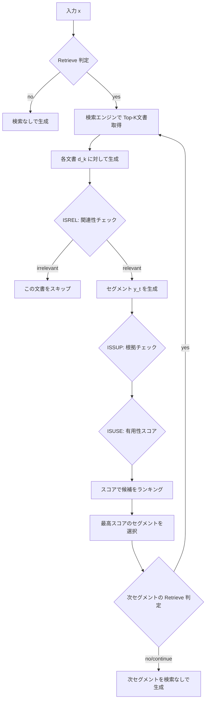

本記事は [arXiv:2310.11511 "Self-RAG: Learning to Retrieve, Generate, and Critique through Self-Reflection"](https://arxiv.org/abs/2310.11511) の解説記事です。

## 論文概要（Abstract）

Retrieval-Augmented Generation（RAG）は外部知識を利用して事実性を向上させるが、従来のRAGは入力に関係なく常に検索を行い、検索結果の品質に関係なく生成に利用するという問題があった。Asai et al.は、LM自身が**検索の要否を判断**し、検索された文書の**関連性**と生成結果の**根拠の正確性**を自己評価する**Self-RAG**を提案した。著者らの実験では、Self-RAG（Llama-2-7B/13B）はChatGPTやRetrieval-augmented Llama-2-chatを複数のベンチマークで上回ったと報告されている。

この記事は [Zenn記事: LLM面接対策2026 Transformer・RAG・推論最適化の技術知識50問](https://zenn.dev/0h_n0/articles/07ff6e1a7fc13b) の深掘りです。

## 情報源

- **arXiv ID**: 2310.11511
- **URL**: [https://arxiv.org/abs/2310.11511](https://arxiv.org/abs/2310.11511)
- **著者**: Akari Asai, Zeqiu Wu, Yizhong Wang, Avirup Sil, Hannaneh Hajishirzi（University of Washington / IBM Research）
- **発表年**: 2023（ICLR 2024採択）
- **分野**: cs.CL

## 背景と動機（Background & Motivation）

標準的なRAGは、ユーザクエリに対して常に検索を実行し、取得した文書をプロンプトに結合して生成を行う。このアプローチには以下の課題がある：

1. **不要な検索**: 「1+1=?」のような自明な質問でも検索を実行し、無関係な文書がノイズとなる
2. **検索結果の品質無視**: 検索された文書が質問と無関係でも、そのまま生成に利用してしまう
3. **事実性の検証不在**: 生成された文が検索文書に裏付けられているかの検証がない
4. **固定的な動作**: 検索の頻度や利用方法をタスクや入力に応じて適応的に変更できない

従来の研究ではKNN-LM（Khandelwal et al., 2020）やATLAS（Izacard et al., 2022）が検索と生成の統合を試みたが、検索の要否判断や生成結果の自己批評は含まれていなかった。SAIL（Luo et al., 2023）はインストラクションに検索結果を挿入する手法だが、検索タイミングの制御はできない。

## 主要な貢献（Key Contributions）

- **4種の反省トークン（reflection tokens）**: 検索判断・関連性評価・根拠検証・有用性評価を特殊トークンとしてモデルに学習させるフレームワーク
- **適応的検索**: モデル自身が検索の要否をトークン単位で判断する仕組み
- **学習パイプライン**: GPT-4による反省トークンのアノテーションと、Critic Model + Generator Modelの2段階学習
- **推論時のカスタマイズ**: 反省トークンの重みを調整することで、事実性重視・創造性重視を切り替え可能

## 技術的詳細（Technical Details）

### 4種の反省トークン

Self-RAGの中核は、以下の4種の特殊トークンである：

| トークン | 入力 | 出力値 | 役割 |
|---------|------|--------|------|
| **[Retrieve]** | $x$（または $x + y$） | `yes`, `no`, `continue` | 検索が必要かを判断 |
| **[ISREL]** | $x$, $d$ | `relevant`, `irrelevant` | 検索文書 $d$ がクエリ $x$ に関連するか |
| **[ISSUP]** | $x$, $d$, $y$ | `fully supported`, `partially supported`, `no support` | 生成文 $y$ が文書 $d$ に裏付けられるか |
| **[ISUSE]** | $x$, $y$ | 1-5のスコア | 生成文 $y$ がクエリ $x$ に対して有用か |

### 推論アルゴリズム



生成はセグメント（文）単位で行われ、各セグメントの生成後に次のセグメントで検索が必要かを再判定する。これにより、長い応答の途中でも必要に応じて検索を挿入できる。

### セグメントレベルのビームサーチ

推論時、各セグメントの生成で複数の検索文書に基づく候補が生成される。最終的な出力は以下のスコアリング関数で選択される：

$$
\text{score}(y_t, d) = \text{ISREL}(d) + \text{ISSUP}(y_t, d) + \text{ISUSE}(y_t)
$$

各スコア項にはハイパーパラメータ（重み）を設定でき、推論時にタスクに応じた調整が可能である。例えば、事実性を重視するタスクでは[ISSUP]の重みを大きくし、創造的な生成タスクでは[ISUSE]の重みを大きくする。

### 学習パイプライン

Self-RAGの学習は以下の3段階で行われる：

**Stage 1: Critic Modelの学習**

GPT-4を使用して、既存のコーパスに反省トークンのアノテーションを行う。具体的には、入力-出力ペア $(x, y)$ に対して：
- 検索が有用かどうか（[Retrieve]ラベル）
- 検索文書の関連性（[ISREL]ラベル）
- 生成文の根拠の有無（[ISSUP]ラベル）
- 生成文の有用性（[ISUSE]ラベル）

をGPT-4に判定させる。著者らは約4,000サンプルのGPT-4アノテーションでCritic Modelを蒸留学習し、人間のアノテーションとの一致率がGPT-4と同等であったと報告している。

**Stage 2: 学習データの拡張**

Critic Modelを使用して、大規模な学習コーパス全体に反省トークンを自動付与する。これにより、手動アノテーションのコストなしに大量の学習データを生成できる。

**Stage 3: Generator Modelの学習**

反省トークンが付与されたデータを用いて、通常の言語モデルの学習と同様にnext-token predictionで学習する。反省トークンは通常のトークンと同じ語彙に追加され、モデルはテキスト生成と反省トークン生成を同時に学習する。

$$
\mathcal{L} = -\sum_{t} \log p_\theta(x_t | x_{<t})
$$

ここで $x_t$ は通常のテキストトークンまたは反省トークンである。学習時には検索文書を含むデータと含まないデータの両方を使用し、検索なしでも生成できる能力を維持する。

### 従来RAGとの構造的差異

| 特性 | 従来のRAG | Self-RAG |
|------|----------|----------|
| 検索タイミング | 常に検索 | モデルが判断（[Retrieve]） |
| 検索結果の利用 | 全て利用 | 関連性チェック後に利用（[ISREL]） |
| 生成の検証 | なし | 根拠チェック（[ISSUP]）+ 有用性評価（[ISUSE]） |
| 推論時制御 | 不可 | 反省トークンの重みで調整可能 |
| 追加モジュール | 検索モジュールのみ | 不要（モデル内に統合） |

## 実験結果（Results）

著者らはLlama-2-7BおよびLlama-2-13Bをベースモデルとして、以下のベンチマークで評価を行っている。

**短文生成（Closed-set）タスク**:

| モデル | PopQA (accuracy) | PubHealth (accuracy) | ARC-Challenge (accuracy) |
|-------|-------------------|----------------------|--------------------------|
| Llama-2-7B | 14.7% | 49.6% | 67.5% |
| Llama-2-13B + RAG | 45.7% | 72.2% | - |
| ChatGPT | 29.3% | 70.0% | 75.3% |
| Self-RAG-7B | 54.9% | 72.4% | - |
| Self-RAG-13B | **55.8%** | **72.4%** | - |

PopQAでは、Self-RAG-7BがChatGPTを25.6ポイント上回り、PubHealthでもChatGPTと同等以上の性能を達成したと報告されている。

**長文生成タスク（ASQA、FactScore）**:

| モデル | ASQA (correctness) | FactScore |
|-------|---------------------|-----------|
| Llama-2-chat-13B | 24.0% | - |
| Retrieval + Llama-2-13B | 30.1% | 32.8% |
| ChatGPT | 35.3% | 58.4% |
| Self-RAG-7B | 33.3% | 81.2% |
| Self-RAG-13B | **36.4%** | - |

FactScoreにおいて、Self-RAG-7BがChatGPTを22.8ポイント上回ったと著者らは報告している。これは、Self-RAGが生成文ごとに根拠を検証する仕組みが事実性の向上に効果的であることを示唆している。

**推論時カスタマイズの効果**:

著者らのアブレーション実験では、[ISSUP]の重みを上げると事実性が向上する一方で応答の多様性が低下し、[ISUSE]の重みを上げると有用性が向上するが事実性がやや低下するというトレードオフが報告されている。

## 実装のポイント（Implementation）

Self-RAGの実装における主要なポイント：

1. **反省トークンの語彙追加**: Llama-2の語彙に4種の反省トークンとその値（`[Retrieve]yes`, `[ISREL]relevant`等）を追加。合計で約10トークンの追加
2. **検索エンジン**: Contriever-MSMARCOを使用。推論時は検索された上位5文書を候補として使用
3. **セグメント単位の生成**: 文（ピリオドまたは改行）単位でセグメントを区切り、各セグメント後に[Retrieve]判定を挿入
4. **並列スコアリング**: 複数の検索文書に対する生成を並列化し、スコアリングで最良の候補を選択

### 推論時の制御例

```python
# 推論時の重みパラメータ（タスクに応じて調整）
scoring_weights = {
    "isrel": 1.0,      # 検索文書の関連性
    "issup": 1.0,      # 根拠の正確性（事実性重視タスクでは大きく設定）
    "isuse": 0.5,      # 有用性（要約・対話タスクでは大きく設定）
}

def score_segment(
    segment: str,
    document: str,
    reflection_tokens: dict[str, str],
    weights: dict[str, float],
) -> float:
    """セグメントのスコアを計算する

    Args:
        segment: 生成されたテキストセグメント
        document: 検索された文書
        reflection_tokens: モデルが生成した反省トークンの値
        weights: 各反省トークンの重み

    Returns:
        セグメントの総合スコア
    """
    score = 0.0

    # ISREL: 検索文書の関連性
    if reflection_tokens["isrel"] == "relevant":
        score += weights["isrel"]

    # ISSUP: 根拠の正確性
    issup_scores = {
        "fully supported": 1.0,
        "partially supported": 0.5,
        "no support": -1.0,
    }
    score += weights["issup"] * issup_scores.get(
        reflection_tokens["issup"], 0.0
    )

    # ISUSE: 有用性（1-5スケール、正規化）
    isuse_value = int(reflection_tokens.get("isuse", "3"))
    score += weights["isuse"] * (isuse_value - 1) / 4.0

    return score
```

## 実運用への応用（Practical Applications）

Self-RAGの考え方は2026年時点でRAGシステムの設計に広く影響を与えている：

- **適応的検索の普及**: LangChainやLlamaIndexでは、クエリの複雑さに応じて検索の要否を判断するルーティング機能が標準装備されている。これはSelf-RAGの[Retrieve]トークンの概念を実装したものと位置づけられる
- **検索結果のリランキング**: Cohere Rerank、Cross-encoderなどのリランカーは、Self-RAGの[ISREL]に相当する関連性フィルタリングを実現する
- **事実性検証（Grounding）**: Azure AI Content SafetyやLlamaGuardなどのガードレール技術は、[ISSUP]に相当する根拠チェック機能を提供している
- **Corrective RAG**: Yan et al.（2024）のCRAGは、Self-RAGの検索品質評価をさらに発展させ、検索結果が不十分な場合にWeb検索にフォールバックする仕組みを提案

## 関連研究（Related Work）

- **REALM** (Guu et al., 2020): 検索モジュールを事前学習に統合した先駆的研究。Self-RAGは推論時の適応的検索と自己批評を追加した点で発展
- **RETRO** (Borgeaud et al., 2022): チャンク化された外部メモリを用いたRetrieval-augmented LM。検索タイミングは固定的で、Self-RAGのような適応的制御は含まない
- **FLARE** (Jiang et al., 2023): 生成の不確実性が高い場合に検索を実行する手法。Self-RAGは反省トークンによるより明示的な制御メカニズムを提供
- **Toolformer** (Schick et al., 2023): LMにAPIツールの使用を学習させる手法。Self-RAGはツール使用の概念を検索に特化させ、さらに結果の品質評価を追加

## まとめと今後の展望

Self-RAGは、4種の反省トークン（[Retrieve]、[ISREL]、[ISSUP]、[ISUSE]）をLMの語彙に追加し、検索の要否判断から生成結果の自己批評までをモデル内部で完結させるフレームワークである。著者らの実験では、Llama-2-7BベースのSelf-RAGがChatGPTをPopQAで25.6ポイント、FactScoreで22.8ポイント上回ったと報告されている。

Self-RAGの核心的なアイデア — モデル自身が検索と生成の品質を評価する — は、2026年時点のRAGシステム設計における適応的検索・リランキング・事実性検証の標準的プラクティスの理論的基盤となっている。後続研究として、Corrective RAG（CRAG）やActive RAGなど、検索品質に応じた動的な戦略切り替えを行う手法が活発に研究されている。

## 参考文献

- **arXiv**: [https://arxiv.org/abs/2310.11511](https://arxiv.org/abs/2310.11511)
- **Code**: [https://github.com/AkariAsai/self-rag](https://github.com/AkariAsai/self-rag)
- **Related Zenn article**: [https://zenn.dev/0h_n0/articles/07ff6e1a7fc13b](https://zenn.dev/0h_n0/articles/07ff6e1a7fc13b)
