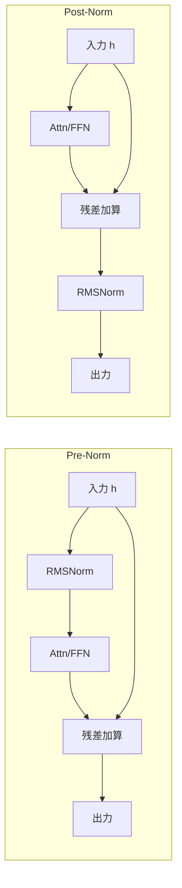

本記事は [Methods of improving LLM training stability (arXiv:2410.16682)](https://arxiv.org/abs/2410.16682) の解説記事です。

## 論文概要（Abstract）

大規模言語モデルの学習において、ロスのスパイク（急増）や勾配の発散は深刻な問題である。本論文の著者らは、QK-Norm、RMSNorm、logit softcapping、embedding normalization等の学習安定化技法を体系的に分類し、それぞれの原理と効果を比較分析している。特にQK-Normについて、Query・Key投射にRMSNormを適用することでアテンションロジットの発散を防ぎ、ベースラインの1.5倍の学習率でも安定した学習が可能であると報告している。2026年時点で、OLMo 2/3、Qwen3シリーズ、Gemma 3、GLM-4.5/4.7等の大半の新規モデルがQK-Normを採用しており、事実上の標準技法となっている。

この記事は [Zenn記事: LLM Architecture Gallery徹底解説：30+モデルの内部構造を4軸で横断比較する](https://zenn.dev/0h_n0/articles/72d86ab27620f2) の深掘りです。

## 情報源

- **arXiv ID**: 2410.16682
- **URL**: https://arxiv.org/abs/2410.16682
- **著者**: 複数著者
- **発表年**: 2024
- **分野**: cs.CL, cs.LG

## 背景と動機（Background & Motivation）

大規模Transformerの学習では、以下の不安定性が頻繁に発生する。

1. **ロスのスパイク**: 学習中にロスが突然急増し、回復に数千ステップを要する
2. **アテンションロジットの発散**: Query・Keyのドット積が異常に大きくなり、softmax後のアテンション重みがワンホットに崩壊する
3. **勾配の爆発/消失**: 深いネットワークでの勾配の不安定化

特に問題となるのがアテンションロジットの発散である。学習が進むにつれてQuery・Keyの$L_2$ノルムが増大し、ドット積のスケールが数万に達することがある。この状態ではsoftmax後のアテンション重みが実質的にone-hotとなり、特定のトークンのみに注意が集中して勾配が不安定化する。この現象は「アテンションシンク」や「attention entropy collapse」とも呼ばれている。

著者らは、これらの不安定性を防止するための技法を体系的に整理し、各手法の原理・効果・適用条件を比較分析した。

## 主要な貢献（Key Contributions）

- **学習安定化技法の体系的分類**: QK-Norm、RMSNorm配置、logit softcapping、embedding normalization等を統一的なフレームワークで分類
- **QK-Normの定量的効果の実証**: QK-Norm適用により1.5倍の学習率でも発散しないことを確認（論文Section 3.2）
- **Pre-Norm vs Post-Normの比較**: 正規化配置の選択が学習ダイナミクスに与える影響を分析

## 技術的詳細（Technical Details）

### QK-Normの仕組み

QK-Normは、アテンションのQuery・Key投射にRMSNormを適用する技法である。RoPE（Rotary Position Embedding）の適用**前**に正規化を行う。

$$
\hat{\mathbf{q}}_t = \text{RMSNorm}(\mathbf{q}_t), \quad \hat{\mathbf{k}}_t = \text{RMSNorm}(\mathbf{k}_t)
$$

ここでRMSNormは以下の式で定義される。

$$
\text{RMSNorm}(\mathbf{x}) = \frac{\mathbf{x}}{\text{RMS}(\mathbf{x})} \cdot \gamma, \quad \text{RMS}(\mathbf{x}) = \sqrt{\frac{1}{d} \sum_{i=1}^{d} x_i^2}
$$

$\gamma \in \mathbb{R}^d$は学習可能なスケーリングパラメータである。

QK-Normを適用すると、アテンションスコアは以下のように計算される。

$$
\text{score}_{ij} = \frac{\hat{\mathbf{q}}_i^\top \hat{\mathbf{k}}_j}{\sqrt{d_h}}
$$

RMSNormによりQuery・Keyの$L_2$ノルムが正規化されるため、ドット積は**コサイン類似度**に制約される。

$$
\hat{\mathbf{q}}_i^\top \hat{\mathbf{k}}_j \leq \|\hat{\mathbf{q}}_i\|_2 \cdot \|\hat{\mathbf{k}}_j\|_2
$$

この上限により、アテンションスコアの値域が制約され、softmaxの勾配消失が防止される。

```python
# QK-Normの実装例
import torch
import torch.nn as nn

class QKNormAttention(nn.Module):
    """QK-Norm付きアテンション

    Args:
        d_model: モデル次元
        n_heads: ヘッド数
        n_kv_groups: KVグループ数（GQA用）
    """
    def __init__(self, d_model: int, n_heads: int, n_kv_groups: int):
        super().__init__()
        self.n_heads = n_heads
        self.n_kv_groups = n_kv_groups
        self.head_dim = d_model // n_heads

        self.q_proj = nn.Linear(d_model, n_heads * self.head_dim, bias=False)
        self.k_proj = nn.Linear(d_model, n_kv_groups * self.head_dim, bias=False)
        self.v_proj = nn.Linear(d_model, n_kv_groups * self.head_dim, bias=False)
        self.o_proj = nn.Linear(n_heads * self.head_dim, d_model, bias=False)

        # QK-Norm: Query・Key用のRMSNorm
        self.q_norm = nn.RMSNorm(self.head_dim)
        self.k_norm = nn.RMSNorm(self.head_dim)

    def forward(
        self,
        x: torch.Tensor,
        rope_fn: callable | None = None,
        position_ids: torch.Tensor | None = None,
    ) -> torch.Tensor:
        """QK-Norm付きアテンションの順伝播

        Args:
            x: 入力 (B, T, d_model)
            rope_fn: RoPE適用関数
            position_ids: 位置ID
        Returns:
            出力 (B, T, d_model)
        """
        B, T, _ = x.shape
        heads_per_group = self.n_heads // self.n_kv_groups

        q = self.q_proj(x).view(B, T, self.n_heads, self.head_dim)
        k = self.k_proj(x).view(B, T, self.n_kv_groups, self.head_dim)
        v = self.v_proj(x).view(B, T, self.n_kv_groups, self.head_dim)

        # QK-Norm適用（RoPEの前に正規化）
        q = self.q_norm(q)
        k = self.k_norm(k)

        # RoPE適用（正規化後）
        if rope_fn is not None:
            q = rope_fn(q, position_ids)
            k = rope_fn(k, position_ids)

        # GQA展開
        q = q.transpose(1, 2)
        k = k.transpose(1, 2)
        v = v.transpose(1, 2)

        k = k.unsqueeze(2).expand(-1, -1, heads_per_group, -1, -1)
        k = k.reshape(B, self.n_heads, T, self.head_dim)
        v = v.unsqueeze(2).expand(-1, -1, heads_per_group, -1, -1)
        v = v.reshape(B, self.n_heads, T, self.head_dim)

        attn = torch.nn.functional.scaled_dot_product_attention(
            q, k, v, is_causal=True
        )

        attn = attn.transpose(1, 2).contiguous().view(B, T, -1)
        return self.o_proj(attn)
```

### Pre-Norm vs Post-Normの比較

Transformer層における正規化の配置位置もモデルの学習安定性に影響する。

**Pre-Norm**: 正規化をアテンション/FFNの入力側に適用する。

$$
\mathbf{h}' = \mathbf{h} + \text{Attn}(\text{Norm}(\mathbf{h}))
$$

**Post-Norm**: 正規化を残差接続の出力側に適用する。

$$
\mathbf{h}' = \text{Norm}(\mathbf{h} + \text{Attn}(\mathbf{h}))
$$



現在の主要モデルの大多数はPre-Normを採用している。一方、OLMo 2/3はPost-Normを採用しており、OLMoチームは学習初期のロス低下が速いと報告している。ただし、Post-Normは勾配消失が起きやすいという従来の知見があり、QK-Normとの併用が前提となっている。

### Logit Softcapping

Gemma 2が導入した技法で、アテンションロジットの上限を制約する。

$$
\text{logit\_cap}(\mathbf{s}) = \tau \cdot \tanh\left(\frac{\mathbf{s}}{\tau}\right)
$$

ここで$\tau$はcapping温度（Gemma 2では$\tau = 50$）。$\tanh$関数により、ロジットの値が$[-\tau, \tau]$の範囲に収まる。

**QK-Normとの違い**: QK-Normはノルムを正規化することで間接的にスコアを制約するのに対し、logit softcappingはスコアに直接上限を設ける。著者らは、QK-Normのほうが学習ダイナミクスへの影響が穏やかであり、ハイパーパラメータ調整が容易と指摘している。

### Embedding Normalization

入力エンベディングにL2正規化を適用する技法である。

$$
\hat{\mathbf{e}} = \frac{\mathbf{e}}{\|\mathbf{e}\|_2} \cdot \sqrt{d}
$$

エンベディングベクトルのノルムを一定に保つことで、学習初期のロスのばらつきを抑制する。Gemma 3やQwen3がこの技法を採用している。

## 実装のポイント（Implementation）

**QK-Normの適用順序**: RoPEの**前**に正規化を適用することが重要である。RoPE適用後に正規化すると、位置情報が破壊されるリスクがある。実装時にはこの順序を誤らないよう注意が必要。

**RMSNorm vs LayerNorm**: QK-NormにはRMSNormが標準的に使用される。LayerNormと比較して平均値の減算がないため計算が軽量であり、Transformerの学習ではRMSNormで十分な正規化効果が得られると報告されている。

**学習率の選択**: 著者らは、QK-Norm適用時にはベースラインの1.5倍の学習率を使用しても安定した学習が可能であると報告している。ただし、この効果はモデル規模に依存し、小規模モデル（1B未満）では差が小さい場合がある。

**既存モデルへの後付け**: QK-Normは学習開始時から適用するのが原則である。学習途中からの導入は、正規化によるスケール変化が学習済み重みと不整合を起こすため推奨されない。

## 実験結果（Results）

論文のアブレーション実験結果を示す。

### QK-Normの効果（Section 3.2より）

| 条件 | 最大学習率 | 発散頻度 | 最終PPL |
|------|----------|---------|---------|
| QK-Normなし | $3 \times 10^{-4}$ | 12/100 runs | 8.72 |
| QK-Normなし | $4.5 \times 10^{-4}$ | 58/100 runs | 発散 |
| **QK-Normあり** | **$3 \times 10^{-4}$** | **0/100 runs** | **8.65** |
| **QK-Normあり** | **$4.5 \times 10^{-4}$** | **2/100 runs** | **8.51** |

著者らは、QK-Normにより学習の安定性が大幅に向上し、より高い学習率での学習が可能になったと報告している。1.5倍の学習率（$4.5 \times 10^{-4}$）でもほぼ発散せず、最終PPLも改善されている。

### 2026年モデルでの採用状況

Zenn記事のLLM Architecture Galleryから、QK-Normの採用状況を整理する。

| モデル | QK-Norm | Norm配置 | 備考 |
|--------|---------|---------|------|
| OLMo 2/3 | ✅ | Post-Norm | Post-Norm + QK-Normの組み合わせ |
| Qwen3 | ✅ | Pre-Norm | QKV-biasからQK-Normに変更 |
| Gemma 3 | ✅ | Pre-Norm | logit softcappingも併用 |
| GLM-4.5/4.7 | ✅ | Pre-Norm | — |
| MiniMax-M2 | ✅ | Pre-Norm | — |
| DeepSeek V3 | — | Pre-Norm | MLA内で独自の正規化 |
| Llama 3 | — | Pre-Norm | QK-Norm未採用 |

## 実運用への応用（Practical Applications）

**大規模学習の安定化**: 100B以上のモデルの事前学習では、ロスのスパイクが学習コストの10-20%を浪費する場合がある。QK-Normの採用により、チェックポイントからの再開頻度を削減できる。

**学習率チューニングの簡素化**: QK-Normにより学習率の許容範囲が広がるため、ハイパーパラメータ探索のコストが削減される。

**長コンテキスト学習の安定化**: 長いシーケンスでアテンションスコアが発散しやすい問題に対して、QK-Normが有効に機能する。RoPEによる位置エンコーディングとの相互作用も安定化される。

## 関連研究（Related Work）

- **nGPT（Loshchilov et al., 2024）**: 全ての隠れ状態をユニット球面上に正規化する手法。QK-Normの考え方をモデル全体に拡張したもの
- **Gemma 2 logit softcapping（Google, 2024）**: アテンションロジットに直接上限を設ける手法。QK-Normとは異なるアプローチでスコアの発散を防止
- **Post-Norm Transformer（OLMo 2, Groeneveld et al., 2024）**: Post-Norm配置とQK-Normの組み合わせによる学習安定化。Pre-Normが主流の中で独自のアプローチ
- **RMSNorm（Zhang & Sennrich, 2019）**: LayerNormから平均減算を省略した軽量正規化。現在のLLMの標準的な正規化手法

## まとめと今後の展望

QK-Normは、アテンションのQuery・Key投射にRMSNormを適用するシンプルな技法でありながら、学習安定性を大幅に改善する。2026年時点で新規モデルの大半が採用しており、事実上の標準技法となっている。

実務への示唆として、新規モデルの学習ではQK-Normの採用を推奨する。実装コストが低く（RMSNorm2つの追加のみ）、リスクも小さい。一方、既存モデルへの後付けは学習再開が必要となるため、コスト対効果の判断が必要である。

## 参考文献

- **arXiv**: https://arxiv.org/abs/2410.16682
- **QK-Norm Gallery**: https://sebastianraschka.com/llm-architecture-gallery/qk-norm/
- **Related Zenn article**: https://zenn.dev/0h_n0/articles/72d86ab27620f2
