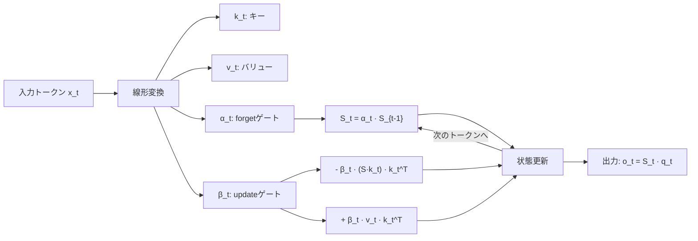
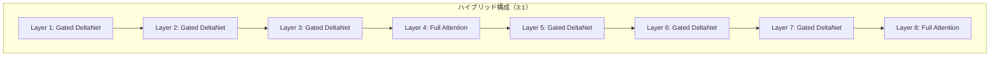

本記事は [Gated Delta Networks: Improving Mamba2 with Delta Rule (arXiv:2412.06464)](https://arxiv.org/abs/2412.06464) の解説記事です。

## 論文概要（Abstract）

Gated DeltaNetは、State Space Model（SSM）であるMamba2のゲーティング機構とDelta Rule（差分更新則）を組み合わせた線形注意アーキテクチャである。著者らは、従来の線形注意やMamba2が苦手とするMulti-Query Associative Recall（MQAR）タスクにおいて、Gated DeltaNetが大幅な改善を示したと報告している。固定サイズの隠れ状態を逐次更新するリカレント構造により、KVキャッシュが不要でコンテキスト長に対してメモリが定数となる特性を持つ。ICLR 2025に採択された。

この記事は [Zenn記事: LLM Architecture Gallery徹底解説：30+モデルの内部構造を4軸で横断比較する](https://zenn.dev/0h_n0/articles/72d86ab27620f2) の深掘りです。

## 情報源

- **arXiv ID**: 2412.06464
- **URL**: https://arxiv.org/abs/2412.06464
- **著者**: Songlin Yang, Jan Kautz, Ali Hatamizadeh（NVIDIA, University of Toronto）
- **発表年**: 2024（ICLR 2025採択）
- **分野**: cs.LG, cs.CL

## 背景と動機（Background & Motivation）

標準的なSelf-Attentionは$O(n^2)$の計算量を要し、長いシーケンスでの推論コストが問題となる。この制約に対し、線形注意（Linear Attention）やSSM（State Space Model）が代替手法として研究されてきた。

Mamba/Mamba2はSSMベースのアーキテクチャとして成功を収めたが、連想記憶（associative recall）能力において標準Transformerに劣ることが知られている。具体的には、「キーAが与えられたとき、過去に登場したバリューBを正確に検索する」タスクで精度が低下する。

この問題の根本原因は、Mamba2の状態更新が**加算的（additive）** であることにある。新しいkey-valueペアを隠れ状態に書き込む際、既存の状態に単純加算するため、類似したキーの情報が混在して検索精度が低下する。

著者らは、Delta Rule（差分更新則）を導入することでこの問題に対処した。Delta Ruleは新しいkey-valueペアを書き込む前に、同じキーに対応する古い情報を**削除**してから更新する。これにより連想記憶の精度が向上する。

## 主要な貢献（Key Contributions）

- **Gated DeltaNet**: Mamba2のゲーティング機構とDelta Ruleを統合した新しい線形注意レイヤー。固定メモリ・線形時間でMQARタスクを高精度に解決
- **チャンクワイズ並列化**: 効率的なGPU学習のためのチャンクワイズ並列化アルゴリズム。リカレント構造でありながらTransformer並みの学習速度を実現
- **ハイブリッドアーキテクチャ**: Gated DeltaNetとフルアテンションの交互配置（3:1比率）による実用的なモデル設計。後続のQwen3.5やKimi Linearに採用

## 技術的詳細（Technical Details）

### Delta Ruleの仕組み

線形注意の隠れ状態$\mathbf{S}_t \in \mathbb{R}^{d_k \times d_v}$は行列メモリとして機能する。標準的な線形注意では、状態更新は以下の加算的な形式である。

$$
\mathbf{S}_t = \mathbf{S}_{t-1} + \mathbf{v}_t \mathbf{k}_t^\top
$$

ここで$\mathbf{k}_t \in \mathbb{R}^{d_k}$はキー、$\mathbf{v}_t \in \mathbb{R}^{d_v}$はバリューである。この更新では、同じキーに対する新旧の値が加算されるため、情報が混在する。

Delta Ruleでは、更新前に古い値を削除する。

$$
\mathbf{S}_t = \mathbf{S}_{t-1} + \beta_t (\mathbf{v}_t - \mathbf{S}_{t-1} \mathbf{k}_t) \mathbf{k}_t^\top
$$

ここで$\beta_t \in (0, 1)$は更新ゲートであり、$\mathbf{S}_{t-1} \mathbf{k}_t$は現在のキーに対する過去の記憶検索結果である。$\mathbf{v}_t - \mathbf{S}_{t-1} \mathbf{k}_t$は「新しい値と古い値の差分」であり、この差分を状態に反映する。

直感的には、Delta Ruleは「上書き更新」に近い動作をする。古い情報を完全に消去するのではなく、$\beta_t$の強度に応じて段階的に置き換える。

### Gated DeltaNetの状態更新

Gated DeltaNetは、Delta Ruleにさらにforgetゲート$\alpha_t$を追加する。

$$
\mathbf{S}_t = \alpha_t \mathbf{S}_{t-1} + \beta_t (\mathbf{v}_t - \mathbf{S}_{t-1} \mathbf{k}_t) \mathbf{k}_t^\top
$$

ここで:
- $\alpha_t \in (0, 1)$: forgetゲート（過去の情報の減衰率）
- $\beta_t \in (0, 1)$: updateゲート（新しい情報の反映度）
- $\mathbf{S}_t \in \mathbb{R}^{d_k \times d_v}$: 隠れ状態（行列メモリ）

展開すると:

$$
\mathbf{S}_t = (\alpha_t \mathbf{I} - \beta_t \mathbf{k}_t \mathbf{k}_t^\top) \mathbf{S}_{t-1} + \beta_t \mathbf{v}_t \mathbf{k}_t^\top
$$

この式は、まず$\alpha_t$で全体的に減衰させ、次に$\beta_t$でキー方向に選択的に古い情報を削除し、新しいvalue-keyペアを書き込む操作を表している。



### ゲート活性化関数

著者らはゲートの活性化関数にSiGLU（Sigmoid-Gated Linear Unit）スタイルを採用している。

$$
\alpha_t = \sigma(W_\alpha \mathbf{x}_t), \quad \beta_t = \sigma(W_\beta \mathbf{x}_t)
$$

ここで$\sigma$はシグモイド関数である。論文のアブレーション実験（Appendix B）によると、SiLU（$x \cdot \sigma(x)$）やReLUと比較して、シグモイドゲートが最も安定した学習を示したと報告されている。

### チャンクワイズ並列化

リカレント構造は逐次処理が必要なため、ナイーブな実装ではGPUの並列性を活かせない。著者らはチャンクワイズ並列化を提案している。

シーケンスを固定サイズのチャンク（推奨: 64トークン）に分割し、チャンク内ではアテンション行列を明示的に構成して並列計算する。チャンク間では隠れ状態を逐次伝搬する。

$$
\text{Chunk内}: \mathbf{O}_{\text{chunk}} = \text{ChunkwiseAttention}(\mathbf{Q}, \mathbf{K}, \mathbf{V}, \alpha, \beta)
$$

$$
\text{Chunk間}: \mathbf{S}_{\text{next}} = f(\mathbf{S}_{\text{prev}}, \text{chunk data})
$$

```python
# Gated DeltaNetの概念的な実装（PyTorch風の擬似コード）
import torch
import torch.nn as nn

class GatedDeltaNet(nn.Module):
    """Gated DeltaNet: Delta Rule + ゲーティングによる線形注意

    Args:
        d_model: モデル次元
        d_key: キー次元（隠れ状態の行方向）
        d_value: バリュー次元（隠れ状態の列方向）
        chunk_size: チャンクワイズ並列化のチャンクサイズ
    """
    def __init__(
        self,
        d_model: int,
        d_key: int = 128,
        d_value: int = 128,
        chunk_size: int = 64,
    ):
        super().__init__()
        self.d_key = d_key
        self.d_value = d_value
        self.chunk_size = chunk_size

        self.q_proj = nn.Linear(d_model, d_key, bias=False)
        self.k_proj = nn.Linear(d_model, d_key, bias=False)
        self.v_proj = nn.Linear(d_model, d_value, bias=False)

        # ゲート投射
        self.alpha_proj = nn.Linear(d_model, 1, bias=True)   # forget gate
        self.beta_proj = nn.Linear(d_model, 1, bias=True)    # update gate

        self.o_proj = nn.Linear(d_value, d_model, bias=False)

    def recurrent_forward(
        self,
        x: torch.Tensor,
        state: torch.Tensor | None = None,
    ) -> tuple[torch.Tensor, torch.Tensor]:
        """リカレントモードの順伝播（推論用）

        Args:
            x: 入力 (B, 1, d_model) — 1トークンずつ処理
            state: 隠れ状態 (B, d_key, d_value) or None
        Returns:
            output: 出力 (B, 1, d_model)
            new_state: 更新された隠れ状態
        """
        B = x.size(0)
        if state is None:
            state = torch.zeros(B, self.d_key, self.d_value, device=x.device)

        q = self.q_proj(x).squeeze(1)      # (B, d_key)
        k = self.k_proj(x).squeeze(1)      # (B, d_key)
        v = self.v_proj(x).squeeze(1)      # (B, d_value)

        alpha = torch.sigmoid(self.alpha_proj(x).squeeze(1))  # (B, 1)
        beta = torch.sigmoid(self.beta_proj(x).squeeze(1))    # (B, 1)

        # Delta Rule更新: S = α*S + β*(v - S@k)*k^T
        retrieved = torch.bmm(state, k.unsqueeze(-1)).squeeze(-1)  # (B, d_value)
        delta = v - retrieved                                       # (B, d_value)

        # 状態更新
        new_state = (
            alpha.unsqueeze(-1) * state
            + beta.unsqueeze(-1) * torch.bmm(
                delta.unsqueeze(-1), k.unsqueeze(1)
            )
        )

        # 出力: o = S_new @ q
        output = torch.bmm(new_state, q.unsqueeze(-1)).squeeze(-1)
        output = self.o_proj(output.unsqueeze(1))

        return output, new_state

    def forward(self, x: torch.Tensor) -> torch.Tensor:
        """チャンクワイズ並列モードの順伝播（学習用）

        Args:
            x: 入力 (B, T, d_model)
        Returns:
            出力 (B, T, d_model)
        """
        B, T, _ = x.shape
        outputs = []
        state = None

        # チャンク単位で処理（簡略化: 実際にはチャンク内を並列化）
        for start in range(0, T, self.chunk_size):
            end = min(start + self.chunk_size, T)
            chunk = x[:, start:end, :]

            chunk_out = []
            for t in range(chunk.size(1)):
                out, state = self.recurrent_forward(
                    chunk[:, t:t+1, :], state
                )
                chunk_out.append(out)
            outputs.extend(chunk_out)

        return torch.cat(outputs, dim=1)
```

**注意**: 上記は概念的な実装であり、実際のflash-linear-attentionライブラリではCUDAカーネルによる高効率なチャンクワイズ並列化が実装されている。

### ハイブリッド構成

Gated DeltaNet単体では長距離の精密な情報検索に弱点がある。固定サイズの隠れ状態に全コンテキストを圧縮するため、RNNと同様に古い情報が徐々に失われる。

この制約を克服するため、実用的なモデルではGated DeltaNetとフルアテンションを**3:1の比率**で交互に配置するハイブリッド構成が採用されている。



Qwen3.5（397B）やKimi Linearがこの構成を採用しており、線形注意の計算効率とフルアテンションの検索精度を両立させている。

## 実装のポイント（Implementation）

**flash-linear-attentionライブラリ**: 著者らのCUDA実装は`fla-org/flash-linear-attention`リポジトリに統合されている（https://github.com/fla-org/flash-linear-attention）。PyTorchから`from fla.layers import GatedDeltaNet`でインポートして使用可能。

**チャンクサイズの選択**: 論文のアブレーション実験によると、チャンクサイズ64がGPU効率と精度のバランスが良い。チャンクが小さすぎると並列性が低下し、大きすぎるとチャンク内アテンション行列のメモリ消費が増加する。

**隠れ状態の初期化**: ゼロ初期化が標準。学習可能な初期状態の導入も可能だが、著者らのアブレーション実験では精度向上は限定的と報告されている。

**ハイブリッド構成の注意点**: Gated DeltaNetレイヤーとフルアテンションレイヤーではKVキャッシュの管理方法が異なる。フルアテンションレイヤーのみKVキャッシュを保持し、Gated DeltaNetレイヤーは隠れ状態のみを保持する。推論エンジンでの実装時にこの差異を正しく処理する必要がある。

## 実験結果（Results）

### MQARベンチマーク

Multi-Query Associative Recall（MQAR）タスクでの比較結果（論文Table 1より）:

| モデル | 精度 | パラメータ数 | メモリ計算量 |
|--------|------|-------------|-------------|
| Transformer | 99.8% | — | $O(n^2)$ |
| Mamba2 | 72.4% | — | $O(n)$ |
| DeltaNet（ゲートなし） | 89.1% | — | $O(n)$ |
| **Gated DeltaNet** | **97.6%** | — | $O(n)$ |

著者らは、Gated DeltaNetがMamba2と比較してMQAR精度を25.2ポイント改善し、Transformerの精度（99.8%）に近い水準を達成したと報告している。

### 言語モデリング

The Pile・SlimPajamaデータセットでの事前学習結果（論文Table 2より）:

| モデル（1.3B） | Pile PPL | HellaSwag | PIQA | ARC-E |
|---------------|----------|-----------|------|-------|
| Mamba2 | 8.72 | 59.1 | 74.2 | 63.5 |
| RWKV-6 | 8.81 | 58.3 | 73.8 | 62.1 |
| **Gated DeltaNet** | **8.54** | **60.2** | **74.8** | **64.7** |

1.3Bパラメータ規模で、著者らはGated DeltaNetがMamba2およびRWKV-6を全ベンチマークで上回ったと報告している。

## 実運用への応用（Practical Applications）

**ストリーミング推論**: 固定サイズの隠れ状態で動作するため、コンテキスト長に依存しないメモリ消費が実現される。チャットボットやリアルタイム翻訳など、連続的にトークンを処理するユースケースに適している。

**エッジデバイス推論**: KVキャッシュが不要なため、メモリ制約の厳しいエッジデバイス（スマートフォン、IoT）での推論に有利である。ただし、ハイブリッド構成のフルアテンションレイヤーにはKVキャッシュが必要な点に注意が必要。

**超長文コンテキスト**: 100Kトークン以上のコンテキストでも隠れ状態のサイズが変わらないため、メモリ面での制約なく処理可能である。ただし、固定サイズ状態への圧縮による情報損失は、精度面でのトレードオフとして存在する。

## 関連研究（Related Work）

- **Mamba/Mamba2（Gu & Dao, 2024）**: 選択的SSMによる線形時間のシーケンスモデル。Gated DeltaNetはMamba2のゲーティング機構を継承しつつ、Delta Ruleで連想記憶を改善した拡張として位置付けられる
- **RWKV-6（Peng et al., 2024）**: RNN型の線形注意アーキテクチャ。token-mixing操作でsequence-level情報を統合するが、MQARタスクではGated DeltaNetに劣ると報告されている
- **Linear Attention（Katharopoulos et al., 2020）**: カーネル近似による線形注意の原型。Gated DeltaNetはこの研究の延長線上にあり、Delta Ruleとゲーティングで精度を大幅に改善した
- **Kimi Linear（Moonshot AI, 2025）**: Gated DeltaNet + MLA + MoEのハイブリッドモデル。Gated DeltaNetの商用モデルへの初期の採用例

## まとめと今後の展望

Gated DeltaNetは、Delta Ruleによる選択的状態更新とゲーティング機構の組み合わせにより、線形注意の連想記憶能力をTransformerに近い水準まで引き上げた。ICLR 2025に採択され、Qwen3.5やKimi Linearなどのフロンティアモデルに採用されている。

実務への示唆として、長コンテキストや低メモリ環境での推論ではGated DeltaNetベースのハイブリッドモデルが有力な選択肢となる。ただし、フルアテンションとの3:1ハイブリッド構成が前提であり、純粋な線形注意のみでの運用は精度面でのリスクがある点に留意が必要である。

## 参考文献

- **arXiv**: https://arxiv.org/abs/2412.06464
- **Code**: https://github.com/NVlabs/GatedDeltaNet
- **flash-linear-attention**: https://github.com/fla-org/flash-linear-attention
- **Related Zenn article**: https://zenn.dev/0h_n0/articles/72d86ab27620f2
