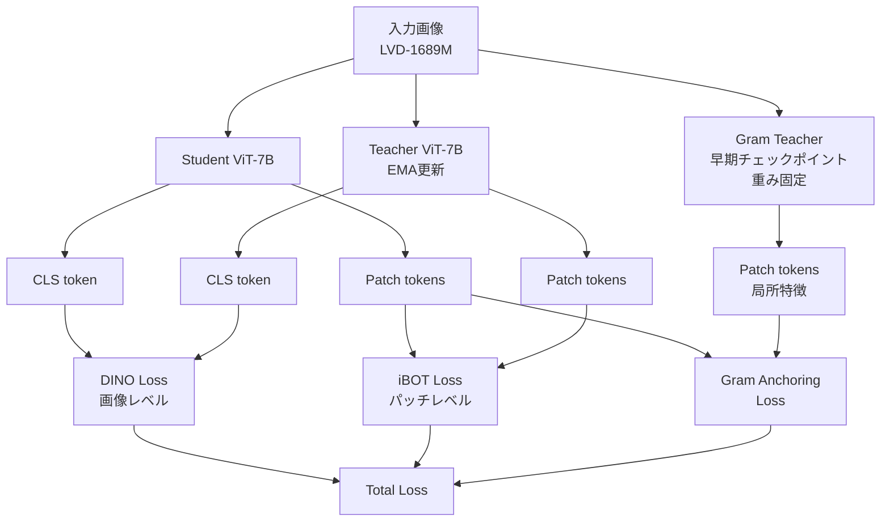

本記事は [DINOv3](https://arxiv.org/abs/2508.10104)（Siméoni et al., 2025）の解説記事です。

## 論文概要（Abstract）

DINOv3は、Meta AIが2025年に発表したDINO系列の最新の自己教師あり学習フレームワークである。7Bパラメータの教師モデル（ViT-7B）を約17億枚の画像（LVD-1689M）で学習し、DINOv2で課題とされていた「大規模・長時間学習時の密な特徴量（パッチレベル表現）の崩壊」に対し、**Gram Anchoring損失**を導入して解決を図っている。著者らは、ImageNet線形評価88.4%、ADE20kセマンティックセグメンテーション55.9 mIoU（DINOv2比+6.0pt）を達成したと報告している。

この記事は [Zenn記事: Self-Distillation入門](https://zenn.dev/0h_n0/articles/94e6c079501239) の深掘りです。

## 情報源

- **arXiv ID**: 2508.10104
- **URL**: [https://arxiv.org/abs/2508.10104](https://arxiv.org/abs/2508.10104)
- **著者**: Oriane Siméoni, Huy V. Vo, Maximilian Seitzer et al.（Meta AI）
- **発表年**: 2025
- **分野**: cs.CV, cs.LG

## 背景と動機（Background & Motivation）

DINOv2（2023年）は自己教師あり学習による汎用視覚特徴量の獲得において大きな成功を収めたが、モデルサイズの大規模化と学習時間の延長に伴い、**密な特徴マップ（パッチレベル表現）が劣化する**という既知の問題が残っていた。具体的には、学習の後半でパッチ特徴量間の局所的な相関構造が崩壊し、セマンティックセグメンテーションや深度推定といった密な予測タスクの性能が低下する現象が観測されていた。

DINOv2ではiBOT損失（パッチレベルのマスク画像モデリング）を導入してこの問題に対処していたが、大規模モデル（ViT-g以上）と長時間の学習スケジュールの組み合わせでは効果が不十分であった。DINOv3はこの課題に対し、学習初期の特徴量構造を保存するGram Anchoring損失を導入し、グローバル理解と密な特徴マップの品質を両立させるアプローチを採っている。

## 主要な貢献（Key Contributions）

- **Gram Anchoring損失**: 学習初期のチェックポイント（Gram Teacher）のパッチ特徴量間の相関構造を保存する正則化手法を導入し、密な特徴量崩壊を解決
- **大規模スケーリング**: 7Bパラメータの教師モデルと1.7B枚の画像データセット（LVD-1689M、17Bの未キュレート画像から精選）による学習
- **学習レシピの簡素化**: DINOv2で必要だったハイパーパラメータスケジュールを撤廃し、よりシンプルな学習設定を実現
- **高解像度対応**: RoPE（Rotary Position Embedding）とRoPE Jitteringにより、4K以上の画像解像度でも安定した特徴マップを生成
- **マルチ学生蒸留**: 複数の学生モデル（ViT-S/B/L/H+ および ConvNext 29M〜198M）を同時に蒸留

## 技術的詳細（Technical Details）

### DINOv3の全体構成

DINOv3の学習パイプラインは、DINOv2の基本構成（DINO損失 + iBOT損失）に加え、Gram Anchoring損失を追加した3つの目的関数から構成されている。

### Gram Anchoring損失

Gram Anchoringは、DINOv3の技術的な核となる新規手法である。学習の初期段階で保存したチェックポイント（**Gram Teacher**）のパッチ特徴量間の類似度構造を、学習中を通じて保存する正則化として機能する。

#### 仕組み

学習の初期段階では、パッチ特徴量の局所的な品質が高い状態が保たれている。しかし、学習が進むにつれてグローバルな画像理解に最適化が偏り、局所特徴が劣化していく。Gram Anchoringは以下の手順でこの劣化を防止する。

1. **Gram Teacherの設定**: 学習初期の高品質なチェックポイントをGram Teacherとして保存（重みを固定）
2. **Gram行列の計算**: 画像のパッチ特徴量からGram行列（全パッチ間の内積行列）を構築

$$
G_{ij} = \mathbf{f}_i \cdot \mathbf{f}_j
$$

ここで $\mathbf{f}_i$ は $i$ 番目のパッチの特徴量ベクトルである。

3. **構造保存制約**: 現在の学生モデルのGram行列がGram TeacherのGram行列と一致するよう損失を適用

$$
\mathcal{L}_{\text{Gram}} = d(G_{\text{student}}, G_{\text{teacher}}^{\text{(gram)}})
$$

ここで $d(\cdot, \cdot)$ はGram行列間の距離関数である。

#### 高解像度Gram Anchoring

著者らは、Gram Teacherに高解像度画像（768px）を入力し、出力をダウンサンプリングすることで、より強い学習信号を生成する手法も提案している。これにより、局所特徴の品質がさらに向上すると報告されている。

### RoPE位置埋め込みと高解像度対応

DINOv3は位置埋め込みにRoPE（Rotary Position Embedding）を採用している。RoPEは相対位置情報を回転行列として埋め込む手法であり、学習時と異なる解像度への外挿が容易である。

さらに、**RoPE Jittering**と呼ばれる手法により、学習時に位置埋め込みのスケールをランダムに変動させることで、異なる解像度間の安定性を向上させている。著者らによると、これらの手法の組み合わせにより4K以上の画像解像度でも安定した特徴マップが生成可能であると報告されている。

### 学習レシピの簡素化

DINOv2では学習率、教師モメンタム、温度パラメータなどに複雑なスケジュールが必要であったが、DINOv3ではこれらのハイパーパラメータスケジュールを撤廃し、固定値による学習を実現している。著者らはこの簡素化により、チューニングコストの削減と再現性の向上が達成されたとしている。

## データセット（LVD-1689M）

DINOv3の学習データセットは、DINOv2のLVD-142M（1.42億枚）から大幅にスケールアップされたLVD-1689M（約16.9億枚）である。

| 項目 | DINOv2 | DINOv3 |
|------|--------|--------|
| 学習画像数 | 142M | 1,689M（約12倍） |
| ソース画像数 | 1.2B | 17B |
| 教師モデル | ViT-g（1.1B） | ViT-7B（7B） |

約170億枚のソーシャルメディア画像から、DINOv2と同様の自動キュレーションパイプラインを適用して約16.9億枚を精選している。データ量の12倍のスケールアップは、モデルサイズの7倍拡大（1.1B→7B）と組み合わせることで、学習データとモデル容量のバランスを保っている。なお、DINOv2ではデータの品質がモデルサイズよりも重要であることが示されており（DINOv2論文Section 4）、DINOv3でもキュレーションパイプラインの品質が性能に大きく寄与していると考えられる。

### DINO系列のスケーリング推移

DINO系列の学習データ・モデルサイズの推移を整理すると以下のとおりである。

| 手法 | 発表年 | 学習データ | 教師モデル | ImageNet線形 |
|------|--------|----------|-----------|------------|
| DINO | 2021 | ImageNet-1K (1.3M) | ViT-S/B (22M/86M) | 77.0% (ViT-S) |
| DINOv2 | 2023 | LVD-142M (142M) | ViT-g (1.1B) | 86.5% |
| DINOv3 | 2025 | LVD-1689M (1.7B) | ViT-7B (7B) | 88.4% |

4年間で学習データは約1,300倍、モデルサイズは約80倍にスケールアップされ、ImageNet線形評価は+11.4ポイント改善されている。

## 実験結果（Results）

### DINOv2との比較

著者らが統一された評価条件下で報告しているDINOv2とDINOv3の比較結果は以下のとおりである。

| 指標 | DINOv2 (ViT-g/14) | DINOv3 (ViT-7B) | 改善幅 |
|------|-------------------|-----------------|--------|
| ImageNet top-1（線形評価） | 87.3% | 88.4% | +1.1pt |
| ADE20k セグメンテーション (mIoU) | 49.9 | 55.9 | +6.0pt |
| PASCAL VOC セグメンテーション (mIoU) | 83.1 | 86.6 | +3.5pt |
| ビデオトラッキング (J&F-Mean) | — | — | +6.7pt |
| インスタンス検索 (GAP) | — | — | +10.9pt |

※ DINOv2のImageNet線形評価は元論文では86.5%と報告されているが、DINOv3論文では統一条件下で87.3%と報告されている。上記数値はDINOv3論文（arXiv:2508.10104）からの引用である。

特にADE20kセマンティックセグメンテーションの+6.0 mIoUの改善は、Gram Anchoringによる密な特徴量の品質向上が直接反映された結果である。

### 蒸留モデルの性能

DINOv3では、ViT-7B教師モデルからViTおよびConvNextアーキテクチャへのマルチ学生蒸留が実施されている。著者らによると、ConvNextベースの小型蒸留モデル（29M〜198Mパラメータ）は、ImageNet-22Kの教師あり学習モデルを分類・セグメンテーション・深度推定のすべてで上回る性能を達成したと報告されている。

ConvNextへの蒸留が可能な点は実務的に重要である。ViTと比較してConvNextは推論時の計算パターンがCNNに近く、エッジデバイスやTensorRT等の推論最適化ツールとの親和性が高い。

## 実装のポイント（Implementation）

### Gram Teacherの選択

Gram Anchoringの効果は、Gram Teacherとして使用するチェックポイントの選択に依存する。著者らの報告では、学習の初期段階（密な特徴量の品質がまだ高い時点）のチェックポイントが適切であり、学習の終盤に近いチェックポイントでは効果が低下する。実装時には、密なタスク（セグメンテーション等）での検証指標をモニタリングし、劣化が始まる前のチェックポイントをGram Teacherとして選択することが推奨される。

### 計算コストに関する制約

ViT-7Bの教師モデルの学習には大規模な計算資源が必要である。論文では具体的なGPU時間は明示されていないが、1.7B枚の画像でのViT-7B学習は数千GPU-dayの計算コストが見込まれる。研究目的で追試する場合は、公開済みの事前学習済みモデルを使用し、タスク固有のfrozen特徴量評価またはファインチューニングから開始する方が現実的である。

### 高解像度推論

RoPE位置埋め込みの採用により、学習時と異なる解像度での推論が可能である。ただし、著者らは学習時に最大768pxで学習を行っており、4K以上の画像への適用時には特徴マップの品質を検証することが推奨されている。

## 実運用への応用（Practical Applications）

DINOv3の実運用上の利点は以下の点にある。

- **マルチタスク基盤モデル**: 単一の事前学習済みモデルから、画像分類・セグメンテーション・深度推定・物体検出・ビデオトラッキングに対応可能。タスクごとに別々のモデルを学習する必要がない
- **ConvNext蒸留モデル**: エッジデバイスへの展開が容易なConvNextアーキテクチャへの蒸留が提供されており、29Mパラメータのモデルでも教師あり学習を上回る性能を達成
- **高解像度対応**: 医用画像やリモートセンシングなど、高解像度画像を扱うドメインでの活用が期待される

ただし、DINOv3の事前学習済みモデルのライセンスや公開状況については論文発表時点（2025年8月）で確認が必要である。DINOv2はApache 2.0ライセンスで公開されているが、DINOv3についてはMeta AIの公開ポリシーに依存する。

## 関連研究（Related Work）

- **DINOv2**（Oquab et al., 2023）: DINOv3の直接の前身。DINO+iBOT統合損失と142M画像でのスケーリングを実現したが、密な特徴量の崩壊問題が残存
- **iBOT**（Zhou et al., ICLR 2022）: パッチレベルのマスク画像モデリング。DINOv3でも引き続き使用されている
- **RoPE**（Su et al., 2021）: Rotary Position Embeddingの原提案。NLP分野で広く採用された後、DINOv3でビジョンタスクに適用
- **SDSSL**（Jang et al., WACV 2023）: 中間層への自己蒸留適用。DINOv3のGram Anchoringとは異なるアプローチで中間表現の品質向上を目指した研究

## まとめと今後の展望

DINOv3は、Gram Anchoring損失の導入により、DINOv2系列で未解決であった密な特徴量崩壊問題を解決し、ADE20kセグメンテーションで+6.0 mIoU、ImageNet線形評価で+1.1ポイントの改善を達成している。学習レシピの簡素化、RoPEによる高解像度対応、ConvNextへのマルチ学生蒸留といった実用的な改善も含まれている。

一方で、ViT-7Bの学習に必要な計算コストは依然として高く、17B画像からのデータキュレーションパイプラインの詳細も完全には公開されていない。実務的には、公開される蒸留モデル（ViT-S/B/L/H、ConvNext）を活用する形での利用が中心となると考えられる。Gram Anchoringの考え方自体は、他の自己教師あり学習フレームワーク（MAE系列など）にも応用可能であり、今後の研究展開が期待される。

## 参考文献

- **arXiv**: [https://arxiv.org/abs/2508.10104](https://arxiv.org/abs/2508.10104)
- **DINOv3 Meta AI**: [https://ai.meta.com/dinov3/](https://ai.meta.com/dinov3/)
- **DINOv2**: [https://arxiv.org/abs/2304.07193](https://arxiv.org/abs/2304.07193)
- **Related Zenn article**: [https://zenn.dev/0h_n0/articles/94e6c079501239](https://zenn.dev/0h_n0/articles/94e6c079501239)
