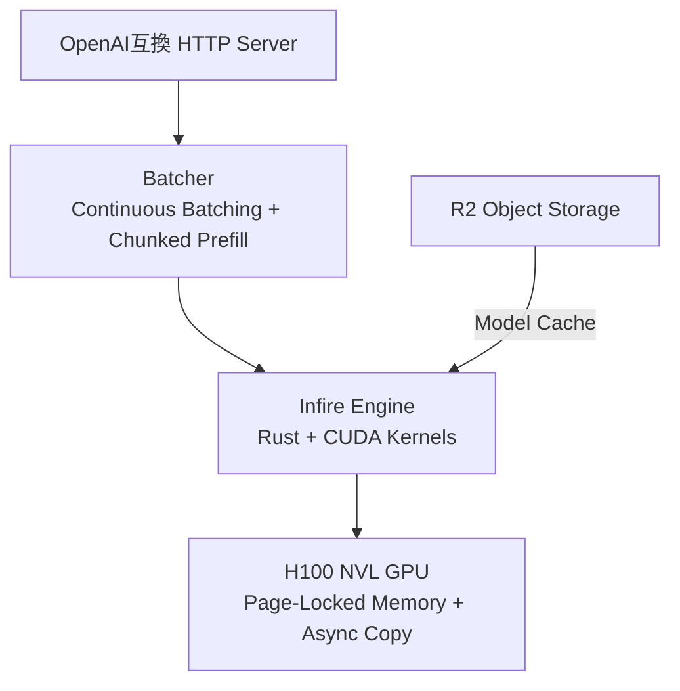

本記事は [Cloudflare Tech Blog: "How we built the most efficient inference engine for Cloudflare's network"](https://blog.cloudflare.com/cloudflares-most-efficient-ai-inference-engine/) の解説記事です。

## ブログ概要（Summary）

Cloudflareは自社エッジネットワーク向けに、Rust製LLM推論エンジン**Infire**をフルスクラッチ開発した。H100 NVL GPU上でShareGPT v3データセット（4,000プロンプト、同時接続200）を用いたベンチマークにおいて、vLLM 0.10.0（ベアメタル）比で約7%高速かつCPU負荷を82%削減（140%→25%）したと報告している。Infireは現在Workers AIのLlama 3.1 8Bモデルを本番稼働で提供している。

この記事は [Zenn記事: rvLLM：Rust製vLLM代替で学ぶGPU推論エンジンの実装最適化](https://zenn.dev/0h_n0/articles/48d89cb18bf0e1) の深掘りです。rvLLMと同様にRustでLLM推論エンジンを構築したCloudflareの事例として、設計判断やトレードオフを比較できます。

## 情報源

- **種別**: 企業テックブログ
- **URL**: [https://blog.cloudflare.com/cloudflares-most-efficient-ai-inference-engine/](https://blog.cloudflare.com/cloudflares-most-efficient-ai-inference-engine/)
- **組織**: Cloudflare
- **発表日**: 2025年9月

## 技術的背景（Technical Background）

Cloudflareは世界330以上の都市にエッジノードを持つCDNプロバイダであり、Workers AIとしてエッジでのLLM推論サービスを提供している。当初vLLMをGPUバックエンドとして採用していたが、以下の課題が顕在化した：

1. **gvisorオーバーヘッド**: セキュリティサンドボックスのgvisorがCPUを2.5コア消費
2. **Pythonランタイム**: GILによるスケジューラ直列化、GCによるレイテンシスパイク
3. **起動時間**: vLLMの起動に121秒以上（rvLLMのZenn記事でも同様の報告）
4. **エッジ非最適化**: vLLMはデータセンター向けに設計されており、分散エッジ環境に不向き
5. **マルチモデル制約**: MIG（Multi-Instance GPU）なしでの複数モデル同時稼働が困難

これらの課題を解決するため、CloudflareはRust製推論エンジンInfireをゼロから開発する決断を下した。

## 実装アーキテクチャ（Architecture）

### システム構成

Infireは3つの主要コンポーネントで構成される：



- **HTTP Server**: OpenAI互換エンドポイントを提供。Workers AIのリクエストを受け付ける
- **Batcher**: continuous batchingとchunked prefillを実装。デコード中のバッチ空きスロットにprefillトークンを充填
- **Infire Engine**: モデルのフォワードパス実行、KVキャッシュ管理、CUDAカーネル呼び出し

### モデルロードと起動時間

Infireの起動時間はLlama 3.1 8B（BF16、約16GB）のロードで**4秒未満**と報告されている。rvLLMの6秒（Qwen2.5-1.5B）と同程度の水準であり、vLLMの121秒と比較して桁違いに高速である。

高速起動を実現する技術：

1. **Page-Locked Memory + CUDA Async Copy**: ホストメモリをページロックし、複数CUDAストリームで非同期にGPUへ転送
2. **JITカーネルコンパイルの並列化**: モデルウェイトのロードとCUDAカーネルのコンパイルを並行実行
3. **R2キャッシュ**: モデルをエッジノードのR2オブジェクトストレージにキャッシュし、ネットワーク転送を最小化

### メモリ管理

vLLMのPagedAttentionと同様に、ページ分割方式のKVキャッシュを実装している。ブログでは「the cache is split into smaller chunks called pages」と記述されており、固定サイズページによるオンデマンド確保を採用していることがわかる。

**メモリ効率の報告値**:
- H100 NVL GPUで「essentially unlimited parallelism under typical load」を実現
- 従来方式では同一GPUで4並列プロンプトに制限されていたのに対し、ページ分割方式により大幅に拡大

### CUDAカーネル最適化

Infireのカーネル最適化はNVIDIA Hopper（H100）アーキテクチャに特化している：

- **低レベルPTX命令**: sm_90向けの最適化されたPTXコードを生成
- **JITコンパイル**: モデルのhidden state size、語彙サイズ、ターゲットGPUに応じてカーネルを動的コンパイル
- **CUDAグラフ**: バッチサイズごとにfine-grained CUDAグラフを事前キャプチャし、カーネルローンチコストを償却
- **cuBLASlt**: 大規模行列積にはcuBLASltを活用

rvLLMが15個のPTXカーネルを手書きしsm_70〜sm_120の幅広いアーキテクチャをサポートするのに対し、InfireはH100に絞った最適化戦略を取っている点が対照的である。

### Continuous Batching + Chunked Prefill

Batcherは2つの集約技術を組み合わせている：

1. **Prefill**: 入力プロンプトの全トークンを並列処理
2. **Decode + Prefill混合バッチ**: デコード中のバッチ空きスロットに、新着リクエストのprefillトークンを充填

この手法は、Sarathi-Serve（arXiv:2401.11351）で提案されたchunked-prefillsに相当する。デコードとprefillを混合することで、「larger matrix multiplications」を生成しGPU利用率を最大化する。

## パフォーマンス最適化（Performance）

### ベンチマーク結果

H100 NVL GPU上でShareGPT v3データセット（4,000プロンプト、同時接続200）を使用した結果：

| 構成 | リクエスト/秒 | トークン/秒 | CPU負荷 |
|---|---|---|---|
| **Infire** | 40.91 | 17,224 | **25%** |
| vLLM 0.10.0 (ベアメタル) | 38.38 | 16,164 | 140% |
| vLLM (gvisor) | 37.13 | 15,637 | 250% |
| vLLM (gvisor + CPU制約) | 22.04 | 9,279 | 100% |

**重要な分析ポイント**:

- ベアメタル対ベアメタルでの差は約7%であり、劇的な差ではない
- InfireのCPU負荷25%に対しvLLMは140%で、**CPU効率は5.6倍**。これはRustのゼロオーバーヘッド抽象化とGIL排除の効果
- gvisor環境下のvLLMはさらにCPU負荷が増大し250%に達する。実運用のCloudflare環境ではgvisorが必須であったため、実効的な差は約1.86倍に拡大

### GPU利用率

ブログでは本番環境で「upward of 80%」のGPU利用率を達成していると報告している。これはInfireのcontinuous batching + chunked prefillの効果であり、GPUがアイドル状態になる時間を最小化している。

### rvLLMとの比較

| 指標 | Infire | rvLLM | Python vLLM |
|---|---|---|---|
| 言語 | Rust | Rust | Python |
| 起動時間 | <4秒 | 6秒 | 121秒 |
| CPU負荷 | 25% | — | 140% |
| GPUターゲット | H100特化 | sm_70〜sm_120 | 汎用 |
| 手書きカーネル | JITコンパイル | 15個PTX | PyTorch経由 |
| 運用実績 | Workers AI本番 | 14,620リクエスト | 広範な本番利用 |

## 運用での学び（Production Lessons）

### なぜvLLMを拡張せずフルスクラッチしたか

Cloudflareがvlmの拡張ではなくフルスクラッチを選択した理由は示唆に富む：

1. **アーキテクチャの根本的不一致**: vLLMは集中型データセンター向け設計。Cloudflareの分散エッジ環境では、モデルの動的ロード・アンロード、マルチテナンシ、低起動時間が必須
2. **Pythonオーバーヘッドの構造的限界**: GIL、GC、PyTorchのメタデータオーバーヘッドはPython内では解消不可能
3. **セキュリティモデルの不整合**: vLLMにはgvisorサンドボックスが必要だったが、RustのメモリセーフティによりInfireはベアメタル実行が許可された

この判断はrvLLMの開発者も同様の洞察に基づいている。Python vLLMのシステムレベルオーバーヘッドは、言語ランタイムを変更しない限り解消できない構造的問題である。

### エッジ推論の課題

- **モデルキャッシュ**: R2オブジェクトストレージでエッジノードにモデルをキャッシュし、ロード時間を削減
- **マルチテナンシ**: 将来的にMIGなしでの複数モデル同時稼働を計画
- **量子化**: メモリ効率のさらなる改善のため開発中

## 学術研究との関連（Academic Connection）

Infireの設計は以下の学術研究に基づいている：

- **PagedAttention (Kwon et al., SOSP 2023)**: KVキャッシュのページ分割方式をRustで再実装
- **Chunked Prefills (Sarathi-Serve, arXiv:2401.11351)**: デコード+prefill混合バッチによるGPU利用率最大化
- **FlashAttention (Dao et al., 2022-2024)**: FlashAttention-3の統合を計画中と報告

学術研究の手法をRustの型安全性とゼロコスト抽象化の下で再実装することで、理論的な最適化を安全かつ効率的に本番環境に投入できるのがRust推論エンジンの強みである。

## Production Deployment Guide

### AWS実装パターン（コスト最適化重視）

InfireのアーキテクチャをAWS上で模倣する場合の構成：

| 規模 | 月間リクエスト | 推奨構成 | 月額コスト | 主要サービス |
|------|--------------|---------|-----------|------------|
| **Small** | ~3,000 | Serverless | $50-150 | Lambda + Bedrock |
| **Medium** | ~30,000 | Hybrid | $300-800 | ECS Fargate + Bedrock |
| **Large** | 300,000+ | Container | $2,000-5,000 | EKS + Karpenter + Spot |

**コスト削減テクニック**:
- Spot Instances使用で最大90%削減（Karpenter自動管理）
- Bedrock Batch API使用で50%削減
- Prompt Caching有効化で30-90%削減
- アイドルタイムのAuto Scaling to Zero

**コスト試算の注意事項**:
上記は2026年3月時点のAWS ap-northeast-1（東京）リージョン料金に基づく概算値です。最新料金は [AWS料金計算ツール](https://calculator.aws/) で確認してください。

### Terraformインフラコード

**Small構成 (Serverless)**:

```hcl
resource "aws_iam_role" "lambda_bedrock" {
  name = "infire-lambda-role"
  assume_role_policy = jsonencode({
    Version = "2012-10-17"
    Statement = [{
      Action    = "sts:AssumeRole"
      Effect    = "Allow"
      Principal = { Service = "lambda.amazonaws.com" }
    }]
  })
}

resource "aws_iam_role_policy" "bedrock_invoke" {
  role = aws_iam_role.lambda_bedrock.id
  policy = jsonencode({
    Version = "2012-10-17"
    Statement = [{
      Effect   = "Allow"
      Action   = ["bedrock:InvokeModel"]
      Resource = "arn:aws:bedrock:ap-northeast-1::foundation-model/anthropic.claude-*"
    }]
  })
}

resource "aws_lambda_function" "inference" {
  filename      = "lambda.zip"
  function_name = "edge-inference-handler"
  role          = aws_iam_role.lambda_bedrock.arn
  handler       = "index.handler"
  runtime       = "python3.12"
  timeout       = 60
  memory_size   = 1024
}
```

### セキュリティベストプラクティス

- IAMロール: 最小権限の原則（特定モデルのみ許可）
- ネットワーク: VPC内配置、パブリックアクセス最小化
- シークレット: AWS Secrets Manager使用
- 暗号化: S3/DynamoDB全てKMS暗号化
- 監査: CloudTrail有効化

### コスト最適化チェックリスト

- [ ] Spot Instances優先（最大90%削減）
- [ ] Reserved Instances: 1年コミットで72%削減
- [ ] Bedrock Batch API使用で50%割引
- [ ] Prompt Caching有効化で30-90%削減
- [ ] AWS Budgets: 月額予算設定（80%で警告）
- [ ] CloudWatch: トークン使用量スパイク検知
- [ ] Cost Anomaly Detection: 自動異常検知
- [ ] タグ戦略: 環境別でコスト可視化
- [ ] S3ライフサイクル: 古いキャッシュ自動削除
- [ ] 開発環境: 夜間停止設定

## まとめと実践への示唆

CloudflareのInfireは、rvLLMと同様にRustによるLLM推論エンジンの可能性を示す重要な事例である。ベアメタルでの7%高速化は限定的に見えるが、CPU負荷82%削減とgvisor不要化による実運用環境での優位性は大きい。Rust製推論エンジンの価値は、純粋なスループット差よりも、起動時間・リソース効率・メモリ安全性といったシステム特性にあることを、InfireとrvLLMの両プロジェクトが裏付けている。

## 参考文献

- **Blog URL**: [https://blog.cloudflare.com/cloudflares-most-efficient-ai-inference-engine/](https://blog.cloudflare.com/cloudflares-most-efficient-ai-inference-engine/)
- **Related Papers**: [PagedAttention (arXiv:2309.06180)](https://arxiv.org/abs/2309.06180), [Sarathi-Serve (arXiv:2401.11351)](https://arxiv.org/abs/2401.11351)
- **Related Zenn article**: [https://zenn.dev/0h_n0/articles/48d89cb18bf0e1](https://zenn.dev/0h_n0/articles/48d89cb18bf0e1)
