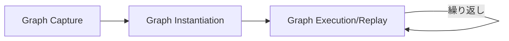

本記事は [NVIDIA Developer Blog: "Optimizing llama.cpp AI Inference with CUDA Graphs"](https://developer.nvidia.com/blog/optimizing-llama-cpp-ai-inference-with-cuda-graphs/) の解説記事です。

## ブログ概要（Summary）

NVIDIAは、llama.cppにCUDA Graphs最適化を実装することで、Llama 7BモデルのH100 GPU上でのデコード推論速度を最大**1.2倍**高速化したと報告している。CUDA Graphsは複数のGPUカーネルローンチを単一の実行可能グラフに統合する技術であり、カーネル間のCPU側ディスパッチオーバーヘッドを排除する。この最適化はrvLLMのPhase 3でも採用されており、GPU推論エンジンにおける標準的な高速化手法となっている。

この記事は [Zenn記事: rvLLM：Rust製vLLM代替で学ぶGPU推論エンジンの実装最適化](https://zenn.dev/0h_n0/articles/48d89cb18bf0e1) の深掘りです。rvLLMがPhase 3で適用したCUDAグラフキャプチャ/リプレイの原理と実装上の課題を理解するための必読資料です。

## 情報源

- **種別**: 企業テックブログ (NVIDIA)
- **URL**: [https://developer.nvidia.com/blog/optimizing-llama-cpp-ai-inference-with-cuda-graphs/](https://developer.nvidia.com/blog/optimizing-llama-cpp-ai-inference-with-cuda-graphs/)
- **組織**: NVIDIA
- **発表日**: 2024年

## 技術的背景（Technical Background）

### カーネルローンチオーバーヘッドの問題

GPU上でLLM推論を実行する場合、1回のデコードステップ（1トークン生成）には数百回のCUDAカーネルローンチが必要となる。各カーネルローンチにはCPU側のディスパッチ処理が伴い、NVIDIAの計測によれば1回あたり数マイクロ秒〜数十マイクロ秒のオーバーヘッドが発生する。

従来のCUDAストリームモデルでは、各GPU操作をCPUが個別にスケジューリングする：

```
CPU: launch_kernel_1 → launch_kernel_2 → ... → launch_kernel_N
      ↓                  ↓                        ↓
GPU: [kernel_1]----gap---[kernel_2]----gap-------[kernel_N]
                   ↑                    ↑
          CPU dispatch overhead   CPU dispatch overhead
```

NVIDIAのプロファイリングデータでは、最適化前のllama.cppにおいて「significant gaps between kernels due to GPU-side launch overhead」が確認されている。モデルサイズが小さいほど各カーネルの実行時間が短くなるため、相対的にオーバーヘッドの比率が増大する。

### CUDA Graphsの原理

CUDA Graphsは、複数のGPU操作を**有向非巡回グラフ（DAG）**として事前キャプチャし、単一のAPI呼び出しでリプレイする機構である。



**3つのフェーズ**:

1. **キャプチャ**: ストリーム上のCUDA操作を記録（実行はしない）
2. **インスタンス化**: 記録されたグラフを実行可能オブジェクトに変換
3. **リプレイ**: 単一API呼び出しで全操作を実行（CPU側オーバーヘッド最小化）

数式で表現すると、$N$ 個のカーネルに対する総オーバーヘッドは：

**従来方式**:
$$T_{\text{overhead}} = N \times t_{\text{launch}} + \sum_{i=1}^{N} t_{\text{kernel}_i}$$

**CUDA Graphs**:
$$T_{\text{overhead}} = t_{\text{replay}} + \sum_{i=1}^{N} t_{\text{kernel}_i}$$

ここで $t_{\text{launch}}$ は個別カーネルローンチのCPUオーバーヘッド（数μs〜数十μs）、$t_{\text{replay}}$ は単一グラフリプレイのオーバーヘッド（1回分のAPI呼び出しに相当）である。$N$ が大きいほど、CUDA Graphsの恩恵が大きくなる。

## 実装アーキテクチャ（Architecture）

### llama.cppでの実装戦略

llama.cppにおけるCUDA Graphs実装は以下の戦略を採用している：

1. **トークン生成フェーズのキャプチャ**: GPUグラフ評価ステージ（デコードステップ）をインターセプトし、ストリーム上の操作をグラフとしてキャプチャ
2. **動的グラフ管理**: 計算グラフが推論中に変化するため、以下の3段階の更新戦略を使用
   - **グラフ再キャプチャ**: コンテキスト長が大幅に変化した場合に完全な再キャプチャ
   - **パラメータ更新**: `cudaGraphExecUpdate`による軽量な変更（オーバーヘッド削減）
   - **選択的ノード置換**: KVキャッシュカーネルノードのみを手動で置換（トークンごとに変化するため）

### バッチサイズ制約

NVIDIAのブログでは、現在のCUDA Graphs最適化は**バッチサイズ1**の推論に制限されていると報告している。これはインタラクティブ/エッジ推論シナリオに主に適用可能であり、サーバー側のバッチ推論には直接適用できない。

この制約はrvLLMのCUDAグラフ実装にも関連する。Zenn記事では「CUDAグラフは動的な形状変更（バッチサイズの変動など）と相性が悪く、形状ごとにグラフを事前キャプチャする必要がある」と指摘されており、rvLLMの開発でも「CUDA graph fix」が必要であったことが報告されている。

### CUDAグラフのキャプチャとリプレイの擬似コード

```python
import torch

def capture_cuda_graph(
    model: torch.nn.Module,
    static_input: torch.Tensor,
    kv_cache: torch.Tensor,
) -> torch.cuda.CUDAGraph:
    """CUDAグラフのキャプチャ

    Args:
        model: Transformerモデル
        static_input: 固定形状の入力テンソル
        kv_cache: KVキャッシュ（グラフ内で更新される）

    Returns:
        キャプチャされたCUDAグラフ
    """
    graph = torch.cuda.CUDAGraph()

    # ウォームアップ実行（メモリ確保を安定化）
    with torch.cuda.stream(torch.cuda.Stream()):
        for _ in range(3):
            _ = model(static_input, kv_cache)

    # グラフキャプチャ
    with torch.cuda.graph(graph):
        static_output = model(static_input, kv_cache)

    return graph, static_output


def replay_cuda_graph(
    graph: torch.cuda.CUDAGraph,
    input_tensor: torch.Tensor,
    static_input: torch.Tensor,
    static_output: torch.Tensor,
) -> torch.Tensor:
    """CUDAグラフのリプレイ

    Args:
        graph: キャプチャ済みグラフ
        input_tensor: 実際の入力データ
        static_input: キャプチャ時の入力バッファ
        static_output: キャプチャ時の出力バッファ

    Returns:
        推論結果
    """
    # 入力データをキャプチャ時のバッファにコピー
    static_input.copy_(input_tensor)

    # グラフリプレイ（CPUオーバーヘッド最小）
    graph.replay()

    # 出力をキャプチャ時のバッファから取得
    return static_output.clone()
```

**注意点**: `torch.cuda.graph`によるキャプチャ中は動的メモリ確保（`torch.malloc`等）が禁止される。すべてのテンソルは事前確保されたバッファを使用する必要がある。

## パフォーマンス最適化（Performance）

### 定量的結果

NVIDIAが報告したベンチマーク結果：

| 条件 | 高速化倍率 |
|---|---|
| Llama 7B, H100 | **最大1.2倍** |
| 小型モデル + 高速GPU | 効果大 |
| 大型モデル | 効果小（カーネル実行時間が支配的） |

### プロファイリング分析

NVIDIAのプロファイリングタイムラインから：
- **最適化前**: カーネル間に「GPU-side launch overhead」による顕著なギャップ
- **最適化後**: 統一スケジューリングにより、カーネル間の間隔が「very small」に

### なぜ1.2倍にとどまるのか

CUDA Graphsの高速化効果が1.2倍程度にとどまる理由は以下の通り：

1. **カーネル実行時間の支配性**: LLMの推論ではGEMM（行列積）カーネルの実行時間がローンチオーバーヘッドより大きい
2. **メモリバウンドなデコード**: デコードフェーズはメモリ帯域幅がボトルネックであり、カーネルローンチの改善は限定的
3. **残存するCPUオーバーヘッド**: GGMLグラフの準備やサンプリング処理のCPU側オーバーヘッドはCUDA Graphsでは改善されない（NVIDIAは追加10%の改善可能性を報告）

### rvLLMでのCUDAグラフ効果

Zenn記事によると、rvLLMのPhase 3では、CUDAグラフに加えてfused GEMMs、ベクトル化float4ロード、事前確保バッファを同時に適用し、Phase 2の8,339 tok/sからPhase 3の10,291 tok/sへ23%の向上を達成している。CUDAグラフ単体の寄与を分離する定量データは公開されていないが、デコードステップ全体をキャプチャすることで「CPUオーバーヘッドをほぼゼロに」していると報告されている。

## 運用での学び（Production Lessons）

### CUDA Graphsの実装上の課題

1. **動的形状の非互換性**: バッチサイズやシーケンス長が変化するとグラフの再キャプチャが必要。形状ごとにグラフをプールする戦略が一般的
2. **メモリ確保の制限**: グラフキャプチャ中の動的メモリ確保は禁止。すべてのバッファを事前確保する必要がある
3. **KVキャッシュ更新**: トークンごとにKVキャッシュが伸長するため、カーネルノードのパラメータを毎ステップ更新する必要がある
4. **デバッグの困難さ**: グラフ内のエラーはキャプチャ時ではなくリプレイ時に発現するため、デバッグが困難

### 適用判断の指針

| ユースケース | CUDA Graphs適用 | 理由 |
|---|---|---|
| バッチサイズ1のリアルタイム推論 | ✅ 推奨 | カーネルローンチが相対的に支配的 |
| 小型モデル（1-7B） | ✅ 効果大 | カーネル実行時間が短い |
| 大型モデル（70B+） | ⚠️ 効果小 | GEMM実行時間が支配的 |
| 動的バッチサイズ | ⚠️ 複雑 | 形状ごとのグラフプールが必要 |
| prefillフェーズ | ❌ 非推奨 | 入力長が毎回異なるため再キャプチャが頻繁 |

## 学術研究との関連（Academic Connection）

CUDA GraphsはNVIDIAのCUDA Toolkit 10.0（2018年）で導入された機能であり、LLM推論への適用は比較的新しい。関連する学術研究として：

- **Orca (Yu et al., OSDI 2022)**: iteration-level schedulingとCUDA Graphsは直交する最適化。Orcaのスケジューリングの上にCUDA Graphsを適用可能
- **FlashAttention-2 (Dao, 2023)**: FlashAttentionカーネル自体のCUDA Graph対応はサポートされている
- **TensorRT-LLM (NVIDIA)**: CUDA Graphsを全面的に活用した商用推論フレームワーク

CES 2026では、NVIDIAがRTX GPU向けにllama.cppとOllamaのさらなるCUDA Graphs最適化を発表している。QKV projectionの並行CUDAストリーム実行（`--CUDA_GRAPH_OPT=1`フラグ）やMMVQカーネルのレジスタプリロードにより、RTX 4090で約150 tok/sを達成している。

## Production Deployment Guide

### AWS実装パターン（コスト最適化重視）

| 規模 | 月間リクエスト | 推奨構成 | 月額コスト |
|------|--------------|---------|-----------|
| **Small** | ~3,000 | Lambda + Bedrock | $50-150 |
| **Medium** | ~30,000 | ECS Fargate | $300-800 |
| **Large** | 300,000+ | EKS + Spot | $2,000-5,000 |

**コスト試算の注意事項**:
上記は2026年3月時点のAWS ap-northeast-1料金に基づく概算値です。最新料金は [AWS料金計算ツール](https://calculator.aws/) で確認してください。

### Terraformインフラコード

```hcl
module "eks" {
  source  = "terraform-aws-modules/eks/aws"
  version = "~> 20.0"

  cluster_name    = "cuda-graph-inference"
  cluster_version = "1.31"
  vpc_id          = module.vpc.vpc_id
  subnet_ids      = module.vpc.private_subnets

  cluster_endpoint_public_access = true
  enable_cluster_creator_admin_permissions = true
}

resource "kubectl_manifest" "gpu_nodepool" {
  yaml_body = <<-YAML
    apiVersion: karpenter.sh/v1
    kind: NodePool
    metadata:
      name: gpu-spot
    spec:
      template:
        spec:
          requirements:
            - key: karpenter.sh/capacity-type
              operator: In
              values: ["spot"]
            - key: node.kubernetes.io/instance-type
              operator: In
              values: ["g5.xlarge", "g5.2xlarge"]
          limits:
            cpu: "32"
            memory: "128Gi"
      disruption:
        consolidationPolicy: WhenEmptyOrUnderutilized
        consolidateAfter: 30s
  YAML
}
```

### コスト最適化チェックリスト

- [ ] Spot Instances優先（最大90%削減）
- [ ] Reserved Instances: 1年コミットで72%削減
- [ ] Bedrock Batch API使用で50%割引
- [ ] AWS Budgets設定（80%で警告）
- [ ] CloudWatch: GPU利用率モニタリング
- [ ] Cost Anomaly Detection有効化
- [ ] タグ戦略: 環境別コスト可視化
- [ ] 開発環境: 夜間GPU停止
- [ ] S3ライフサイクル: モデルキャッシュ自動削除
- [ ] Karpenter: アイドル30秒でスケールダウン

## まとめと実践への示唆

CUDA Graphsは、LLM推論におけるカーネルローンチオーバーヘッドを体系的に削減する標準技術として確立されつつある。llama.cppでの1.2倍の高速化は控えめに見えるが、rvLLMやCloudflare Infireのような推論エンジンでは、他の最適化（fused GEMMs、GPU側argmax、ベクトル化ロード）と組み合わせることで累積的な効果を発揮する。特にバッチサイズ1のリアルタイム推論シナリオでは、CUDA Graphsの適用は推論レイテンシ削減の基本的な施策として検討すべきである。

## 参考文献

- **Blog URL**: [https://developer.nvidia.com/blog/optimizing-llama-cpp-ai-inference-with-cuda-graphs/](https://developer.nvidia.com/blog/optimizing-llama-cpp-ai-inference-with-cuda-graphs/)
- **CUDA Graphs Documentation**: [NVIDIA CUDA Toolkit Documentation](https://docs.nvidia.com/cuda/cuda-c-programming-guide/index.html#cuda-graphs)
- **Related Zenn article**: [https://zenn.dev/0h_n0/articles/48d89cb18bf0e1](https://zenn.dev/0h_n0/articles/48d89cb18bf0e1)
